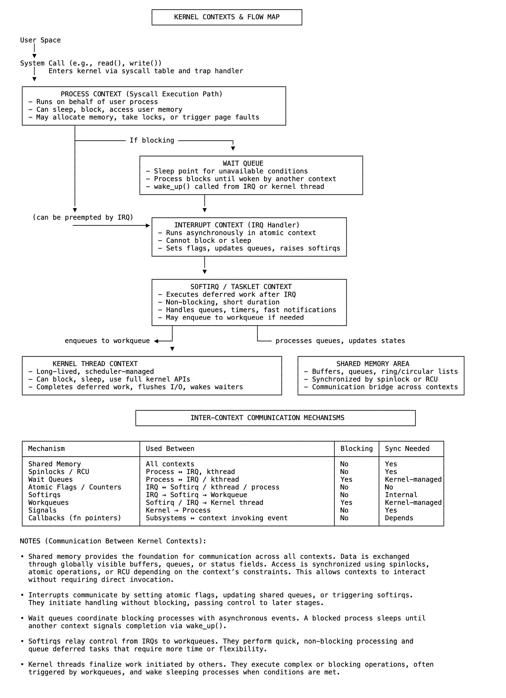

# 23 内核如何自我通信——内部通信工具

在 Linux 内核内部，代码在不同的上下文中运行：用户发起的系统调用、硬件中断、延迟处理程序和内部内核线程。每个上下文都在特定的约束下运行——有些可以阻塞或睡眠，另一些则必须快速执行且不被中断。尽管存在这些差异，内核仍通过一组专为安全高效通信设计的内部工具，实现了跨上下文的数据交换和协调。

共享内存结构提供了基础。缓冲区、队列和状态字段等对象可在多个执行路径中被并发访问。根据上下文的阻塞能力，使用自旋锁、原子操作或 RCU 等无锁技术来维持同步。这些机制在不影响并发性或响应性的前提下，确保了一致性。

为支持阻塞操作，内核使用等待队列（wait queues）。无法立即进行的系统调用可能会阻塞并在等待队列上睡眠。另一个上下文（通常是中断处理程序或内核线程）可在条件变化后唤醒该进程。这将请求与其解决解耦，而不会浪费 CPU 周期。

中断处理程序面临最严格的限制：它们不能阻塞、分配内存或访问用户空间。其作用是确认硬件并标记延迟工作。如果需要额外处理，内核会调度软中断（softirq）或任务小项（tasklet），它们会在中断后不久运行，但仍处于非阻塞约束范围内。

对于需要更多时间或灵活性的操作，内核使用工作队列（workqueues）。这些工具将任务委托给内核管理的线程，使其能够独立运行并完全访问内核服务。工作队列广泛用于延迟 I/O、内存回收和异步设备处理。

为实现快速无锁信号传递，内核使用原子标志和计数器。更新单个位或计数器可向另一个上下文通知就绪、进展或完成状态。这些在网络和存储等性能关键路径中尤为常见。

内核线程是由内核创建的持久性、调度器管理的任务。与中断或软中断不同，它们可以阻塞、睡眠并使用任何内核 API。它们处理后台工作、延迟清理和必须独立于用户活动运行的周期性任务。

回调（Callbacks）完善了协调模型。子系统注册函数指针，以便在满足特定条件时调用。这些处理程序在遇到条件的上下文中执行，实现了子系统间响应迅速、解耦的行为。

这些工具（共享内存、等待队列、工作队列、原子变量、内核线程和回调）共同构成了 Linux 内核的通信架构。每个工具都针对其执行上下文量身定制，实现了整个系统精确、可靠的协调。

