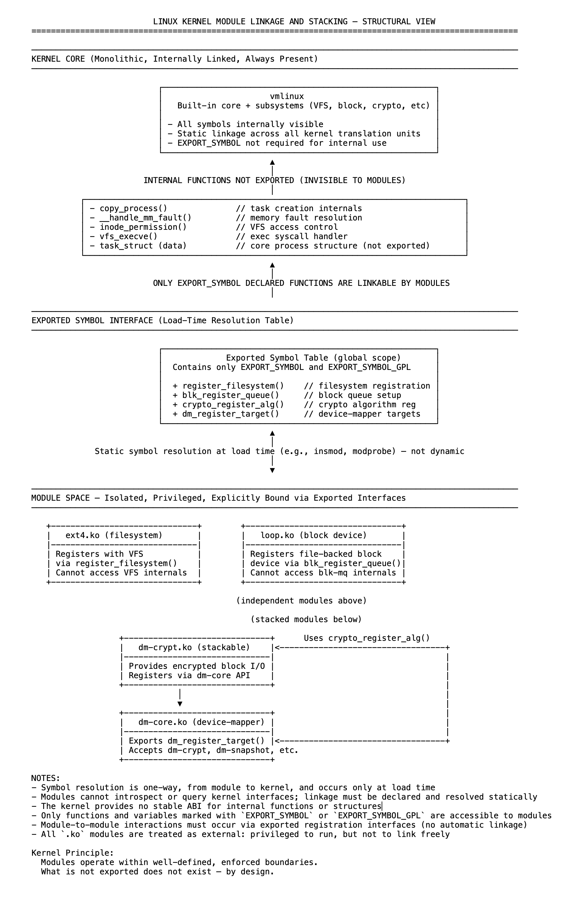

# 24 内核模块仅通过导出符号相互认知

内核模块是独立编译的内核功能单元，设计为可在运行时加载。它们提供了一种灵活的方式来扩展内核（通常用于设备驱动程序、文件系统、密码学例程或协议实现），而无需完全重建或重启。一旦插入，模块就成为运行内核的一部分，在特权空间中运行，可完全访问内核环境。

尽管具有这种级别的访问权限，但内核模块在设计上是隔离的。除非内核函数或变量已被显式导出，否则模块不能引用或调用它们。内核不提供发现、延迟绑定或符号查找功能。所有交互必须通过通过`EXPORT_SYMBOL`或`EXPORT_SYMBOL_GPL`声明的预定义接口进行。

这种边界是有意设定的。内核不保证稳定的内部ABI，并且除了导出的接口外不提供任何支持。任何未显式导出的符号都被视为内部符号，可能在版本之间更改或删除。导出接口是模块与内核其余部分之间唯一受支持的边界。

加载模块时，其未定义的符号会与仅包含内核选择公开的标识符的全局符号表进行匹配。如果缺少必需的符号，模块将无法加载。解析仅在加载时进行一次，不能动态调整。

模块不能访问彼此的内部符号，除非这些符号被显式导出。模块是一起开发、在相同配置中编译，还是放在相关的源目录中，都没有区别。没有`EXPORT_SYMBOL`，符号就是不可见的。从模块的角度来看，未导出的内容就不存在。

模块分层和堆叠很常见，但必须严格显式。一个模块可能依赖另一个模块来注册回调、提供处理程序表或公开实用函数，但只能通过导出符号和已建立的注册点实现。运行时不会发现或连接任何内容。

这不是技术限制，而是有意的架构决策。内核强制实施这种分离，以保持内部灵活性、版本独立性和系统完整性。像`task_struct`、`cred`和`mm_struct`等关键结构是内核行为的核心，除非通过安全接口有意公开，否则永远不能直接访问。

每个模块都被视为外部代码，无论它与内核功能的集成多么紧密。它必须声明许可证，预先解决依赖关系，并将其访问限制为内核明确选择公开的接口。

内核模块仅通过导出符号相互认知，没有例外。这不是惯例，而是强制的设计：精确、有意，且对Linux内核的长期稳定性至关重要。

