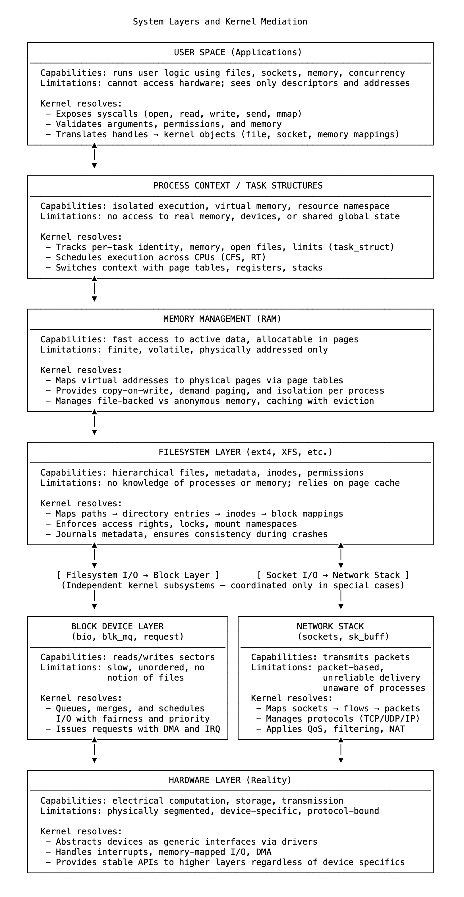

# 25 搭建组件之间的桥梁

现代系统由独立运行的部件构成。内存以页为单位组织，磁盘存储块，网卡传输数据包，CPU在寄存器中逐次执行指令。每个组件都按自身规则运行，对其他组件毫无所知。

用户空间看不到这些细节。进程打开文件、发送数据、分配内存并执行逻辑，却无需了解这些请求是如何实现的。这种假象之所以成立，是因为内核能看到底层的每个组件，并懂得如何在它们之间进行转换。

内核并非通过扁平化来统一系统，而是维持各组件的分离，通过精心控制的结构将一个域映射到另一个域。它跟踪边界并解决可能导致系统无法使用的不匹配问题。

文件描述符不是文件，而是对struct file的引用，该结构指向inode，inode又映射到块范围，通过块层解析为磁盘I/O。当请求读取时，内核沿此路径确定数据的物理位置，将I/O操作入队，并将结果复制到用户内存（若该内存已映射、可写且符合策略允许）。

用户空间中的指针实为虚拟地址。内核通过进程的页表将其映射，页表指向物理内存。这些页面可能是匿名的、基于文件的，或当前已换出。每个页面都在内核空间中被跟踪，其元数据描述了引用计数、状态、标志和访问约束。这不仅是地址转换，更是一组保证，可在负载下维持隔离性、安全性和公平性。

网络数据包以DMA缓冲区的形式到达NIC，内核将其提取到sk_buff结构中，解析协议头，对流量分类，并将它们入队以传递给匹配的套接字。该套接字属于某个进程，进程看到的是流。但该流之所以存在，是因为内核强制实现了一致性，处理了重新排序、超时、确认和流量控制。每次发送或接收调用都依赖这种底层结构。

每个子系统都不了解其他子系统。内存子系统知道页，却不知道文件；文件系统知道inode和块，却不知道进程；网络栈理解数据包和协议，却不知道程序或流。它们在架构上是独立的。只有内核能看到所有子系统，并维持映射，使它们以一致、可控和可组合的方式交互。

内核不消除限制，而是理解限制。它尊重每个组件的自然边界，并在它们之间搭建桥梁——虚拟与物理、逻辑与程序、共享与隔离的桥梁。用户空间依赖的每一个抽象（每一个系统调用、每一个文件、每一个套接字、每一个映射页）之所以存在，只是因为内核在不兼容的域之间进行中介，并将系统维系在一起。

