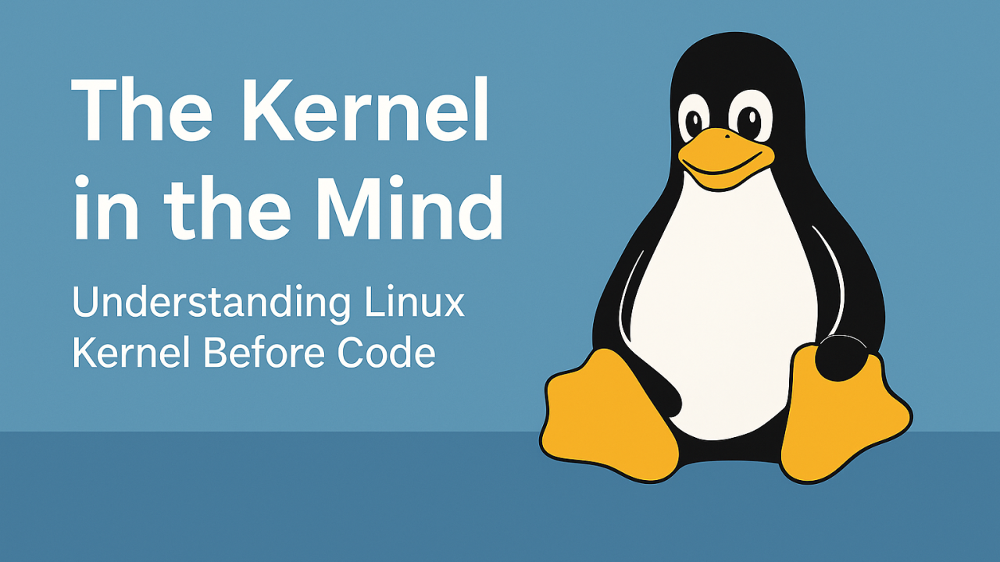

# 《心中的内核》专栏说明

## 介绍

这并非一部教你编写内核代码的指南，而是一场探寻Linux内核设计思维的思想之旅。   

在系统编程的世界里，人们常常迷失于符号定义、头文件结构与实现细节的丛林中。然而剥离代码表象，内核实则是一个井然有序的响应式系统——它受上下文环境所规约，以分离原则为基石，从内存管理到任务调度的每一处设计，都浸透着精准的设计意图。   

本系列内容专为那些渴望在内核源码之外构建内核运行心智模型的探索者而作。无论你是初次叩响Linux内核内部机制的大门，还是带着全新思考重返这片领域，我们聚焦的核心始终是行为逻辑，而非语法细节。   

每一篇文章起初都是独立成章的思考札记，而当它们汇聚在一起，便勾勒出一幅概念图谱——这幅图谱不关乎函数调用的细枝末节，而是内核如何响应外部请求、执行机制约束、实现模块隔离与提供系统服务的底层逻辑。   内核掌管着系统运行的方方面面，让我们一同洞悉它的运行之道。

## 目录

[0. 专栏说明](https://cppguide.cn/pages/the-kernel-in-the-mind-contents/)

[1. 内核不是进程，而是系统](https://cppguide.cn/pages/the-kernel-in-the-mind-ch01/)

[2. 为进程服务：内核的首要职责](https://cppguide.cn/pages/the-kernel-in-the-mind-ch02/)

[3. 代码之前的概念图](https://cppguide.cn/pages/the-kernel-in-the-mind-ch03/)

[4. 作为分层系统的内核：虚拟、映射、隔离、控制](https://cppguide.cn/pages/the-kernel-in-the-mind-ch04/)

[5. 单体形式，协同行为：真正的内核模型](https://cppguide.cn/pages/the-kernel-in-the-mind-ch05/)

[6. 内核对象揭示设计 —— 函数仅执行设计](https://cppguide.cn/pages/the-kernel-in-the-mind-ch06/)

[7. 无冲突的代码 —— 内核如何在并发风暴中保持安全](https://cppguide.cn/pages/the-kernel-in-the-mind-ch07/)

[8. 间接的力量 —— 一个内核如何为所有进程服务](https://cppguide.cn/pages/the-kernel-in-the-mind-ch08/)

[9. 内核的设备模型：硬件如何成为 /dev](https://cppguide.cn/pages/the-kernel-in-the-mind-ch09/)

[10. 内核如何看待内存的：不是映射，而是责任](https://cppguide.cn/pages/the-kernel-in-the-mind-ch10/)

[11. 内存不是一个地方，而是一个系统](https://cppguide.cn/pages/the-kernel-in-the-mind-ch11/)

[12. 内核始终存在 —— 你知道它在哪里吗？](https://cppguide.cn/pages/the-kernel-in-the-mind-ch12/)

[13. 不只是代码执行：内核实际执行的内容](https://cppguide.cn/pages/the-kernel-in-the-mind-ch13/)

[14. boot结束之处：内核开始之处](https://cppguide.cn/pages/the-kernel-in-the-mind-ch14/)

[15. 从 vmlinuz 到 eBPF：Linux 内核内部实际运行的内容](https://cppguide.cn/pages/the-kernel-in-the-mind-ch15/)

[16. 无状态 CPU，有状态内核：执行如何被协调](https://cppguide.cn/pages/the-kernel-in-the-mind-ch16/)

[17. 内核构建的内容 —— 逐层构建](https://cppguide.cn/pages/the-kernel-in-the-mind-ch17/)

[18. 内核执行路径：在哪里运行，以及为什么重要](https://cppguide.cn/pages/the-kernel-in-the-mind-ch18/)

[19. 追踪执行的模板](https://cppguide.cn/pages/the-kernel-in-the-mind-ch19/)

[20. 中断不是干扰，而是设计](https://cppguide.cn/pages/the-kernel-in-the-mind-ch20/)

[21. 执行是逻辑的，位置是物理的](https://cppguide.cn/pages/the-kernel-in-the-mind-ch21/)

[22. 不仅仅是一段代码：每个内核路径内部的过程](https://cppguide.cn/pages/the-kernel-in-the-mind-ch22/)

[23. 内核如何自我通信 —— 内部通信工具](https://cppguide.cn/pages/the-kernel-in-the-mind-ch23/)

[24. 内核模块彼此了解：仅通过导出的符号](https://cppguide.cn/pages/the-kernel-in-the-mind-ch24/)

[25. 搭建组件之间的桥梁](https://cppguide.cn/pages/the-kernel-in-the-mind-ch25/)

[26. libc 之外：用户空间如何真正与内核对话](https://cppguide.cn/pages/the-kernel-in-the-mind-ch26/)

[27. CPU 不移动数据 —— 但没有 CPU，什么都无法移动](https://cppguide.cn/pages/the-kernel-in-the-mind-ch27/)

[28. 时间与精度：内核眼中的 CPU 执行](https://cppguide.cn/pages/the-kernel-in-the-mind-ch28/)

[29. 内核在虚拟化中的角色：理解 KVM](https://cppguide.cn/pages/the-kernel-in-the-mind-ch29/)

[30. 两个世界，一个 CPU：虚拟化中的 root 操作和非 root 操作](https://cppguide.cn/pages/the-kernel-in-the-mind-ch30/)

[31. 内核与 VirtIO：无需模拟的网络驱动程序](https://cppguide.cn/pages/the-kernel-in-the-mind-ch31/)

[32. 一切仍由操作系统掌控](https://cppguide.cn/pages/the-kernel-in-the-mind-ch32/)

[33. 对齐即理解](https://cppguide.cn/pages/the-kernel-in-the-mind-ch33/)

[34. 如果内核不是由 Linus 创建和维护的，会怎样？](https://cppguide.cn/pages/the-kernel-in-the-mind-ch34/)

[35. 配置并非定制，而是内核的身份标识](https://cppguide.cn/pages/the-kernel-in-the-mind-ch35/)

[36. 内存生命周期和塑造它的角色](https://cppguide.cn/pages/the-kernel-in-the-mind-ch36/)

[37. 中断如何在不变中演变](https://cppguide.cn/pages/the-kernel-in-the-mind-ch37/)

[38. 并发之外的同步](https://cppguide.cn/pages/the-kernel-in-the-mind-ch38/)

[39. 这从来不是关于炒作，而是关于硬件](https://cppguide.cn/pages/the-kernel-in-the-mind-ch39/)

[40. 从意图到 I/O：内核如何看待文件、磁盘和设备](https://cppguide.cn/pages/the-kernel-in-the-mind-ch40/)

[41. 心中的内核 —— 效率至上而非历史遗留原因：为什么内核仍用 C 语言开发](https://cppguide.cn/pages/the-kernel-in-the-mind-ch41/)

## 完整版专栏全文PDF下载

如果你想获取本专栏全套PDF版本，请加小方微信 `cppxiaofang` 获取，备注“**心中的内核**”。