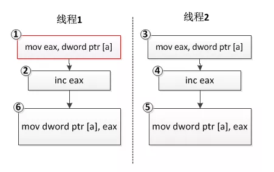

# 整型变量赋值是原子操作吗？

## 整型变量赋值操作不是原子操作

那么为什么整型变量的操作不是原子性的呢？常见的整型变量操作有如下几种情况：

给整型变量赋值一个确定的值，如

```
int a = 1;
```

这条指令操作一般是原子的，因为对应着一条计算机指令，cpu将立即数1搬运到变量**a**的内存地址中即可，汇编指令如下：

```
mov dword ptr [a], 2  
```

然后这确是最不常见的情形，由于现代编译器一般有优化策略，如果变量**a**的值在编译期间就可以计算出来（例如这里的例子中**a**的值就是**1**），那么**a**这个变量本身在正式版本的软件中（release版）就很有可能被编译器优化掉，使用**a**的地方，直接使用常量**1**来代替。所以实际的执行指令中，这样的指令存在的可能性比较低。

变量自身增加或者减去一个值，如

```
a ++;
```

从C/C++语法的级别来看，这是一条语句，是原子的；但是从实际执行的二进制指令来看，也不是原子的，其一般对应三条指令，首先将变量**a**对应的内存值搬运到某个寄存器（如**eax**）中，然后将该寄存器中的值自增**1**，再将该寄存器中的值搬运回**a**的内存中：

```
mov eax, dword ptr [a]  
inc eax
mov dword ptr [a], eax
```

现在假设**a**的值是0，有两个线程，每个线程对变量**a**的值递增**1**，我们预想的结果应该是**2**，可实际运行的结果可能是**1**！是不是很奇怪？分析如下：

```
int a = 0;

//线程1
void thread_func1()
{
	a ++;
}

//线程2
void thread_func2()
{
	a ++;
}
```



我们预想的结果是**线程1**和**线程2**的三条指令各自执行，最终**a**的值为**2**，但是由于操作系统线程调度的不确定性，**线程1**执行完指令①和②后，**eax**寄存器中的值为**1**，此时操作系统切换到**线程2**执行，执行指令③④⑤，此时**eax**的值变为**1**；接着操作系统切回**线程1**继续执行，执行指令⑦，得到**a**的最终结果**1**。

- 把一个变量的值赋值给另外一个变量，或者把一个表达式的值赋值给另外一个变量，如

  ```
  int a = b;
  ```

  从C/C++语法的级别来看，这是也是一条语句，是原子的；但是从实际执行的二进制指令来看，由于现代计算机CPU架构体系的限制，数据不可以直接从内存搬运到另外一块内存，必须借助寄存器中断，这条语句一般对应两条计算机指令，即将变量**b**的值搬运到某个寄存器（如**eax**）中，再从该寄存器搬运到变量**a**的内存地址：

  ```
  mov eax, dword ptr [b]  
  mov dword ptr [a], eax 
  ```

  既然是两条指令，那么多个线程在执行这两条指令时，某个线程可能会在第一条指令执行完毕后被剥夺CPU时间片，切换到另外一个线程而产生不确定的情况。这和上一种情况类似，就不再详细分析了。

说点题外话，网上很多人强调某些特殊的整型数值类型（如bool类型）的操作是原子的，这是由于，某些CPU生产商开始有意识地从硬件平台保证这一类操作的原子性，但这并不是每一种类型的CPU架构都支持，在这一事实成为标准之前，我们在多线程操作整型时还是老老实实使用下文介绍的原子操作或线程同步技术来对这些数据类型进行保护。
