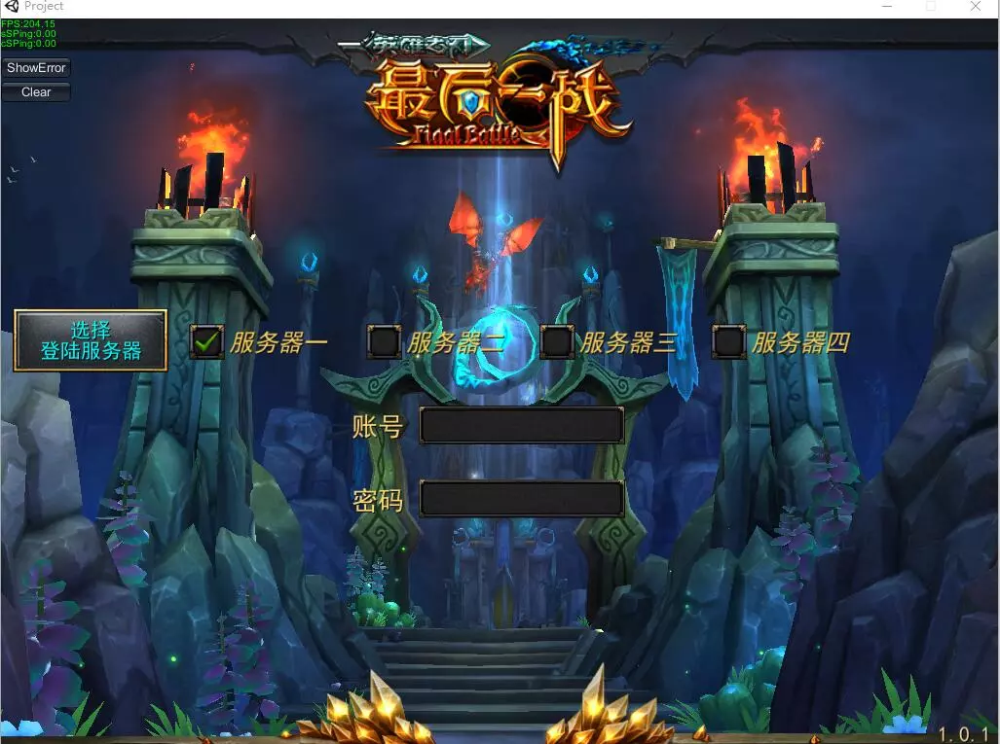
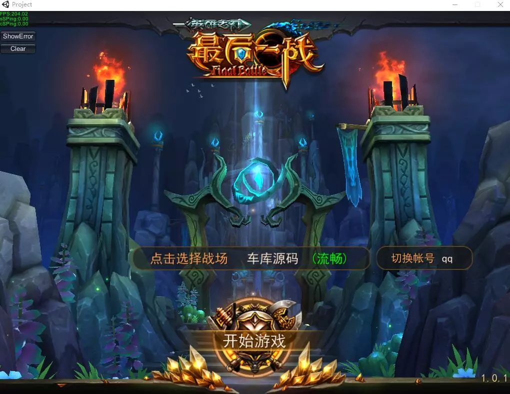
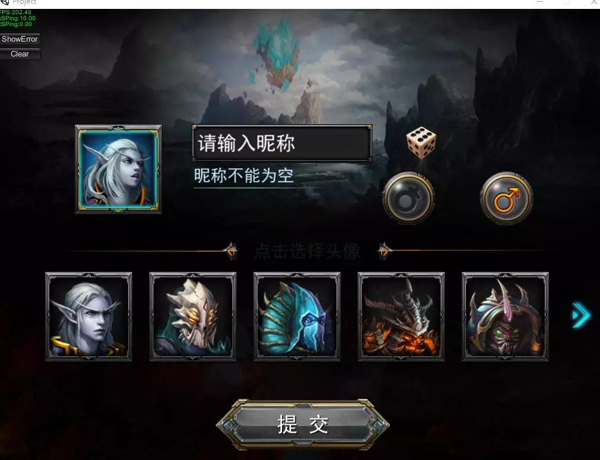
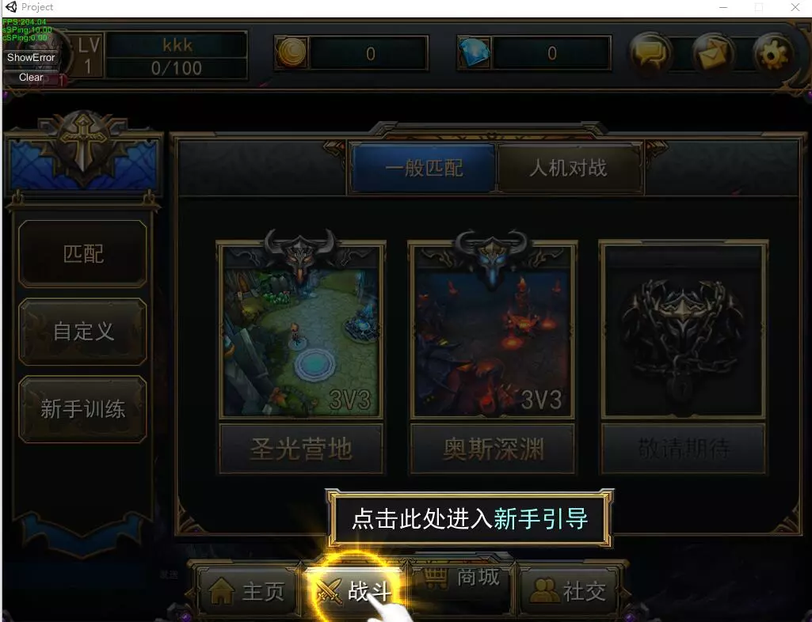
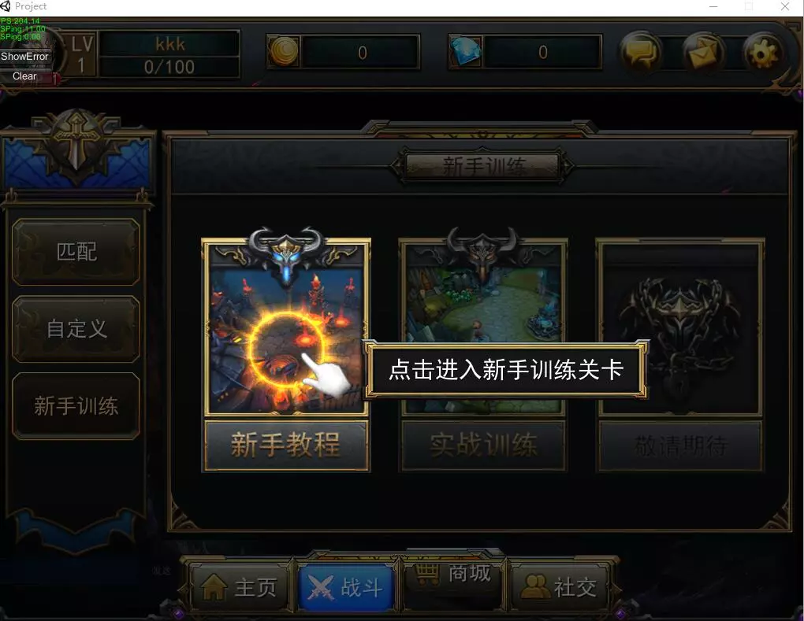
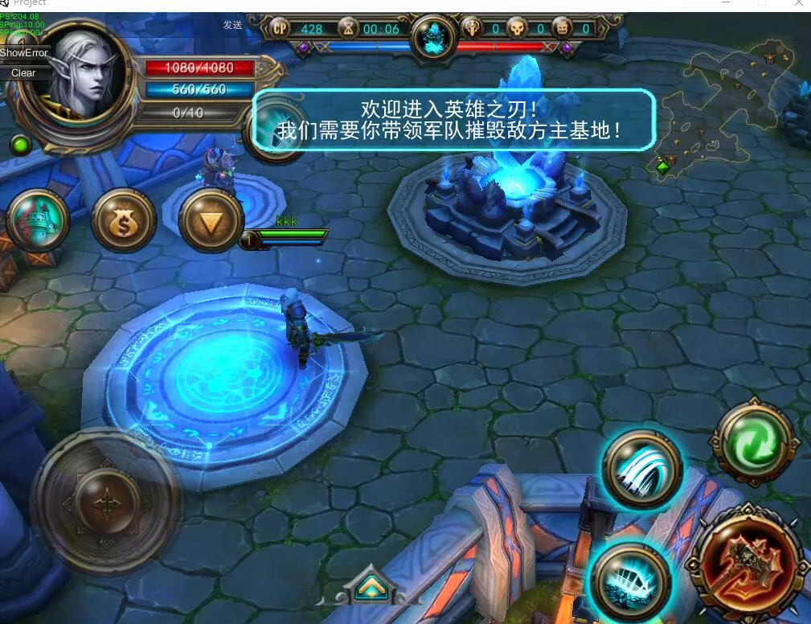
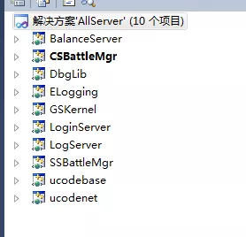

## 从零学习开源项目系列（一） 从一款多人联机实时对战游戏开始

**写在前面的话**

经常有学生或者初学者问我如何去阅读和学习一个开源软件的代码，也有不少朋友在工作岗位时面对前同事留下的项目，由于文档不完善、代码注释少、工程数量大，而无从下手。本文将来通过一个多人联机实时对战游戏——最后一战，来解答以上问题。

其实，我以上问题在我是一个学生时，我也同样因此而困惑，但是后来，我发现，对于文档缺失、注释缺失的项目，需要自己摸索，虽然是挑战，同时也是机遇——一个不错的学习机会。因为至少有代码，正如侯捷大师所说的的，**“源码面前，了无秘密”**，所以我们应该**“read the fucking code”**。

所以，这个系列的文章，我们分析“最后一战”这个游戏源码时，我们不会按照传统的思路：先介绍总结的程序结构，再介绍各个模块的细节，因为，当我们面对一套陌生的源码时，尤其是在文档缺失的情况下，我们根本无法开始就掌握这个项目的总体结构，我们只能从零开始一个个模块的对代码进行阅读和调试，所以我们这个系列的文章也按这个思路来分析，以真实的案例来教会新手一步步读懂一个开源项目的代码。

我们先来看下这个游戏的内容吧，下面给出游戏画面的部分截图：

这是一款类似于王者荣耀、dota之类的5v5实时RPG竞技游戏。

客户端的逻辑比较简单，主要是一些游戏特效和动画（基于Unity 3D），所以这里我们主要分析游戏的服务器端源码。

先介绍一下推荐的源码的运行和开发环境（我的配置）：

**Windows 7**

**Visual Studio 2010**

服务器端有非常多的模块，这里先截一张主要模块的项目图示：

从下一篇文章开始，我们将介绍如何学习这样的源码。

欢迎阅读下一篇**《从零学习开源项目系列（二） 最后一战概况》**。

> 源码下载方法：
>
> 微信搜索公众号**『高性能服务器开发』**(中文名：高性能服务器开发)，关注公众号后，在公众号中回复**『英雄联盟』**，即可得到下载链接。（喷子和代码贩子请远离！）