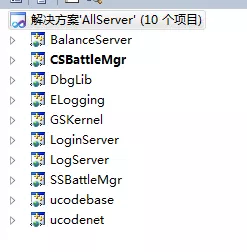
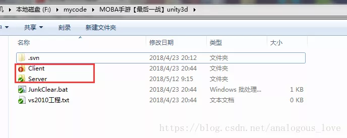
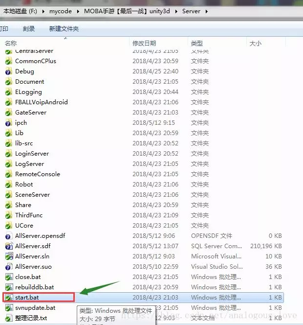
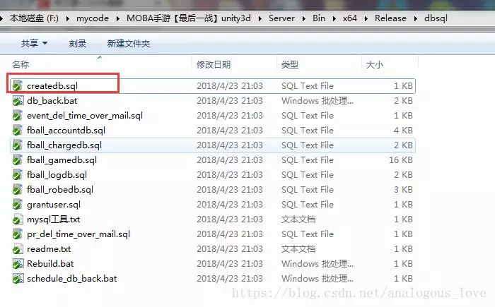
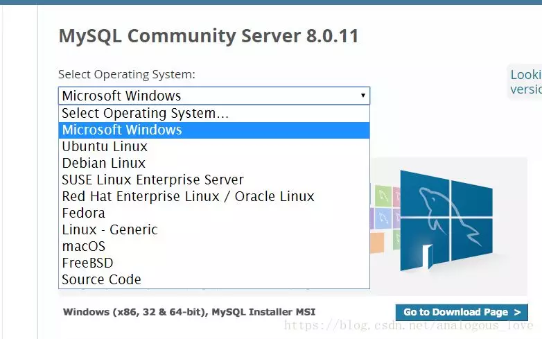

## 从零学习开源项目系列（二） 最后一战概况

这份代码我也是无意中来自一个朋友，据他说也是来源于互联网，服务器端代码原来是Linux版本的，但被厉害的大神修改成可以在Windows上运行。（如果不小心侵犯了您的版权，请联系我删除）。好在，这份代码中使用的大多数方法和接口都是可以跨Windows和Linux两个平台的，所以Linux开发下的朋友请不要感到不适，我们学习这份代码更多的不是纠结细节而是学习思路和原理。

游戏主solution文件用Visual Studio打开后如下图所示：



这里总共有10个工程项目，模块比较多。**我们应该从何处入手呢？**我们先看下源码目录：



我们进入**Server目录**，发现如下一个文件：



我们打开看一下**内容**：

```
cd Bin\x64\Release
start.bat
```

这个代码**进入Bin\x64\Release目录**，执行另外一个start.bat，我们进入这个目录去看下这个**文件内容**：

```
taskkill /f /t /im redis-server.exe 
taskkill /f /t /im CSBattleMgr.exe 
taskkill /f /t /im SSBattleMgr.exe 
taskkill /f /t /im GSConsole.exe 
taskkill /f /t /im BalanceServer.exe
taskkill /f /t /im LoginServer.exe
taskkill /f /t /im GSKernel.exe
taskkill /f /t /im RobotConsole.exe
taskkill /f /t /im LogServer.exe

ping -n 1 127.0>nul
start /min "redis-server" "redis-server.exe" redis.conf

ping -n 1 127.0>nul
start /min "redis-Logicserver" "redis-server.exe" redis-logic.conf

ping -n 1 127.0>nul
echo "start CSBattleMgr.exe"
start /min "CSBattleMgr" "CSBattleMgr.exe"

ping -n 1 127.0>nul
echo "start SSBattleMgr.exe"
start /min "SSBattleMgr" "SSBattleMgr.exe"

ping -n 1 127.0>nul
echo "start GSKernel.exe"
start /min "GSKernel" "GSKernel.exe"

ping -n 1 127.0>nul
echo "start BalanceServer.exe"
start /min "BalanceServer" "BalanceServer.exe"

ping -n 1 127.0>nul
echo "start LoginServer.exe"
start /min "LoginServer" "LoginServer.exe"

ping -n 1 127.0>nul
echo "start LogServer.exe"
start /min "LogServer" "LogServer.exe"
```

通过这个脚本，我们得到了这个服务器项目的一些信息，这个服务器由以下一些服务**组成**：

- redis-server（启动两个）
- CSBattleMgr
- SSBattleMgr
- GSKernel
- BalanceServer
- LoginServer
- LogServer

这些服务器具体是做啥的，我现在也不知道，**后面我们会教大家如何阅读。**

另外在Bin/x64/Release/dbsql目录我们发下一些**sql文件**：


我们打开**建表的createdb.sql：**

```
drop database if exists fball_gamedb;
drop database if exists fball_logdb;

drop database if exists fball_accountdb;
create database fball_accountdb character set utf8;

drop database if exists fball_chargedb;
create database fball_chargedb character set utf8;

drop database if exists fball_robedb;
create database fball_robedb character set utf8; 

drop database if exists fball_gamedb_1;
create database fball_gamedb_1 character set utf8;

drop database if exists fball_gamedb_2;
create database fball_gamedb_2 character set utf8;

drop database if exists fball_gamedb_3;
create database fball_gamedb_3 character set utf8; 

drop database if exists  fball_logdb_1;
create database fball_logdb_1 character set utf8;

drop database if exists  fball_logdb_2;
create database fball_logdb_2 character set utf8;

drop database if exists  fball_logdb_3;
create database fball_logdb_3 character set utf8;
```

也就是说，这套服务需要使用mysql，我们安装一个mysql，并执行这个Rebuild.bat把这些库创建一下，**Rebuild.bat内容**如下：

```
@echo off  
:begin
@echo ----------1, create all game database------------ 
mysql -uroot -p123321<createdb.sql
mysql -uroot -p123321<grantuser.sql 

mysql -uroot -p123321<fball_accountdb.sql
mysql -uroot -p123321<fball_chargedb.sql
mysql -uroot -p123321<fball_robedb.sql

mysql -uroot -p123321 fball_accountdb < fball_accountdb.sql
mysql -uroot -p123321 fball_chargedb < fball_chargedb.sql
mysql -uroot -p123321 fball_robedb < fball_robedb.sql

mysql -uroot -p123321 fball_gamedb_1 < fball_gamedb.sql
mysql -uroot -p123321 fball_gamedb_2 < fball_gamedb.sql
mysql -uroot -p123321 fball_gamedb_3 < fball_gamedb.sql 

mysql -uroot -p123321 fball_logdb_1 < fball_logdb.sql
mysql -uroot -p123321 fball_logdb_2 < fball_logdb.sql
mysql -uroot -p123321 fball_logdb_3 < fball_logdb.sql 
```

通过这个，我们发现这里mysql的root用户的密码123321。你在创建mysql时，需要**建议**将密码也设置成这个。

我们**下载**mysql community版本（免费的），下载地址：

> https://dev.mysql.com/downloads/mysql/

**类型**我们选Microsoft：



**注意**，这套服务也使用了redis，我们不用专门下载和编译redis windows版本，我们的程序目录下已经提供了windows版本的redis的服务程序和配置文件：



我们搞清楚基本服务器概况后，**各个服务的作用以及服务之间的关系如何**，我们下一篇文章继续分析。


欢迎阅读下一篇**《从零学习开源项目系列（三） CSBattleMgr和LogServer》。**

> 源码下载方法：
>
> 微信搜索公众号**『高性能服务器开发』**(中文名：高性能服务器开发)，关注公众号后，在公众号中回复**『英雄联盟』**，即可得到下载链接。（喷子和代码贩子请远离！）