## 从零学习开源项目系列（四）LogServer源码探究

这是从零学习开源项目的第四篇，上一篇是《[从零学习开源项目系列（三） CSBattleMgr服务源码研究](http://mp.weixin.qq.com/s?__biz=MzU2MTQ1MzI3NQ==&mid=2247484692&idx=1&sn=346d0a16db724a575947562282f7c621&chksm=fc79c4a0cb0e4db62bc1f2a4f9489cd5d0cf8dd4c3363fcdd76bb65543e372b780b0895711a7&scene=21#wechat_redirect)》，这篇文章我们一起来学习LogServer，中文意思可能是“日志服务器”。那么这个日志服务器到底做了哪些工作呢？

我们在Visual Studio中将LogServer设置为启动项，然后按F5将LogServer启动起来，启动成功后显示如下图：

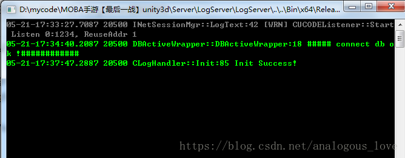

从上图中，我们可以到大致做了三件事：

```
1. 创建一个侦听端口（端口号1234）
2. 连接mysql数据库
3. 初始化日志处理程序
```

我们来验证一下这三件事的细节。我们再Visual Studio中将程序中断（【**调试**】菜单-【**全部中断**】，快捷键**Ctrl + Alt + Break**）。然后在线程窗口查看这个程序所有的线程，如下图所示：

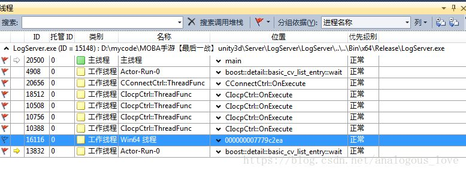

所有用红色旗帜标记的线程都是用户线程，我们可以查看这些线程的调用堆栈。我们从最上面的主线程开始：

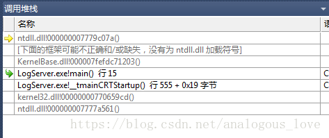

切换到main函数，我们可以看出这里是一个循环：

```
int main()
{
    auto res = CLogHandler::GetInstance().Init();
    if (res)
    {
        while(true)
        {
            INetSessionMgr::GetInstance()->Update();
            Sleep(1);
        }
    }
    return 0;
}
```

这里一个是初始化动作，一个循环中**Update**动作，它们具体做了些什么，我们先不管，我们先看其他线程做了什么，再回过头来看这里的代码。

我们接着看下一个线程的内容：

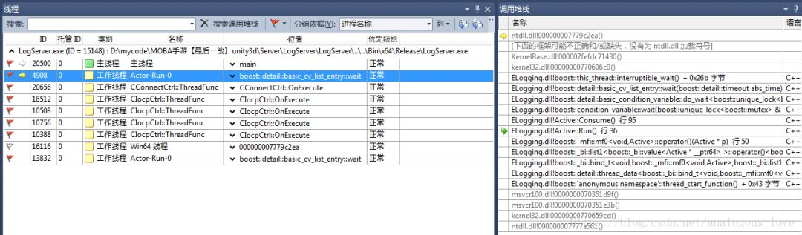

从调用堆栈来看，这是一个使用**boost::thread**启动的线程，这个线程函数代码如下：

```
void Active::Run() {
    if (m_BeginInThreadCallback){
    m_BeginInThreadCallback();
    }
    while (true){
    Consume();
    }
}
```

我们先看下这个线程函数做了什么，主要是**m_BeginInThreadCallback**和**Consume()**函数，看下**Consume()**函数：

```
void Active::Consume(){
    boost::mutex::scoped_lock lock(m_IOMutex);
    while(m_Queue.empty()){
        m_ConditionVar.wait(lock);
    }
    m_SwapQueue.swap(m_Queue);
    lock.unlock();
    while(!m_SwapQueue.empty()){
        Buffer* pBuffer = m_SwapQueue.front();
        m_SwapQueue.pop();
        m_Callback(pBuffer);
        --m_PendingWorkNum;
        if (pBuffer){
            m_pBufferPool.ReleaseObejct(pBuffer);
        }
    }
}
```

这段代码很好理解，先使用条件变量挂起当前线程，条件变量触发后，如果消费者和生产者共有队列**m_Queue**中有数据，将公用的队列**m_Queue**临时倒换到本地的一个局部队列**m_SwapQueue**中，然后挨个处理队列**m_SwapQueue**中的数据。

这个线程在哪里创建的呢？通过搜索线程函数，我们找到如下代码：

```
void Active::Start(){
    bool ifHvTimer = !m_ThreadTimer.IsEmpty();
    if (ifHvTimer){
        m_Thread = boost::thread(&Active::RunWithUpdate, this);
    }
    else{
        m_Thread = boost::thread(&Active::Run, this);
    }
    m_ThreadID = get_native_thread_id(m_Thread);
    char sThreadName[30];
    sprintf(sThreadName, "%s-%d", "Actor-Run", GetActorID());
    _SetThreadName(m_ThreadID, sThreadName);
}
```

在上面这个函数中添加断点，重启下程序，很快会触发断点，我们看下断点触发时的调用堆栈：

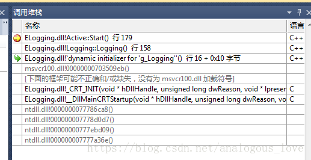

通过调用堆栈，我们发现这个线程在一个全局变量的构造函数中初始化的，这个全局变量在DllMain()函数中初始化：

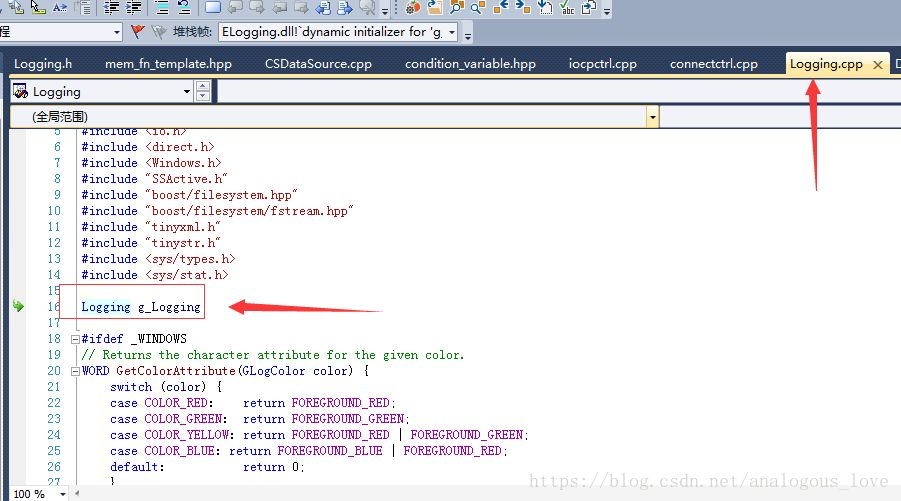

而这个dll是ELogging项目生成的：


也就是说，这是一个与日志处理相关的线程。生产者产生日志记录，然后由这个线程作为消费者，来处理日志。

我们接着看下一个线程的内容：

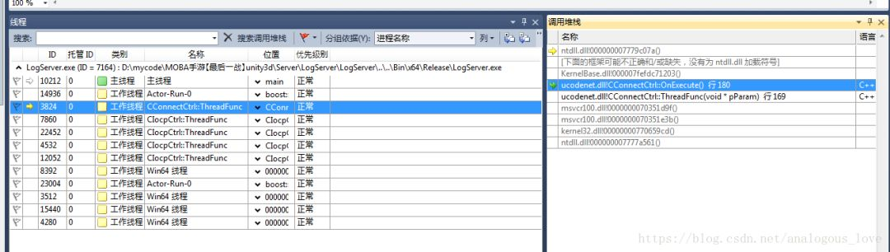

```
void CConnectCtrl::OnExecute()
{
    while(!m_bTerminate)
    {
        _ProcRequests();
        _ProcEvents();
        //CCPSockMgr::Instance()->CheckDelayRelease();
        Sleep(1);
    }
}
```

这也是一个循环，先看下_ProcRequests()函数：

```
void CConnectCtrl::_ProcRequests()
{
    while(m_dwSockCount < (UINT32)MAX_CONNECTION)
    {
        SConnReq* pstConnReq = (SConnReq*)m_oReqQueue.PopFront();
        if(NULL == pstConnReq)
        {
            break;
        }
        SOCKET hSock = socket(PF_INET, SOCK_STREAM, IPPROTO_IP);
        if(INVALID_SOCKET == hSock)
        {
            CRITICAL(_SDT("CConnectCtrl::_ProcRequests, socket failed, errno %d"), WSAGetLastError());
            CEventMgr::Instance()->PushConnErrEvt(WSAGetLastError(), pstConnReq->dwConnectorID);
            m_oFreeQueue.PushBack(pstConnReq);
            break;
        }
        //// 2009-04-02 cwy modify for general use
        if (pstConnReq->bNeedBind)
        {
            if ( false == BindAddress(hSock, pstConnReq->pszBindIP, pstConnReq->wBindPort) )
            {
                _OnSockError(hSock, pstConnReq);
                break;
            }
        }
        if (g_bNodelay)
        {
            const CHAR szOpt = 1;
            if (0 != ::setsockopt(hSock, IPPROTO_TCP, TCP_NODELAY, (char *)&szOpt, sizeof(char)))
            {
                WARN(_SDT("setsockopt for new socket on UpdateConetext failed, errno=%d"), ::WSAGetLastError());
            }
        }
        WSAEVENT hEvent = WSACreateEvent();
        if(WSA_INVALID_EVENT == hEvent)
        {
            _OnSockError(hSock, pstConnReq);
            break;
        }
        if(SOCKET_ERROR == WSAEventSelect(hSock, hEvent, FD_CONNECT))
        {
            _OnSockError(hSock, pstConnReq);
            WSACloseEvent(hEvent);
            break;
        }
        sockaddr_in stAddr = {0};
        stAddr.sin_family       = AF_INET;
        stAddr.sin_addr.s_addr  = pstConnReq->dwIP;
        stAddr.sin_port         = htons(pstConnReq->wPort);
        if( SOCKET_ERROR == connect(hSock, (sockaddr*)&stAddr, sizeof(stAddr)) )
        {
            if(WSAEWOULDBLOCK != WSAGetLastError())
            {
                _OnSockError(hSock, pstConnReq);
                WSACloseEvent(hEvent);
                break;
            }
        }
        m_pProcReqArray[m_dwSockCount]  = pstConnReq;
        m_pSockArray[m_dwSockCount]     = hSock;
        m_pEventsArray[m_dwSockCount]   = hEvent;
        ++m_dwSockCount;
    }
}
```

这段函数的逻辑也是比较容易懂，先从一个队列中取出数据，然后处理，只不过这些数据都是与连接相关的信息。

再看下while循环中第二个函数_ProcEvents：

```
void CConnectCtrl::_ProcEvents()
{
    if(0 == m_dwSockCount)
    {
        return;
    }
    WSANETWORKEVENTS    stNetworkEvents;
    WSAEVENT*           pEvents;
    UINT32              dwCount;
    UINT32              dwIndex;
    UINT32              dwStart = 0;
    do
    {
        pEvents = &m_pEventsArray[dwStart];
        if(dwStart + WSA_MAXIMUM_WAIT_EVENTS > m_dwSockCount)
        {
            dwCount = m_dwSockCount - dwStart;
        }
        else
        {
            dwCount = WSA_MAXIMUM_WAIT_EVENTS;
        }
        dwIndex = WSAWaitForMultipleEvents(dwCount, pEvents, false, 0, false);
        if(WSA_WAIT_FAILED == dwIndex || WSA_WAIT_TIMEOUT == dwIndex)
        {
            dwStart += dwCount;
            continue;
        }
        dwIndex -= WSA_WAIT_EVENT_0;
        dwIndex += dwStart;
        ++dwStart;
        SDASSERT(m_pProcReqArray[dwIndex] != NULL && m_pSockArray[dwIndex] != INVALID_SOCKET && m_pEventsArray[dwIndex] != WSA_INVALID_EVENT);
        if(SOCKET_ERROR == WSAEnumNetworkEvents(m_pSockArray[dwIndex], m_pEventsArray[dwIndex], &stNetworkEvents))
        {
            if(WSAEWOULDBLOCK != WSAGetLastError())
            {
                CEventMgr::Instance()->PushConnErrEvt(WSAGetLastError(), m_pProcReqArray[dwIndex]->dwConnectorID);
                _CloseEvent(dwIndex);
            }
            continue;
        }
        if(stNetworkEvents.lNetworkEvents & FD_CONNECT)
        {
            if(stNetworkEvents.iErrorCode[FD_CONNECT_BIT] != 0)
            {
                CEventMgr::Instance()->PushConnErrEvt(stNetworkEvents.iErrorCode[FD_CONNECT_BIT], m_pProcReqArray[dwIndex]->dwConnectorID);
                _CloseEvent(dwIndex);
                continue;
            }
            //
            // 连接成功
            //
            SConnReq* pstReq = m_pProcReqArray[dwIndex];
            CConnData * pConnData = CConnDataMgr::Instance()->Alloc(pstReq->dwRecvBufSize, pstReq->dwSendBufSize);
            if (pConnData == NULL)
            {
                CRITICAL(_SDT("CConnectCtrl::_ProcEvents, create ConnData failed"));
                CEventMgr::Instance()->PushConnErrEvt(0, pstReq->dwConnectorID);
                _CloseEvent(dwIndex);
                continue;
            }
            CCPSock *poSock = &pConnData->sock;
            CUCConnection * poConnection = &pConnData->connection;
            poSock->SetSock(m_pSockArray[dwIndex]);
            m_oFreeQueue.PushBack(m_pProcReqArray[dwIndex]);
            WSACloseEvent(m_pEventsArray[dwIndex]);
            m_pProcReqArray[dwIndex]    = NULL;
            m_pSockArray[dwIndex]       = INVALID_SOCKET;
            m_pEventsArray[dwIndex]     = WSA_INVALID_EVENT;
            sockaddr_in stAddr = {0};
            INT32 nAddrLen = sizeof(stAddr);
            getsockname(poSock->GetSock(), (sockaddr*)&stAddr, &nAddrLen);
            poConnection->SetAccept(false);
            poConnection->SetParentID(pstReq->dwConnectorID);
            poConnection->SetSession(pstReq->poSession);
            poConnection->SetLocalIP(stAddr.sin_addr.s_addr);
            poConnection->SetLocalPort(SDNtohs(stAddr.sin_port));
            poConnection->SetRemoteIP(pstReq->dwIP);
            poConnection->SetRemotePort(pstReq->wPort);
            //poConnection->SetCpSock(poSock);
            //poSock->SetConnection(poConnection);
            poSock->SetPacketParser(pstReq->poPacketParser);
            poSock->SetConnect(TRUE);
            //CEventMgr::Instance()->PushEstablishEvt(pConnData, false, pstReq->dwConnectorID);
            if(false == poSock->AssociateWithIocp())
            {
                poSock->Close();
            }
            else
            {
                if(false == poSock->PostRecv())
                {
                    poSock->Close();
                }
            }
        }
    }while(dwStart < m_dwSockCount);
    _CompressEvent();
}
```

这个函数，对上一个函数中发起的连接结果做出判断并处理。如果连接成功，则向完成端口上投递一个recv事件。这个循环的代码，我建议读者好好研究一下，非常好的重连实例，同时也组合了完成端口的模型，还有一些重要的网络编程细节（如nodelay选项等）。

那么这个线程在哪里启动的呢？通过搜索OnExecute函数名我们发现真正的线程函数：

```
unsigned CConnectCtrl::ThreadFunc(LPVOID pParam)
{
    CConnectCtrl* poCtrl = (CConnectCtrl*)pParam;
    poCtrl->OnExecute();
    return 0;
}
```

进而搜索到：

```
bool CConnectCtrl::Init()
{
    INT32 nMaxRequest = MAX_CONNECTION * 2;
    m_pAllReqArray = new SConnReq[nMaxRequest];
    if(NULL == m_pAllReqArray)
    {
        return false;
    }
    if(false == m_oFreeQueue.Init(nMaxRequest+1))
    {
        return false;
    }
    if(false == m_oReqQueue.Init(nMaxRequest+1))
    {
        return false;
    }
    INT32 i;
    for(i = 0; i < nMaxRequest; i++)
    {
        m_oFreeQueue.PushBack(&m_pAllReqArray[i]);
    }
    m_pProcReqArray = new SConnReq*[MAX_CONNECTION];
    if(NULL == m_pProcReqArray)
    {
        CRITICAL(_SDT("CConnectCtrl::Init, new SConnReq*[%d] failed"), MAX_CONNECTION);
        return false;
    }
    m_pEventsArray = new WSAEVENT[MAX_CONNECTION];
    if(NULL == m_pEventsArray)
    {
        CRITICAL(_SDT("CConnectCtrl::Init, new WSAEVENT[%d] failed"), MAX_CONNECTION);
        return false;
    }
    m_pSockArray = new SOCKET[MAX_CONNECTION];
    if(NULL == m_pSockArray)
    {
        CRITICAL(_SDT("CConnectCtrl::Init, new SOCKET[%d] failed"), MAX_CONNECTION);
        return false;
    }
    for(i = 0; i < MAX_CONNECTION; i++)
    {
        m_pProcReqArray[i]  = NULL;
        m_pEventsArray[i]   = WSA_INVALID_EVENT;
        m_pSockArray[i]     = INVALID_SOCKET;
    }
    m_dwSockCount = 0;
    m_bTerminate = false;
    UINT dwThreadID = 0;
    m_hThread = (HANDLE)_beginthreadex( NULL,                   // Security
                                        0,                      // Stack size - use default
                                        ThreadFunc,             // Thread fn entry point
                                        (void*)this,            // Param for thread
                                        0,                      // Init flag
                                        &dwThreadID);           // Thread address
    if(NULL == m_hThread)
    {
        CRITICAL(_SDT("CConnectCtrl::Init, _beginthreadex failed"));
        return false;
    }
    return true;
}
```

我们在**CConnectCtrl::Init()**处加个断点，然后重启一下程序，看下调用堆栈：

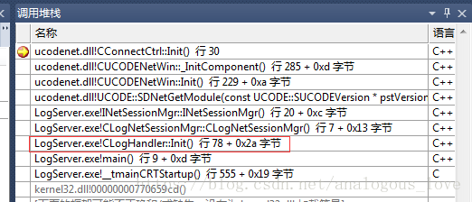

在**CUCODENETWin::_InitComponent()**中我们看到整个网络通信框架的初始化，初始化**CConnDataMgr**、**CEventMgr**、**CConnectCtrl**和**CIocpCtrl**。

```
bool CUCODENetWin::_InitComponent()
{
    if (false == CConnDataMgr::Instance()->Init())
    {
        CRITICAL(_SDT("CUCODENetWin::_InitComponent, Init CConnDataMgr failed" ));
        return false;
    }
    if(false == CEventMgr::Instance()->Init(MAX_NET_EVENT))
    {
        CRITICAL(_SDT("CUCODENetWin::_InitComponent, Init CEventMgr %d failed"), MAX_NET_EVENT);
        return false;
    }
    if(false == CConnectCtrl::Instance()->Init())
    {
        CRITICAL(_SDT("CUCODENetWin::_InitComponent, Init CConnectCtrl failed"));
        return false;
    }
    if(false == CIocpCtrl::Instance()->Init())
    {
        CRITICAL(_SDT("CUCODENetWin::_InitComponent, Init CIocpCtrl failed"));
        return false;
    }
    return true;
}
```

而所有的这些初始化，都是在所谓的CLogNetSessionMgr中初始化的：

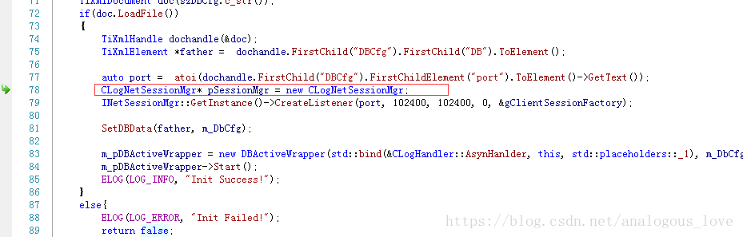

我们最终追溯到最上层的代码中：

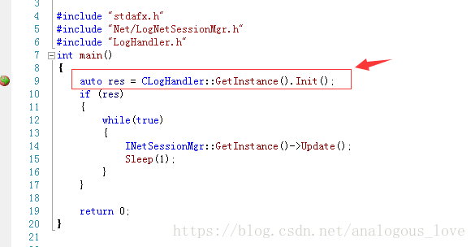

到这里，终于找到家了。

最后一批介绍的四个线程是完成端口线程，如下图所示：

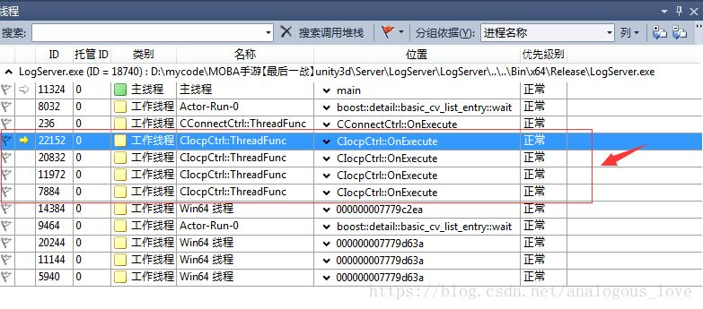

精华部分全在其线程函数中：

```
void CIocpCtrl::OnExecute()
{
    SPerHandleData* pstPerHandleData;
    SPerIoData*     pstPerIoData;
    CCPSock*        poSock;
    CCpListener*    poListener;
    BOOL            bRet;
    DWORD           dwByteTrabsferred;
    while(true)
    {
        pstPerHandleData    = NULL;
        pstPerIoData        = NULL;
        dwByteTrabsferred   = 0;
        bRet = GetQueuedCompletionStatus(
            m_hCompletionPort,
            &dwByteTrabsferred,
            (PULONG_PTR)&pstPerHandleData,
            (LPOVERLAPPED*)&pstPerIoData,
            INFINITE);
        // 检查是否是线程退出
        if(NULL == pstPerHandleData)
        {
            return;
        }
        //当有客户端请求创建连接时
        if(pstPerHandleData->bListen)
        {
            // for listen event
            poListener = (CCpListener*)pstPerHandleData->ptr;
            if(NULL != poListener &&  NULL != pstPerIoData)
            {
                poListener->OnAccept(bRet, pstPerIoData);
                //printf("Accpet Count:%d \n", InterlockedIncrement((LONG*)&m_acceptCount) ); 
            }
            else 
            {
                SDASSERT(false);
            }
        }
        else 
        {
            //for non-listen event 
            poSock = (CCPSock*)pstPerHandleData->ptr;
            if ( NULL == poSock )
            {
                continue;
            }
            if( FALSE == bRet || NULL == pstPerIoData )
            {               
                if (::WSAGetLastError()!=ERROR_IO_PENDING)
                {
                    INFO(_SDT("[%s:%d]CCPSock connID=%d error %d, close it"), 
                        MSG_MARK, poSock->GetConnectionID(), ::WSAGetLastError());
                    poSock->OnClose();
                }                
            }
            else
            {           
                switch(pstPerIoData->nOp)
                {
                case IOCP_RECV:
                    {
                        poSock->DecPostRecv();
                        if (dwByteTrabsferred > 0)
                        {
                            poSock->OnRecv(dwByteTrabsferred);
                        }
                        else
                        {
                            INFO(_SDT("[%s:%d]CCPSock connID=%d error %d, close it, socket :%d "), 
                                MSG_MARK, poSock->GetConnectionID(), ::WSAGetLastError(), poSock->GetSock());
                            poSock->OnClose();
                        }
                    }
                    break;
                case IOCP_SEND:
                    {
                        poSock->DecPostSend();
                        if (dwByteTrabsferred > 0)
                        {
                            poSock->OnSend(dwByteTrabsferred);
                        }
                        else
                        {
                            INFO(_SDT("[%s:%d]CCPSock connID=%d error %d, close it"), 
                                MSG_MARK, poSock->GetConnectionID(), ::WSAGetLastError());
                            poSock->OnClose();
                        }
                    }
                    break;
                case IOCP_CLOSE:
                    {
                        poSock->OnClose(false);
                    }
                    break;
                default:
                    ;
                }
            }
        }
    }
}
```

我始终觉得，**完成端口模型即使不从事Windows开发的linux服务器开发人员应该也要掌握一下。**尤其是linux服务器开发人员需要给客户端人员设计网络通信层的企业。

我们看下，这四个线程在哪里启动的。

同样的方法，我们通过搜索，先找到：

```
unsigned CIocpCtrl::ThreadFunc(LPVOID pParam)
{
    CIocpCtrl* poCtrl = (CIocpCtrl*)pParam;
    poCtrl->m_threadBufPool.CreateThreadBuffer();
    poCtrl->OnExecute();
    poCtrl->m_threadBufPool.ReleaseThreadBuffer();
    return 0;
}
```

进而进一步找到：

```
bool CIocpCtrl::Init()
{
    //创建IO完成端口句柄
    m_hCompletionPort = CreateIoCompletionPort(INVALID_HANDLE_VALUE, NULL, 0, 0);
    if (m_hCompletionPort == NULL)
    {
        CRITICAL(_SDT("CIocpCtrl::Init, CreateIoCompletionPort failed, Error %d \n"), ::WSAGetLastError()); 
        return false;
    }
    //获取当前服务器的CPU核数
    SYSTEM_INFO stSysInfo;
    GetSystemInfo(&stSysInfo);
    m_nNumberOfWorkers = stSysInfo.dwNumberOfProcessors * THREAD_PER_CPU;
    if (g_nThreadNum > 0)
    {
        m_nNumberOfWorkers = g_nThreadNum;
    }
    m_WorkerArray = new HANDLE[m_nNumberOfWorkers];
    for (INT32 i = 0; i < m_nNumberOfWorkers; i++) 
    {
        m_WorkerArray[i] = INVALID_HANDLE_VALUE;
    }
    //创建m_nNumberOfWorkers个线程
    UINT dwThreadID = 0;
    for (INT32 j = 0; j < m_nNumberOfWorkers; j++) 
    {
        m_WorkerArray[j] = (HANDLE)_beginthreadex(  NULL,                   // Security
                                                    0,                      // Stack size - use default
                                                    ThreadFunc,             // Thread fn entry point
                                                    (void*)this,            // Param for thread
                                                    0,                      // Init flag
                                                    &dwThreadID);           // Thread address
        if (NULL == m_WorkerArray[j]) 
        {
            m_nNumberOfWorkers = j;
            this->Uninit();
            CRITICAL(_SDT("CIocpCtrl::Init, Create Worker thread failed, Close Handler\n")); 
            return false;
        }
    }
    return true;
}
```

然后同样的方法在CIocpCtrl::Init()处加个断点，重新跑下程序，得到如下调用堆栈：

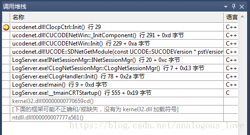

我们上文中已经介绍过了，这里就不再重复说明：

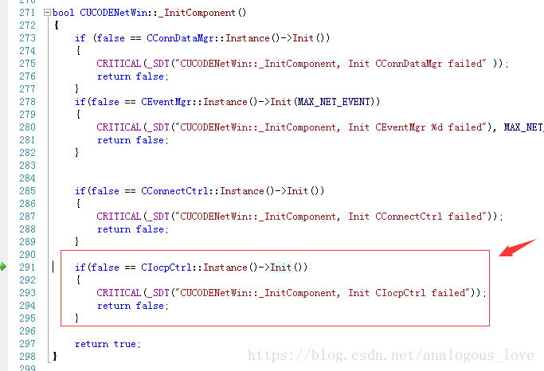

通过分析，我们知道LogServer大致的技术框架，业务细节和技术细节，我们在后面的文章中会接着介绍。我们当前的目的是快速把所有的服务的技术框架给熟悉一遍。

> 源码下载方法：
>
> 微信搜索公众号**『高性能服务器开发』**(中文名：高性能服务器开发)，关注公众号后，在公众号中回复**『英雄联盟』**，即可得到下载链接。（喷子和代码贩子请远离！）