## 从零学习开源项目系列（三） CSBattleMgr服务源码研究

服务器项目工程如下图所示：

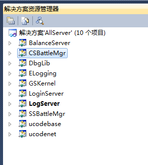

如上图所示，这篇文章我们将介绍CSBattleMgr的情况，但是我们不会去研究这个服务器的特别细节的东西（这些细节我们将在后面的文章中介绍）。阅读一个未知的项目源码如果我们开始就纠结于各种细节，那么我们最终会陷入“横看成岭侧成峰，远近高低各不同”的尴尬境界，浪费时间不说，可能收获也是事倍功半。所以，尽管我们不熟悉这套代码，我们还是尽量先从整体来把握，先大致了解各个服务的功能，细节部分回头再针对性地去研究。

这个系列的第二篇文章《[从零学习开源项目系列（二） 最后一战概况](http://mp.weixin.qq.com/s?__biz=MzU2MTQ1MzI3NQ==&mid=2247484623&idx=1&sn=70998483d3a394db444bf2b7e76548a9&chksm=fc79c57bcb0e4c6dfe15b6a62dfa8f083861a757dfcff2faa381dc56a9d4f2a3b2e190da6caa&scene=21#wechat_redirect)》中我们介绍了，这套游戏的服务需要使用redis和mysql，我们先看下mysql是否准备好了（mysql服务启动起来，数据库建表数据存在，具体细节请参考第二篇文章）。打开Windows的cmd程序，输入以下指令连接mysql：

```
mysql -uroot -p123321  
```

连接成功以后，如下图所示：

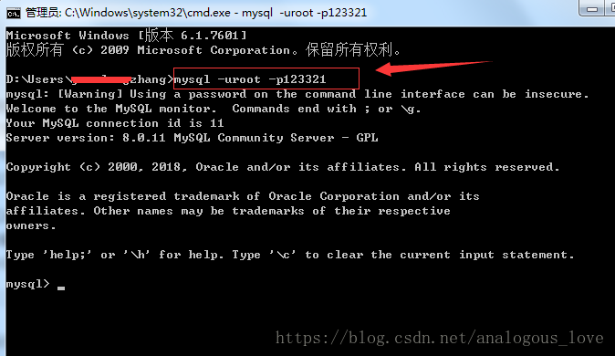

然后我们输入以下指令，查看我们需要的数据库是否创建成功：

```
show databases;  
```

这些都是基本的sql语句，如果您不熟悉的话，可能需要专门学习一下。

数据库创建成功后如下图所示：

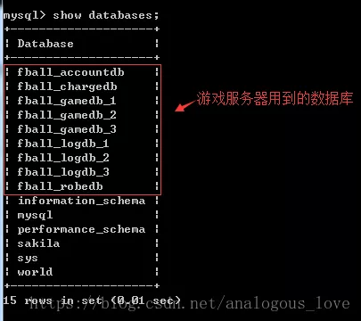

至于数据库中的表是否创建成功，我们这里先不关注，后面我们实际用到哪张数据表，我们再去研究。

mysql没问题了，接下来我们要启动一下redis，通过第二篇文章我们知道redis需要启动两次，也就是一共两个redis进程，我们游戏服务中分别称为**redis-server**和**redis-login-server**（它们的配置文件信息不一样），我们可以在**Server\Bin\x64\Release**目录下手动cmd命令行执行下列语句：

```
start /min "redis-server" "redis-server.exe" redis.conf  
start /min "redis-Logicserver" "redis-server.exe" redis-logic.conf  
```

但是这样比较麻烦，我将这两句拷贝出来，放入一个叫start-redis.bat文件中了，每次启动只要执行一下这个bat文件就可以：

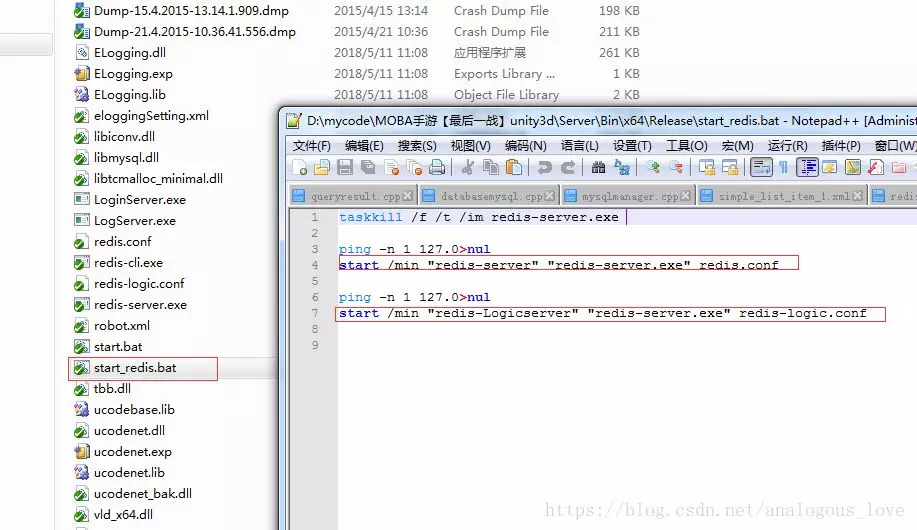

redis和redis-logic服务启动后如下图所示：

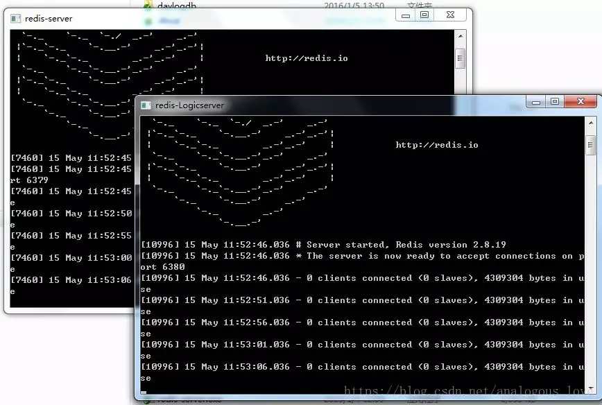

我们常见的redis服务都是linux下的源码，微软公司对redis源码进行了改造，出了一个Windows版本，稍微有点不尽人意（例如：Windows下没有完全与linux的fork()相匹配的API，所以只能用CreateProcess()去替代）。关于windows版本的redis源码官方下载地址为：https://github.com/MicrosoftArchive/redis/releases。

在启动好了mysql和redis后，我们现在正式来看一下CSBattleMgr这个服务。读者不禁可能要问，那么多服务，你怎么知道要先看这个服务呢？我们[上一篇文章](http://mp.weixin.qq.com/s?__biz=MzU2MTQ1MzI3NQ==&mid=2247484623&idx=1&sn=70998483d3a394db444bf2b7e76548a9&chksm=fc79c57bcb0e4c6dfe15b6a62dfa8f083861a757dfcff2faa381dc56a9d4f2a3b2e190da6caa&scene=21#wechat_redirect)中也说过，我们再start.bat文件中发现除了redis以外，这是第三个需要启动的服务，所以我们先研究它（start.bat我们可以认为是源码作者为我们留下的部署步骤“文档”）：

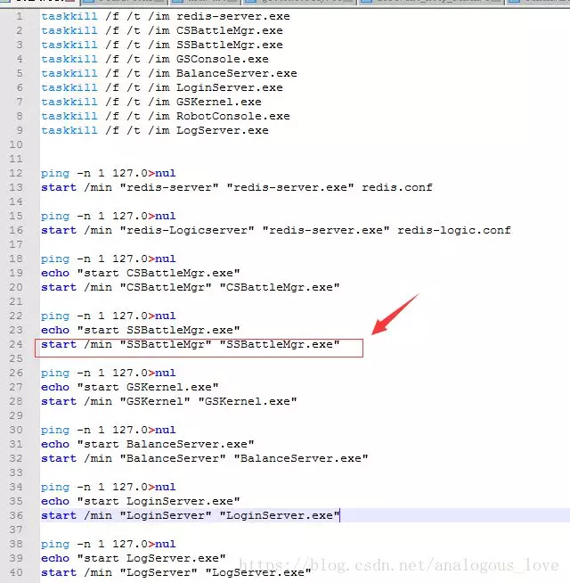

我们打开CSBattleMgr服务main.cpp文件，找到入口main函数，内容如下：

```
int main(){  
    DbgLib::CDebugFx::SetExceptionHandler(true);  
    DbgLib::CDebugFx::SetExceptionCallback(ExceptionCallback, NULL);  
    GetCSKernelInstance();  
    GetCSUserMgrInstance();  
    GetBattleMgrInstance();  
    GetCSKernelInstance()->Initialize();  
    GetBattleMgrInstance()->Initialize();  
    GetCSUserMgrInstance()->Initialize();  
    GetCSKernelInstance()->Start();  
    mysql_library_init(0, NULL, NULL);  
    GetCSKernelInstance()->MainLoop();  
}  
```

通过调试，我们发下这个函数大致做了以下任务：

```
//1. 设置程序异常处理函数  
//2. 初始化一系列单例对象  
//3. 初始化mysql  
//4. 进入一个被称作“主循环”的无限循环  
```

**步骤1**设置程序异常处理函数没有好介绍的，我们看一下**步骤2**初始化一系列单例对象，总共初始化了三个类的对象**CCSKernel**、**CCSUserMgr**和**CCSBattleMgr**。单例模式本身没啥好介绍的，但是有人要提单例模式的线程安全性，所以出现很多通过加锁的单例模式代码，我个人觉得没必要；认为要加锁的朋友可能认为单例对象如果在第一次初始化时同时被多个线程调用就会有问题，我觉得加锁带来的开销还不如像上面的代码一样，在整个程序初始化初期获取一下单例对象，让单例对象生成出来，后面即使多个线程获取这个单例对象也都是读操作，无需加锁。以GetCSKernelInstance();为例：

```
CCSKernel* GetCSKernelInstance(){  
    return &CCSKernel::GetInstance();  
}  

CCSKernel& CCSKernel::GetInstance(){  
    if (NULL == pInstance){  
        pInstance = new CCSKernel;  
    }  
    return *pInstance;  
}  
```

GetCSKernelInstance()->Initialize()的初始化动作其实是加载各种配置信息和事先设置一系列的回调函数和定时器：

```
INT32   CCSKernel::Initialize()  
{  
    //JJIAZ加载配置的时候 不要随便调整顺序  
    CCSCfgMgr::getInstance().Initalize();   
    INT32 n32Init = LoadCfg();     
    if (eNormal != n32Init)  
    {  
        ELOG(LOG_ERROR," loadCfg()............failed!");  
        return n32Init;  
    }  
    if(m_sCSKernelCfg.un32MaxSSNum > 0 )  
    {  
        m_psSSNetInfoList = new SSSNetInfo[m_sCSKernelCfg.un32MaxSSNum];  
        memset(m_psSSNetInfoList, 0, sizeof(SSSNetInfo) * m_sCSKernelCfg.un32MaxSSNum);  
        m_psGSNetInfoList = new SGSNetInfo[m_sCSKernelCfg.un32MaxGSNum];  
        memset(m_psGSNetInfoList, 0, sizeof(SGSNetInfo) * m_sCSKernelCfg.un32MaxGSNum);  
        m_psRCNetInfoList = new SRCNetInfo[10];  
    }  
    m_GSMsgHandlerMap[GSToCS::eMsgToCSFromGS_AskRegiste] = std::bind(&CCSKernel::OnMsgFromGS_AskRegiste, this, std::placeholders::_1, std::placeholders::_2, std::placeholders::_3);  
    m_GSMsgHandlerMap[GSToCS::eMsgToCSFromGS_AskPing] = std::bind(&CCSKernel::OnMsgFromGS_AskPing, this, std::placeholders::_1, std::placeholders::_2, std::placeholders::_3);  
    m_GSMsgHandlerMap[GSToCS::eMsgToCSFromGS_ReportGCMsg] = std::bind(&CCSKernel::OnMsgFromGS_ReportGCMsg, this, std::placeholders::_1, std::placeholders::_2, std::placeholders::_3);  
    m_SSMsgHandlerMap[SSToCS::eMsgToCSFromSS_AskPing] = std::bind(&CCSKernel::OnMsgFromSS_AskPing, this, std::placeholders::_1, std::placeholders::_2, std::placeholders::_3);  
    AddTimer(std::bind(&CCSKernel::ProfileReport, this, std::placeholders::_1, std::placeholders::_2), 5000, true);  
    return eNormal;  
}  
```


如上图所示，这些配置信息都是游戏术语，包括各种技能、英雄、模型等信息。

GetBattleMgrInstance()->Initialize()其实是帮CSKernel对象启动一个定时器：

```
INT32   CCSBattleMgr::Initialize(){  
    GetCSKernelInstance()->AddTimer(std::bind(&CCSMatchMgr::Update, m_pMatchMgr, std::placeholders::_1, std::placeholders::_2), c_matcherDelay, true);  
    return eNormal;  
}  
```

GetCSUserMgrInstance()->Initialize()是初始化mysql和redis的一些相关信息，由于redis是做服务的缓存的，所以我们一般在项目中看到cacheServer这样的字眼指的都是redis：

```
void CCSUserMgr::Initialize(){  
    SDBCfg cfgGameDb = CCSCfgMgr::getInstance().GetDBCfg(eDB_GameDb);  
    SDBCfg cfgCdkeyDb=CCSCfgMgr::getInstance().GetDBCfg(eDB_CdkeyDb);   
    m_UserCacheDBActiveWrapper = new DBActiveWrapper( std::bind(&CCSUserMgr::UserCacheDBAsynHandler, this, std::placeholders::_1), cfgGameDb, std::bind(&CCSUserMgr::DBAsyn_QueryWhenThreadBegin, this) );  
    m_UserCacheDBActiveWrapper->Start();  
    m_CdkeyWrapper = new DBActiveWrapper( std::bind(&CCSUserMgr::UserAskDBAsynHandler, this, std::placeholders::_1), cfgCdkeyDb, std::bind(&CCSUserMgr::CDKThreadBeginCallback, this) );  
    m_CdkeyWrapper->Start();  
    for (int i = 0; i < gThread ; i++)  
    {  
        DBActiveWrapper* pThreadDBWrapper(new DBActiveWrapper(std::bind(&CCSUserMgr::UserAskDBAsynHandler, this, std::placeholders::_1), cfgGameDb));  
        pThreadDBWrapper->Start();  
        m_pUserAskDBActiveWrapperVec.push_back(pThreadDBWrapper);  
    }   
}  
```

注意一点：不知道大家有没有发现，我们代码中大量使用C++11中的std::bind()这样函数，注意由于我们使用的Visual Studio版本是2010，2010这个版本是不支持C++11的，所以这里的std::bind不是C++11的，而是C++11发布之前的草案tr1中的，所以全部的命名空间应该是tr1::std::bind，其他的类似C++11的功能也是一样，所以你在代码中可以看到这样引入命名空间的语句：

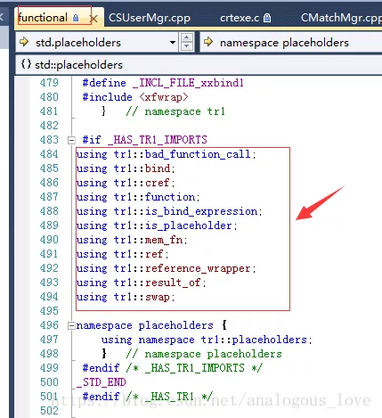

GetCSKernelInstance()->Start();是初始化所有的网络连接的Session管理器，所谓Session，中文译为“会话”，其下层对应网络通信的连接，每一路连接对应一个Session，而管理这些Session的对象就是Session Manager，在我们的代码中是**CSNetSessionMgr**，它继承自接口类**INetSessionMgr**：

```
class CSNetSessionMgr : public INetSessionMgr  
{  
public:  
    CSNetSessionMgr();  
    virtual ~CSNetSessionMgr();  
public:  
    virtual ISDSession* UCAPI CreateSession(ISDConnection* pConnection) { return NULL; /*重写*/}  
    virtual ICliSession* UCAPI CreateConnectorSession(SESSION_TYPE type);  
    virtual bool CreateConnector(SESSION_TYPE type, const char* ip, int port, int recvsize, int sendsize, int logicId);  
private:  
    CSParser m_CSParser;  
};  
```

初始化CSNetSessionMgr的代码如下：

```
INT32   CCSKernel::Start()  
{  
    CSNetSessionMgr* pNetSession = new CSNetSessionMgr;  
    GetBattleMgrInstance()->RegisterMsgHandle(m_SSMsgHandlerMap, m_GSMsgHandlerMap,  m_GCMsgHandlerMap, m_RCMsgHandlerMap);  
    GetCSUserMgrInstance()->RegisterMsgHandle(m_SSMsgHandlerMap, m_GSMsgHandlerMap,  m_GCMsgHandlerMap, m_RCMsgHandlerMap);  
    ELOG(LOG_INFO, "success!");  
    return 0;  
}  
```

连接数据库成功以后，我们的CSBattleMgr程序的控制台会显示一行提示mysql连接成功：

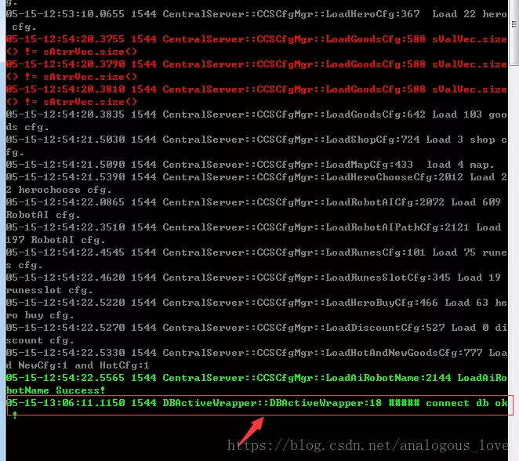

读者看上图会发现，这些日志信息有三个颜色，出错信息使用红色，重要的正常信息使用绿色，一般的输出信息使用灰色。这是如何实现的呢？我们将在下一篇文章《从零学习开源项目系列（三） LogServer服务源码研究》中介绍具体实现原理，这也是一种不错的日志级别提醒方式。

介绍完了初始化流程，我们介绍一下这个服务的主体部分MainLoop()函数，先看一下整体代码：

```
 void CCSKernel::MainLoop(){
    TIME_TICK    tHeartBeatCDTick = 10;
    //侦听端口10002
    INetSessionMgr::GetInstance()->CreateListener(m_sCSKernelCfg.n32GSNetListenerPort, 1024000, 10240000, 0, &gGateSessionFactory);
    //侦听端口10001
    INetSessionMgr::GetInstance()->CreateListener(m_sCSKernelCfg.n32SSNetListenerPort, 1024000, 10240000, 1, &gSceneSessionFactory);
    //侦听端口10010
    INetSessionMgr::GetInstance()->CreateListener(m_sCSKernelCfg.n32RCNetListenerPort, 1024000, 10240000, 2, &gRemoteConsoleFactory);
    //连接LogServer 1234端口
    INetSessionMgr::GetInstance()->CreateConnector(ST_CLIENT_C2Log, m_sCSKernelCfg.LogAddress.c_str(), m_sCSKernelCfg.LogPort, 102400, 102400, 0);
    //连接redis 6379
    if (m_sCSKernelCfg.redisAddress != "0"){
        INetSessionMgr::GetInstance()->CreateConnector(ST_CLIENT_C2R, m_sCSKernelCfg.redisAddress.c_str(), m_sCSKernelCfg.redisPort, 102400, 102400, 0);
    }
    //连接redis 6380，也是redis-logic
    if (m_sCSKernelCfg.redisLogicAddress != "0"){
        INetSessionMgr::GetInstance()->CreateConnector(ST_CLIENT_C2LogicRedis, m_sCSKernelCfg.redisLogicAddress.c_str(), m_sCSKernelCfg.redisLogicPort, 102400, 102400, 0);
    }
    while (true)
    {
        if (kbhit())
        {
            static char CmdArray[1024] = { 0 };
            static int CmdPos = 0;
            char CmdOne = getche();
            CmdArray[CmdPos++] = CmdOne;
            bool bRet = 0;
            if (CmdPos >= 1024 || CmdOne == 13)
            { 
                CmdArray[--CmdPos] = 0; 
                bRet = DoUserCmd(CmdArray);
                CmdPos = 0; 
                if (bRet) 
                    break; 
            }
        }
        INetSessionMgr::GetInstance()->Update();
        GetCSUserMgrInstance()->OnHeartBeatImmediately();
        ++m_RunCounts;
        m_BattleTimer.Run();
        Sleep(1);
    }
}
```

这个函数虽然叫MainLoop()，但是实际MainLoop()只是后半部分，前半部分总共创建三个侦听端口和三个连接器，也就是所谓的Listener和Connector，这些对象都是由上文提到的CSNetSessionMgr管理，所谓Listener就是这个服务使用socket API bind()和listen()函数在某个地址+端口号的二元组上绑定，供其他程序连接（其他程序可能是其他服务程序也可能是客户端，具体是哪个，我们后面的文章再进一步挖掘），侦听端口统计如下：

- 侦听端口10002
- 侦听端口10001
- 侦听端口10010

连接器（Connector）也有三个，分别连接的服务和端口号是：

- 连接redis的6379号端口
- 连接redis-logic的6380端口
- 连接某服务的1234端口

这个1234端口到底是哪个服务的呢？通过代码我们可以看出是LogServer的，那么到底是不是LogServer的呢，我们后面具体求证一下。

```
INetSessionMgr::GetInstance()->CreateConnector( ST_CLIENT_C2Log, 
                                                m_sCSKernelCfg.LogAddress.c_str(), 
                                                m_sCSKernelCfg.LogPort, 
                                                102400, 
                                                102400, 
                                                0);
```

接着我们就正式进入了一个while循环：

```
while (true)
{
    if (kbhit())
    {
        static char CmdArray[1024] = { 0 };
        static int CmdPos = 0;
        char CmdOne = getche();
        CmdArray[CmdPos++] = CmdOne;
        bool bRet = 0;
        if (CmdPos >= 1024 || CmdOne == 13) 
        { 
            CmdArray[--CmdPos] = 0; 
            bRet = DoUserCmd(CmdArray);
            CmdPos = 0; 
            if (bRet) 
                break;
        }
    }
    INetSessionMgr::GetInstance()->Update();
    GetCSUserMgrInstance()->OnHeartBeatImmediately();
    ++m_RunCounts;
    m_BattleTimer.Run();
    Sleep(1);
}
```

循环具体做了啥，我们先看**INetSessionMgr::GetInstance()->Update();**代码：

```
void INetSessionMgr::Update()  
{  
    mNetModule->Run();  
    vector<char*> tempQueue;  
    EnterCriticalSection(&mNetworkCs);  
    tempQueue.swap(m_SafeQueue);  
    LeaveCriticalSection(&mNetworkCs);  
    for (auto it=tempQueue.begin();it!=tempQueue.end();++it){  
        char* pBuffer = (*it);  
        int nType = *(((int*)pBuffer)+0);  
        int nSessionID = *(((int*)pBuffer)+1);  
        Send((SESSION_TYPE)nType,nSessionID,pBuffer+2*sizeof(int));  
        delete []pBuffer;  
    }  
    auto &map = m_AllSessions.GetPointerMap();  
    for (auto it=map.begin();it!=map.end();++it)  
    {  
        (*it)->Update();  
    }  
}  
```

通过这段代码我们看出，这个函数先是使用std::vector对象的swap()方法把一个公共队列中的数据倒换到一个临时队列中，这是一个很常用的技巧，目的是减小锁的粒度：由于公共的队列需要被生产者和消费者同时使用，我们为了减小加锁的粒度和时间，把当前队列中已有的数据一次性倒换到消费者本地的一个临时队列中来，这样消费者就可以使用这个临时队列了，从而避免了每次都要通过加锁从公共队列中取数据了，提高了效率。接着，我们发现这个队列中的数据是一个个的Session对象，遍历这些Session对象个每个Session对象的连接的对端发数据，同时执行Session对象的Update()方法。具体发了些什么数据，我们后面的文章再研究。

我们再看一下循环中的第二个函数**GetCSUserMgrInstance()->OnHeartBeatImmediately();**，其代码如下：

```
INT32 CCSUserMgr::OnHeartBeatImmediately()  
{  
    OnTimeUpdate();  
    SynUserAskDBCallBack();  
    return eNormal;  
}  
```

这些名字都是自解释的，先是同步时间，再同步数据库的一些操作：

```
INT32 CCSUserMgr::SynUserAskDBCallBack(){  
    while (!m_DBCallbackQueue.empty()){  
        Buffer* pBuffer = NULL;  
        m_DBCallbackQueue.try_pop(pBuffer);  
        switch (pBuffer->m_LogLevel)  
        {  
        case DBToCS::eQueryUser_DBCallBack:  
            SynHandleQueryUserCallback(pBuffer);  
            break;  
        case DBToCS::eQueryAllAccount_CallBack:  
            SynHandleAllAccountCallback(pBuffer);  
            break;  
        case DBToCS::eMail_CallBack:  
            SynHandleMailCallback(pBuffer);  
            break;  
        case  DBToCS::eQueryNotice_CallBack:  
            DBCallBack_QueryNotice(pBuffer);  
            break;  
        default:  
            ELOG(LOG_WARNNING, "not hv handler:%d", pBuffer->m_LogLevel);  
            break;  
        }  
        if (pBuffer){  
            m_DBCallbackQueuePool.ReleaseObejct(pBuffer);  
        }  
    }  
    return 0;  
}  
```

再看一下while循环中第三个函数m_BattleTimer.Run()；其代码如下：

```
void CBattleTimer::Run(){  
    TimeKey nowTime = GetInternalTime();  
    while(!m_ThreadTimerQueue.empty()){  
        ThreadTimer& sThreadTimer = m_ThreadTimerQueue.top();  
        if (!m_InvalidTimerSet.empty()){  
            auto iter = m_InvalidTimerSet.find(sThreadTimer.sequence);  
            if (iter != m_InvalidTimerSet.end()){  
                m_InvalidTimerSet.erase(iter);  
                m_ThreadTimerQueue.pop();  
                continue;  
            }  
        }  
        if (nowTime >=  sThreadTimer.nextexpiredTime){  
            m_PendingTimer.push_back(sThreadTimer);  
            m_ThreadTimerQueue.pop();  
        }  
        else{  
            break;  
        }  
    }  
    if (!m_PendingTimer.empty()){  
        for (auto iter = m_PendingTimer.begin(); iter != m_PendingTimer.end(); ++iter){  
            ThreadTimer& sThreadTimer = *iter;  
            nowTime = GetInternalTime();  
            int64_t tickSpan = nowTime - sThreadTimer.lastHandleTime;  
            sThreadTimer.pHeartbeatCallback(nowTime, tickSpan);  
            if (sThreadTimer.ifPersist){  
                TimeKey newTime = nowTime + sThreadTimer.interval;  
                sThreadTimer.lastHandleTime = nowTime;  
                sThreadTimer.nextexpiredTime = newTime;  
                m_ThreadTimerQueue.push(sThreadTimer);  
            }  
        }  
        m_PendingTimer.clear();  
    }  
    if (!m_ToAddTimer.empty()){  
        for (auto iter = m_ToAddTimer.begin(); iter != m_ToAddTimer.end(); ++iter){  
            m_ThreadTimerQueue.push(*iter);  
        }  
        m_ToAddTimer.clear();  
    }  
}  
```

这也是一个与时间有关的操作。具体细节我们也在后面文章中介绍。

CSBattleMgr服务跑起来之后，cmd窗口显示如下：

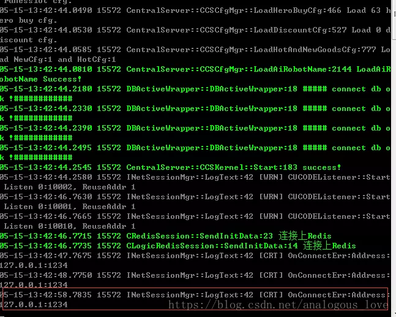

上图中我们看到Mysql和redis服务均已连上，但是程序会一直提示连接**127.0.0.1:1234**端口连不上。由此我们断定，这个使用1234端口的服务没有启动。这不是我们介绍的重点，重点是说明这个服务会定时自动重连这个1234端口，自动重连机制是我们做服务器开发必须熟练开发的一个功能。所以我建议大家好好看一看这一块的代码。这里我带着大家简单梳理一遍吧。

首先，我们根据提示找到INetSessionMgr::LogText的42行，并在那里加一个断点：

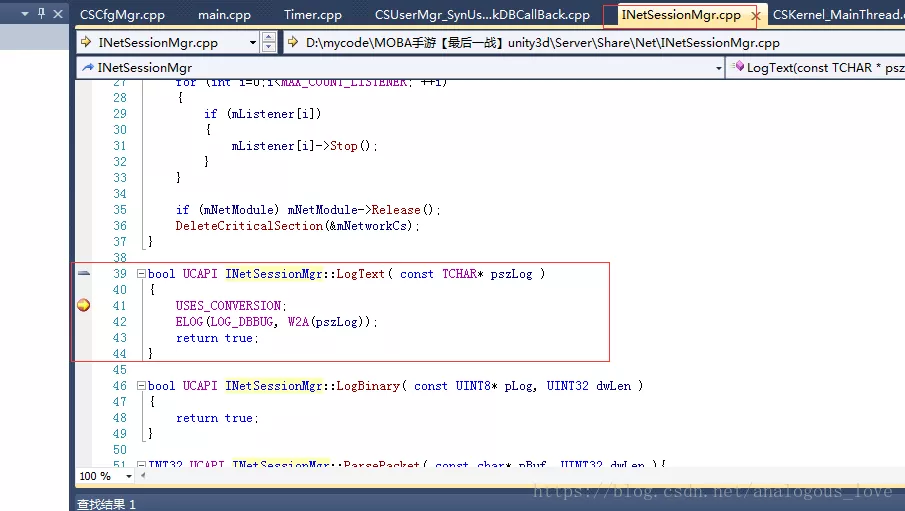

很快，由于重连机制，触发这个断点，我们看下此时的调用堆栈：

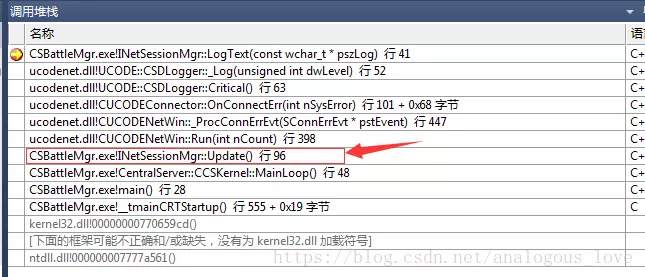

我们切换到如图箭头所示的堆栈处代码：

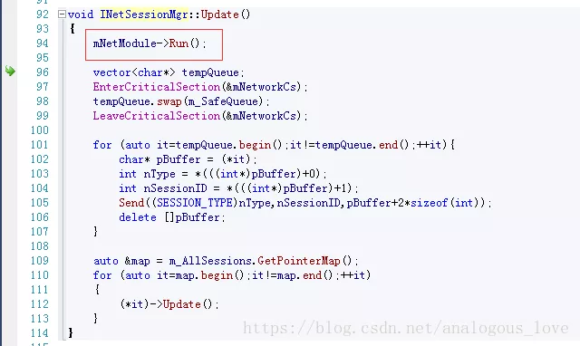

箭头所示说明是mNetModule->Run();调用产生的日志输出。我们看下这个的调用：

```
bool CUCODENetWin::Run(INT32 nCount)  
{  
    CConnDataMgr::Instance()->RunConection();  
    do  
    {  
// #ifdef UCODENET_HAS_GATHER_SEND         
// #pragma message("[preconfig]sdnet collect buffer, has a internal timer")          
//         if (m_pTimerModule)          
//         {  
//             m_pTimerModule->Run();  
//         }          
// #endif  
#ifdef UCODENET_HAS_GATHER_SEND   
        static INT32 sendCnt = 0;  
        ++sendCnt;  
        if (sendCnt == 10)  
        {  
            sendCnt = 0;  
            UINT32 now = GetTickCount();  
            if (now < m_dwLastTick)  
            {  
                /// 溢出了,发生了数据回绕 \///  
                m_dwLastTick = now;  
            }  
            if ((now - m_dwLastTick) > 50)  
            {  
                m_dwLastTick = now;              
                FlushBufferedData();  
            }  
        }         
#endif //   
        //SNetEvent stEvent;   
        SNetEvent *pstEvent  = CEventMgr::Instance()->PopFrontNetEvt();  
        if (pstEvent == NULL)  
        {  
            return false;  
        }  
        SNetEvent & stEvent = *pstEvent;   
        switch(stEvent.nType)  
        {  
        case NETEVT_RECV:  
            _ProcRecvEvt(&stEvent.stUn.stRecv);  
            break;  
        case NETEVT_SEND:  
            _ProcSendEvt(&stEvent.stUn.stSend);   
            break;   
        case NETEVT_ESTABLISH:  
            _ProcEstablishEvt(&stEvent.stUn.stEstablish);  
            break;  
        case NETEVT_ASSOCIATE:  
            _ProcAssociateEvt(&stEvent.stUn.stAssociate);  
            break;  
        case NETEVT_TERMINATE:  
            _ProcTerminateEvt(&stEvent.stUn.stTerminate);  
            break;  
        case NETEVT_CONN_ERR:  
            _ProcConnErrEvt(&stEvent.stUn.stConnErr);  
            break;  
        case NETEVT_ERROR:  
            _ProcErrorEvt(&stEvent.stUn.stError);  
            break;  
        case NETEVT_BIND_ERR:  
            _ProcBindErrEvt(&stEvent.stUn.stBindErr);  
            break;  
        default:  
            SDASSERT(false);  
            break;  
        }  
        CEventMgr::Instance()->ReleaseNetEvt(pstEvent);   
    }while(--nCount != 0);  
    return true;  
}  
```

我们看到**SNetEvent \*pstEvent = CEventMgr::Instance()->PopFrontNetEvt();**时，看到这里我们大致可以看出这又是一个生产者消费者模型，只不过这里是消费者——从队列中取出数据，对应的switch-case分支是：

```
case NETEVT_CONN_ERR:  
    _ProcConnErrEvt(&stEvent.stUn.stConnErr);  
```

即连接失败。那么在哪里连接的呢？我们只需要看看这个队列的生产者在哪里就能找到了，因为连接不成功，往队列中放入一条连接出错的数据，我们看一下**CEventMgr::Instance()->PopFrontNetEvt()**的实现，找到具体的队列名称：

```
/** 
 * @brief 获取一个未处理的网络事件(目前为最先插入的网络事件) 
 * @return 返回一个未处理的网络事件.如果处理失败,返回NULL 
 * @remark 由于此类只有在主线程中调用,所以,此函数内部并未保证线程安全 
 */  
inline SNetEvent*  PopFrontNetEvt()  
{  
    return  (SNetEvent*)m_oEvtQueue.PopFront();  
}  
```

通过这段代码我们发现队列的名字叫m_oEvtQueue，我们通过搜索这个队列的名字找到生产者，然后在生产者往队列中加入数据那里加上一个断点：

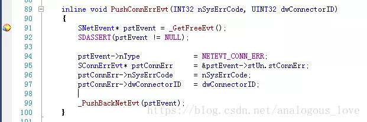

等断点触发以后，我们看下此时的调用堆栈：

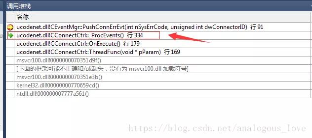

我们切换到上图中箭头所指向的代码处：

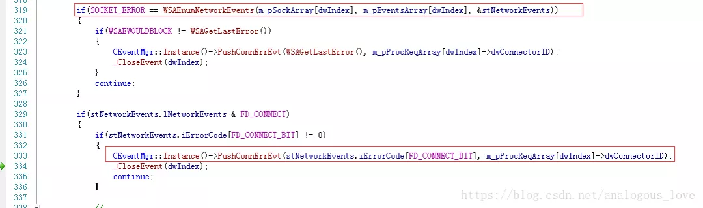

到这里我们基本上认识了，这里连接使用的**异步connect()**，即在线程A中将连接socket，然后使用**WSAEventSelect**绑定该socket并设置该socket为非阻塞模式，等连接有结果了（成功或失败）使用Windows API **WSAEnumNetworkEvents**去检测这个socket的连接事件（FD_CONNECT），然后将判断结果加入队列m_oEvtQueue中，另外一个线程B从队列中取出判断结果打印出日志。如果您不清楚这个流程，请学习一下异步connect的使用方法和WSAEventSelect、WSAEnumNetworkEvents的用法。那么这个异步connect在哪里呢？我们搜索一下socket API connect函数（其实我可以一开始就搜索connect函数的，但是我之所以不这么做是想让您了解一下我研究一个不熟悉的项目代码的思路），得到如下图：

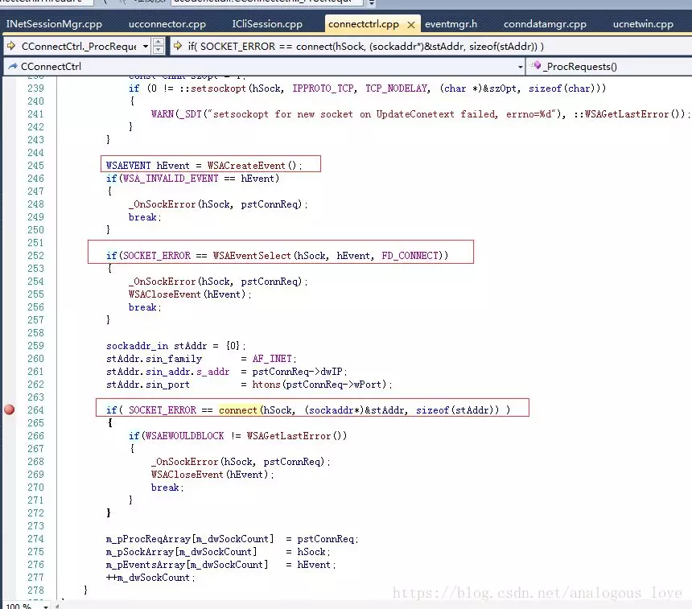

我们在上述标红的地方加个断点：

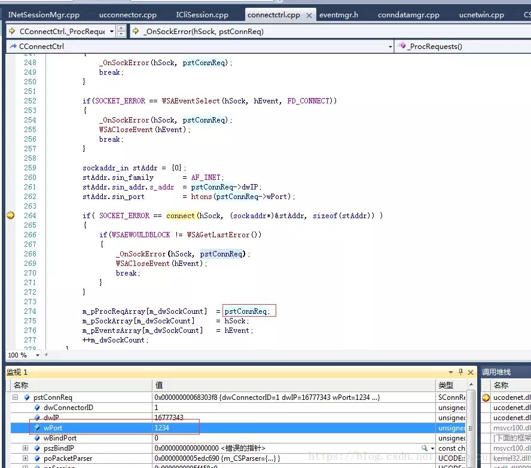

通过上图中的端口信息1234，我们验证了的确是上文说的流程。然后我们观察一下这个调用堆栈：


发现这里又是一个消费者，又存在一个队列！

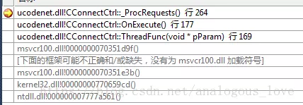

同样的道理，我们通过队列名称m_oReqQueue找到生产者：

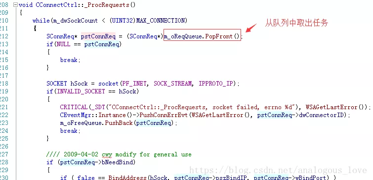

我们看下这个时候的生产者的调用堆栈：

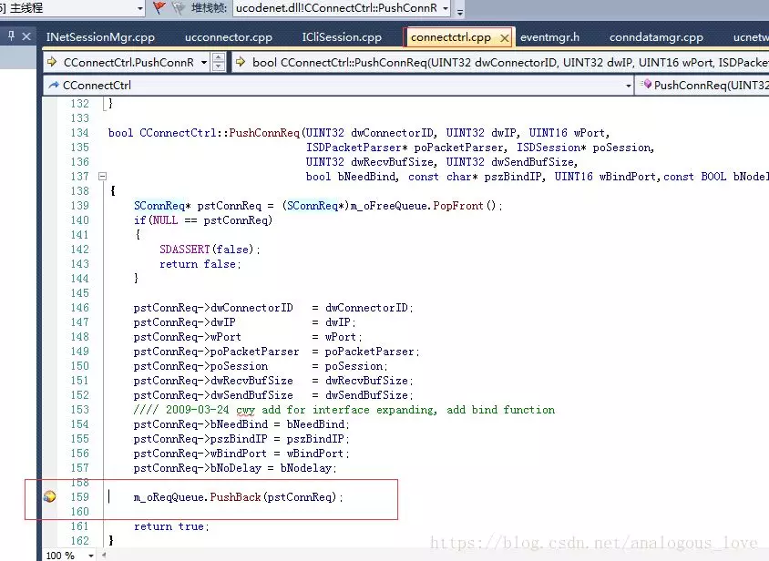

切换到如图所示的代码处：

```
bool ICliSession::Reconnect()  
{  
    if (IsHadRecon() && mReconnectTag)  
    {  
        UINT32 curTime = GetTickCount();  
        if (curTime>mReconTime)  
        {  
            mReconTime = curTime+10000;  
            if (m_poConnector->ReConnect())  
            {  
                //printf("client reconnect server(%s)...\n",mRemoteEndPointer.c_str());  
                ResetRecon();  
                return true;  
            }  
        }  
    }  
    return false;  
}  
```

在这里我们终于可以好好看一下重连的逻辑如何设计了。具体代码读者自己分析哈，限于篇幅这里就不介绍了。

看到这里，可能很多读者在对照我提供的代码时，会产生一个困难：同样的代码为啥在我手中可以这样分析，但是到你们手中可能就磕磕绊绊了？只能说经验和自我学习这是相辅相成的过程，例如上文中说的生产者消费者模式、任务队列，我曾经也和你们一样，也不熟悉这些东西，但是当我知道这些东西时我就去学习这些我认为的“基础”知识，并且反复练习，这样也就慢慢积累经验了。所以，孔子说的没错：**学而不思则罔，思而不学则殆**。什么时候该去学习，什么时候该去思考，古人诚不欺我也。

到这里我们也大致清楚了CSBattleMgr做了哪些事情。后面我们把所有的服务都过一遍之后再从整体来介绍。下一篇文章我们将继续研究这个侦听1234端口的LogServer，敬请期待。

限于作者经验水平有限，文章中可能有错漏的地方，欢迎批评指正。

欢迎阅读下一篇《从零学习开源项目系列（四） LogServer源码探究》。


> 源码下载方法：
>
> 微信搜索公众号 **『高性能服务器开发』**(中文名：高性能服务器开发)，关注公众号后，在公众号中回复**『英雄联盟』** ，即可得到下载链接。（喷子和代码贩子请远离！）

