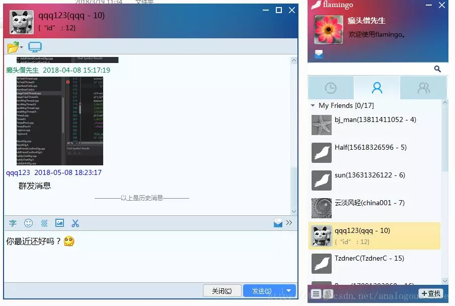
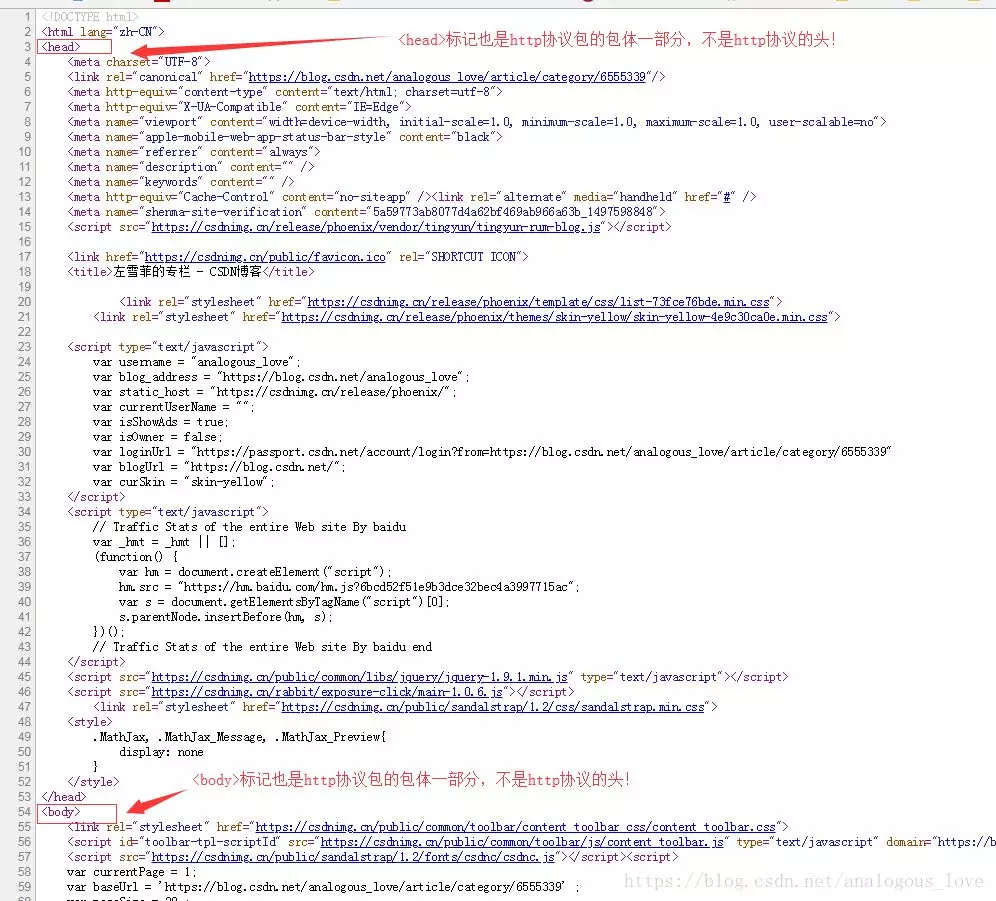
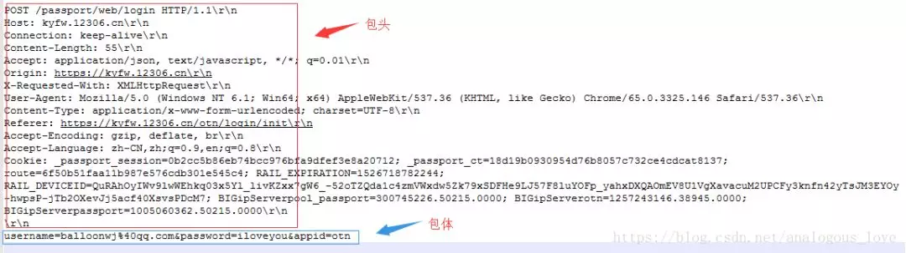
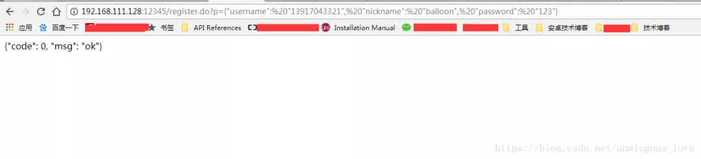

## 从零实现一个http服务器

我始终觉得，天生的出身很重要，但**后天的努力**更加重要，所以如今的很多“科班”往往不如后天努力的“非科班”。所以，我们需要重新给“专业”和“专家”下一个定义：所谓专业，就是别人不搞你搞，这就是你的“专业”；你和别人同时搞，你比别人搞的好，就是“专家”。

说到**http协议**和**http请求**，很多人都知道，但是他们真的“知道”吗？我面试过很多求职者，一说到http协议，他们能滔滔不绝，然后我问他http协议的具体格式是啥样子的？很多人不清楚，不清楚就不清楚吧，他甚至能将http协议的头扯到html文档头部。当我问http GET和POST请求的时候，GET请求是什么形式一般人都可以答出来，但是POST请求的数据放在哪里，服务器如何识别和解析这些POST数据，很多人又说不清道不明了。当说到http服务器时，很多人离开了apache、Nginx这样现成的http server之外，自己实现一个http服务器无从下手，如果实际应用场景有需要使用到一些简单http请求时，使用apache、Nginx这样重量级的http服务器程序实在劳师动众，你可以尝试自己实现一个简单的。

上面提到的问题，如果您不能清晰地回答出来，可以阅读一下这篇文章，这篇文章在不仅介绍http的格式，同时带领大家从零实现一个简单的http服务器程序。

### 一、项目背景

最近很多朋友希望我的flamingo服务器支持http协议，我自己也想做一个微信小程序，小程序通过http协议连接通过我的flamingo服务器进行聊天。flamingo是一个开源的即时通讯软件，目前除了服务器端，还有pc端、android端，后面会支持更多的终端。关于flamingo的介绍您可以参考这里: https://github.com/baloonwj/flamingo，更新日志：https://github.com/baloonwj/flamingo/issues/1。下面是flamingo的部分截图：



### 二、http协议介绍

**1. http协议是应用层协议，一般建立在tcp协议的基础之上（当然你的实现非要基于udp也是可以的），也就是说http协议的数据收发是通过tcp协议的。**

**2. http协议也分为head和body两部分，但是我们一般说的html中的和标记不是http协议的头和身体，它们都是http协议的body部分。**



那么http协议的头到底长啥样子呢？我们来介绍一下http协议吧。

http协议的格式如下：

```
GET或POST 请求的url路径（一般是去掉域名的路径） HTTP协议版本号\r\n
字段1名: 字段1值\r\n
字段2名: 字段2值\r\n
     …
字段n名 : 字段n值\r\n
\r\n
http协议包体内容
```

也就是说http协议由两部分组成：包头和包体，包头与包体之间使用一个\r\n分割，由于http协议包头的每一行都是以**\r\n**结束，所以http协议包头一般以**\r\n\r\n**结束。

举个例子，比如我们在浏览器中请求http://www.hootina.org/index_2013.php这个网址，这是一个典型的GET方法，浏览器组装的http数据包格式如下：

```
GET /index_2013.php HTTP/1.1\r\n
Host: www.hootina.org\r\n
Connection: keep-alive\r\n
Upgrade-Insecure-Requests: 1\r\n
User-Agent: Mozilla/5.0 (Windows NT 6.1; Win64; x64) AppleWebKit/537.36 (KHTML, like Gecko) Chrome/65.0.3325.146 Safari/537.36\r\n
Accept: text/html,application/xhtml+xml,application/xml;q=0.9,image/webp,image/apng,*/*;q=0.8\r\n
Accept-Encoding: gzip, deflate\r\n
Accept-Language: zh-CN,zh;q=0.9,en;q=0.8\r\n
\r\n
```

上面这个请求只有包头没有包体，http协议的包体不是必须的，也就是说GET请求一般没有包体。

如果GET请求带参数，那么一般是附加在请求的url后面，参数与参数之间使用&分割，例如请求http://www.hootina.org/index_2013.php?param1=value1&param2=value2&param3=value3，我们看下这个请求组装的的http协议包格式：

```
GET /index_2013.php?param1=value1&param2=value2&param3=value3 HTTP/1.1\r\n
Host: www.hootina.org\r\n
Connection: keep-alive\r\n
Upgrade-Insecure-Requests: 1\r\n
User-Agent: Mozilla/5.0 (Windows NT 6.1; Win64; x64) AppleWebKit/537.36 (KHTML, like Gecko) Chrome/65.0.3325.146 Safari/537.36\r\n
Accept: text/html,application/xhtml+xml,application/xml;q=0.9,image/webp,image/apng,*/*;q=0.8\r\n
Accept-Encoding: gzip, deflate\r\n
Accept-Language: zh-CN,zh;q=0.9,en;q=0.8\r\n
\r\n
```

对比一下，你现在知道http协议的GET参数放在协议包的什么位置了吧。

那么POST的数据放在什么位置呢？我们再12306网站https://kyfw.12306.cn/otn/login/init中登陆输入用户名和密码：


然后发现浏览器以POST方式组装了http协议包发送了我们的用户名、密码和其他一些信息，组装的包格式如下：

```
POST /passport/web/login HTTP/1.1\r\n
Host: kyfw.12306.cn\r\n
Connection: keep-alive\r\n
Content-Length: 55\r\n
Accept: application/json, text/javascript, */*; q=0.01\r\n
Origin: https://kyfw.12306.cn\r\n
X-Requested-With: XMLHttpRequest\r\n
User-Agent: Mozilla/5.0 (Windows NT 6.1; Win64; x64) AppleWebKit/537.36 (KHTML, like Gecko) Chrome/65.0.3325.146 Safari/537.36\r\n
Content-Type: application/x-www-form-urlencoded; charset=UTF-8\r\n
Referer: https://kyfw.12306.cn/otn/login/init\r\n
Accept-Encoding: gzip, deflate, br\r\n
Accept-Language: zh-CN,zh;q=0.9,en;q=0.8\r\n
Cookie: _passport_session=0b2cc5b86eb74bcc976bfa9dfef3e8a20712; _passport_ct=18d19b0930954d76b8057c732ce4cdcat8137; route=6f50b51faa11b987e576cdb301e545c4; RAIL_EXPIRATION=1526718782244; RAIL_DEVICEID=QuRAhOyIWv9lwWEhkq03x5Yl_livKZxx7gW6_-52oTZQda1c4zmVWxdw5Zk79xSDFHe9LJ57F8luYOFp_yahxDXQAOmEV8U1VgXavacuM2UPCFy3knfn42yTsJM3EYOy-hwpsP-jTb2OXevJj5acf40XsvsPDcM7; BIGipServerpool_passport=300745226.50215.0000; BIGipServerotn=1257243146.38945.0000; BIGipServerpassport=1005060362.50215.0000\r\n
\r\n
username=balloonwj%40qq.com&password=iloveyou&appid=otn
```

其中`username=balloonwj%40qq.com&password=iloveyou&appid=otn`就是我们的POST数据，但是大家需要注意的以下几种，不要搞错：
**1. 我的用户名是balloonwj@qq.com，到POST里面变成balloonwj%40qq.com，其中%40是@符号的16进制转码形式。这个码表可以参考这里：****http://www.w3school.com.cn/tags/html_ref_urlencode.html**

**2.这里有三个变量，分别是username、password和appid，他们之间使用&符号分割，但是请注意的是，这不意味着传递多个POST变量时必须使用&符号分割，只不过这里是浏览器html表单（输入用户名和密码的文本框是html表单的一种）分割多个变量采用的默认方式而已。你可以根据你的需求，来自由定制，只要让服务器知道你的解析方式即可。比如可以这么分割：**

**方法一**


```
1username=balloonwj%40qq.com|password=iloveyou|appid=otn
```

**方法二**


```
username:balloonwj%40qq.com\r\n
password:iloveyou\r\n
appid:otn\r\n
```

**方法三**


```
1username,password,appid=balloonwj%40qq.com,iloveyou,otn
```

不管怎么分割，只要你能自己按一定的规则解析出来就可以了。

不知道你注意到没有，上面的POST数据放在http包体中，服务器如何解析呢？可能你没明白我的意思，看下图：



如上图所示，由于http协议是基于tcp协议的，tcp协议是流式协议，包头部分可以通过多出的\r\n来分界，包体部分如何分界呢？这是协议本身要解决的问题。目前一般有两种方式，第一种方式就是在包头中有个`content-Length`字段，这个字段的值的大小标识了POST数据的长度，上图中55就是数据`username=balloonwj%40qq.com&password=iloveyou&appid=otn`的长度，服务器收到一个数据包后，先从包头解析出这个字段的值，再根据这个值去读取相应长度的作为http协议的包体数据。还有一个格式叫做**http chunked技术**（分块），大致意思是将大包分成小包，具体的详情有兴趣的读者可以自行搜索学习。

### 三、http客户端实现

如果您能掌握以上说的http协议，你就可以自己通过代码组装http协议发送http请求了（也是各种开源http库的做法）。我们先简单地介绍一下如何模拟发送http。举个例子，我们要请求http://www.hootina.org/index_2013.php，那么我们可以先通过域名得到ip地址，即通过socket API `gethostbyname()`得到www.hootina.org的ip地址，由于http服务器默认的端口号是80，有了域名和ip地址之后，我们使用socket API `connect()`去连接服务器，然后根据上面介绍的格式组装成http协议包，利用socket API `send()`函数发出去，如果服务器有应答，我们可以使用socket API `recv()`去接受数据，接下来就是解析数据（先解析包头和包体）。

### 四、http服务器实现

我们这里简化一些问题，假设客户端发送的请求都是GET请求，当客户端发来http请求之后，我们拿到http包后就做相应的处理。我们以为我们的flamingo服务器实现一个支持http格式的注册请求为例。假设用户在浏览器里面输入以下网址，就可以实现一个注册功能：

http://120.55.94.78:12345/register.do?p={"username": "13917043329", "nickname": "balloon", "password": "123"}

这里我们的http协议使用的是12345端口号而不是默认的80端口。如何侦听12345端口，这个是非常基础的知识了，这里就不介绍了。当我们收到数据以后：

```
void HttpSession::OnRead(const std::shared_ptr<TcpConnection>& conn, Buffer* pBuffer, Timestamp receivTime)
{
    //LOG_INFO << "Recv a http request from " << conn->peerAddress().toIpPort();

    string inbuf;
    //先把所有数据都取出来
    inbuf.append(pBuffer->peek(), pBuffer->readableBytes());
    //因为一个http包头的数据至少\r\n\r\n，所以大于4个字符
    //小于等于4个字符，说明数据未收完，退出，等待网络底层接着收取
    if (inbuf.length() <= 4)
        return;

    //我们收到的GET请求数据包一般格式如下：
    /*
    GET /register.do?p={%22username%22:%20%2213917043329%22,%20%22nickname%22:%20%22balloon%22,%20%22password%22:%20%22123%22} HTTP/1.1\r\n
    Host: 120.55.94.78:12345\r\n
    Connection: keep-alive\r\n
    Upgrade-Insecure-Requests: 1\r\n
    User-Agent: Mozilla/5.0 (Windows NT 6.1; Win64; x64) AppleWebKit/537.36 (KHTML, like Gecko) Chrome/65.0.3325.146 Safari/537.36\r\n
    Accept-Encoding: gzip, deflate\r\n
    Accept-Language: zh-CN, zh; q=0.9, en; q=0.8\r\n
    \r\n
     */
    //检查是否以\r\n\r\n结束，如果不是说明包头不完整，退出
    string end = inbuf.substr(inbuf.length() - 4);
    if (end != "\r\n\r\n")
        return;

    //以\r\n分割每一行
    std::vector<string> lines;
    StringUtil::Split(inbuf, lines, "\r\n");
    if (lines.size() < 1 || lines[0].empty())
    {
        conn->forceClose();
        return;
    }

    std::vector<string> chunk;
    StringUtil::Split(lines[0], chunk, " ");
    //chunk中至少有三个字符串：GET+url+HTTP版本号
    if (chunk.size() < 3)
    {
        conn->forceClose();
        return;
    }

    LOG_INFO << "url: " << chunk[1] << " from " << conn->peerAddress().toIpPort();
    //inbuf = /register.do?p={%22username%22:%20%2213917043329%22,%20%22nickname%22:%20%22balloon%22,%20%22password%22:%20%22123%22}
    std::vector<string> part;
    //通过?分割成前后两端，前面是url，后面是参数
    StringUtil::Split(chunk[1], part, "?");
    //chunk中至少有三个字符串：GET+url+HTTP版本号
    if (part.size() < 2)
    {
        conn->forceClose();
        return;
    }

    string url = part[0];
    string param = part[1].substr(2);

    if (!Process(conn, url, param))
    {
        LOG_ERROR << "handle http request error, from:" << conn->peerAddress().toIpPort() << ", request: " << pBuffer->retrieveAllAsString();
    }

    //短连接，处理完关闭连接
    conn->forceClose();
}
```

代码注释都写的很清楚，我们先利用\r\n分割得到每一行，其中第一行的数据是：

```
GET /register.do?p={%22username%22:%20%2213917043329%22,%20%22nickname%22:%20%22balloon%22,%20%22password%22:%20%22123%22} HTTP/1.1
```

其中%22是双引号的url转码形式，%20是空格的url转码形式，然后我们根据空格分成三段，其中第二段就是我们的网址和参数：

```
/register.do?p={%22username%22:%20%2213917043329%22,%20%22nickname%22:%20%22balloon%22,%20%22password%22:%20%22123%22}
```

然后我们根据网址与参数之间的问号将这个分成两段：第一段是网址，第二段是参数：

```
bool HttpSession::Process(const std::shared_ptr<TcpConnection>& conn, const std::string& url, const std::string& param)
{
    if (url.empty())
        return false;

    if (url == "/register.do")
    {
        OnRegisterResponse(param, conn);
    }
    else if (url == "/login.do")
    {
        OnLoginResponse(param, conn);
    }
    else if (url == "/getfriendlist.do")
    {

    }
    else if (url == "/getgroupmembers.do")
    {

    }
    else
        return false;


    return true;
}
```

然后我们根据url匹配网址，如果是注册请求，会走注册处理逻辑：

```
void HttpSession::OnRegisterResponse(const std::string& data, const std::shared_ptr<TcpConnection>& conn)
{
    string retData;
    string decodeData;
    URLEncodeUtil::Decode(data, decodeData);
    BussinessLogic::RegisterUser(decodeData, conn, false, retData);
    if (!retData.empty())
    {
        std::string response;
        URLEncodeUtil::Encode(retData, response);
        MakeupResponse(retData, response);
        conn->send(response);

        LOG_INFO << "Response to client: cmd=msg_type_register" << ", data=" << retData << conn->peerAddress().toIpPort();;
    }
}
```

注册结果放在retData中，为了发给客户端，我们将结果中的特殊字符如双引号转码，如返回结果是：

```
{"code":0, "msg":"ok"}
```

会被转码成：

```
{%22code%22:0,%20%22msg%22:%22ok%22}
```

然后，将数据组装成http协议发给客户端，给客户端的应答协议与http请求协议有一点点差别，就是将请求的url路径换成所谓的http响应码，如200表示应答正常返回、404页面不存在。应答协议格式如下：

```
GET或POST 响应码 HTTP协议版本号\r\n
字段1名: 字段1值\r\n
字段2名: 字段2值\r\n
     …
字段n名 : 字段n值\r\n
\r\n
http协议包体内容
```

举个例子如：

```
HTTP/1.1 200 OK\r\n
Content-Type: text/html\r\n
Content-Length:42\r\n
\r\n
{%22code%22:%200,%20%22msg%22:%20%22ok%22}
```

注意，包头中的**Content-Length长度**必须正好是包体`{%22code%22:%200,%20%22msg%22:%20%22ok%22}`的长度，这里是42。这也符合我们浏览器的返回结果：



当然，需要注意的是，我们一般说http连接一般是短连接，这里我们也实现了这个功能（看上面的代码：`conn->forceClose();`），不管一个http请求是否成功，服务器处理后立马就关闭连接。

当然，这里还有一些没处理好的地方，如果你仔细观察上面的代码就会发现这个问题，就是不满足一个http包头时的处理，如果某个客户端（不是使用浏览器）通过程序模拟了一个连接请求，但是迟迟不发含有\r\n\r\n的数据，这路连接将会一直占用。我们可以判断收到的数据长度，防止别有用心的客户端给我们的服务器乱发数据。我们假定，我们能处理的最大url长度是2048，如果用户发送的数据累积不含\r\n\r\n，且超过2048个，我们认为连接非法，将连接断开。代码修改成如下形式：

```
void HttpSession::OnRead(const std::shared_ptr<TcpConnection>& conn, Buffer* pBuffer, Timestamp receivTime)
{
    //LOG_INFO << "Recv a http request from " << conn->peerAddress().toIpPort();

    string inbuf;
    //先把所有数据都取出来
    inbuf.append(pBuffer->peek(), pBuffer->readableBytes());
    //因为一个http包头的数据至少\r\n\r\n，所以大于4个字符
    //小于等于4个字符，说明数据未收完，退出，等待网络底层接着收取
    if (inbuf.length() <= 4)
        return;

    //我们收到的GET请求数据包一般格式如下：
    /*
    GET /register.do?p={%22username%22:%20%2213917043329%22,%20%22nickname%22:%20%22balloon%22,%20%22password%22:%20%22123%22} HTTP/1.1\r\n
    Host: 120.55.94.78:12345\r\n
    Connection: keep-alive\r\n
    Upgrade-Insecure-Requests: 1\r\n
    User-Agent: Mozilla/5.0 (Windows NT 6.1; Win64; x64) AppleWebKit/537.36 (KHTML, like Gecko) Chrome/65.0.3325.146 Safari/537.36\r\n
    Accept-Encoding: gzip, deflate\r\n
    Accept-Language: zh-CN, zh; q=0.9, en; q=0.8\r\n
    \r\n
     */
    //检查是否以\r\n\r\n结束，如果不是说明包头不完整，退出
    string end = inbuf.substr(inbuf.length() - 4);
    if (end != "\r\n\r\n")
        return;
    //超过2048个字符，且不含\r\n\r\n，我们认为是非法请求
    else if (inbuf.length() >= MAX_URL_LENGTH)
    {
        conn->forceClose();
        return;
    }

    //以\r\n分割每一行
    std::vector<string> lines;
    StringUtil::Split(inbuf, lines, "\r\n");
    if (lines.size() < 1 || lines[0].empty())
    {
        conn->forceClose();
        return;
    }

    std::vector<string> chunk;
    StringUtil::Split(lines[0], chunk, " ");
    //chunk中至少有三个字符串：GET+url+HTTP版本号
    if (chunk.size() < 3)
    {
        conn->forceClose();
        return;
    }

    LOG_INFO << "url: " << chunk[1] << " from " << conn->peerAddress().toIpPort();
    //inbuf = /register.do?p={%22username%22:%20%2213917043329%22,%20%22nickname%22:%20%22balloon%22,%20%22password%22:%20%22123%22}
    std::vector<string> part;
    //通过?分割成前后两端，前面是url，后面是参数
    StringUtil::Split(chunk[1], part, "?");
    //chunk中至少有三个字符串：GET+url+HTTP版本号
    if (part.size() < 2)
    {
        conn->forceClose();
        return;
    }

    string url = part[0];
    string param = part[1].substr(2);

    if (!Process(conn, url, param))
    {
        LOG_ERROR << "handle http request error, from:" << conn->peerAddress().toIpPort() << ", request: " << pBuffer->retrieveAllAsString();
    }

    //短连接，处理完关闭连接
    conn->forceClose();
}
```

但这只能解决发送非法数据的情况，如果一个客户端连上来不给我们发任何数据，这段逻辑就无能为力了。如果不断有客户端这么做，会浪费我们大量的连接资源，所以我们还需要一个定时器去定时检测哪些http连接超过一定时间内没给我们发数据，找到后将连接断开。这又涉及到服务器定时器如何设计了，关于这部分请参考我写的其他文章。

限于作者经验水平有限，文中难免有错乱之处，欢迎拍砖。另外，关于上面的代码，可以去github上下载，地址是：

https://github.com/baloonwj/flamingo
