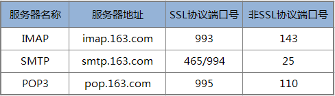
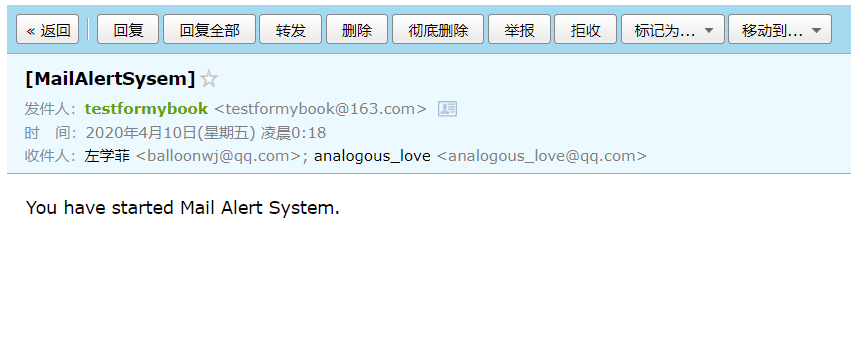
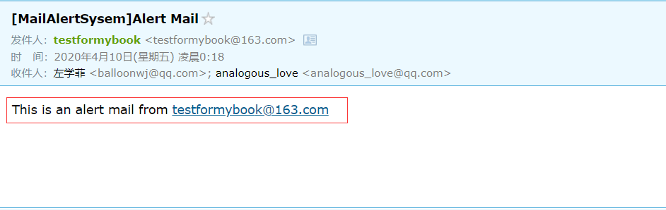
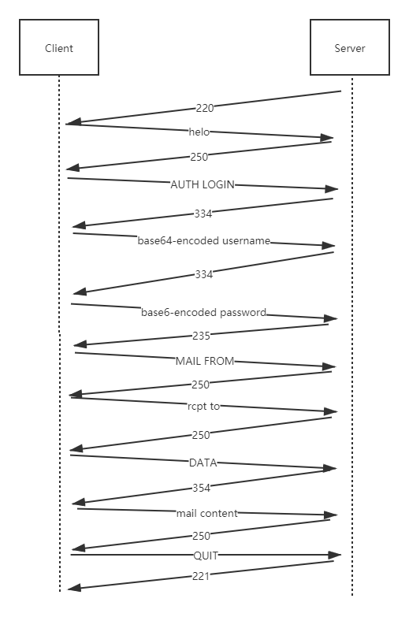
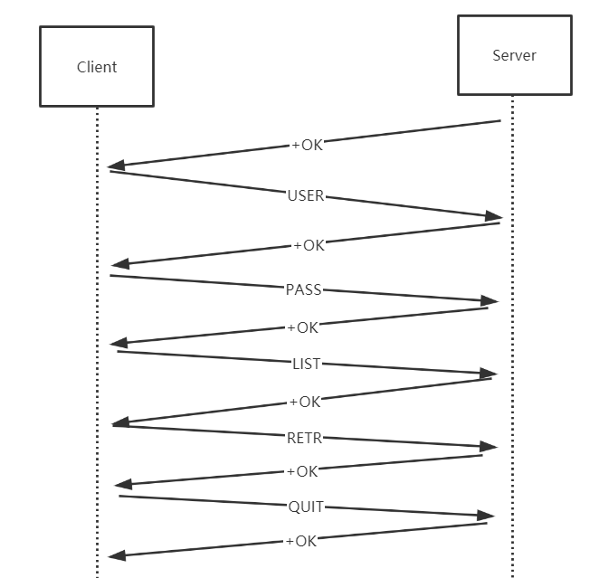
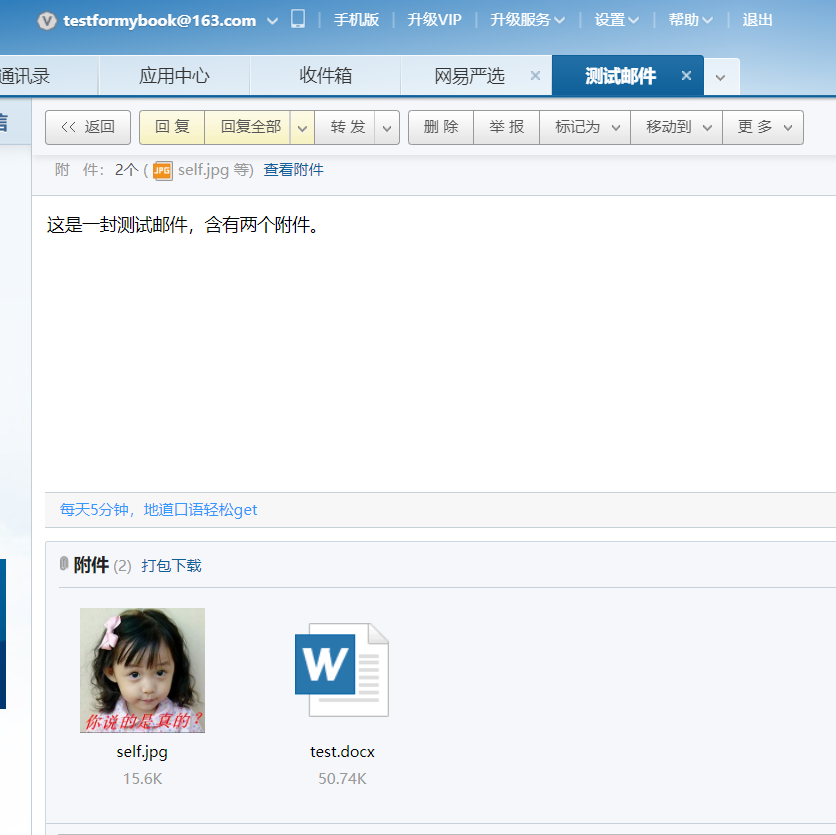
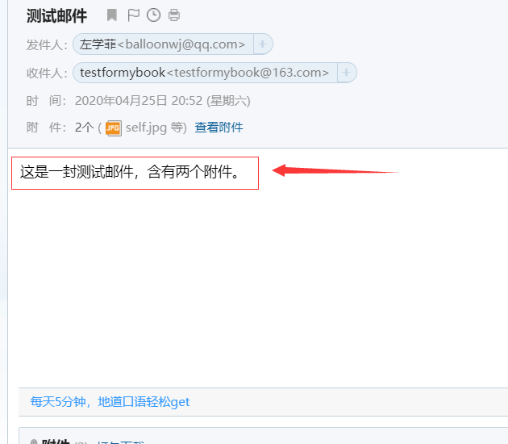
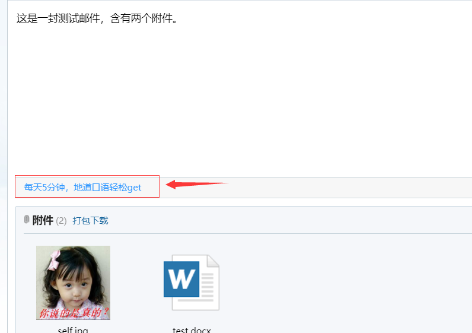

## 从零实现一个邮件收发客户端

与邮件收发有关的协议有 POP3、SMPT 和 IMAP 等。

**POP3**

**POP3**全称是 Post Office Protocol 3 ，即邮局协议的第 3 个版本，它规定怎样将个人计算机连接到 Internet 的邮件服务器和下载电子邮件的电子协议，它是因特网电子邮件的第一个离线协议标准，POP3 允许用户从服务器上把邮件存储到本地主机（即自己的计算机）上，同时删除保存在邮件服务器上的邮件，而 POP3 服务器则是遵循 POP3 协议的接收邮件服务器，用来接收电子邮件的。

**SMTP**

**SMTP** 的全称是 Simple Mail Transfer Protocol，即简单邮件传输协议。它是一组用于从源地址到目的地址传输邮件的规范，它帮助每台计算机在发送或中转邮件时找到下一个目的地。SMTP 服务器就是遵循 SMTP 协议的发送邮件服务器。SMTP 需要认证，简单地说就是要求必须在提供了账户名和密码之后才可以登录 SMTP 服务器，这就使得那些垃圾邮件的散播者无可乘之机，使用户避免受到垃圾邮件的侵扰。

**IMAP**

**IMAP**全称是 Internet Mail Access Protocol，即交互式邮件存取协议，它是跟 POP3 类似邮件访问标准协议之一。不同的是，开启了 IMAP 后，在电子邮件客户端收取的邮件仍然保留在服务器上，同时在客户端上的操作都会反馈到服务器上，如：删除邮件，标记已读等，服务器上的邮件也会做相应的动作。所以无论从浏览器登录邮箱或者客户端软件登录邮箱，看到的邮件以及状态都是一致的。而 POP3 对邮件的操作只会在本地邮件客户端起作用。

读者如果需要自己编写相关的邮件收发客户端，需要登录对应的邮件服务器开启相应的  POP3/SMTP/IMAP 服务。以 163 邮箱为例：

请登录 163 邮箱(http://mail.163.com/)，点击页面正上方的“**设置**”，再点击左侧上“**POP3/SMTP/IMAP**”，其中“**开启 SMTP 服务**”是系统默认勾选开启的。读者可勾选图中另两个选项，点击确定，即可开启成功。不勾选图中两个选项，点击确定，可关闭成功。

网易163免费邮箱相关服务器信息：



163免费邮客户端设置的POP3、SMTP、IMAP地址

POP3、SMTP、IMAP 协议就是我们前面介绍的以指定字符（串）为包的结束标志的协议典型例子。我们来以 SMTP 协议和 POP3 协议为例来讲解一下。

#### SMTP 协议

先来介绍 SMTP 协议吧，SMTP 全称是 **S**imple **M**ail **T**ransfer **P**rotocol，即简单邮件传输协议，该协议用于发送邮件。

SMTP 协议的格式：

```
关键字 自定义内容\r\n
```

“自定义内容”根据“关键字”的类型是否设置，对于使用 SMTP 作为客户端的一方常用的“关键字“如下所示：

```
//连接上邮件服务器之后登录服务器之前向服务器发送的问候信息
HELO 自定义问候语\r\n

//请求登录邮件服务器
AUTH LOGIN\r\n
base64形式的用户名\r\n
base64形式的密码\r\n

//设置发件人邮箱地址
MAIL FROM:发件人地址\r\n

//设置收件人地址，每次发送可设置一个收件人地址，如果有多个收件地址，要分别设置对应次数
rcpt to:收件人地址\r\n

//发送邮件正文开始标志
DATA\r\n
//发送邮件正文，注意邮件正文以.\r\n结束
邮件正文\r\n.\r\n

//登出服务器
QUIT\r\n
```

使用 SMTP 作为邮件服务器的一方常用的“关键字“是定义的各种应答码，应答码后面可以带上自己的信息，然后以\r\n作为结束，格式如下：

```
应答码 自定义消息\r\n
```

常用的应答码含义如下所示：

```
211 帮助返回系统状态
214 帮助信息
220 服务准备就绪
221 关闭连接
235 用户验证成功
250 请求操作就绪
251 用户不在本地，转寄到其他路径
334 等待用户输入验证信息
354 开始邮件输入
421 服务不可用
450 操作未执行，邮箱忙
451 操作中止，本地错误
452 操作未执行，存储空间不足
500 命令不可识别或语言错误
501 参数语法错误
502 命令不支技
503 命令顺序错误
504 命令参数不支持
550 操作未执行，邮箱不可用
551 非本地用户
552 中止存储空间不足
553 操作未执行，邮箱名不正确
554 传输失败
```

更多的 SMTP 协议的细节可以参考相应的 RFC 文档。

下面我们来看一个具体的使用 SMTP 发送邮件的代码示例，假设我们现在要实现一个邮件报警系统，根据上文的介绍，我们实现一个 SmtpSocket 类来综合常用邮件的功能：

**SmtpSocket.h**

```
/**
 * 发送邮件类，SmtpSocket.h
 * zhangyl 2019.05.11
 */

#pragma once

#include <string>
#include <vector>
#include "Platform.h"

class SmtpSocket final
{
public:
    static bool sendMail(const std::string& server, short port, const std::string& from, const std::string& fromPassword,
                         const std::vector<std::string>& to, const std::string& subject, const std::string& mailData);

public:
	SmtpSocket(void);
	~SmtpSocket(void);
	
	bool isConnected() const { return m_hSocket; }
	bool connect(const char* pszUrl, short port = 25);
	bool logon(const char* pszUser, const char* pszPassword);
	bool setMailFrom(const char* pszFrom);
	bool setMailTo(const std::vector<std::string>& sendTo);
	bool send(const std::string& subject, const std::string& mailData);

	void closeConnection();
	void quit();	//退出

private:
	/**
	 *	验证从服务器返回的前三位代码和传递进来的参数是否一样
	 */
	bool checkResponse(const char* recvCode);

private:	
	bool		                m_bConnected;
	SOCKET		                m_hSocket;
    std::string                 m_strUser;
    std::string                 m_strPassword;
    std::string                 m_strFrom;
    std::vector<std::string>    m_strTo;;
};
```

**SmtpSocket.cpp**

```
#include "SmtpSocket.h"
#include <sstream>
#include <time.h>
#include <string.h>
#include "Base64Util.h"
#include "Platform.h"

bool SmtpSocket::sendMail(const std::string& server, short port, const std::string& from, const std::string& fromPassword, 
                          const std::vector<std::string>& to, const std::string& subject, const std::string& mailData)
{
    size_t atSymbolPos = from.find_first_of("@");
    if (atSymbolPos == std::string::npos)
        return false;

    std::string strUser = from.substr(0, atSymbolPos);
    
    SmtpSocket smtpSocket;
    //smtp.163.com 25
    if (!smtpSocket.connect(server.c_str(), port))
        return false;

    //testformybook 2019hhxxttxs
    if (!smtpSocket.logon(strUser.c_str(), fromPassword.c_str()))
        return false;

    //testformybook@163.com 
    if (!smtpSocket.setMailFrom(from.c_str()))
        return false;

    if (!smtpSocket.setMailTo(to))
        return false;

    if (!smtpSocket.send(subject, mailData))
        return false;

    return true;
}

SmtpSocket::SmtpSocket() : m_bConnected(false), m_hSocket(-1)
{

}

SmtpSocket::~SmtpSocket()
{
    quit();
}

bool SmtpSocket::checkResponse(const char* recvCode)
{
    char recvBuffer[1024] = { 0 };
    long lResult = 0;
    lResult = recv(m_hSocket, recvBuffer, 1024, 0);
    if (lResult == SOCKET_ERROR || lResult < 3)
        return false;

    return  recvCode[0] == recvBuffer[0] && \
            recvCode[1] == recvBuffer[1] && \
            recvCode[2] == recvBuffer[2] ? true : false;
}

void SmtpSocket::quit()
{
    if (m_hSocket < 0)
        return;

    //退出
    if (::send(m_hSocket, "QUIT\r\n", strlen("QUIT\r\n"), 0) == SOCKET_ERROR)
    {
        closeConnection();
        return;
    }

    if (!checkResponse("221")) 
        return;
}


bool SmtpSocket::logon(const char* pszUser, const char* pszPassword)
{
    if (m_hSocket < 0)
        return false;

    //发送"AUTH LOGIN"
    if (::send(m_hSocket, "AUTH LOGIN\r\n", strlen("AUTH LOGIN\r\n"), 0) == SOCKET_ERROR) 
        return false;

    if (!checkResponse("334")) 
        return false;

    //发送经base64编码的用户名
    char szUserEncoded[64] = { 0 };
    Base64Util::encode(szUserEncoded, pszUser, strlen(pszUser), '=', 64);
    strncat(szUserEncoded, "\r\n", 64);
    //MailLogNormalA("[SmtpSocket::Logon] Logon [User:%s].", lpUser);
    if (::send(m_hSocket, szUserEncoded, strlen(szUserEncoded), 0) == SOCKET_ERROR) 
        return false;

    if (!checkResponse("334")) 
        return false;

    //发送经base64编码的密码
    //验证密码
    char szPwdEncoded[64] = { 0 };
    Base64Util::encode(szPwdEncoded, pszPassword, strlen(pszPassword), '=', 64);
    strncat(szPwdEncoded, "\r\n", 64);
    //MailLogNormalA("[SmtpSocket::Logon] Logon [User:%s] [Pass:*****].", lpUser);
    if (::send(m_hSocket, szPwdEncoded, strlen(szPwdEncoded), 0) == SOCKET_ERROR)
        return false;

    if (!checkResponse("235")) 
        return false;

    m_strUser = pszUser;
    m_strPassword = pszPassword;

    return true;
}

void SmtpSocket::closeConnection()
{
    if (m_hSocket >= 0)
    {
        closesocket(m_hSocket);
        m_hSocket = -1;
        m_bConnected = false;
    }
}

bool SmtpSocket::connect(const char* pszUrl, short port/* = 25*/)
{
    //MailLogNormalA("[SmtpSocket::Connect] Start connect [%s:%d].", lpUrl, lPort);
    struct sockaddr_in server = { 0 };
    struct hostent* pHostent = NULL;
    unsigned int addr = 0;

    closeConnection();
    m_hSocket = socket(AF_INET, SOCK_STREAM, IPPROTO_TCP);

    if (m_hSocket < 0) 
        return false;

    long tmSend(15 * 1000L), tmRecv(15 * 1000L), noDelay(1);
    setsockopt(m_hSocket, IPPROTO_TCP, TCP_NODELAY, (char*)& noDelay, sizeof(long));
    setsockopt(m_hSocket, SOL_SOCKET, SO_SNDTIMEO, (char*)& tmSend, sizeof(long));
    setsockopt(m_hSocket, SOL_SOCKET, SO_RCVTIMEO, (char*)& tmRecv, sizeof(long));

    if (inet_addr(pszUrl) == INADDR_NONE)
    {
        pHostent = gethostbyname(pszUrl);
    }
    else
    {
        addr = inet_addr(pszUrl);
        pHostent = gethostbyaddr((char*)& addr, sizeof(addr), AF_INET);
    }

    if (!pHostent)
        return false;

    server.sin_family = AF_INET;
    server.sin_port = htons((u_short)port);
    server.sin_addr.s_addr = *((unsigned long*)pHostent->h_addr);
    if (::connect(m_hSocket, (struct sockaddr*) & server, sizeof(server)) == SOCKET_ERROR)
        return false;

    if (!checkResponse("220")) 
        return false;

    //向服务器发送"HELO "+服务器名
    //string strTmp="HELO "+SmtpAddr+"\r\n";
    char szSend[256] = { 0 };
    snprintf(szSend, sizeof(szSend), "HELO %s\r\n", pszUrl);
    if (::send(m_hSocket, szSend, strlen(szSend), 0) == SOCKET_ERROR) 
        return false;

    if (!checkResponse("250")) 
        return false;

    m_bConnected = true;

    return true;
}

bool SmtpSocket::setMailFrom(const char* pszFrom)
{
    if (m_hSocket < 0) 
        return false;

    char szSend[256] = { 0 };
    snprintf(szSend, sizeof(szSend), "MAIL FROM:<%s>\r\n", pszFrom);
    if (::send(m_hSocket, szSend, strlen(szSend), 0) == SOCKET_ERROR) 
        return false;

    if (!checkResponse("250")) 
        return false;

    m_strFrom = pszFrom;

    return true;
}

bool SmtpSocket::setMailTo(const std::vector<std::string>& sendTo)
{
    if (m_hSocket < 0)
        return false;

    char szSend[256] = { 0 };

    for (const auto& iter : sendTo)
    {
        snprintf(szSend, sizeof(szSend), "rcpt to:  <%s>\r\n", iter.c_str());
        if (::send(m_hSocket, szSend, strlen(szSend), 0) == SOCKET_ERROR)
            return false;

        if (!checkResponse("250"))
            return false;
    }
    

    m_strTo = sendTo;

    return true;
}

bool SmtpSocket::send(const std::string& subject, const std::string& mailData)
{
    if (m_hSocket < 0) 
        return false;

    std::ostringstream osContent;

    //注意：邮件正文内容与其他附属字样之间一定要空一行
    osContent << "Date: " << time(nullptr) << "\r\n";
    osContent << "from: " << m_strFrom << "\r\n";
    osContent << "to: ";
    for (const auto& iter : m_strTo)
    {
        osContent << iter << ";";
    }
    osContent << "\r\n";
    osContent << "subject: " << subject << "\r\n";
    osContent << "Content-Type: text/plain; charset=UTF-8\r\n";
    osContent << "Content-Transfer-Encoding: quoted-printable\r\n\r\n";
    osContent << mailData << "\r\n.\r\n";

    std::string data = osContent.str();
    const char* lpSendBuffer = data.c_str();

    //发送"DATA\r\n"
    if (::send(m_hSocket, "DATA\r\n", strlen("DATA\r\n"), 0) == SOCKET_ERROR)
        return false;

    if (!checkResponse("354"))
        return false;

    long dwSend = 0;
    long dwOffset = 0;
    long lTotal = data.length();
    long lResult = 0;
    const long SEND_MAX_SIZE = 1024 * 100000;
    while ((long)dwOffset < lTotal)
    {
        if (lTotal - dwOffset > SEND_MAX_SIZE) 
            dwSend = SEND_MAX_SIZE;
        else 
            dwSend = lTotal - dwOffset;

        lResult = ::send(m_hSocket, lpSendBuffer + dwOffset, dwSend, 0);
        if (lResult == SOCKET_ERROR) 
            return false;

        dwOffset += lResult;
    }

    if (!checkResponse("250")) 
        return false;

    return true;
}
```

然后我们使用另外一个类 MailMonitor 对 SmtpSocket 对象的功能进行高层抽象：

**MailMonitor.h**

```
/**
 * 邮件监控线程, MailMonitor.h
 * zhangyl 2019.05.11
 */

#pragma once

#include <string>
#include <vector>
#include <list>
#include <memory>
#include <mutex>
#include <condition_variable>
#include <thread>

struct MailItem
{
    std::string subject;
    std::string content;
};

class MailMonitor final
{
public:
    static MailMonitor& getInstance();

private:
    MailMonitor() = default;
    ~MailMonitor() = default;
    MailMonitor(const MailMonitor & rhs) = delete;
    MailMonitor& operator=(const MailMonitor & rhs) = delete;

public:
    bool initMonitorMailInfo(const std::string& servername, const std::string& mailserver, short mailport, const std::string& mailfrom, const std::string& mailfromPassword, const std::string& mailto);
    void uninit();
    void wait();

    void run();

    bool alert(const std::string& subject, const std::string& content);

private:
    void alertThread();

    void split(const std::string& str, std::vector<std::string>& v, const char* delimiter = "|");
    
private:
    std::string                             m_strMailName;              //用于标识是哪一台服务器发送的邮件
    std::string                             m_strMailServer;
    short                                   m_nMailPort;
    std::string                             m_strFrom;
    std::string                             m_strFromPassword;
    std::vector<std::string>                m_strMailTo;

    std::list<MailItem>                     m_listMailItemsToSend;      //待写入的日志
    std::shared_ptr<std::thread>            m_spMailAlertThread;
    std::mutex                              m_mutexAlert;
    std::condition_variable                 m_cvAlert;
    bool                                    m_bExit;                    //退出标志
    bool                                    m_bRunning;                 //运行标志
};
```

**MailMonitor.cpp**

```
#include "MailMonitor.h"
#include <functional>
#include <sstream>
#include <iostream>
#include <string.h>
#include "SmtpSocket.h"

MailMonitor& MailMonitor::getInstance()
{
    static MailMonitor instance;
    return instance;
}

bool MailMonitor::initMonitorMailInfo(const std::string& servername, const std::string& mailserver, short mailport, const std::string& mailfrom, const std::string& mailfromPassword, const std::string& mailto)
{
    if (servername.empty() || mailserver.empty() || mailport < 0 || mailfrom.empty() || mailfromPassword.empty() || mailto.empty())
    {
        std::cout << "Mail account info is not config, not start MailAlert" << std::endl;
        return false;
    }
        

    m_strMailName = servername;

    m_strMailServer = mailserver;
    m_nMailPort = mailport;
    m_strFrom = mailfrom;
    m_strFromPassword = mailfromPassword;

    split(mailto, m_strMailTo, ";");

    std::ostringstream osSubject;
    osSubject << "[" << m_strMailName << "]";

    SmtpSocket::sendMail(m_strMailServer, m_nMailPort, m_strFrom, m_strFromPassword, m_strMailTo, osSubject.str(), "You have started Mail Alert System.");

    return true;
}

void MailMonitor::uninit()
{
    m_bExit = true;

    m_cvAlert.notify_one();

    if (m_spMailAlertThread->joinable())
        m_spMailAlertThread->join();
}

void MailMonitor::wait()
{
    if (m_spMailAlertThread->joinable())
        m_spMailAlertThread->join();
}

void MailMonitor::run()
{
    m_spMailAlertThread.reset(new std::thread(std::bind(&MailMonitor::alertThread, this)));
}

void MailMonitor::alertThread()
{
    m_bRunning = true;

    while (true)
    {        
        MailItem mailItem;
        {
            std::unique_lock<std::mutex> guard(m_mutexAlert);
            while (m_listMailItemsToSend.empty())
            {
                if (m_bExit)
                    return;

                m_cvAlert.wait(guard);
            }

            mailItem = m_listMailItemsToSend.front();
            m_listMailItemsToSend.pop_front();
        }

        std::ostringstream osSubject;
        osSubject << "[" << m_strMailName << "]" << mailItem.subject;
        SmtpSocket::sendMail(m_strMailServer, m_nMailPort, m_strFrom, m_strFromPassword, m_strMailTo, osSubject.str(), mailItem.content);
    }// end outer-while-loop

    m_bRunning = false;
}

bool MailMonitor::alert(const std::string& subject, const std::string& content)
{
    if (m_strMailServer.empty() || m_nMailPort < 0 || m_strFrom.empty() || m_strFromPassword.empty() || m_strMailTo.empty())
        return false;

    MailItem mailItem;
    mailItem.subject = subject;
    mailItem.content = content;

    {
        std::lock_guard<std::mutex> lock_guard(m_mutexAlert);
        m_listMailItemsToSend.push_back(mailItem);
        m_cvAlert.notify_one();
    }
    
    return true;
}

void MailMonitor::split(const std::string& str, std::vector<std::string>& v, const char* delimiter/* = "|"*/)
{
    if (delimiter == NULL || str.empty())
        return;

    std::string buf(str);
    size_t pos = std::string::npos;
    std::string substr;
    int delimiterlength = strlen(delimiter);
    while (true)
    {
        pos = buf.find(delimiter);
        if (pos != std::string::npos)
        {
            substr = buf.substr(0, pos);
            if (!substr.empty())
                v.push_back(substr);

            buf = buf.substr(pos + delimiterlength);
        }
        else
        {
            if (!buf.empty())
                v.push_back(buf);
            break;
        }
    }
}
```

程序中另外用到的两个辅助类文件如下：

**Base64Util.h**

```
#pragma once

class Base64Util final
{
private:
    Base64Util() = delete;
    ~Base64Util() = delete;
    Base64Util(const Base64Util& rhs) = delete;
    Base64Util& operator=(const Base64Util& rhs) = delete;

public:
    static int encode(char* pDest, const char* pSource, int lenSource, char chMask, int maxDest);
    static int decode(char* pDest, const char* pSource, int lenSource, char chMask, int maxDest);
    static bool check(char* lpString);
};

```

**Base64Util.cpp**

```
#include "Base64Util.h"
/////////////////////////////////////////////////////////////////////////////////////////////////
static const char __DeBase64Tab__[] =
{
    0, 0, 0, 0, 0, 0, 0, 0, 0, 0, 0, 0, 0, 0, 0, 0, 0, 0, 0, 0, 0, 0, 0, 0,
    0, 0, 0, 0, 0, 0, 0, 0, 0, 0, 0, 0, 0, 0, 0, 0, 0, 0, 0,
    62,        // '+'
    0, 0, 0,
    63,        // '/'
    52, 53, 54, 55, 56, 57, 58, 59, 60, 61,        // '0'-'9'
    0, 0, 0, 0, 0, 0, 0,
    0, 1, 2, 3, 4, 5, 6, 7, 8, 9, 10, 11, 12,
    13, 14, 15, 16, 17, 18, 19, 20, 21, 22, 23, 24, 25,        // 'A'-'Z'
    0, 0, 0, 0, 0, 0,
    26, 27, 28, 29, 30, 31, 32, 33, 34, 35, 36, 37, 38,
    39, 40, 41, 42, 43, 44, 45, 46, 47, 48, 49, 50, 51,        // 'a'-'z'
};
static const char __EnBase64Tab__[] = { "ABCDEFGHIJKLMNOPQRSTUVWXYZabcdefghijklmnopqrstuvwxyz0123456789+/" };

int Base64Util::encode(char* pDest, const char* pSource, int lenSource, char chMask, int maxDest)
{
    char c1, c2, c3;
    int i = 0, lenDest(0), lDiv(lenSource / 3), lMod(lenSource % 3);
    for (; i < lDiv; ++i, lenDest += 4)
    {
        if (lenDest + 4 >= maxDest) 
            return 0;
        c1 = *pSource++;
        c2 = *pSource++;
        c3 = *pSource++;
        *pDest++ = __EnBase64Tab__[c1 >> 2];
        *pDest++ = __EnBase64Tab__[((c1 << 4) | (c2 >> 4)) & 0X3F];
        *pDest++ = __EnBase64Tab__[((c2 << 2) | (c3 >> 6)) & 0X3F];
        *pDest++ = __EnBase64Tab__[c3 & 0X3F];
    }
    if (lMod == 1)
    {
        if (lenDest + 4 >= maxDest) return(0);
        c1 = *pSource++;
        *pDest++ = __EnBase64Tab__[(c1 & 0XFC) >> 2];
        *pDest++ = __EnBase64Tab__[((c1 & 0X03) << 4)];
        *pDest++ = chMask;
        *pDest++ = chMask;
        lenDest += 4;
    }
    else if (lMod == 2)
    {
        if (lenDest + 4 >= maxDest) return(0);
        c1 = *pSource++;
        c2 = *pSource++;
        *pDest++ = __EnBase64Tab__[(c1 & 0XFC) >> 2];
        *pDest++ = __EnBase64Tab__[((c1 & 0X03) << 4) | ((c2 & 0XF0) >> 4)];
        *pDest++ = __EnBase64Tab__[((c2 & 0X0F) << 2)];
        *pDest++ = chMask;
        lenDest += 4;
    }
    *pDest = 0;
    return(lenDest);
}

int Base64Util::decode(char* pDest, const char* pSource, int lenSource, char chMask, int maxDest)
{
    int lenDest = 0, nValue = 0, i = 0;
    for (; i < lenSource; i += 4)
    {
        nValue = __DeBase64Tab__[(int)(*pSource)] << 18;
        pSource++;
        nValue += __DeBase64Tab__[(int)*pSource] << 12;
        pSource++;
        if (++lenDest >= maxDest) 
            break;

        *pDest++ = char((nValue & 0X00FF0000) >> 16);

        if (*pSource != chMask)
        {
            nValue += __DeBase64Tab__[(int)*pSource] << 6;
            pSource++;
            if (++lenDest >= maxDest) 
                break;
            *pDest++ = (nValue & 0X0000FF00) >> 8;

            if (*pSource != chMask)
            {
                nValue += __DeBase64Tab__[(int)*pSource];
                pSource++;
                if (++lenDest >= maxDest) 
                    break;
                *pDest++ = nValue & 0X000000FF;
            }
        }
    }
    *pDest = 0;
    return(lenDest);
}

bool Base64Util::check(char* lpString)
{
    for (; *lpString; ++lpString)
    {
        switch (*lpString)
        {
        case	'+': *lpString = '@';	break;
        case	'@': *lpString = '+';	break;
        case	'=': *lpString = '$';	break;
        case	'$': *lpString = '=';	break;
        case	'/': *lpString = '#';	break;
        case	'#': *lpString = '/';	break;
        default:
            if (*lpString >= 'A' && *lpString <= 'Z')
                * lpString = *lpString - 'A' + 'a';
            else if (*lpString >= 'a' && *lpString <= 'z')
                * lpString = *lpString - 'a' + 'A';
            else if (*lpString >= '0' && *lpString <= '4')
                * lpString = *lpString - '0' + '5';
            else if (*lpString >= '5' && *lpString <= '9')
                * lpString = *lpString - '5' + '0';
            else
                return false;
        }
    }
    return true;
}
```

**Platform.h**

```
#pragma once

#include <stdint.h>

#if defined(__GNUC__)
#pragma GCC diagnostic push
#pragma GCC diagnostic ignored "-Wdeprecated-declarations"
#elif defined(_MSC_VER)
#pragma warning(disable : 4996)
#endif

#ifdef WIN32

#pragma comment(lib, "Ws2_32.lib")
#pragma comment(lib, "Shlwapi.lib")

//remove warning C4996 on Windows
//#define _CRT_SECURE_NO_WARNINGS

typedef int          socklen_t;
//typedef uint64_t     ssize_t;
typedef unsigned int in_addr_t;

//Windows 上没有这些结构的定义，为了移植方便，手动定义这些结构
#define  XPOLLIN         1
#define  XPOLLPRI        2
#define  XPOLLOUT        4
#define  XPOLLERR        8 
#define  XPOLLHUP        16
#define  XPOLLNVAL       32
#define  XPOLLRDHUP      8192

#define  XEPOLL_CTL_ADD  1
#define  XEPOLL_CTL_DEL  2
#define  XEPOLL_CTL_MOD  3

#pragma pack(push, 1)
typedef union epoll_data {
    void*    ptr;
    int      fd;
    uint32_t u32;
    uint64_t u64;
} epoll_data_t;

struct epoll_event {
    uint32_t     events;    /* Epoll events */
    epoll_data_t data;      /* User data variable */
};
#pragma pack(pop)

#include <winsock2.h>
#include <ws2tcpip.h>
#include <Windows.h>
#include <Ws2ipdef.h>
#include <io.h>     //_pipe
#include <fcntl.h>  //for O_BINARY
#include <shlwapi.h>

class NetworkInitializer
{
public:
    NetworkInitializer();
    ~NetworkInitializer();
};

#else

typedef int SOCKET;

#define SOCKET_ERROR -1

#define closesocket(s) close(s)


#include <arpa/inet.h>

#include <netinet/in.h>
#include <netinet/tcp.h>
#include <netinet/in.h>
#include <netdb.h>

#include <unistd.h>
#include <stdint.h>
#include <endian.h>
#include <poll.h>
#include <fcntl.h>
#include <signal.h>
#include <inttypes.h>
#include <errno.h>
#include <dirent.h>


#include <sys/socket.h>
#include <sys/select.h>
#include <sys/time.h>
#include <sys/types.h>
#include <sys/eventfd.h>
#include <sys/stat.h>
#include <sys/uio.h>
#include <sys/epoll.h>
#include <sys/syscall.h>

//for ubuntu readv not found
#ifdef __UBUNTU
#include <sys/uio.h>
#endif 


#define  XPOLLIN         POLLIN
#define  XPOLLPRI        POLLPRI
#define  XPOLLOUT        POLLOUT
#define  XPOLLERR        POLLERR 
#define  XPOLLHUP        POLLHUP
#define  XPOLLNVAL       POLLNVAL
#define  XPOLLRDHUP      POLLRDHUP

#define  XEPOLL_CTL_ADD  EPOLL_CTL_ADD
#define  XEPOLL_CTL_DEL  EPOLL_CTL_DEL
#define  XEPOLL_CTL_MOD  EPOLL_CTL_MOD

//Linux下没有这两个函数，定义之
#define ntohll(x) be64toh(x)
#define htonll(x) htobe64(x)

#endif
```

**Platform.cpp**

```
#include "Platform.h"

#ifdef WIN32

NetworkInitializer::NetworkInitializer()
{
    WORD wVersionRequested = MAKEWORD(2, 2);
    WSADATA wsaData;
    ::WSAStartup(wVersionRequested, &wsaData);   
}

NetworkInitializer::~NetworkInitializer()
{
    ::WSACleanup();
}

#endif
```

我们在 main 函数模拟产生一条新的报警邮件：

**main.cpp**

```
/**
 *  邮件报警demo
 *  zhangyl 2020.04.09
 **/

#include <iostream>
#include <stdlib.h>
#include "Platform.h"
#include "MailMonitor.h"

//Winsock网络库初始化
#ifdef WIN32
NetworkInitializer windowsNetworkInitializer;
#endif


#ifndef WIN32
void prog_exit(int signo)
{
    std::cout << "program recv signal [" << signo << "] to exit." << std::endl;

    //停止邮件发送服务
    MailMonitor::getInstance().uninit();
}

#endif

const std::string servername = "MailAlertSysem";
const std::string mailserver = "smtp.163.com";
const short mailport = 25;
const std::string mailuser = "testformybook@163.com";
const std::string mailpassword = "2019hhxxttxs";
const std::string mailto = "balloonwj@qq.com;analogous_love@qq.com";

int main(int argc, char* argv[])
{
#ifndef WIN32
    //设置信号处理
    signal(SIGCHLD, SIG_DFL);
    signal(SIGPIPE, SIG_IGN);
    signal(SIGINT, prog_exit);
    signal(SIGTERM, prog_exit);
#endif
   
    bool bInitSuccess = MailMonitor::getInstance().initMonitorMailInfo(servername, mailserver, mailport, mailuser, mailpassword, mailto);
    if (bInitSuccess)
        MailMonitor::getInstance().run();

    const std::string subject = "Alert Mail";
    const std::string content = "This is an alert mail from " + mailuser;
    MailMonitor::getInstance().alert(subject, content);

    //等待报警邮件线程退出
    MailMonitor::getInstance().wait();

    return 0;
}
```

上述代码使用了 163 邮箱账号 testformybook@163.com 给 QQ 邮箱账户 balloonwj@qq.com 和 analogous_love@qq.com 分别发送邮件，发送给邮件的函数是 MailMonitor::alert() 函数，实际发送邮件的函数是 SmtpSocket::send() 函数。

无论在 Windows 或者 Linux 上编译运行程序，我们的两个邮箱都会分别收到两封邮件，如下图所示：





产生第一封邮件的原因是我们在 main 函数中调用 MailMonitor::getInstance().initMonitorMailInfo() 初始化邮箱服务器名、地址、端口号、用户名和密码时，MailMonitor::initMonitorMailInfo() 函数内部会调用 SmtpSocket::sendMail() 函数发送一封邮件通知指定联系人邮件报警系统已经启动：

```
bool MailMonitor::initMonitorMailInfo(const std::string& servername, const std::string& mailserver, short mailport, const std::string& mailfrom, const std::string& mailfromPassword, const std::string& mailto)
{
    //...无关代码省略...

    SmtpSocket::sendMail(m_strMailServer, m_nMailPort, m_strFrom, m_strFromPassword, m_strMailTo, osSubject.str(), "You have started Mail Alert System.");

    return true;
}
```

产生第二封邮件则是我们在 main 函数中主动调用产生报警邮件的函数：

```
const std::string subject = "Alert Mail";
const std::string content = "This is an alert mail from " + mailuser;
MailMonitor::getInstance().alert(subject, content);
```

我们以第一封邮件为例来说明整个邮件发送过程中，我们的程序（客户端）与 163 邮件服务器之间的协议数据的交换内容，核心的邮件发送功能在 SmtpSocket::sendMail() 函数中：

```
bool SmtpSocket::sendMail(const std::string& server, short port, const std::string& from, const std::string& fromPassword, 
                          const std::vector<std::string>& to, const std::string& subject, const std::string& mailData)
{
    size_t atSymbolPos = from.find_first_of("@");
    if (atSymbolPos == std::string::npos)
        return false;

    std::string strUser = from.substr(0, atSymbolPos);
    
    SmtpSocket smtpSocket;
    //smtp.163.com 25
    if (!smtpSocket.connect(server.c_str(), port))
        return false;

    //testformybook 2019hhxxttxs
    if (!smtpSocket.logon(strUser.c_str(), fromPassword.c_str()))
        return false;

    //testformybook@163.com 
    if (!smtpSocket.setMailFrom(from.c_str()))
        return false;

    if (!smtpSocket.setMailTo(to))
        return false;

    if (!smtpSocket.send(subject, mailData))
        return false;

    return true;
}
```

这个函数先创建 socket，再使用邮箱的地址和端口后去连接服务器（smtpSocket.connect() 函数内部额外做了一步将域名解析成 ip 地址的工作），连接成功后开始和服务器端进行数据交换：

```
client: 尝试连接服务器
client: 连接成功
server: 220\r\n

client: helo自定义问候语\r\n
server: 250\r\n

client: AUTH LOGIN\r\n
server: 334\r\n

client: base64编码后的用户名\r\n
server: 334\r\n

client: base64编码后的密码\r\n
server: 235\r\n

client: MAIL FROM:<发件人地址>\r\n
server: 250\r\n

client: rcpt to:<收件人地址1>\r\n
server: 250\r\n

client: rcpt to:<收件人地址2>\r\n
server: 250\r\n

client: DATA\r\n
server: 354\r\n

client: 邮件正文\r\n.\r\n
server: 250\r\n

client：QUIT\r\n
server：221\r\n
```

我们将上述过程绘制成如下示意图：




最终邮件就发出去了，这里我们模拟了客户端使用 smtp 协议给服务器端发送邮件，我们自己实现服务器端接收客户端发送的邮件请求也是一样的道理。这就是 SMTP 协议的格式，SMTP 协议是以特定标记作为分隔符的协议格式典型。

> 读者可以在 Windows 上或者 Linux 主机上测试上述程序，如果读者在阿里云这样的云主机上测试，阿里云等云主机为了避免在网络上产生大量垃圾邮件默认是禁止发往其他服务器的 25 号端口的数据的，读者需要申请解除该端口限制，或者将邮件服务器的 25 端口改成其他端口（一般改成 465 端口）。

完整的发送邮件编解码 SMTP 协议示例代码请在【**高性能服务器开发】**公众号后台回复关键字“**SMTP**”。

上文我们介绍了 SMTP 协议常用的协议命令，SMTP 协议支持的完整命令列表读者可以参考 rfc5321 文档：https://tools.ietf.org/html/rfc5321 。

#### POP3 协议

我们再来看下 POP3 协议：

```
client：连接邮箱pop服务器，连接成功
server：+OK Welcome to coremail Mail Pop3 Server (163coms[10774b260cc7a37d26d71b52404dcf5cs])\r\n

client：USER 用户名\r\n
server：+OK core mail

client：PASS 密码\r\n
server：+OK 202 message(s) [3441786 byte(s)]\r\n

client：LIST\r\n
server：+OK 5 30284\r\n1 8284\r\n2 11032\r\n3 2989\r\n4 3871\r\n5 4108\r\n.\r\n

client：RETR 100\r\n
server：
+OK 4108 octets\r\n
Received: from sonic310-21.consmr.mail.gq1.yahoo.com (unknown [98.137.69.147])
by mx29 (Coremail) with SMTP id T8CowABHlztmml5erAoHAQ--.23443S3;
Wed, 04 Mar 2020 01:56:57 +0800 (CST)\r\n
DKIM-Signature: v=1; a=rsa-sha256; c=relaxed/relaxed; d=yahoo.com; s=s2048; t=1583258213; bh=ABL3sF+YL/syl+mwknwxiAlvKPRNYq4AYTujNrPA86g=; h=Date:From:Reply-To:Subject:References:From:Subject;\r\n
b=OrAQTs0GJnA9yVA08gRolpsoe9E2PQhc3BLvK0msqlZkIYPYVLD1SHAHc7eI3imH4b+hggrFA6wUeiSqqq2du3tOokCU8ckq3LrbdI82EZ013M3KL6o2y+/wdPIj9Mo1TeGbmqtthYBOpGvEgwzsQMNnydkJdy5tDaW6IBT2Ux+IaP0K+jp71eYXcWjdR0mSyu3aMhLqc0z4l5HlZYpZRQG1hjxZOaCH/UjgBAdr98JecVvuRp4s5iGe6OIxc0p3xzRZBxTlLdgdHjmTKHQ00eTNCfFYai2rMxf4830lMYTwKI6O/iu3jUbTA2yjxx0LrYBFTiWzFetwAQupKLw3Qg==\r\n
X-YMail-OSG: 7HG016cVM1nEI.fdz8BF9PN3tO6MvrppAOwu_jpQ09s4eVdYvLXavghvjDvWrRW
B7PF6pZKuhiLjV7yCErxEmbWUKPLzX.WL4RJ9u4tnPC4NyVp30cLaoGZVIapWeFtqRpKlh31orVY
WTsWE9FcDuHts5p2MPAd7Si52EZfyPuoffEIWrd481hx1IdSsRQN_V7mpfxihvReOIoQ5rCWuMzd
oK5kXOho8iOwXlEVPzdTs33RD5rQmwbycPtLS7.FARNxWl9yO9Lrd25gDYa1hXvgG4aQptJQK5aD
cHQpZUYqdiaNUaEoGoIDQR_HVndus53gTyzUzmJONpDo6wQM39O.pih7VGCrgLqB2_hHeJdPEUIk
jCcwkqNn0cfDyc4QwBdQ65jcgm2cJDPFgoODhxDIqTqeFVbXFr2cXLand8vAqARi3tlnmsOUA7ZI
DiSvhSx8eYGd4_frX1LfP.TpctO9Uuc3ZP6iP_K24F9HE9HNN9_swBUEPlBOB3jjSPSOdmiEMteF
NWj1qOJ8i47BwMBILtx0dZheRRSxvfzSA.JmnUghFo80EgaGRgXYIEAzt8hpvxdZbtwrg0k0WPeF
Y4LC2my.A9XcsnF58558bweJDaDHCJyLGFnE8__ZQI163vMPqY6QbU3OP0EJz2OE1rPBOrq9PUol
TZjOEu6ghV1PG2HhX0Ydc.vvq5mloqbKusdzV5EgtpFZjLdp1_RQWuI1LG865Ig756HBaozMU6RG
0FUMn86pvXRBbNMPD6ADwcw4rdw.Xqk5TRZkqJpSp6KX82OjAgFu0xxMiZnQ7LNemrsJ2UQK9Y2_
nm8nrwOIX03Ol6Z2KspWUcPNkqPIZ6vGAr9FO9qqE_elB3K4hh04lq_KS5Tv_XoI3deD4r3J6RTb
O9xp5O6cbe0Svy7FS7DosvJfK958_57Kk_6vk6wxxc3D8cx_k6P.yPbphTCLYFdfnbV5sRKNvUKT
.apHpO8d0GUf29QtSc3dwBDrLEcRSpguJ3tMKBc2GZPCwUMOgf2b24zFZ49.D7MRQbZifaHsk4dJ
L9jxS2qdN5pSjhZUjbLCUQ2YGcYgmNnTbfjAIaxqUWNSgpypIYNmi.lgG4bM_gW7sXH_Y3TULcsC
.1GXTSjZUdUvvkr7BDnzUy3FGqv9Eyfb7GOwPzTXLzdurcd6eHx0ejCmC6gVJIwoIh9S0YSK659a
K2usThSAyogrxqQ664fZr70CrLJehr5OZNLstPt3fiJhyUR1DXrlm6myQ9uSQ5vPTl0p2.DemDaY
k84mtcZO0EEjKIzqeSvZ505Fex0u.66Mzu2lmr07WwMCE7wgqwOSWRnYNCz2rWcLmXA_TVDtdJ85
bHZ79FY6Vs5pGJjp.7YgDnVqysBp95w--\r\n
Received: from sonic.gate.mail.ne1.yahoo.com by sonic310.consmr.mail.gq1.yahoo.com with HTTP; Tue, 3 Mar 2020 17:56:53 +0000\r\n
Date: Tue, 3 Mar 2020 17:56:49 +0000 (UTC)\r\n
From: Peter Edward Copley <noodlelife@yahoo.com>\r\n
Reply-To: Peter Edward Copley <pshun3592@gmail.com>\r\n
Message-ID: <729348196.5391236.1583258209467@mail.yahoo.com>\r\n
Subject: Re:Hello\r\n
MIME-Version: 1.0\r\n
Content-Type: multipart/alternative; \r\n
boundary="----=_Part_5391235_1821490954.1583258209466"\r\n
References: <729348196.5391236.1583258209467.ref@mail.yahoo.com>\r\n
X-Mailer: WebService/1.1.15302 YMailNorrin Mozilla/5.0 (Windows NT 10.0; Win64; x64) AppleWebKit/537.36 (KHTML, like Gecko) Chrome/80.0.3987.122 Safari/537.36\r\n
X-CM-TRANSID:T8CowABHlztmml5erAoHAQ--.23443S3\r\n
Authentication-Results: mx29; spf=pass smtp.mail=noodlelife@yahoo.com;\r\n
dkim=pass header.i=@yahoo.com\r\n
X-Coremail-Antispam: 1Uf129KBjDUn29KB7ZKAUJUUUUU529EdanIXcx71UUUUU7v73
VFW2AGmfu7bjvjm3AaLaJ3UbIYCTnIWIevJa73UjIFyTuYvjxU-NtIUUUUU\r\n
\r\n
------=_Part_5391235_1821490954.1583258209466\r\n
.\r\n

client：QUIT\r\n
server：+OK core mail\r\n
```

上述过程如下示意图所示：




当我们收取邮件正文之后，我们就可以根据邮件正文中的各种 tag 来解析邮件内容得到邮件的 MessageID、收件人、发件人、邮件主题、正文和附件，注意附件内容也会被拆成特定的编码格式放在邮件中。邮件正文里面按所谓的 boundary 来分成多个块，例如上文中的 `boundary="----=_Part_5391235_1821490954.1583258209466"`。

我们来看一个具体的例子吧。



上述邮件的主题是“测试邮件”，内容是纯文本“这是一封测试邮件，含有两个附件。”，还有两个附件，一张名为 self.jpg 的图片，一个名为 test.docx 的文档。我们将邮件下载下来后得到邮件原文是：

```
+OK 93763 octets
Received: from qq.com (unknown [183.3.226.165])
	by mx27 (Coremail) with SMTP id TcCowABHJo+dMqReI+72Bg--.18000S3;
	Sat, 25 Apr 2020 20:52:45 +0800 (CST)
DKIM-Signature: v=1; a=rsa-sha256; c=relaxed/relaxed; d=qq.com; s=s201512;
	t=1587819165; bh=RLNDml5+GusG7KQTgkjeS/Mpn1m/LmqBUaz6Nmo6ukY=;
	h=From:To:Subject:Mime-Version:Date:Message-ID;
	b=K3sJK+aPQ9zHu1GUvKckofm3cfocpze10XBp9FufVVVYS423myQnFWMaREpGGbeaS
	 vrCGdjawcfhXpkvGZnhOkJZrtut1er5zWZRkmsDnqvoekRURXKt3wWyOv5WUuSPHZI
	 NzGjMQbtYmbWjFla7zs1Cg81UQKRtg1s5KxWwGVQ=
X-QQ-FEAT: CPmoSFXLZ/TSSc3nxNJn8bUc57myjtkH8mxkmSC9/G9nP1mNDXcYVAAERmmiE
	038rlXj8w6qkTmh1317bdJp9MqMMEUSgpJC5DulJn4k6WCURo4NEYDiuUQK/J+YfUQnpETt
	w4aQYpj6nKAIqKgorGGK0zy6oQWavfOgssyvSU15d6wqlw904x6aZhS3KAUAM4+eGitBRk9
	fxUEABnV/opGuLtZ/fex+UsUAVgXFbTZPoYjhxoM4ZKJsDEJ38x/9QHR1FymBebmAvNzzbB
	JT45M4OYwynKE/mrFR1FPSeXA=
X-QQ-SSF: 00010000000000F000000000000000Z
X-HAS-ATTACH: no
X-QQ-BUSINESS-ORIGIN: 2
X-Originating-IP: 255.21.142.175
X-QQ-STYLE: 
X-QQ-mid: webmail504t1587819163t7387219
From: "=?gb18030?B?1/PRp7fG?=" <balloonwj@qq.com>
To: "=?gb18030?B?dGVzdGZvcm15Ym9vaw==?=" <testformybook@163.com>
Subject: =?gb18030?B?suLK1NPKvP4=?=
Mime-Version: 1.0
Content-Type: multipart/mixed;
	boundary="----=_NextPart_5EA4329B_0FBAC2B8_51634C9D"
Content-Transfer-Encoding: 8Bit
Date: Sat, 25 Apr 2020 20:52:43 +0800
X-Priority: 3
Message-ID: <tencent_855A7727508F28D762951979338305E06B08@qq.com>
X-QQ-MIME: TCMime 1.0 by Tencent
X-Mailer: QQMail 2.x
X-QQ-Mailer: QQMail 2.x
X-QQ-SENDSIZE: 520
Received: from qq.com (unknown [127.0.0.1])
	by smtp.qq.com (ESMTP) with SMTP
	id ; Sat, 25 Apr 2020 20:52:44 +0800 (CST)
Feedback-ID: webmail:qq.com:bgweb:bgweb16
X-CM-TRANSID:TcCowABHJo+dMqReI+72Bg--.18000S3
Authentication-Results: mx27; spf=pass smtp.mail=balloonwj@qq.com; dki
	m=pass header.i=@qq.com
X-Coremail-Antispam: 1Uf129KBjDUn29KB7ZKAUJUUUUU529EdanIXcx71UUUUU7v73
	VFW2AGmfu7bjvjm3AaLaJ3UbIYCTnIWIevJa73UjIFyTuYvjxU-LIDUUUUU

This is a multi-part message in MIME format.

------=_NextPart_5EA4329B_0FBAC2B8_51634C9D
Content-Type: multipart/alternative;
	boundary="----=_NextPart_5EA4329B_0FBAC2B8_71508FA9";

------=_NextPart_5EA4329B_0FBAC2B8_71508FA9
Content-Type: text/plain;
	charset="gb18030"
Content-Transfer-Encoding: base64

1eLKx9K7t+Ky4srU08q8/qOsuqzT0MG9uPa4vbz+oaM=

------=_NextPart_5EA4329B_0FBAC2B8_71508FA9
Content-Type: text/html;
	charset="gb18030"
Content-Transfer-Encoding: base64

PG1ldGEgaHR0cC1lcXVpdj0iQ29udGVudC1UeXBlIiBjb250ZW50PSJ0ZXh0L2h0bWw7IGNo
YXJzZXQ9R0IxODAzMCI+PGRpdj7V4srH0ru34rLiytTTyrz+o6y6rNPQwb249ri9vP6hozwv
ZGl2Pg==

------=_NextPart_5EA4329B_0FBAC2B8_71508FA9--

------=_NextPart_5EA4329B_0FBAC2B8_51634C9D
Content-Type: application/octet-stream;
	charset="gb18030";
	name="self.jpg"
Content-Disposition: attachment; filename="self.jpg"
Content-Transfer-Encoding: base64

/9j/4AAQSkZJRgABAQEAYABgAAD/2wBDAAgGBgcGBQgHBwcJCQgKDBQNDAsLDBkSEw8UHRof
Hh0aHBwgJC4nICIsIxwcKDcpLDAxNDQ0Hyc5PTgyPC4zNDL/2wBDAQkJCQwLDBgNDRgyIRwh
MjIyMjIyMjIyMjIyMjIyMjIyMjIyMjIyMjIyMjIyMjIyMjIyMjIyMjIyMjIyMjIyMjL/wAAR
CAEXAR8DASIAAhEBAxEB/8QAHwAAAQUBAQEBAQEAAAAAAAAAAAECAwQFBgcICQoL/8QAtRAA
AgEDAwIEAwUFBAQAAAF9AQIDAAQRBRIhMUEGE1FhByJxFDKBkaEII0KxwRVS0fAkM2JyggkK
FhcYGRolJicoKSo0NTY3ODk6Q0RFRkdISUpTVFVWV1hZWmNkZWZnaGlqc3R1dnd4eXqDhIWG
h4iJipKTlJWWl5iZmqKjpKWmp6ipqrKztLW2t7i5usLDxMXGx8jJytLT1NXW19jZ2uHi4+Tl
5ufo6erx8vP09fb3+Pn6/8QAHwEAAwEBAQEBAQEBAQAAAAAAAAECAwQFBgcICQoL/8QAtREA
AgECBAQDBAcFBAQAAQJ3AAECAxEEBSExBhJBUQdhcRMiMoEIFEKRobHBCSMzUvAVYnLRChYk
NOEl8RcYGRomJygpKjU2Nzg5OkNERUZHSElKU1RVVldYWVpjZGVmZ2hpanN0dXZ3eHl6goOE
hYaHiImKkpOUlZaXmJmaoqOkpaanqKmqsrO0tba3uLm6wsPExcbHyMnK0tPU1dbX2Nna4uPk
3nOqryf+eEvH/jlX4PHfhIS（限于篇幅，省去部分内容...）F11n5mOMG3lwMf8AAKKKmOxDKeq+PPDtxPA0OuBIYz+8T7PL8/8A45Uj/ETwzDCWOqqV64EE
v/xFFFO5q3eIknj7wy8AH9qrsccjyJeP/HKhsvGHhWyT93qwyflX9xLwP++KKKaqS5TFxVwv
PiBoLRMbTUonkzgBoJQPr9ysXWvGGg30kVumpqoLh2byZP8A4iiikpNS0GtjpNM8c+FraHB1
f/yBL/8AEVej+InhUf8AMWXGf+feX/4iiihslmVrPj3wzLGETVlPPeCX/wCIrMl8YeH5rdBD
rCLInIzBL/8AEUUU7msNyRPGugi2/eaohbG5R5EnHt9ym3vjPw3JZAHUtp2hvlhk6/8AfFFF
RzNNWJfvT1Kz+LvDctsBHqW0p0Bik/8AiKrr4v0HH/H+P+/Mn+FFFZz3Gf/Z

------=_NextPart_5EA4329B_0FBAC2B8_51634C9D
Content-Type: application/octet-stream;
	charset="gb18030";
	name="test.docx"
Content-Disposition: attachment; filename="test.docx"
Content-Transfer-Encoding: base64

UEsDBBQABgAIAAAAIQCshlBXjgEAAMAFAAATAAgCW0NvbnRlbnRfVHlwZXNdLnhtbCCiBAIo
oAACAAAAAAAAAAAAAAAAAAAAAAAAAAAAAAAAAAAAAAAAAAAAAAAAAAAAAAAAAAAAAAAAAAAA
AAAAAAAAAAAAAAAAAAAAAAAAAAAAAAAAAAAAAAAAAAAAAAAAAAAAAAAAAAAAAAAAAAAAAAAA
AAAAAAAAAAAAAAAAA（限于篇幅，省去部分内容...）
V5cAEAAOECAAARAAAAAAAAAAAAAAAAAHyyAABk
b2NQcm9wcy9jb3JlLnhtbFBLAQItABQABgAIAAAAIQAKRdqw1gcAAGM8AAAPAAAAAAAAAAAA
AAAAACO1AAB3b3JkL3N0eWxlcy54bWxQSwECLQAUAAYACAAAACEAISmu3xsCAADFBQAAEgAA
AAAAAAAAAAAAAAAmvQAAd29yZC9mb250VGFibGUueG1sUEsBAi0AFAAGAAgAAAAhAMB9S4Zw
AQAAxQIAABAAAAAAAAAAAAAAAAAAcb8AAGRvY1Byb3BzL2FwcC54bWxQSwUGAAAAAA0ADQBM
AwAAF8IAAAAA

------=_NextPart_5EA4329B_0FBAC2B8_51634C9D--
.

```

我们如何去解析这样的邮件格式呢？

这封邮件内容主要由两部分组成，第一部分是“OK”关键字，第二部分是邮件内容，邮件内容以 **点 + \r\n** 结束。其中邮件内容中前面一部分是一个的 tag 和 tag 值，我们可以从这些 tag 中得到邮件的 MessageID、收件人姓名和地址、发件人姓名和地址、邮件主题，例如：

```
From: "=?gb18030?B?1/PRp7fG?=" <balloonwj@qq.com>
To: "=?gb18030?B?dGVzdGZvcm15Ym9vaw==?=" <testformybook@163.com>
Subject: =?gb18030?B?suLK1NPKvP4=?=
Date: Sat, 25 Apr 2020 20:52:43 +0800
Message-ID: <tencent_855A7727508F28D762951979338305E06B08@qq.com>
```

其中像邮件的收发人姓名（From 和 To）使用了 base64 编码，我们使用 base64 解码即可还原其内容。

`Content-Type: multipart/mixed;` 说明邮件有多个部分组成。

我们先根据`boundary="----=_NextPart_5EA4329B_0FBAC2B8_71508FA9";`中指定的 `----=_NextPart_5EA4329B_0FBAC2B8_71508FA9` 分隔符得到除了邮件附件内容外的邮件正文内容，一共有两段：

**正文段一**

```
Content-Type: text/plain;
	charset="gb18030"
Content-Transfer-Encoding: base64

1eLKx9K7t+Ky4srU08q8/qOsuqzT0MG9uPa4vbz+oaM=
```

这段内容为纯文本格式（text/plain），使用 base64 编码，字符集格式为 gb18030，解码之后得到正文即：




**正文段二**

```
Content-Type: text/html;
	charset="gb18030"
Content-Transfer-Encoding: base64

PG1ldGEgaHR0cC1lcXVpdj0iQ29udGVudC1UeXBlIiBjb250ZW50PSJ0ZXh0L2h0bWw7IGNo
YXJzZXQ9R0IxODAzMCI+PGRpdj7V4srH0ru34rLiytTTyrz+o6y6rNPQwb249ri9vP6hozwv
ZGl2Pg==
```

这段内容为富文本格式（text/html），使用 base64 编码，字符集格式为 gb18030，解码之后得到正文即邮件中的那个带超级链接的英语广告，这是我使用的 163 邮件服务器自动插入到邮件正文中的：



接下来就是两个附件的内容了，使用的编码格式也是 base64，我们使用 base64 解码还原成 ASCII 字节流后作为文件的内容，再取 tag 中附件文件名生成对应的文件即可还原成附件内容。

完整的邮件解码及 POP3 协议收发示例代码请在【**高性能服务器开发】**公众号后台回复关键字“**POP3**”。

上文我们介绍了 POP3 协议常用的命令，POP3 完整的命令读者可以参考 rfc1939 文档 https://tools.ietf.org/html/rfc1939。

#### 邮件客户端

上面我们介绍了 POP3 和 SMTP 协议，IMAP 与此类似这里就不再介绍了，读者可以参考 rfc3501：https://tools.ietf.org/html/rfc3501 。

除了上面说的三种协议，邮件还有使用 Exchange 协议的，具体可以参考这里：https://docs.microsoft.com/en-us/openspecs/exchange_server_protocols/ms-asemail/f3d27369-e0f5-4164-aa5e-9b1abda16f5f。

在理解了上述邮件协议之后，我们就可以编写自己的邮件客户端了，且可以自由定制邮件展示功能（如上文中 163 邮箱在收到的邮件内部插入自定义英语广告）。
