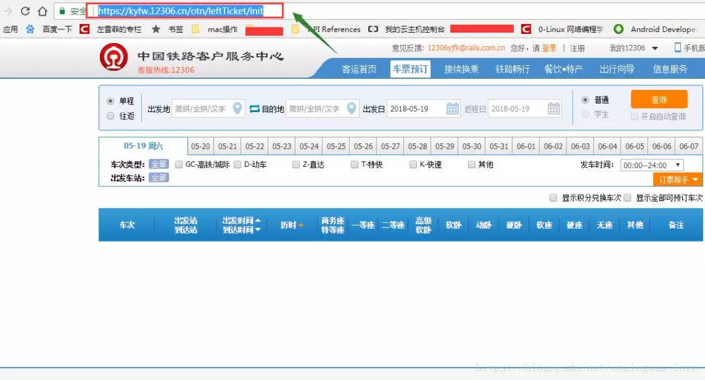
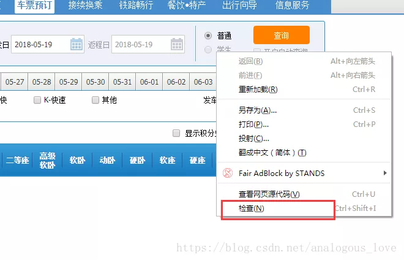
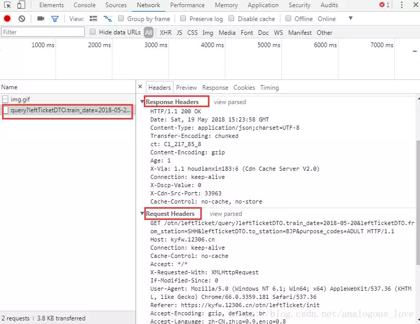
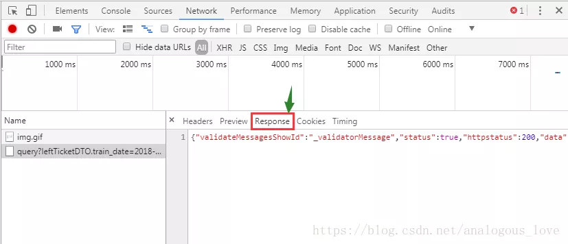
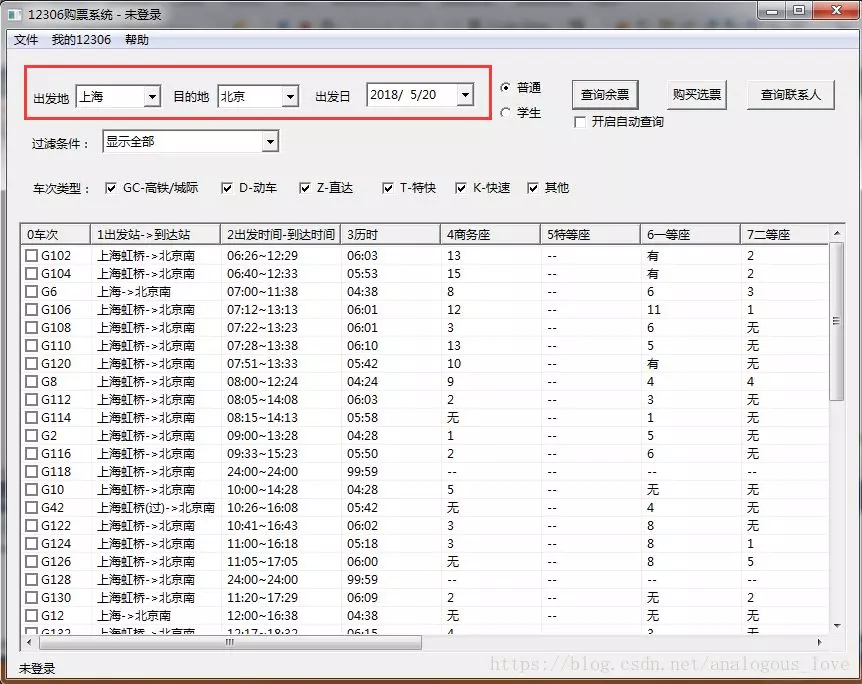
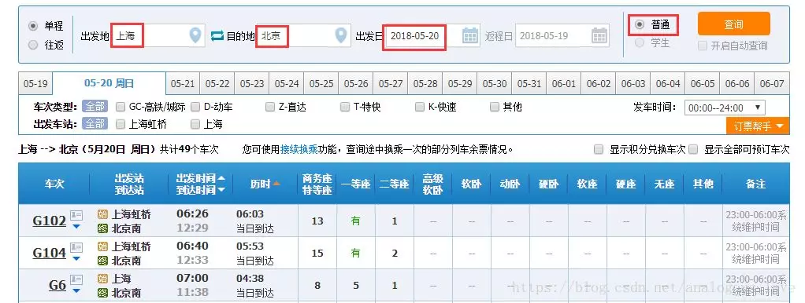
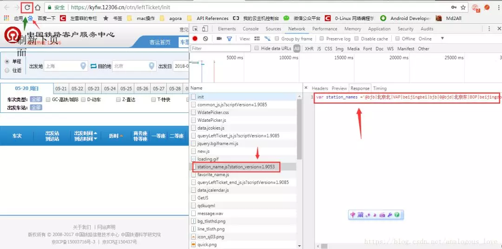
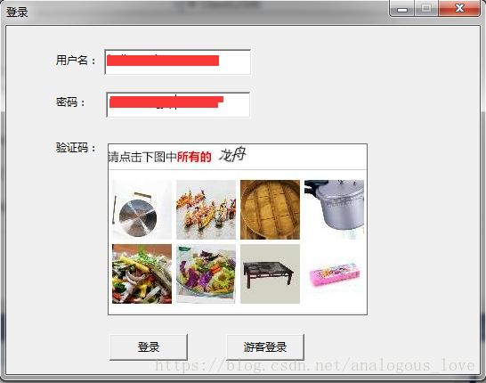
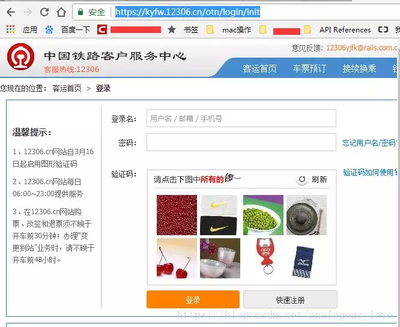
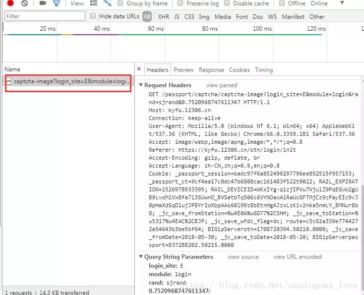

## 从零实现一款12306刷票软件

写在前面的话

每年逢年过节，一票难求读者肯定不陌生。这篇文章，我们带领读者从零实现一款12306刷票软件，其核心原理是**通过发送http请求模拟登录12306网站的购票**的过程，最后买到票。

关于http请求的格式和如何组装http数据包给服务器发送请求，我们在上一篇文章《[从零实现一个http服务器](http://mp.weixin.qq.com/s?__biz=MzU2MTQ1MzI3NQ==&mid=2247484692&idx=1&sn=346d0a16db724a575947562282f7c621&chksm=fc79c4a0cb0e4db62bc1f2a4f9489cd5d0cf8dd4c3363fcdd76bb65543e372b780b0895711a7&scene=21#wechat_redirect)》中已经详细介绍过了，如果还不明白的朋友可以去那篇文章看下。

**郑重申明一下：这里介绍的技术仅供用于学习，不可用于恶意攻击12306服务器，请勿滥用本文介绍的技术。对12306服务器造成的任何损失，后果自负。**

当然，由于12306服务器用户量巨大，为了防止黄牛和其他一些非法攻击者，12306的很多url和在购票过程中各个步骤的协议细节经常发生变化。所以，本文中介绍的一些具体的url，可能在你看到本文时已经失效。但是这并没有关系，只要你掌握了本文中介绍的分析方法，您就可以灵活地修改您的代码，以适应最新的12306服务器的要求。

举个例子，如12306的查票接口目前的url是：

```
https://kyfw.12306.cn/otn/leftTicket/query
```

可能过几天就变成了

```
https://kyfw.12306.cn/otn/leftTicket/queryX
```

再过几天又可能变成

```
https://kyfw.12306.cn/otn/leftTicket/queryY
```

然后一个星期后又可能变成

```
https://kyfw.12306.cn/otn/leftTicket/queryZ
```

这些笔者都见过。所以，重在原理的学习，掌握了原理，不管12306的相关url变成什么样，都可以以不变应万变。哎，12306在与黄牛的斗争中越走越远啊T_T

本文将使用以下工具来分析12306购票的过程，然后使用C++语言，模拟相关的过程，最终购票。

1. Chrome浏览器（其他的浏览器也可以，都有类似的界面，如Chrome，装了httpwatch的IE浏览器等）
2. 一个可以登录12306网址并且可以购票的12306账号
3. Visual Studio（版本随意，我这里用的是VS 2013）

一、查票与站点信息接口

之所以先分析这个接口，是因为查票不需要用户登录的，相对来说最简单。我们在Chrome浏览器中打开12306余票查询页面，网址是：https://kyfw.12306.cn/otn/leftTicket/init，如下图所示：



然后在页面中右键菜单中选择【**检查**】菜单，打开后，选择【**网络**】选项卡。如下图所示：




打开后页面变成二分窗口了，左侧是正常的网页页面，右侧是浏览器自带的控制台，当我们在左侧页面中进行操作后，右侧会显示我们浏览器发送的各种http请求和应答。我们这里随便查一个票吧，如查**2018年5月20**日从**上海到北京**的票，点击12306网页中【查询】按钮后，我们发现右侧是这样的：


通过图中列表的type值是**xhr**，我们可以得出这是一个**ajax**请求（ajax是一种浏览器原生支持的异步技术，具体细节请读者自行搜索）。我们选择这个请求，你能看到这个请求的细节——请求和响应结果：



在reponse中，我们可以看到我们的这个http的去除http头的响应结果（包体，可能是解压缩或者解码后的）：



这是一个json格式，我们找个json格式化工具，把这个json格式化后贴出来给大家看一下，其实您后面会发现12306的http请求结果中与购票相关的数据基本上都是json格式。这里的json如下：

```
{  
    "validateMessagesShowId": "_validatorMessage",  
    "status": true,  
    "httpstatus": 200,  
    "data": {  
        "result": ["null|23:00-06:00系统维护时间|5l0000G10270|G102|AOH|VNP|AOH|VNP|06:26|12:29|06:03|IS_TIME_NOT_BUY|RLVVIt093U2EZuy2NE+VQyRloXyqTzFp6YyNk6J52QcHEA01|20180520|3|HZ|01|11|1|0|||||||||||1|有|13||O090M0|O9M|0",(内容太长，这里省略) "],  
        "flag": "1",  
        "map": {  
            "AOH": "上海虹桥",  
            "BJP": "北京",  
            "VNP": "北京南",  
            "SHH": "上海"  
        }  
    },  
    "messages": [],  
    "validateMessages": {}  
}
```


其中含有的**余票信息在result节点**中，这是一个数组。每个节点以|分割，我们可以格式化后显示在自己的界面上：



我这里做的界面比较简陋，读者如果有兴趣可以做更精美的界面。我们列下这个请求发送的http数据包和应答包：

请求包：

```
GET /otn/leftTicket/query?leftTicketDTO.train_date=2018-05-20&leftTicketDTO.from_station=SHH&leftTicketDTO.to_station=BJP&purpose_codes=ADULT HTTP/1.1  
Host: kyfw.12306.cn  
Connection: keep-alive  
Cache-Control: no-cache  
Accept: */*  
X-Requested-With: XMLHttpRequest  
If-Modified-Since: 0  
User-Agent: Mozilla/5.0 (Windows NT 6.1; Win64; x64) AppleWebKit/537.36 (KHTML, like Gecko) Chrome/66.0.3359.181 Safari/537.36  
Referer: https://kyfw.12306.cn/otn/leftTicket/init  
Accept-Encoding: gzip, deflate, br  
Accept-Language: zh-CN,zh;q=0.9,en;q=0.8  
Cookie: RAIL_EXPIRATION=1526978933395; RAIL_DEVICEID=WKxIYg-q1zjIPVu7VjulZ9PqEGvW2gUB9LvoM1Vx8fa7l3SUwnO_BVSatbTq506c6VYNOaxAiRaUcGFTMjCz9cPayEIc9vJ0pHaXdSqDlujJP8YrIoXbpAAs60l99z8bEtnHgAJzxLzKiv2nka5nmLY_BMNur8b8; _jc_save_fromStation=%u4E0A%u6D77%2CSHH; _jc_save_toStation=%u5317%u4EAC%2CBJP; _jc_save_fromDate=2018-05-20; _jc_save_toDate=2018-05-19; _jc_save_wfdc_flag=dc 
```

应答包：

```
HTTP/1.1 200 OK
Date: Sat, 19 May 2018 15:23:58 GMT
Content-Type: application/json;charset=UTF-8
Transfer-Encoding: chunked
ct: C1_217_85_8
Content-Encoding: gzip
Age: 1
X-Via: 1.1 houdianxin183:6 (Cdn Cache Server V2.0)
Connection: keep-alive
X-Dscp-Value: 0
X-Cdn-Src-Port: 33963
Cache-Control: no-cache, no-store
```

通过上一篇文章《[从零实现一个http服务器](http://mp.weixin.qq.com/s?__biz=MzU2MTQ1MzI3NQ==&mid=2247484692&idx=1&sn=346d0a16db724a575947562282f7c621&chksm=fc79c4a0cb0e4db62bc1f2a4f9489cd5d0cf8dd4c3363fcdd76bb65543e372b780b0895711a7&scene=21#wechat_redirect)》我们知道这是一个http GET请求，其中在url后面是请求附带的参数：

```
leftTicketDTO.train_date: 2018-05-20  
leftTicketDTO.from_station: SHH  
leftTicketDTO.to_station: BJP  
purpose_codes: ADULT  
```

这四个参数分别是**购票日期**、**出发站**、**到达站**和**票类型**（这里是成人票（即普通票）），正好对应我们界面上的查询信息：



但是，读者可能会问，这里的出发站和到达站分别是SHH和BJP，这些站点代码，我如何获得呢？因为只有知道这些站点编码我才能自己购买指定出发站和到达站的火车票啊。如果您是一位细心的人，您肯定会想到，我们查票的时候再进入查票页面，这些站点信息就已经有了，那么可能是在这个查票页面加载时，从服务器请求的站点信息，所以我们刷新下查票页面，发现果然是这样：


进入查票页面之前，浏览器从 https://kyfw.12306.cn/otn/resources/js/framework/station_name.js?station_version=1.9053 下载一个叫 **station.name.js** 文件，这是一个javascript脚本，里面只有一行代码，就是定义了一个station_names的js变量，之所以url地址后面加一个**station_version=1.9053**，你可以理解成版本号，但是主要是通过一个随机值1.9053，让浏览器不要使用缓存中的station_name.js，而是每次都从服务器重新加载下这个文件，这样的话如果站点信息有更新，也可以避免因为缓存问题，导致本地的缓存与服务器上的站点信息不一致。由于站点信息比较多，我们截个图把：



看上图，我们可以看出来，每个站点信息都是通过**@**符号分割，然后通过**|**分割每一个站点的各种信息。这样的话，根据上文的格式假如我们要查询**2018年5月30日从长春到南京**的火车普通票，就可以通过网址：

```
https://kyfw.12306.cn/otn/leftTicket/query?leftTicketDTO.train_date=2018-05-30&leftTicketDTO.from_station=CCT&leftTicketDTO.to_station=NJH&purpose_codes=ADULT
```

当然，这里需要说明一下的就是，由于全国的火车站点信息文件比较大，我们程序解析起来时间较长，加上火车站编码信息并不是经常变动，所以，我们我们没必要每次都下载这个station_name.js，所以我在写程序模拟这个请求时，一般先看本地有没有这个文件，如果有就使用本地的，没有才发http请求向12306服务器请求。这里我贴下我请求站点信息的程序代码（C++代码）：

```
/**  
 * 获取全国车站信息 
 * @param si 返回的车站信息 
 * @param bForceDownload 强制从网络上下载，即不使用本地副本 
 */  
bool GetStationInfo(vector<stationinfo>& si, bool bForceDownload = false);
```


```
#define URL_STATION_NAMES   "https://kyfw.12306.cn/otn/resources/js/framework/station_name.js?station_version=1.9053" 
```


```
bool Client12306::GetStationInfo(vector<stationinfo>& si, bool bForceDownload/* = false*/)  
{    
    FILE* pfile;  
    pfile = fopen("station_name.js", "rt+");  
    //文件不存在，则必须下载  
    if (pfile == NULL)  
    {  
        bForceDownload = true;  
    }  
    string strResponse;  
    if (bForceDownload)  
    {  
        if (pfile != NULL)  
            fclose(pfile);  
        pfile = fopen("station_name.js", "wt+");  
        if (pfile == NULL)  
        {  
            LogError("Unable to create station_name.js");  
            return false;  
        }  
        CURLcode res;  
        CURL* curl = curl_easy_init();  
        if (NULL == curl)  
        {  
            fclose(pfile);  
            return false;  
        }  
        //URL_STATION_NAMES  
        curl_easy_setopt(curl, CURLOPT_URL, URL_STATION_NAMES);  
        //响应结果中保留头部信息  
        //curl_easy_setopt(curl, CURLOPT_HEADER, 1);  
        curl_easy_setopt(curl, CURLOPT_COOKIEFILE, "");  
        curl_easy_setopt(curl, CURLOPT_READFUNCTION, NULL);  
        curl_easy_setopt(curl, CURLOPT_WRITEFUNCTION, OnWriteData);  
        curl_easy_setopt(curl, CURLOPT_WRITEDATA, (void *)&strResponse);  
        curl_easy_setopt(curl, CURLOPT_NOSIGNAL, 1);  
        //设定为不验证证书和HOST  
        curl_easy_setopt(curl, CURLOPT_SSL_VERIFYPEER, false);  
        curl_easy_setopt(curl, CURLOPT_SSL_VERIFYHOST, false);  
        curl_easy_setopt(curl, CURLOPT_CONNECTTIMEOUT, 10);  
        curl_easy_setopt(curl, CURLOPT_TIMEOUT, 10);  
        res = curl_easy_perform(curl);  
        bool bError = false;  
        if (res == CURLE_OK)  
        {  
            int code;  
            res = curl_easy_getinfo(curl, CURLINFO_RESPONSE_CODE, &code);  
            if (code != 200)  
            {  
                bError = true;  
                LogError("http response code is not 200, code=%d", code);  
            }  
        }  
        else  
        {  
            LogError("http request error, error code = %d", res);  
            bError = true;  
        }  
        curl_easy_cleanup(curl);  
        if (bError)  
        {  
            fclose(pfile);  
            return !bError;  
        }  
        if (fwrite(strResponse.data(), strResponse.length(), 1, pfile) != 1)  
        {  
            LogError("Write data to station_name.js error");              
            return false;  
        }  
        fclose(pfile);  
    }  
    //直接读取文件  
    else  
    {  
        //得到文件大小  
        fseek(pfile, 0, SEEK_END);  
        int length = ftell(pfile);  
        if (length < 0)  
        {  
            LogError("invalid station_name.js file");  
            fclose(pfile);  
        }  
        fseek(pfile, 0, SEEK_SET);  
        length++;  
        char* buf = new char[length];  
        memset(buf, 0, length*sizeof(char));  
        if (fread(buf, length-1, 1, pfile) != 1)  
        {  
            LogError("read station_name.js file error");  
            fclose(pfile);  
            return false;  
        }  
        strResponse = buf;  
        fclose(pfile);  
    }  
    /* 
    返回结果为一个js文件， 
    var station_names = '@bjb|北京北|VAP|beijingbei|bjb|0@bjd|北京东|BOP|beijingdong|bjd|1@bji|北京|BJP|beijing|bj|2" 
    */  
    //LogInfo("recv json = %s", strResponse.c_str());  
    OutputDebugStringA(strResponse.c_str());  
    vector<string> singleStation;  
    split(strResponse, "@", singleStation);  
    size_t size = singleStation.size();  
    for (size_t i = 1; i < size; ++i)  
    {  
        vector<string> v;  
        split(singleStation[i], "|", v);  
        if (v.size() < 6)  
            continue;  
        stationinfo st;  
        st.code1 = v[0];  
        st.hanzi = v[1];  
        st.code2 = v[2];  
        st.pingyin = v[3];  
        st.simplepingyin = v[4];  
        st.no = atol(v[5].c_str());  
        si.push_back(st);  
    }  
    return true;  
}  
```

这里用了一个站点信息结构体**stationinfo**，定义如下：

```
//var station_names = '@bjb|北京北|VAP|beijingbei|bjb|0@bjd|北京东|BOP|beijingdong|bjd|1@bji|北京|BJP|beijing|bj|2  
struct stationinfo  
{  
    string code1;  
    string hanzi;  
    string code2;  
    string pingyin;  
    string simplepingyin;  
    int no;  
};  
```

因为我们这里目的是为了模拟http请求做买火车票相关的操作，而不是技术方面本身，所以为了快速实现我们的目的，我们就使用curl库。这个库是一个强大的http相关的库，例如12306服务器返回的数据可能是分块的（chunked），这个库也能帮我们组装好；再例如，服务器返回的数据是使用gzip格式压缩的，curl也会帮我们自动解压好。所以，接下来的所有12306的接口，都基于我封装的curl库一个接口：

```
/** 
 * 发送一个http请求 
 *@param url 请求的url 
 *@param strResponse http响应结果 
 *@param get true为GET，false为POST 
 *@param headers 附带发送的http头信息 
 *@param postdata post附带的数据     
 *@param bReserveHeaders http响应结果是否保留头部信息 
 *@param timeout http请求超时时间 
 */  
bool HttpRequest(const char* url, string& strResponse, bool get = true, const char* headers = NULL, const char* postdata = NULL, bool bReserveHeaders = false, int timeout = ); 
```


函数各种参数已经在函数注释中写的清清楚楚了，这里就不一一解释了。这个函数的实现代码如下：

```
bool Client12306::HttpRequest(const char* url,   
                              string& strResponse,   
                              bool get/* = true*/,   
                              const char* headers/* = NULL*/,   
                              const char* postdata/* = NULL*/,   
                              bool bReserveHeaders/* = false*/,   
                              int timeout/* = 10*/)  
{  
    CURLcode res;  
    CURL* curl = curl_easy_init();  
    if (NULL == curl)  
    {  
        LogError("curl lib init error");  
        return false;  
    }  
    curl_easy_setopt(curl, CURLOPT_URL, url);  
    //响应结果中保留头部信息  
    if (bReserveHeaders)  
       curl_easy_setopt(curl, CURLOPT_HEADER, 1);  
    curl_easy_setopt(curl, CURLOPT_COOKIEFILE, "");  
    curl_easy_setopt(curl, CURLOPT_READFUNCTION, NULL);  
    curl_easy_setopt(curl, CURLOPT_WRITEFUNCTION, OnWriteData);  
    curl_easy_setopt(curl, CURLOPT_WRITEDATA, (void *)&strResponse);  
    curl_easy_setopt(curl, CURLOPT_NOSIGNAL, 1);  
    //设定为不验证证书和HOST  
    curl_easy_setopt(curl, CURLOPT_SSL_VERIFYPEER, false);  
    curl_easy_setopt(curl, CURLOPT_SSL_VERIFYHOST, false);  
    //设置超时时间  
    curl_easy_setopt(curl, CURLOPT_CONNECTTIMEOUT, timeout);  
    curl_easy_setopt(curl, CURLOPT_TIMEOUT, timeout);  
    curl_easy_setopt(curl, CURLOPT_REFERER, URL_REFERER);  
    //12306早期版本是不需要USERAGENT这个字段的，现在必须了，估计是为了避免一些第三方的非法刺探吧。  
    //如果没有这个字段，会返回  
    /* 
        HTTP/1.0 302 Moved Temporarily 
        Location: http://www.12306.cn/mormhweb/logFiles/error.html 
        Server: Cdn Cache Server V2.0 
        Mime-Version: 1.0 
        Date: Fri, 18 May 2018 02:52:05 GMT 
        Content-Type: text/html 
        Content-Length: 0 
        Expires: Fri, 18 May 2018 02:52:05 GMT 
        X-Via: 1.0 PSshgqdxxx63:10 (Cdn Cache Server V2.0) 
        Connection: keep-alive 
        X-Dscp-Value: 0 
     */  
    curl_easy_setopt(curl, CURLOPT_USERAGENT, "Mozilla/5.0 (Windows NT 6.1; Win64; x64) AppleWebKit/537.36 (KHTML, like Gecko) Chrome/65.0.3325.146 Safari/537.36");  
    //不设置接收的编码格式或者设置为空，libcurl会自动解压压缩的格式，如gzip  
    //curl_easy_setopt(curl, CURLOPT_ACCEPT_ENCODING, "gzip, deflate, br");  
    //添加自定义头信息  
    if (headers != NULL)  
    {  
        //LogInfo("http custom header: %s", headers);  
        struct curl_slist *chunk = NULL;          
        chunk = curl_slist_append(chunk, headers);        
        curl_easy_setopt(curl, CURLOPT_HTTPHEADER, chunk);  
    }  
    if (!get && postdata != NULL)  
    {  
        //LogInfo("http post data: %s", postdata);  
        curl_easy_setopt(curl, CURLOPT_POSTFIELDS, postdata);  
    }  
    LogInfo("http %s: url=%s, headers=%s, postdata=%s", get ? "get" : "post", url, headers != NULL ? headers : "", postdata!=NULL?postdata : "");  
    res = curl_easy_perform(curl);  
    bool bError = false;  
    if (res == CURLE_OK)  
    {  
        int code;  
        res = curl_easy_getinfo(curl, CURLINFO_RESPONSE_CODE, &code);  
        if (code != 200 && code != 302)  
        {  
            bError = true;  
            LogError("http response code is not 200 or 302, code=%d", code);  
        }  
    }  
    else  
    {  
        LogError("http request error, error code = %d", res);  
        bError = true;  
    }  
    curl_easy_cleanup(curl);  
    LogInfo("http response: %s", strResponse.c_str());  
   return !bError;  
} 
```


正如上面注释中所提到的，浏览器在发送http请求时带的某些字段，不是必须的，我们在模拟这个请求时可以不添加，如查票接口浏览器可能会发以下http数据包：

```
GET /otn/leftTicket/query?leftTicketDTO.train_date=2018-05-30&leftTicketDTO.from_station=SHH&leftTicketDTO.to_station=BJP&purpose_codes=ADULT HTTP/1.1  
Host: kyfw.12306.cn  
Connection: keep-alive  
Cache-Control: no-cache  
Accept: */*  
X-Requested-With: XMLHttpRequest  
If-Modified-Since: 0  
User-Agent: Mozilla/5.0 (Windows NT 6.1; Win64; x64) AppleWebKit/537.36 (KHTML, like Gecko) Chrome/66.0.3359.181 Safari/537.36  
Referer: https://kyfw.12306.cn/otn/leftTicket/init  
Accept-Encoding: gzip, deflate, br  
Accept-Language: zh-CN,zh;q=0.9,en;q=0.8  
Cookie: JSESSIONID=ACD9CB098169C4D73CDE80D6F6C38E5A; RAIL_EXPIRATION=1526978933395; RAIL_DEVICEID=WKxIYg-q1zjIPVu7VjulZ9PqEGvW2gUB9LvoM1Vx8fa7l3SUwnO_BVSatbTq506c6VYNOaxAiRaUcGFTMjCz9cPayEIc9vJ0pHaXdSqDlujJP8YrIoXbpAAs60l99z8bEtnHgAJzxLzKiv2nka5nmLY_BMNur8b8; _jc_save_fromStation=%u4E0A%u6D77%2CSHH; _jc_save_toStation=%u5317%u4EAC%2CBJP; _jc_save_wfdc_flag=dc; route=c5c62a339e7744272a54643b3be5bf64; BIGipServerotn=1708720394.50210.0000; _jc_save_fromDate=2018-05-30; _jc_save_toDate=2018-05-20 
```


其中像**Connection**、**Cache-Control**、**Accept**、**If-Modified-Since**等字段都不是必须的，所以我们在模拟我们自己的http请求时可以不用可以添加这些字段，当然据我观察，12306服务器现在对发送过来的http数据包要求越来越严格了，如去年的时候，User-Agent这个字段还不是必须的，现在如果你不带上这个字段，可能12306返回的结果就不一定正确。当然，不正确的结果中一定不会有明确的错误信息，充其量可能会告诉你页面不存在或者系统繁忙请稍后再试，这是服务器自我保护的一种重要的措施，试想你做服务器程序，会告诉非法用户明确的错误信息吗？那样不就给了非法攻击服务器的人不断重试的机会了嘛。

需要特别注意的是：查票接口发送的http协议的头还有一个字段叫Cookie，其值是一串非常奇怪的东西：

```
JSESSIONID=ACD9CB098169C4D73CDE80D6F6C38E5A; 
RAIL_EXPIRATION=1526978933395; 
RAIL_DEVICEID=WKxIYg-q1zjIPVu7VjulZ9PqEGvW2gUB9LvoM1Vx8fa7l3SUwnO_BVSatbTq506c6VYNOaxAiRaUcGFTMjCz9cPayEIc9vJ0pHaXdSqDlujJP8YrIoXbpAAs60l99z8bEtnHgAJzxLzKiv2nka5nmLY_BMNur8b8; 
_jc_save_fromStation=%u4E0A%u6D77%2CSHH;
_jc_save_toStation=%u5317%u4EAC%2CBJP;
_jc_save_wfdc_flag=dc;
route=c5c62a339e7744272a54643b3be5bf64;
BIGipServerotn=1708720394.50210.0000;
_jc_save_fromDate=2018-05-30;
_jc_save_toDate=2018-05-2
```

注意：原代码中各个字段都是连在一起的，我这里为了读者方便阅读，将各个字段单独放在一行。在这串字符中有一个**JSESSIONID**，在不需要登录的查票接口，我们可以传或者不传这个字段值。但是在购票以及查询常用联系人这些需要在已经登录的情况下才能进行的操作，我们必须带上这个数据，这是服务器给你的token（验证令牌），而这个令牌是在刚进入12306站点时，服务器发过来的，你后面的登录等操作必须带上这个token，否则服务器会认为您的请求是非法请求。我第一次去研究12306的买票流程时，即使在用户名、密码和图片验证码正确的情况下，也无法登录就是这个原因。这是12306为了防止非法登录使用的一个安全措施。


**二、登录与拉取图片验证码接口**

我的登录页面效果如下：



12306的图片验证码一般由八个图片组成，像上面的“龙舟”文字，也是图片，这两处的图片（文字图片和验证码）都是在服务器上拼装后，发给客户端的，12306服务器上这种类型的小图片有一定的数量，虽然数量比较大，但是是有限的。如果你要做验证码自动识别功能，可以尝试着下载大部分图片，然后做统计规律。所以，我这里并没有做图片自动识别功能。有兴趣的读者可自行尝试。

先说下，拉取验证码的接口。我们打开Chrome浏览器12306的登录界面：

```
https://kyfw.12306.cn/otn/login/init
```

如下图所示：



可以得到拉取验证码的接口：



我们可以看到发送的http请求数据包格式是：

```
GET /passport/captcha/captcha-image?login_site=E&module=login&rand=sjrand&0.7520968747611347 HTTP/1.1  
Host: kyfw.12306.cn  
Connection: keep-alive  
User-Agent: Mozilla/5.0 (Windows NT 6.1; Win64; x64) AppleWebKit/537.36 (KHTML, like Gecko) Chrome/66.0.3359.181 Safari/537.36  
Accept: image/webp,image/apng,image/*,*/*;q=0.8  
Referer: https://kyfw.12306.cn/otn/login/init  
Accept-Encoding: gzip, deflate, br  
Accept-Language: zh-CN,zh;q=0.9,en;q=0.8  
Cookie: _passport_session=badc97f6a852499297796ee852515f957153; _passport_ct=9cf4ea17c0dc47b6980cac161483f522t9022; RAIL_EXPIRATION=1526978933395; RAIL_DEVICEID=WKxIYg-q1zjIPVu7VjulZ9PqEGvW2gUB9LvoM1Vx8fa7l3SUwnO_BVSatbTq506c6VYNOaxAiRaUcGFTMjCz9cPayEIc9vJ0pHaXdSqDlujJP8YrIoXbpAAs60l99z8bEtnHgAJzxLzKiv2nka5nmLY_BMNur8b8; _jc_save_fromStation=%u4E0A%u6D77%2CSHH; _jc_save_toStation=%u5317%u4EAC%2CBJP; _jc_save_wfdc_flag=dc; route=c5c62a339e7744272a54643b3be5bf64; BIGipServerotn=1708720394.50210.0000; _jc_save_fromDate=2018-05-30; _jc_save_toDate=2018-05-20; BIGipServerpassport=837288202.50215.0000  
```

这里也是一个http GET请求，**Host**、**Referer**和**Cookie**这三个字段是必须的，且Cookie字段必须带上上文说的**JSESSIONID**，下载图片验证码和下文中各个步骤也必须在Cookie字段中带上这个**JSESSIONID**值，否则无法从12306服务器得到正确的应答。后面会介绍如何拿到这个这。这个拉取图片验证码的http GET请求需要三个参数，如上面的代码段所示，即**login_site**、**module**、rand和一个类似于**0.7520968747611347**的随机值，前三个字段的值都是固定的，module字段表示当前是哪个模块，当前是登录模块，所以值是login，后面获取最近联系人时取值是**passenger**。这里还有一个需要注意的地方是，如果您验证图片验证码失败时，重新请求图片时，必须也重新请求下**JSESSIONID**。这个url是

```
https://kyfw.12306.cn/otn/login/init
```

http请求和应答包如下：

请求包：

```
Accept: text/html,application/xhtml+xml,application/xml;q=0.9,image/webp,image/apng,*/*;q=0.8  
Accept-Encoding: gzip, deflate, br  
Accept-Language: zh-CN,zh;q=0.9,en;q=0.8  
Cache-Control: max-age=0  
Connection: keep-alive  
Cookie: RAIL_EXPIRATION=1526978933395; RAIL_DEVICEID=WKxIYg-q1zjIPVu7VjulZ9PqEGvW2gUB9LvoM1Vx8fa7l3SUwnO_BVSatbTq506c6VYNOaxAiRaUcGFTMjCz9cPayEIc9vJ0pHaXdSqDlujJP8YrIoXbpAAs60l99z8bEtnHgAJzxLzKiv2nka5nmLY_BMNur8b8; _jc_save_fromStation=%u4E0A%u6D77%2CSHH; _jc_save_toStation=%u5317%u4EAC%2CBJP; _jc_save_wfdc_flag=dc; route=c5c62a339e7744272a54643b3be5bf64; BIGipServerotn=1708720394.50210.0000; _jc_save_fromDate=2018-05-30; _jc_save_toDate=2018-05-20; BIGipServerpassport=837288202.50215.0000  
Host: kyfw.12306.cn  
Referer: https://kyfw.12306.cn/otn/passport?redirect=/otn/login/loginOut  
Upgrade-Insecure-Requests: 1  
User-Agent: Mozilla/5.0 (Windows NT 6.1; Win64; x64) AppleWebKit/537.36 (KHTML, like Gecko) Chrome/66.0.3359.181 Safari/537.36  
```

应答包：

```
HTTP/1.1 200 OK  
Date: Sun, 20 May 2018 02:23:53 GMT  
Content-Type: text/html;charset=utf-8  
Transfer-Encoding: chunked  
Set-Cookie: JSESSIONID=D5AE154D66F67DE53BF70420C772158F; Path=/otn  
ct: C1_217_101_6  
Content-Language: zh-CN  
Content-Encoding: gzip  
X-Via: 1.1 houdianxin184:4 (Cdn Cache Server V2.0)  
Connection: keep-alive  
X-Dscp-Value: 0  
X-Cdn-Src-Port: 46480  
```

这个值在应答包字段Set-Cookie中拿到：

```
Set-Cookie: JSESSIONID=D5AE154D66F67DE53BF70420C772158F; Path=/otn  
```

所以，我们每次请求图片验证码时，都重新请求一下这个JSESSIONID，代码如下：

```
#define URL_LOGIN_INIT      "https://kyfw.12306.cn/otn/login/init"  
```

```
bool Client12306::loginInit()  
{     
    string strResponse;  
    if (!HttpRequest(URL_LOGIN_INIT, strResponse, true, "Upgrade-Insecure-Requests: 1", NULL, true, 10))  
    {  
        LogError("loginInit failed");  
        return false;  
    }  
    if (!GetCookies(strResponse))  
    {  
        LogError("parse login init cookie error, url=%s", URL_LOGIN_INIT);  
        return false;  
    }  
    return true;  
}  

bool Client12306::GetCookies(const string& data)  
{  
    if (data.empty())  
    {  
        LogError("http data is empty");  
        return false;  
    }  
    //解析http头部  
    string str;  
    str.append(data.c_str(), data.length());  
    size_t n = str.find("\r\n\r\n");  
    string header = str.substr(0, n);  
    str.erase(0, n + 4);  
    //m_cookie.clear();  
    //获取http头中的JSESSIONID=21AC68643BBE893FBDF3DA9BCF654E98;  
    vector<string> v;  
    while (true)  
    {  
        size_t index = header.find("\r\n");  
        if (index == string::npos)  
            break;  
        string tmp = header.substr(0, index);  
        v.push_back(tmp);  
        header.erase(0, index + 2);  
        if (header.empty())  
            break;  
    }  
    string jsessionid;  
    string BIGipServerotn;  
    string BIGipServerportal;  
    string current_captcha_type;  
    size_t m;  
    OutputDebugStringA("\nresponse http headers:\n");  
    for (size_t i = 0; i < v.size(); ++i)  
    {  
        OutputDebugStringA(v[i].c_str());  
        OutputDebugStringA("\n");  
        m = v[i].find("Set-Cookie: ");  
        if (m == string::npos)  
            continue;  
        string tmp = v[i].substr(11);  
        Trim(tmp);  
        m = tmp.find("JSESSIONID");  
        if (m != string::npos)  
        {  
            size_t comma = tmp.find(";");  
            if (comma != string::npos)  
                jsessionid = tmp.substr(0, comma);  
        }  
        m = tmp.find("BIGipServerotn");  
        if (m != string::npos)  
        {  
            size_t comma = tmp.find(";");  
            if (comma != string::npos)  
                BIGipServerotn = tmp.substr(m, comma);  
            else  
                BIGipServerotn = tmp;  
        }  
        m = tmp.find("BIGipServerportal");  
        if (m != string::npos)  
        {  
            size_t comma = tmp.find(";");  
            if (comma != string::npos)  
                BIGipServerportal = tmp.substr(m, comma);  
            else  
                BIGipServerportal = tmp;  
        }  
        m = tmp.find("current_captcha_type");  
        if (m != string::npos)  
        {  
            size_t comma = tmp.find(";");  
            if (comma != string::npos)  
                current_captcha_type = tmp.substr(m, comma);  
            else  
                current_captcha_type = tmp;             
        }  
    }  
    if (!jsessionid.empty())  
    {  
        m_strCookies = jsessionid;  
        m_strCookies += "; ";  
        m_strCookies += BIGipServerotn;  
        if (!BIGipServerportal.empty())  
        {  
            m_strCookies += "; ";  
            m_strCookies += BIGipServerportal;  
        }  
        m_strCookies += "; ";  
        m_strCookies += current_captcha_type;  
        return true;  
    }  
    LogError("jsessionid is empty");  
    return false;  
}  
```

```
#define URL_GETPASSCODENEW  "https://kyfw.12306.cn/passport/captcha/captcha-image"  
```

```
bool Client12306::DownloadVCodeImage(const char* module)  
{  
    if (module == NULL)  
    {  
        LogError("module is invalid");  
        return false;  
    }  
    //https://kyfw.12306.cn/passport/captcha/captcha-image?login_site=E&module=login&rand=sjrand&0.06851784300754482  
    ostringstream osUrl;  
    osUrl << URL_GETPASSCODENEW;  
    osUrl << "?login_site=E&module=";  
    osUrl << module;  
    //购票验证码  
    if (strcmp(module, "passenger") != 0)  
    {  
        osUrl << "&rand=sjrand&";  
    }  
    //登录验证码  
    else  
    {        
        osUrl << "&rand=randp&";       
    }  
    double d = rand() * 1.000000 / RAND_MAX;  
    osUrl.precision(17);  
    osUrl << d;  
    string strResponse;  
    string strCookie = "Cookie: ";  
    strCookie += m_strCookies;  
    if (!HttpRequest(osUrl.str().c_str(), strResponse, true, strCookie.c_str(), NULL, false, 10))  
    {  
        LogError("DownloadVCodeImage failed");  
        return false;  
    }  
    //写入文件  
    time_t now = time(NULL);  
    struct tm* tblock = localtime(&now);  
    memset(m_szCurrVCodeName, 0, sizeof(m_szCurrVCodeName));  
#ifdef _DEBUG  
    sprintf(m_szCurrVCodeName, "vcode%04d%02d%02d%02d%02d%02d.jpg",  
        1900 + tblock->tm_year, 1 + tblock->tm_mon, tblock->tm_mday,  
        tblock->tm_hour, tblock->tm_min, tblock->tm_sec);  
#else  
    sprintf(m_szCurrVCodeName, "vcode%04d%02d%02d%02d%02d%02d.v",  
        1900 + tblock->tm_year, 1 + tblock->tm_mon, tblock->tm_mday,  
        tblock->tm_hour, tblock->tm_min, tblock->tm_sec);  
#endif  
    FILE* fp = fopen(m_szCurrVCodeName, "wb");  
    if (fp == NULL)  
    {  
        LogError("open file %s error", m_szCurrVCodeName);  
        return false;  
    }  
    const char* p = strResponse.data();  
    size_t count = fwrite(p, strResponse.length(), 1, fp);  
    if (count != 1)  
    {  
        LogError("write file %s error", m_szCurrVCodeName);  
        fclose(fp);  
        return false;  
    }  
    fclose(fp);  
    return true;  
}  
```

我们再看下验证码去服务器验证的接口

```
https://kyfw.12306.cn/passport/captcha/captcha-check
```

请求头：

```
POST /passport/captcha/captcha-check HTTP/1.1  
Host: kyfw.12306.cn  
Connection: keep-alive  
Content-Length: 50  
Accept: application/json, text/javascript, */*; q=0.01  
Origin: https://kyfw.12306.cn  
X-Requested-With: XMLHttpRequest  
User-Agent: Mozilla/5.0 (Windows NT 6.1; Win64; x64) AppleWebKit/537.36 (KHTML, like Gecko) Chrome/66.0.3359.181 Safari/537.36  
Content-Type: application/x-www-form-urlencoded; charset=UTF-8  
Referer: https://kyfw.12306.cn/otn/login/init  
Accept-Encoding: gzip, deflate, br  
Accept-Language: zh-CN,zh;q=0.9,en;q=0.8  
Cookie: _passport_session=3e39a33a25bf4ea79146bd9362c11ad62327; _passport_ct=c5c7940e08ce44db9ad05d213c1296ddt4410; RAIL_EXPIRATION=1526978933395; RAIL_DEVICEID=WKxIYg-q1zjIPVu7VjulZ9PqEGvW2gUB9LvoM1Vx8fa7l3SUwnO_BVSatbTq506c6VYNOaxAiRaUcGFTMjCz9cPayEIc9vJ0pHaXdSqDlujJP8YrIoXbpAAs60l99z8bEtnHgAJzxLzKiv2nka5nmLY_BMNur8b8; _jc_save_fromStation=%u4E0A%u6D77%2CSHH; _jc_save_toStation=%u5317%u4EAC%2CBJP; _jc_save_wfdc_flag=dc; route=c5c62a339e7744272a54643b3be5bf64; BIGipServerotn=1708720394.50210.0000; _jc_save_fromDate=2018-05-30; _jc_save_toDate=2018-05-20; BIGipServerpassport=837288202.50215.0000
```


这是一个POST请求，其中POST数据带上的输入的图片验证码选择的坐标X和Y值：

```
answer: 175,58,30,51  
login_site: E  
rand: sjrand 
```


这里我选择了两张图片，所以有两组坐标值，（175，58）是一组，（30，51）是另外一组，这个坐标系如下：


因为每个图片的尺寸都一样，所以，我可以给每个图片设置一个坐标范围，当选择了一个图片，给一个在其中的坐标即可，不一定是鼠标点击时的准确位置：

```
//刷新验证码 登录状态下的验证码传入”randp“，非登录传入”sjrand“ 具体参看原otsweb中的传入参数  
struct VCodePosition  
{  
    int x;  
    int y;  
};  
const VCodePosition g_pos[] =  
{  
    { 39, 40 },  
    { 114, 43 },  
    { 186, 42 },  
    { 252, 47 },  
    { 36, 120 },  
    { 115, 125 },  
    { 194, 125 },  
    { 256, 120 }  
};  
//验证码图片八个区块的位置  
struct VCODE_SLICE_POS  
{  
    int xLeft;  
    int xRight;  
    int yTop;  
    int yBottom;  
};  
const VCODE_SLICE_POS g_VCodeSlicePos[] =   
{  
    {0,   70,  0,  70},  
    {71,  140, 0,  70 },  
    {141, 210, 0,  70 },  
    {211, 280, 0,  70 },  
    { 0,  70,  70, 140 },      
    {71,  140, 70, 140 },  
    {141, 210, 70, 140 },  
    {211, 280, 70, 140 }  
};  
//8个验证码区块的鼠标点击状态  
bool g_bVodeSlice1Pressed[8] = { false, false, false, false, false, false, false, false};  
```

验证的图片验证码的接口代码是：

```
int Client12306::checkRandCodeAnsyn(const char* vcode)  
{  
    string param;  
    param = "randCode=";  
    param += vcode;  
    param += "&rand=sjrand";    //passenger:randp  
    string strResponse;  
    string strCookie = "Cookie: ";  
    strCookie += m_strCookies;  
    if (!HttpRequest(URL_CHECKRANDCODEANSYN, strResponse, false, strCookie.c_str(), param.c_str(), false, 10))  
    {  
        LogError("checkRandCodeAnsyn failed");  
        return -1;  
    }  
    ///** 成功返回  
    //HTTP/1.1 200 OK  
    //Date: Thu, 05 Jan 2017 07:44:16 GMT  
    //Server: Apache-Coyote/1.1  
    //X-Powered-By: Servlet 2.5; JBoss-5.0/JBossWeb-2.1  
    //ct: c1_103  
    //Content-Type: application/json;charset=UTF-8  
    //Content-Length: 144  
    //X-Via: 1.1 jiandianxin29:6 (Cdn Cache Server V2.0)  
    //Connection: keep-alive  
    //X-Cdn-Src-Port: 19153  
    //参数无效  
    //{"validateMessagesShowId":"_validatorMessage","status":true,"httpstatus":200,"data":{"result":"0","msg":""},"messages":[],"validateMessages":{}}  
    //验证码过期  
    //{"validateMessagesShowId":"_validatorMessage","status":true,"httpstatus":200,"data":{"result":"0","msg":"EXPIRED"},"messages":[],"validateMessages":{}}  
    //验证码错误  
    //{"validateMessagesShowId":"_validatorMessage","status":true,"httpstatus":200,"data":{"result":"1","msg":"FALSE"},"messages":[],"validateMessages":{}}  
    //验证码正确  
    //{"validateMessagesShowId":"_validatorMessage","status":true,"httpstatus":200,"data":{"result":"1","msg":"TRUE"},"messages":[],"validateMessages":{}}  
    Json::Reader JsonReader;  
    Json::Value JsonRoot;  
    if (!JsonReader.parse(strResponse, JsonRoot))  
        return -1;  
    //{"validateMessagesShowId":"_validatorMessage", "status" : true, "httpstatus" : 200, "data" : {"result":"1", "msg" : "TRUE"}, "messages" : [], "validateMessages" : {}}  
    if (JsonRoot["status"].isNull() || JsonRoot["status"].asBool() != true)  
        return -1;  
    if (JsonRoot["httpstatus"].isNull() || JsonRoot["httpstatus"].asInt() != 200)  
        return -1;  
    if (JsonRoot["data"].isNull() || !JsonRoot["data"].isObject())  
        return -1;  
    if (JsonRoot["data"]["result"].isNull())  
        return -1;  
    if (JsonRoot["data"]["result"].asString() != "1" && JsonRoot["data"]["result"].asString() != "0")  
        return -1;  
    if (JsonRoot["data"]["msg"].isNull())  
        return -1;  
    //if (JsonRoot["data"]["msg"].asString().empty())         
    //  return -1;  
    if (JsonRoot["data"]["msg"].asString() == "")  
        return 0;  
    else if (JsonRoot["data"]["msg"].asString() == "FALSE")  
        return 1;  
    return 1;  
}  
```

同理，这里也给出验证用户名和密码的接口实现代码：

```
int Client12306::loginAysnSuggest(const char* user, const char* pass, const char* vcode)  
{  
    string param = "loginUserDTO.user_name=";  
    param += user;  
    param += "&userDTO.password=";  
    param += pass;  
    param += "&randCode=";  
    param += vcode;  
    string strResponse;  
    string strCookie = "Cookie: ";  
    strCookie += m_strCookies;  
    if (!HttpRequest(URL_LOGINAYSNSUGGEST, strResponse, false, strCookie.c_str(), param.c_str(), false, 10))  
    {  
        LogError("loginAysnSuggest failed");  
        return 2;  
    }  
    ///** 成功返回  
    //HTTP/1.1 200 OK  
    //Date: Thu, 05 Jan 2017 07:49:53 GMT  
    //Server: Apache-Coyote/1.1  
    //X-Powered-By: Servlet 2.5; JBoss-5.0/JBossWeb-2.1  
    //ct: c1_103  
    //Content-Type: application/json;charset=UTF-8  
    //Content-Length: 146  
    //X-Via: 1.1 f186:10 (Cdn Cache Server V2.0)  
    //Connection: keep-alive  
    //X-Cdn-Src-Port: 48361  
    //邮箱不存在  
    //{"validateMessagesShowId":"_validatorMessage","status":true,"httpstatus":200,"data":{},"messages":["该邮箱不存在。"],"validateMessages":{}}  
    //密码错误  
    //{"validateMessagesShowId":"_validatorMessage","status":true,"httpstatus":200,"data":{},"messages":["密码输入错误。如果输错次数超过4次，用户将被锁定。"],"validateMessages":{}}  
    //登录成功  
    //{"validateMessagesShowId":"_validatorMessage","status":true,"httpstatus":200,"data":{"otherMsg":"",loginCheck:"Y"},"messages":[],"validateMessages":{}}  
    //WCHAR* psz1 = Utf8ToAnsi(strResponse.c_str());  
    //wstring str = psz1;  
    //delete[] psz1;  
    Json::Reader JsonReader;  
    Json::Value JsonRoot;  
    if (!JsonReader.parse(strResponse, JsonRoot))  
        return 2;  
    //{"validateMessagesShowId":"_validatorMessage", "status" : true,   
    //"httpstatus" : 200, "data" : {"otherMsg":"", loginCheck : "Y"}, "messages" : [], "validateMessages" : {}}  
    if (JsonRoot["status"].isNull())  
        return -1;  
    bool bStatus = JsonRoot["status"].asBool();  
    if (!bStatus)  
        return -1;  
    if (JsonRoot["httpstatus"].isNull() || JsonRoot["httpstatus"].asInt() != 200)  
        return 2;  
    if (JsonRoot["data"].isNull() || !JsonRoot["data"].isObject())  
        return 2;  
    if (JsonRoot["data"]["otherMsg"].isNull() || JsonRoot["data"]["otherMsg"].asString() != "")  
        return 2;  
    if (JsonRoot["data"]["loginCheck"].isNull() || JsonRoot["data"]["loginCheck"].asString() != "Y")  
        return 1;  
    return 0;  
}  
```

这里还有个注意细节，就是通过POST请求发送的数据需要对一些符号做URL Encode，这个我在上一篇文章《[从零实现一个http服务器](http://mp.weixin.qq.com/s?__biz=MzU2MTQ1MzI3NQ==&mid=2247484692&idx=1&sn=346d0a16db724a575947562282f7c621&chksm=fc79c4a0cb0e4db62bc1f2a4f9489cd5d0cf8dd4c3363fcdd76bb65543e372b780b0895711a7&scene=21#wechat_redirect)》也详细做了介绍，还不清楚的可以参见上一篇文章。所以对于向图片验证码坐标信息中含有的逗号信息就要进行URL编码，从

```
answer=114,54,44,46&login_site=E&rand=sjrand  
```

变成

```
answer=114%2C54%2C44%2C46&login_site=E&rand=sjrand  
```

所以，在http包头中指定的**Content-Length**字段的值应该是编码后的字符串长度，而不是原始的长度，这个地方特别容易出错。


如果验证成功后，接下来就是查票和购票了。这里就不一一介绍了，所有的原理都是一样的，作者可以自行探索。当然，我已经将大多数的接口都探索完了，并实现了，我这里贴一下吧：

```
/** 
 *@desc:    封装获取验证码、校验验证码、登录等12306各个请求的类，Client12306.h文件 
 *@author:      zhangyl 
 *@date:    2017.01.17 
 */  
#ifndef __CLIENT_12306_H__  
#define __CLIENT_12306_H__  
 
#include <vector>  
#include <string>  
  
using namespace std;  
 
//车次类型  
#define TRAIN_GC     0x00000001  
#define TRAIN_D      (0x00000001 << 1)  
#define TRAIN_Z      (0x00000001 << 2)  
#define TRAIN_T      (0x00000001 << 3)  
#define TRAIN_K      (0x00000001 << 4)  
#define TRAIN_OTHER  (0x00000001 << 5)  
#define TRAIN_ALL    (TRAIN_GC | TRAIN_D | TRAIN_Z | TRAIN_T | TRAIN_K | TRAIN_OTHER)  
  
//票信息  
struct queryLeftNewDTO  
{  
    string  train_no;  
    string  station_train_code;  
    string  start_station_telecode;     //始发站  
    string  start_station_name;       
    string  end_station_telecode;       //终点站  
    string  end_station_name;  
    string  from_station_telecode;      //出发站  
    string  from_station_name;          //到达站  
    string  to_station_telecode;  
    string  to_station_name;  
    string  start_time;  
    string  arrive_time;  
    string  day_difference;  
    string  train_class_name;  
    string  lishi;  
    string  canWebBuy;  
    string  lishiValue;  
    string  yp_info;  
    string  control_train_day;  
    string  start_train_date;  
    string  seat_feature;  
    string  yp_ex;  
    string  train_seat_feature;  
    string  seat_types;  
    string  location_code;  
    string  from_station_no;  
    string  to_station_no;  
    string  control_day;  
    string  sale_time;  
    string  is_support_card;  
    string  controlled_train_flag;  
    string  controlled_train_message;  
    string  train_type_code;  
    string  start_province_code;  
    string  start_city_code;  
    string  end_province_code;  
    string  end_city_code;  
    string  swz_num;    //商务座     
    string  rz_num;     //软座  
    string  yz_num;     //硬座  
    string  gr_num;     //高级软卧  
    string  rw_num;     //软卧  
    string  yw_num;     //硬卧  
    string  tz_num;     //特等座  
    string  zy_num;     //一等座  
    string  ze_num;     //二等座     
    string  wz_num;     //无座  
    string  gg_num;  
    string  yb_num;   
    string  qt_num;  
};  
 
struct ticketinfo  
{  
    queryLeftNewDTO DTO;  
    string secretStr;  
    string buttonTextInfo;  
};  
  
//var station_names = '@bjb|北京北|VAP|beijingbei|bjb|0@bjd|北京东|BOP|beijingdong|bjd|1@bji|北京|BJP|beijing|bj|2  
struct stationinfo  
{  
    string code1;  
    string hanzi;  
    string code2;  
    string pingyin;  
    string simplepingyin;  
    int no;  
};  
  
struct passenager  
{  
    string code;  //"8"  
    string passenger_name;  //"范蠡"  
    string sex_code;// "M"  
    string sex_name; // "男"  
    string born_date; //"1989-12-08 00:00:00"  
    string country_code;// "CN"  
    string passenger_id_type_code;//  "1"  
    string passenger_id_type_name; // "二代身份证"  
    string passenger_id_no; // "34262319781108812X"  
    string passenger_type; // "1"  
    string passenger_flag; // "0"  
    string passenger_type_name; // "成人"  
    string mobile_no; // "13917043320"  
    string phone_no;  
    string email; // "balloonwj@qq.com"  
    string address; //  ""  
    string postalcode; // ""  
    string first_letter;// ""  
    string recordCount;// "13"  
    string total_times;// "99"  
    string index_id;// "0"  
};  
  
class Client12306  
{  
public:  
    static Client12306& GetInstance();  
private:  
    Client12306();  
    ~Client12306();  
private:  
    Client12306(const Client12306&);  
    Client12306& operator=(const Client12306&);  
public:  
    bool ReloadVCodeImage();  
    /** 
     * 游客查票 
     * https://kyfw.12306.cn/otn/leftTicket/query?leftTicketDTO.train_date=2017-05-24&leftTicketDTO.from_station=BJP&leftTicketDTO.to_station=SHH&purpose_codes=ADULT 
     * 应答：{“validateMessagesShowId”:”_validatorMessage”,”status”:true,”httpstatus”:200,”messages”:[],”validateMessages”:{}} 
     *@param: train_date列车发车日期，格式：2017-01-28 
     *@param: from_station出发站，格式：SHH 对应上海 
     *@parma: to_station到站,格式：BJP 对应北京 
     *@param: purpose_codes 票类型，成人票：ADULT 学生票：0X00 
     *@param: v 查票结果 
     */  
    bool GuestQueryTicket(const char* train_date, const char* from_station, const char* to_station, const char* purpose_codes, vector<ticketinfo>& v);  
    /** 
    * 初始化session，获取JSESSIONID 
    */  
    bool loginInit();  
    bool DownloadVCodeImage(const char* module = "login");  
    /** 
    *@return 0校验成功；1校验失败；2校验出错 
    */  
    int checkRandCodeAnsyn(const char* vcode);  
    /** 
    *@return 0校验成功；1校验失败；2校验出错 
    */  
    int loginAysnSuggest(const char* user, const char* pass, const char* vcode);  
    /**  
     * 正式登录 
     */  
    bool userLogin();  
    /**  
     * 模拟12306跳转 
     */  
    bool initMy12306();  
    /** 
     * 拉取乘客买票验证码 
     */  
    //bool GetVCodeImage();  
    /** 
     * 拉取乘客买票验证码 
     */  
    /**  
     * 查询余票第一步 
     * https://kyfw.12306.cn/otn/leftTicket/log?leftTicketDTO.train_date=2017-02-08&leftTicketDTO.from_station=SHH&leftTicketDTO.to_station=NJH&purpose_codes=ADULT 
     * 应答：{“validateMessagesShowId”:”_validatorMessage”,”status”:true,”httpstatus”:200,”messages”:[],”validateMessages”:{}} 
     *@param: train_date列车发车日期，格式：2017-01-28 
     *@param: from_station出发站，格式：SHH 对应上海 
     *@parma: to_station到站,格式：BJP 对应北京 
     *@param: purpose_codes 票类型，成人票：ADULT 学生票：0X00 
     */  
    bool QueryTickets1(const char* train_date, const char* from_station, const char* to_station, const char* purpose_codes);  
    /** 
     * 查询余票第二步 
     * 这几种情形都有可能，所以应该都尝试一下 
     * https://kyfw.12306.cn/otn/leftTicket/queryZ?leftTicketDTO.train_date=2017-02-08&leftTicketDTO.from_station=SHH&leftTicketDTO.to_station=NJH&purpose_codes=ADULT 
     * https://kyfw.12306.cn/otn/leftTicket/queryX?leftTicketDTO.train_date=2017-02-08&leftTicketDTO.from_station=SHH&leftTicketDTO.to_station=NJH&purpose_codes=ADULT 
     * https://kyfw.12306.cn/otn/leftTicket/query?leftTicketDTO.train_date=2017-02-08&leftTicketDTO.from_station=SHH&leftTicketDTO.to_station=NJH&purpose_codes=ADULT 
     * {"status":false,"c_url":"leftTicket/query","c_name":"CLeftTicketUrl"} 
     * {"validateMessagesShowId":"_validatorMessage","status":true,"httpstatus":200,"messages":["非法请求"],"validateMessages":{}} 
     * 应答中含有实际余票信息 
     *@param: train_date列车发车日期，格式：2017-01-28 
     *@param: from_station出发站，格式：SHH 对应上海 
     *@parma: to_station到站,格式：BJP 对应北京 
     *@param: purpose_codes 票类型，成人票：ADULT 学生票：0X00 
     */  
    bool QueryTickets2(const char* train_date, const char* from_station, const char* to_station, const char* purpose_codes, vector<ticketinfo>& v);  
    /**  
     * 检测用户是否登录 
     * https://kyfw.12306.cn/otn/login/checkUser POST _json_att= 
     * Cookie: JSESSIONID=0A01D967FCD9827FC664E43DEE3C7C6EF950F677C2; __NRF=86A7CBA739653C1CC2C3C3AA7C88A1E3; BIGipServerotn=1742274826.64545.0000; BIGipServerportal=3134456074.17695.0000; current_captcha_type=Z; _jc_save_fromStation=%u4E0A%u6D77%2CSHH; _jc_save_toStation=%u5357%u4EAC%2CNJH; _jc_save_fromDate=2017-01-22; _jc_save_toDate=2017-01-22; _jc_save_wfdc_flag=dc 
     * {"validateMessagesShowId":"_validatorMessage","status":true,"httpstatus":200,"data":{"flag":true},"messages":[],"validateMessages":{}} 
     */  
    bool checkUser();  
    /**  
     * 预提交订单 POST 
     * https://kyfw.12306.cn/otn/leftTicket/submitOrderRequest?secretStr=secretStr&train_date=2017-01-21&back_train_date=2016-12-23&tour_flag=dc&purpose_codes=ADULT&query_from_station_name=深圳&query_to_station_name=武汉&undefined= 
     */  
    bool submitOrderRequest(const char* secretStr, const char* train_date, const char* back_train_date, const char* tour_flag, const char* purpose_codes, const char* query_from_station_name, const char* query_to_station_name);  
    /**  
     * 模拟跳转页面InitDc，Post 
     */  
    bool initDc();  
    /** 
     * 拉取常用联系人 POST 
     * https://kyfw.12306.cn/otn/confirmPassenger/getPassengerDTOs?_json_att=&REPEAT_SUBMIT_TOKEN=SubmitToken 
     */  
    bool getPassengerDTOs(vector<passenager>& v);  
    /**  
     * 购票人确定 
     * https://kyfw.12306.cn/otn/confirmPassenger/checkOrderInfo 
     @param oldPassengerStr oldPassengerStr组成的格式：乘客名,passenger_id_type_code,passenger_id_no,passenger_type，’_’ 
                            示例： 张远龙,1,342623198912088150,1_ 
     @param passengerTicketStr  passengerTicketStr组成的格式：seatType,0,票类型（成人票填1）,乘客名,passenger_id_type_code,passenger_id_no,mobile_no,’N’  
                            示例： O,0,1,张远龙,1,342623198912088150,13917043320,N    101 
     @tour_flag dc表示单程票 
     应答：{"validateMessagesShowId":"_validatorMessage","status":true,"httpstatus":200,"data":{"ifShowPassCode":"N","canChooseBeds":"N","canChooseSeats":"N","choose_Seats":"MOP9","isCanChooseMid":"N","ifShowPassCodeTime":"1","submitStatus":true,"smokeStr":""},"messages":[],"validateMessages":{}} 
     */  
    bool checkOrderInfo(const char* oldPassengerStr, const char* passengerTicketStr, const char* tour_flag, bool& bVerifyVCode);  
    /**  
     * 准备进入排队 
     * https://kyfw.12306.cn/otn/confirmPassenger/getQueueCount 
     _json_att      10 
     fromStationTelecode    VNP 23 
     leftTicket enu80ehMzuVJlK2Q43c6kn5%2BzQF41LEI6Nr14JuzThrooN57  63 
     purpose_codes  00  16 
     REPEAT_SUBMIT_TOKEN    691c09b5605e46bfb2ec2380ee65de0e    52 
     seatType   O   10 
     stationTrainCode   G5  19 
     toStationTelecode  AOH 21 
     train_date Fri Feb 10 00:00:00 UTC+0800 2017   50 
     train_location P2  17 
     train_no   24000000G502    21 
     应答：{"validateMessagesShowId":"_validatorMessage","status":true,"httpstatus":200,"data":{"count":"4","ticket":"669","op_2":"false","countT":"0","op_1":"true"},"messages":[],"validateMessages":{}} 
     */  
    bool getQueueCount(const char* fromStationTelecode, const char* leftTicket, const char* purpose_codes, const char* seatType, const char* stationTrainCode, const char* toStationTelecode, const char* train_date, const char* train_location, const char* train_no);  
    /**  
     * 确认购买 
     * https://kyfw.12306.cn/otn/confirmPassenger/confirmSingleForQueue 
     _json_att      10 
     choose_seats       13 
     dwAll  N   7 
     key_check_isChange 7503FD317E01E290C3D95CAA1D26DD8CFA9470C3643BA9799D3FB753    75 
     leftTicketStr  enu80ehMzuVJlK2Q43c6kn5%2BzQF41LEI6Nr14JuzThrooN57  66 
     oldPassengerStr    张远龙,1,342623198912088150,1_ 73 
     passengerTicketStr O,0,1,张远龙,1,342623198912088150,13917043320,N    101 
     purpose_codes  00  16 
     randCode       9 
     REPEAT_SUBMIT_TOKEN    691c09b5605e46bfb2ec2380ee65de0e    52 
     roomType   00  11 
     seatDetailType 000 18 
     train_location P2  17 
     应答：{"validateMessagesShowId":"_validatorMessage","status":true,"httpstatus":200,"data":{"submitStatus":true},"messages":[],"validateMessages":{}} 
     */  
    bool confirmSingleForQueue(const char* leftTicketStr, const char* oldPassengerStr, const char* passengerTicketStr, const char* purpose_codes, const char* train_location);  
    /**  
     * 查询订单状态： https://kyfw.12306.cn/otn/confirmPassenger/queryOrderWaitTime?random=1486368851278&tourFlag=dc&_json_att=&REPEAT_SUBMIT_TOKEN=691c09b5605e46bfb2ec2380ee65de0e 
     GET 
     _json_att 
     random 1486368851278 
     REPEAT_SUBMIT_TOKEN    691c09b5605e46bfb2ec2380ee65de0e 
     tourFlag   dc 
     响应：{"validateMessagesShowId":"_validatorMessage","status":true,"httpstatus":200,"data":{"queryOrderWaitTimeStatus":true,"count":0,"waitTime":-1,"requestId":6234282826330508533,"waitCount":0,"tourFlag":"dc","orderId":"E061149209"},"messages":[],"validateMessages":{}} 
     */  
    bool queryOrderWaitTime(const char* tourflag, string& orderId);  
    /**  
     * https://kyfw.12306.cn/otn/confirmPassenger/resultOrderForDcQueue POST 
     _json_att      10 
     orderSequence_no   E061149209  27 
     REPEAT_SUBMIT_TOKEN    691c09b5605e46bfb2ec2380ee65de0e    52 
     {"validateMessagesShowId":"_validatorMessage","status":true,"httpstatus":200,"data":{"submitStatus":true},"messages":[],"validateMessages":{}} 
     */  
    //bool resultOrderForDcQueue();  
    /**  
     * 未完成的订单页面 https://kyfw.12306.cn/otn/queryOrder/initNoComplete GET 
     * 获取未完成的订单 https://kyfw.12306.cn/otn/queryOrder/queryMyOrderNoComplete POST _json_att= 
     */  
    /* 
    { 
    "validateMessagesShowId": "_validatorMessage", 
    "status": true, 
    "httpstatus": 200, 
    "data": { 
        "orderDBList": [ 
            { 
                "sequence_no": "E079331507", 
                "order_date": "2017-02-09 10:10:55", 
                "ticket_totalnum": 1, 
                "ticket_price_all": 55300, 
                "cancel_flag": "Y", 
                "resign_flag": "4", 
                "return_flag": "N", 
                "print_eticket_flag": "N", 
                "pay_flag": "Y", 
                "pay_resign_flag": "N", 
                "confirm_flag": "N", 
                "tickets": [ 
                    { 
                        "stationTrainDTO": { 
                            "trainDTO": {}, 
                            "station_train_code": "G41", 
                            "from_station_telecode": "VNP", 
                            "from_station_name": "北京南", 
                            "start_time": "1970-01-01 09:16:00", 
                            "to_station_telecode": "AOH", 
                            "to_station_name": "上海虹桥", 
                            "arrive_time": "1970-01-01 14:48:00", 
                            "distance": "1318" 
                        }, 
                        "passengerDTO": { 
                            "passenger_name": "范蠡", 
                            "passenger_id_type_code": "1", 
                            "passenger_id_type_name": "二代身份证", 
                            "passenger_id_no": "34262319781108815X", 
                            "total_times": "98" 
                        }, 
                        "ticket_no": "E079331507110008B", 
                        "sequence_no": "E079331507", 
                        "batch_no": "1", 
                        "train_date": "2017-02-11 00:00:00", 
                        "coach_no": "10", 
                        "coach_name": "10", 
                        "seat_no": "008B", 
                        "seat_name": "08B号", 
                        "seat_flag": "0", 
                        "seat_type_code": "O", 
                        "seat_type_name": "二等座", 
                        "ticket_type_code": "1", 
                        "ticket_type_name": "成人票", 
                        "reserve_time": "2017-02-09 10:10:55", 
                        "limit_time": "2017-02-09 10:10:55", 
                        "lose_time": "2017-02-09 10:40:55", 
                        "pay_limit_time": "2017-02-09 10:40:55", 
                        "ticket_price": 55300, 
                        "print_eticket_flag": "N", 
                        "resign_flag": "4", 
                        "return_flag": "N", 
                        "confirm_flag": "N", 
                        "pay_mode_code": "Y", 
                        "ticket_status_code": "i", 
                        "ticket_status_name": "待支付", 
                        "cancel_flag": "Y", 
                        "amount_char": 0, 
                        "trade_mode": "", 
                        "start_train_date_page": "2017-02-11 09:16", 
                        "str_ticket_price_page": "553.0", 
                        "come_go_traveller_ticket_page": "N", 
                        "return_deliver_flag": "N", 
                        "deliver_fee_char": "", 
                        "is_need_alert_flag": false, 
                        "is_deliver": "N", 
                        "dynamicProp": "", 
                        "fee_char": "", 
                        "insure_query_no": "" 
                    } 
                ], 
                "reserve_flag_query": "p", 
                "if_show_resigning_info": "N", 
                "recordCount": "1", 
                "isNeedSendMailAndMsg": "N", 
                "array_passser_name_page": [ 
                    "张远龙" 
                ], 
                "from_station_name_page": [ 
                    "北京南" 
                ], 
                "to_station_name_page": [ 
                    "上海虹桥" 
                ], 
                "start_train_date_page": "2017-02-11 09:16", 
                "start_time_page": "09:16", 
                "arrive_time_page": "14:48", 
                "train_code_page": "G41", 
                "ticket_total_price_page": "553.0", 
                "come_go_traveller_order_page": "N", 
                "canOffLinePay": "N", 
                "if_deliver": "N", 
                "insure_query_no": "" 
            } 
        ], 
        "to_page": "db" 
    }, 
    "messages": [], 
    "validateMessages": {} 
} 
    */  
    /**  
     * 已完成订单（改/退） : https://kyfw.12306.cn/otn/queryOrder/queryMyOrder POST 
     * queryType 1 按订票日期 2 按乘车日期 
     * 查询日期queryStartDate=2017-02-09&queryEndDate=2017-02-09 
     * come_from_flag: my_order 全部 my_resign 可改签 my_cs_resign 可变更到站 my_refund 可退票 
     * &pageSize=8&pageIndex=0& 
     * query_where G 未出行订单 H 历史订单 
     * sequeue_train_name 订单号/车次/乘客姓名 
     */  
    /* 历史订单格式 
       参见[历史订单.txt] 
    */  
    /**  
     * 获取全国车站信息 
     *@param si 返回的车站信息 
     *@param bForceDownload 强制从网络上下载，即不使用本地副本 
     */  
    bool GetStationInfo(vector<stationinfo>& si, bool bForceDownload = false);  
    /**  
     * 获取所有高校信息 https://kyfw.12306.cn/otn/userCommon/schoolNames POST provinceCode=11&_json_att= 
     */  
    /**  
     * 获取所有城市信息 https://kyfw.12306.cn/otn/userCommon/allCitys POST station_name=&_json_att= 
     */  
    /** 
     * 查询常用联系人 
     */  
    bool QueryPassengers(int pageindex = 2, int pagesize = 10);  
    bool GetVCodeFileName(char* pszDst, int nLength);  
private:  
    bool GetCookies(const string& data);  
    /** 
     * 发送一个http请求 
     *@param url 请求的url 
     *@param strResponse http响应结果 
     *@param get true为GET，false为POST 
     *@param headers 附带发送的http头信息 
     *@param postdata post附带的数据     
     *@param bReserveHeaders http响应结果是否保留头部信息 
     *@param timeout http请求超时时间 
     */  
    bool HttpRequest(const char* url, string& strResponse, bool get = true, const char* headers = NULL, const char* postdata = NULL, bool bReserveHeaders = false, int timeout = 10);  
private:  
    char                m_szCurrVCodeName[256]; //当前验证码图片的名称  
    string              m_strCookies;  
    string              m_strGlobalRepeatSubmitToken;  
    string              m_strKeyCheckIsChange;  
};  
#endif //!__CLIENT_12306_H__  
```

具体的实现代码就不在文章中贴出来了，您可以下载我的代码。下载地址在微信公众号『**easyserverdev**』中回复『**12306源码**』即可得到下载地址，当然，由于12306的接口经常发生改变，当你拿到代码时，可能12306服务器的接口已经稍微发生了改变，您可以按上面介绍的原理做响应的修改。

最后当您实现了基本的登录和购票功能后，你就可以不断模拟某些请求去进行刷票了，这就是刷票的基本原理。
