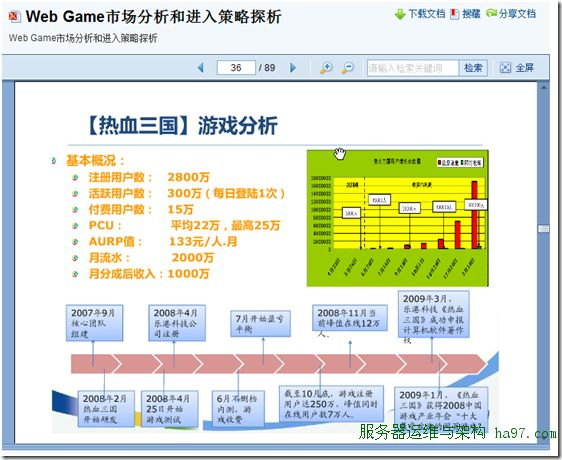
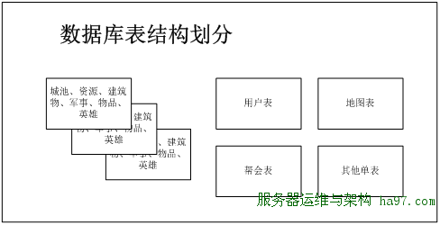
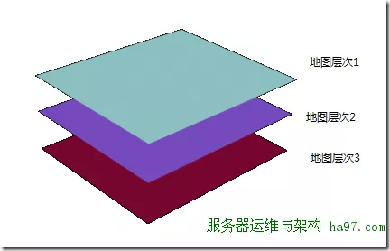
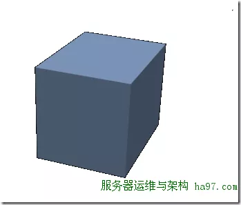
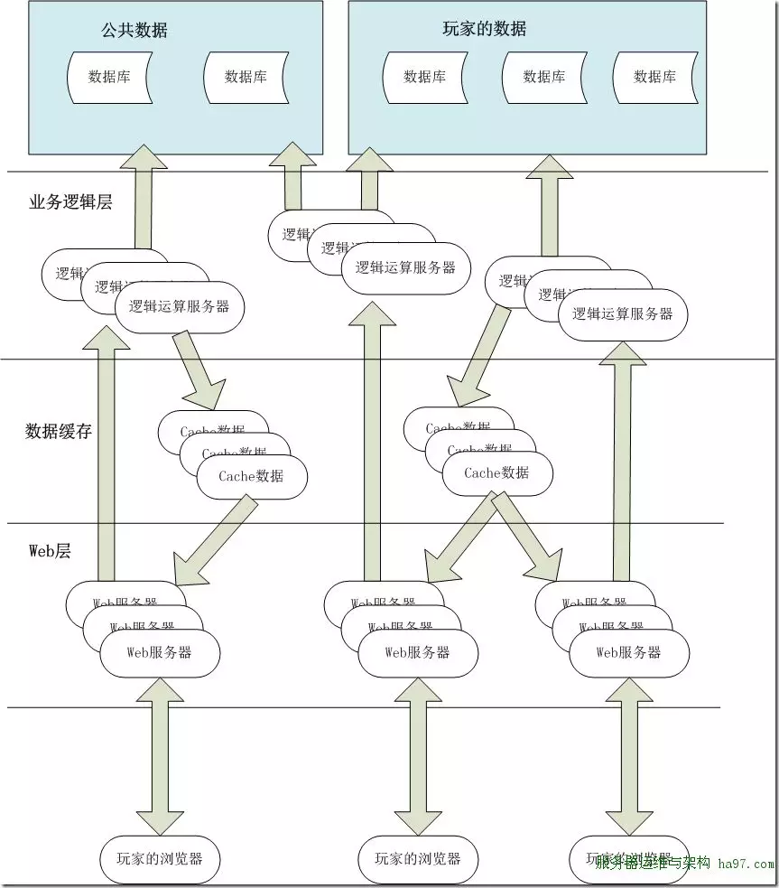

# 10 十万在线的WebGame的数据库设计思路

### 服务器数量预估

**在线人数预估：**
    在项目设计之前，需要先对运营后的服务器人数做一下预估，预计激活人数300w，活跃人数40w，同时在线10w。而服务器的设计极限则在激活人数500w，活跃人数60w，最高同时在线15w。
数据参考：

这里之所以预计这么低的激活人数，是从整个服务器考虑的。《热血三国》是将不同的用户放在不同的服务器里，所以单一服务器的激活人数不会对服务器压力产生太 大影响。而如果将所有玩家统一到一组服务器里，则会导致用户表访问压力过大。偏低的激活人数靠定期清理不活跃账户来实现。

**数据库服务器数量估计：**
服务器在搭配上，一般分为db服务器和web服务器。在这之前的运营中，通常按照1:1的方式来配置数据库和web服务器，而实际情况可以使1:2的配置比 例。不过在单一世界的设计里，单台db服务器肯定无法满足需求。之前设计过一款策略类webgame，在运营时，每秒sql数为在线人数的1~1.5倍。 不过这个测试数据，是在没有钱全面应用缓存的情况的数据，在新系统里，如果全面应用缓存，并采用类似于Memcache的软件提供数据缓存，这样数据库的访问压力将可以得到极大的缓解，因此我们暂定吧每秒sql数暂定为在线人数的1倍。正常情况下数据库的访问压力应该为 10w sql/秒 极限数据应该为15w sql/秒。
数据库使用ms sqlserver 2008，在这之前的一个策略类webgame项目，对一台CPU为 E5520核的服务器上做压力测试，得到的数据如下：

| Sql数    | 5k                  |
| -------- | ------------------- |
| CPU      | 50%                 |
| 硬盘IO   | 0.5M(突发3M）       |
| 网卡流量 | 30Mbit/s(100M网卡） |

按照上面的分析，在正常情况下，我们需要为整个系统提供20台db。Web服务端按照1:1和db做搭配，也将安排20台，预计3个机柜的服务器。

### 数据库表结构划分

**数据库表设计：**
因为要把这么多访问量分担到不同的服务器里，原先的数据库表设计肯定不会合适。初步的想法是根据游戏的逻辑模块，将不同模块的数据库表拆分到各个服务器 里，如果按照上面的服务器预估得到的结论是4~6组服务器，实际上这个方案还是可行的。但如果是20组服务器的话，除非是一台服务器一张数据库表，但这的 设计会造成数据表太分散，在处理事务的时候，会跨多个数据库
策略类webgame一般的主要模块为：建筑物和资源、军事、英雄、物品、帮会、交易、地图。根据这些模块的应用场景，可以将数据库表分为2种类型，一种是属于玩家的数据，另外一种是公共数据。

1. 属于玩家的数据是指玩家个人说拥有的基地、资源、军事单位、物品等数据，它们都是围绕着玩家而产生的。
2. 公共数据则是指由多位玩家共同组合而产生的数据，例如：账户信息、帮会、地图等。

这里划分两种数据的目的是在于他们的数据库表的划分。对于公共数据，则采用单一服务器，单一数据库表处理的方式来处理。例如帮会模块和地图模块就准备分别 用3台服务器来存储各自对应的数据库表。而对于玩家的数据，则根据用户ID采用一定的划分方式，将玩家数据打散到各个服务器里（http://blog.zhaojie.me/2010/03/sharding-by-id-characteristic.html）。

（数据表的结构划分）

**用户表和其单表的设计思路：**
    这里所说的单表是指在逻辑上部队数据库表做拆分，程序在访问时只访问一个数据库。当然这只是逻辑上的单一，根据实际上的访问压力，可以将数据库文件作水平切割分布在不同的文件分区和服务器里。这部分的数据库表设计继续沿用之前的设计方案就可以了。
对于用户信息，帮会信息等数据，实际上插入和更新的频率不会太高，更多的是在查询上，因此这部分的设计重点应该是在缓存上。从以前的资料里得知Memcache服务器每秒可以响应4w次的读请求，用一台Memcache就能处理好用户和帮会信息的缓存处理。

### 地图模块设计思路

**地图模块：**
    地图在传统策略类webgame里都是以平面的方式展示和存储的。地图的移动都是在这个平面上实现。但一般来说，平面地图的设计容量都会有一个上限，一般来 地图多为400*400，他的人数上限就是16w，实际上服务器容纳3~5w人后，整张地图就会显得很拥挤了。如果要想容纳几百万人在线，平面地图的尺寸 就需要扩容得相当大了，这样玩家从地图中间移动到边缘的时间会相当恐怖，因此平面地图在这里不是很合适。因此，地图不能用平面来构造，必须是立体的方法构 造。在这里我设计了两组方案：

**立体平面空间：**

如上图所描述的，立体平面空间，就是把多块地图一层层叠加在一起，形成一个立体的空间。这样如果用户不够，再增加一个新的平面就行。游戏的背景可以根据需要 做调整（例如整个世界是被大海隔开的5片大陆组成，在这5片大陆之外，还有其它的超位面空间，这些空间自身是互不相连的，但是可以通过传送阵进行位面传 送）。这样做的好处是，用户容易理解，以往用户的操作习惯不用改变，毕竟都是在平面地图上战斗。只不过要做跨位面的战斗的移动计算上会存在问题（逻辑上的 问题：是否允许跨大陆的远征军）
用户坐标的表示方法：地图层次、x坐标、y坐标

**数据库设计方案：**
采用了层次结构，只需要增加一个地图层次的字段，这个地图表就能沿用。（参考字段：ID、地图层次、X坐标、y坐标、地图类型、玩家ID、城池ID）
虽然说，加入了一个地图层次的字段能解决地图的表示问题，不过，因为整个游戏世界是单一世界的服务器，当所用地图信息存储到一张表的时候，这数据量就不容小 视。在这之前做webgame项目的时候，整张地图是预先生成好数据库记录的，当有玩家加入游戏的时候，就去修改表里的玩家ID和城池ID。同时因为地图 大小只有400400，整张表也就16w条记录。但如果是要做一个承载500w人的服务器，那地图的尺寸最好是要800800，并且地图的层次为 15~20层，就算最小的15层，按照原先的设计思路，至少需要预先插入960w条记录。
数据量看上去比较夸张，不过对于SqlServer来说也不是处理不了，并且我们还将计划把地图表单独用一台服务器来处理，其压力远小很多。不过也不能不考虑当发生性能瓶颈时的优化处理。优化的方法有两个：

1. 拆分：按照地图层次，把这张表拆分成15~20张表，或者拆分到15~20个数据库里
2. 用疏矩阵存储：地图不预先生成用户的地图信息，而是有玩家加入时才插入数据。这个方案在服务器早期人数比较少时会得到良好的性能效果，但当用户人数达到一定量时，还是避免不了因为记录函数过多而导致而外的开销。

**全立体空间：**

全立体空间就是取消了平面的坐标显示，用户都是在一个三维的立体地图里战斗。好处是地图不用那么分散，在移动计算让很好处理，存在的问题就是游戏在显示的时候，如何表现地图的三维效果会比较困难。
用户坐标的表示方式：x坐标 y坐标 z坐标

**数据库存储方案：**
三维空间的数据库表设计结构可以和上面的表一样，而且也只能采用疏矩阵的方式存储，因为做成三维空间后，可表示的位置的记录数更多了。

**可移动基地在全立体空间的设想：**
早在两年前，看过《超时空要塞F》的时候，就产生了一个想法，就是玩家的基地是可以移动的。玩家的母舰在游戏的过程中，已一定的速度在整个世界里移动。
可以移动体系的设计要点：

1. 用户的基地可移动
2. 用户基地只能拥有一个（武林三国、travian都能建立多个）
3. 空间坐标由x坐标 y坐标 z坐标 组成，并且坐标的值应为小数
4. 同一个坐标里运行多个玩家存在，玩家的航线交叉并不会造成影响（只是为了方便计算减少判断过程）
5. 移动的数据通过后台定时刷新
      a)每个短周期(1~60s)在内存里更新坐标
      b)每个长周期（10~100个短周期时间）将坐标的数据更新的数据库
6. 攻击舰队移动的时间是按照2个阶段来进行的
      a)第一个阶段是从母舰移动到目标坐标的时间
      b)第二个阶段，在快到达时（前60分钟），做一个判断，判断攻击舰队的雷达能否搜索到目标的母舰坐标，能则做攻击坐标的新修正，如果不能则继续按照原先的坐标点移动。以上判断将每隔1分钟做一次，直到到达目标坐标点。如果到达目标坐标点仍然无法视为攻击失败，舰队返回
7. 舰队的移动距离和舰队所携带的能量有关，超过移动范围的坐标，舰队是无法出发的。
8. 部队和母舰应该是可以进行空间跳跃实现长距离的移动，不过空间跳跃需要在制定地点消耗大量的能量才能实现。
9. 默认情况下，母舰移动速度为1格（x、y、z坐标）/天。
10. 默认舰队的雷达查询范围为1格
11. 默认母舰的雷达查询范围为3格

### 玩家数据的数据库设计

**数据库的划分:**
在游戏里数据交互最频繁的还是玩家的数据，他的访问量是一台服务器所不能解决的，因此我们考虑将这部分数据分担到多台服务器里。分担的方法还是做水平切 割，但这次不使用数据库自身的切割功能，而是在应用逻辑层上对数据库进行切割。根据用户的ID取模后写入对应的服务器里。
服务器1
用户ID % 服务器数量 = 0
服务器2
用户ID % 服务器数量 = 1
……
预计每台服务器能提供6k~8k的在线用户访问，预计一共需要16台服务器。考虑到服务器的进一步扩容问题，在初期规划时，建议规划为32个数据库，每台服务器可以先放3~5个数据库，等服务器用户人数上来后，再将数据库拆分到不同的服务器里。

**用户数据库各个模块的设计:**
玩家基地里的建筑物，资源，物品，英雄等相关表，基本上都是玩家独立拥有的，不存在和其他玩家交互的情况，因此这些表的设计继续沿用之前的设计就可以了。

**军事模块:**
军事模块分为部队表，部队创建事件表和战斗事件表。部队表和部队创建事件都是玩家自己内部的事情，把相关的数据和玩家其他数据放在一个数据库里就行了，但是战斗事件表则会设计到两位或者多为玩家则会比较复杂一些。
战斗事件表通常记录的是A玩家（城池）对B玩家（城池）的攻击，里面有攻击部队，到达时间等信息。这个条记录和A放在一起，那么B在查询自己被攻击的记录 时，就需要访问32个数据库，反之，和B放在一起，这A查询自己部队的攻击情况时，就需要遍历32个数据库。如果和用户表一样单独把这张表拿出来，用单独 的一个服务器来处理，则会导致表过大，查询会变慢以及战斗服务器的压力过大。
在之前的项目，战斗服务器处理每场战斗大约是100ms，也就是每秒能处理10场战斗。当然你也许说可以用多线程来进行，但是使用多线程后，战斗事件的顺序可能会点到，影响用户的战术安排。
在这里，我设想，将一个表设计改为2个表：攻击事件表和被攻击事件表。这两个表的结构一样。加入A玩家发起对B玩家的攻击，那么将攻击事件加入A玩家所在 服务器里的攻击事件表，在B玩家服务器里，将数据插入被攻击事件表。然后每个数据库对应一个战斗服务器程序，这个程序在已被攻击事件表为依据，进行攻击计 算。在计算完成后，在同时删除2个表里的数据。

**好友模块:**
好友表本身就可以分为2个表，已某位玩家ID为主键和对应玩家放在同一个数据库里。但是好友申请则需要另外考虑了。如果申请的申请方不可见自己发出的申 请，则只需把申请记录和被申请玩家放在一个数据里。但如果需要可见，则会麻烦一些，一种方法是参考战斗表的设计思路，分为申请表和被申请表。还有一种方法 就是把申请表独立出来，所用用户的申请都放在这张表里。作为我个人，我倾向于后面的一种方法。

**用户邮件表设计:**
用户邮件虽然是属于2位用户之间的交互数据，但从整个系统的角度上来说，用单一的一张表放在单独的服务器里会更简单一些。因为邮件表的内容基本为只读内容，只存在插入和读取功能，并且用户访问的频率不是很高，可以很方便的在逻辑层和web层作缓存。

### 整体架构和总结

**总结：**
虽然对于单一世界的webgame思考了很多，但到最后细化写成文字，也就只有这4篇短文。不是说不想深入细节去讨论，而是发现如果不做一些具体开发就没法深入写下去，因此本系列文章页就在这里点到即止，希望能给大家一些启发。