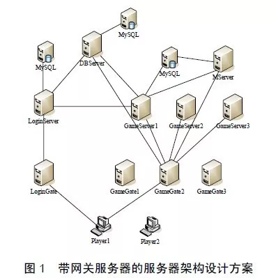
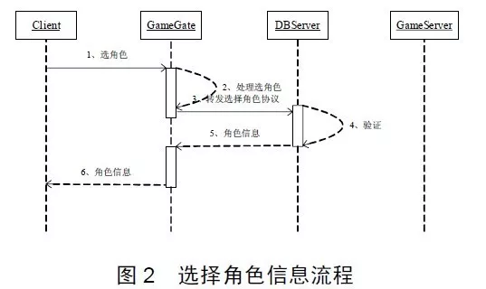
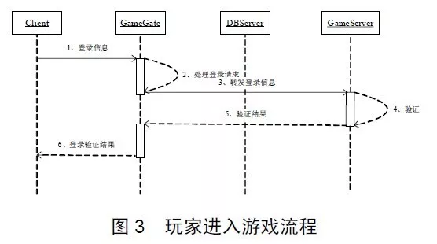

# 11 一种高性能网络游戏服务器架构设计

​    网络游戏的结构分为客户端与服务器端，客户端采用2D绘制引擎或者3D绘制引擎绘制游戏世界的实时画面，服务器端则负责响应所有客户端的连接请求和游戏逻辑处理，并控制所有客户端的游戏画面绘制。客户端与服务器通过网络数据包交互完成每一步游戏逻辑，由于游戏逻辑是由服务器负责处理的，要保证面对海量用户登录时，游戏具有良好的流畅性和用户体验，优秀的服务器架构起到了关键的作用。

### 1 服务器架构设计

**1.1 服务器架构分类**
服务器组的架构一般分为两种：第一种是带网关服务器的服务器架构；第二种是不带网关服务器的服务器架构，这两种方案各有利弊。在给出服务器架构设计之前，先对这两种设计方案进行详细的探讨。 
所谓网关服务器，其实是**Gate服务器**，比如LoginGate、GameGate等。网关服务器的主要职责是将客户端和游戏服务器隔离，客户端程序直接与这些网关服务器通信，并不需要知道具体的游戏服务器内部架构，包括它们的IP、端口、网络通信模型(完成端口或Epoll)等。客户端只与网关服务器相连，通过网关服务器转发数据包间接地与游戏服务器交互。同样地，游戏服务器也不直接和客户端通信，发给客户端的协议都通过网关服务器进行转发。

**1.2 服务器架构设计** 
根据网络游戏的规模和设计的不同，每组服务器中服务器种类和数量是不尽相同的。本文设计出的带网关服务器的服务器组架构如图1所示。

本文将服务器设计成带网关服务器的架构，虽然加大了服务器的设计复杂度，但却带来了以下几点好处：
（1）作为网络**通信的中转站**，负责维护将内网和外网隔离开，使外部无法直接访问内部服务器，保障内网服务器的安全，一定程度上较少外挂的攻击。 
（2）网关服务器负责**解析数据包、加解密、超时处理和一定逻辑处理**，这样可以提前过滤掉错误包和非法数据包。
（3）客户端程序只需建立与网关服务器的连接即可进入游戏，无需与其它游戏服务器同时建立多条连接，节省了客户端和服务器程序的网络资源开销。 
（4）在玩家跳服务器时，不需要断开与网关服务器的连接，玩家数据在不同游戏服务器间的切换是内网切换，切换工作瞬间完成，玩家几乎察觉不到，这保证了游戏的流畅性和良好的用户体验。 

在享受网关服务器带来上述好处的同时，还需注意以下可能导致负面效果的两个情况：**如何避免网关服务器成为高负载情况下的通讯瓶颈问题以及由于网关的单节点故障导致整组服务器无法对外提供服务的问题**。上述两个问题可以采用“多网关” 技术加以解决。顾名思义，“多网关” 就是同时存在多个网关服务器，比如一组服务器可以配置三台GameGate。当负载较大时，可以通过增加网关服务器来增加网关的总体通讯流量，当一台网关服务器宕机时，它只会影响连接到本服务器的客户端，其它客户端不会受到任何影响。 

从图1的服务器架构图可以看出，一组服务器包括LoginGate、LoginServer、GameGate、GameServer、DBServer和MServer等多种服务器。LoginGate和GameGate就是网关服务器，一般一组服务器会配置3台GameGate，因为稳定性对于网络游戏运营来说是至关重要的，而服务器宕机等突发事件是游戏运营中所面临的潜在风险，配置多台服务器可以有效地降低单个服务器宕机带来的风险。另外，配置多台网关服务器也是进行负载均衡的有效手段之一。下面将对各种服务器的主要功能和彼此之间的数据交互做详细解释。

（1）LoginGate 
 LoginGate主要负责在玩家登录时**维护客户端与LoginServer之间的网络连接与通讯**，对LoginServer和客户端的通信数据进行加解密、校验。

（2）LoginServer 

LoginServer主要功能是验证玩家的**账号是否合法**，只有通过验证的账号才能登录游戏。从架构图可以看出， DBServer和GameServer会连接LoginServer。玩家登录基本流程是，客户端发送账号和密码到LoginServer验证，如果验证通过，LoginServer会给玩家分配一个SessionKey，LoginServer会把这个SessionKey发送给客户端、DBServer和GameServer，在后续的选择角色以后进入游戏过程中，DBServer和GameServer将验证SessionKey合法性，如果和客户端携带的SessionKey不一致，将无法成功获取到角色或者进入游戏。

（3）GameGate 

GameGate(GG)主要负责在用户游戏过程中负责**维持GS与客户端之间的网络连接和通讯**，对GS和客户端的通信数据进行加解密和校验，对客户端发往GS的用户数据进行解析，过滤错误包，对客户端发来的一些协议作简单的逻辑处理，其中包括游戏逻辑中的一些超时判断。在用户选择角色过程中负责维持DBServer与客户端之间的网络连接和通讯，对DBServer和客户端的通信数据进行加解密和校验，对客户端发往DBServer的用户数据做简单的分析。维持客户端与MServer之间的网络连接与通讯、加解密、数据转发和简单的逻辑处理等。

（4）GameServer 

GameServer(GS)主要负责**游戏逻辑处理**。网络游戏有庞大世界观背景，绚丽激烈的阵营对抗以及完备的装备和技能体系。目前，网络游戏主要包括任务系统、声望系统、玩家PK、宠物系统、摆摊系统、行会系统、排名系统、副本系统、生产系统和宝石系统等。从软件架构角度来看，这些系统可以看着GS的子系统或模块，它们共同处理整个游戏世界逻辑的运算。游戏逻辑包括角色进入与退出游戏、跳GS以及各种逻辑动作(比如行走、跑动、说话和攻击等)。 

由于整个游戏世界有许多游戏场景，在该架构中一组服务器有3台GS共同负责游戏逻辑处理，每台游戏服务器负责一部分地图的处理，这样不仅降低了单台服务器的负载，而且降低了GS宕机带来的风险。玩家角色信息里会保持玩家上次退出游戏时的地图编号和所在GS编号，这样玩家再次登录时，会进入到上次退出时的GS。 

上面提到过，在验证账号之后，LoginServer会把这个SessionKey 发给GS，当玩家选择角色登录GS时，会把SessionKey一起发给GS，这时GS会验证SessionKey是否与其保存的相一致，不一致的话GS会拒绝玩家进入游戏。MServer的主要负责GS之间的数据转发以及数据广播，另外，一些系统也可以放到MServer上，这样也可以减轻GS的运算压力。

（5）DBServer 

DBServer主要的功能是**缓存玩家角色数据**，保证角色数据能快速的读取和保存。由于角色数据量是比较大的，包括玩家的等级、经验、生命值、魔法值、装备、技能、好友、公会等。如果每次GS获取角色数据都去读数据库，效率必然非常低下，用DBServer缓存角色数据之后，极大地提高了数据请求的响应速度。 

LoginServer会在玩家选组时把SessionKey发给DBServer，当玩家发送获取角色信息协议时会带上这个SessionKey，如果跟DBServer保存的SessionKey不一致，则DBServer会认为玩家不是合法用户，获取角色协议将会失败。另外，玩家选取角色正式进入游戏时，GS会给DBServer发送携带SessionKey的获取角色信息协议，这时DBServer同样会验证SessionKey的合法性。总之，只有客户端、DBServer和GS所保存的SessionKey一致，才能保证协议收到成功反馈。 

与DBServer通讯的服务器主要有GG，GS和LoginServer，DBServer与GG交互的协议主要包括列角色、创建角色、删除角色、恢复角色等，DBServer与GS交互的协议包括读取角色数据、保存角色数据和跳服务器等，DBServer与LoginServer交互的协议主要是用户登录协议，这时候会给DBServer发送SessionKey。 

（6）MServer 
每一个组有一台MServer，主要**负责维持3台GS之间数据的转发和数据广播**。另外一些游戏系统也可能会放到MServer上处理，比如行会系统。

**1.3 服务器交互的主要流程** 
下面给出服务器之间数据通讯的主要流程从这些流程能看出各种服务器之间是如何数据交互和协同工作的。

 

图2的流程说明了，在选角色过程中，客户端会把携带游戏账号和SessionKey的选角色协议发给GG，GG做一些简单处理之后转发给DBServer，DBServer要验证SessionKey的合法性，验证通过之后，DBServer会从角色信息缓冲区里取出该账户的所有角色信息发给客户端。这个过程在客户端的表现是，当选择好服务器组之后，客户端会直接显示该账号下的所有角色，之后就可以选择角色进入游戏了。

图3的流程说明了，在玩家选角色正式进入游戏时，客户端会把携带游戏账号、角色ID和SessionKey的登录协议发给GG，GG做一些简单处理之后转发给GS。GS会验证SessionKey的合法性，验证通过之后，GS会把验证通过的结果发给客户端，同时GS给DBServer发获取角色数据的协议，这些角色数据是一个玩家所有的游戏数据，包括装备、技能等等。

图4的流程说明了，在玩家游戏过程，客户端把逻辑协议(包括走、说话、跑、使用技能等)发给GG，GG完成加解密和简单逻辑处理之后转发给GS，GS负责这些协议的主要
逻辑处理。 

### 2 总结

网络游戏服务器的架构设计已经成为当前网络游戏研究领域的热点，因为**高性能服务器架构设计**是一款网络游戏成功的关键。本文从实际应用出发，提出了一种高性能的服务器架构设计解决方案，并且详细探讨了各种服务器的功能，本文的最后给出了几个服务器之间数据通讯的关键流程，以图文并茂的方式解释各个服务器是如何协同工作的。