# 12 经典游戏服务器端架构概述

## 架构的分析模型

### 一. 讨论的背景

​    现代电子游戏，基本上都会使用一定的网络功能。从验证正版，到多人交互等等，都需要架设一些专用的服务器，以及编写在服务器上的程序。因此，游戏服务器端软件的架构，本质上也是游戏服务器这个特定领域的软件架构。
​    软件架构的分析，可以通过不同的层面入手。比较经典的软件架构描述，包含了以下几种架构：
​    **1.运行时架构**——这种架构关心如何解决运行效率问题，通常以程序进程图、数据流图为表达方式。在大多数开发团队的架构设计文档中，都会包含运行时架构，说明这是一种非常重要的设计方面。这种架构也会显著的影响软件代码的开发效率和部署效率。本文主要讨论的是这种架构。
​    **2.逻辑架构**——这种架构关心软件代码之间的关系，主要目的是为了提高软件应对需求变更的便利性。人们往往会以类图、模块图来表达这种架构。这种架构设计在需要长期运营和重用性高的项目中，有至关重要的作用。因为软件的可扩展性和可重用度基本是由这个方面的设计决定的。特别是在游戏领域，需求变更的频繁程度，在多个互联网产业领域里可以说是最高的。本文会涉及一部分这种架构的内容，但不是本文的讨论重点。
​    **3.物理架构**——关心软件如何部署，以机房、服务器、网络设备为主要描述对象。
​    **4.数据架构**——关心软件涉及的数据结构的设计，对于数据分析挖掘，多系统协作有较大的意义。
​    **5.开发架构**——关心软件开发库之间的关系，以及版本管理、开发工具、编译构建的设计，主要为了提高多人协作开发，以及复杂软件库引用的开发效率。现在流行的集成构建系统就是一种开发架构的理论。

### 二. 游戏服务器架构的要素

​    服务器端软件的本质，是一个会长期运行的程序，并且它还要服务于多个不定时，不定地点的网络请求。所以这类软件的特点是要非常关注稳定性和性能。这类程序如果需要多个协作来提高承载能力，则还要关注部署和扩容的便利性；同时，还需要考虑如何实现某种程度容灾需求。由于多进程协同工作，也带来了开发的复杂度，这也是需要关注的问题。
​    功能约束，是架构设计决定性因素。一个万能的架构，必定是无能的架构。一个优秀的架构，则是正好把握了对应业务领域的核心功能产生的。游戏领域的功能特征，于服务器端系统来说，非常明显的表现为几个功能的需求：
​    **1.对于游戏数据和玩家数据的存储**
​    **2.对玩家客户端进行数据广播**
​    把一部分游戏逻辑在服务器上运算，便于游戏更新内容，以及防止外挂。
​    针对以上的需求特征，在服务器端软件开发上，我们往往会关注软件对电脑内存和CPU的使用，以求在特定业务代码下，能尽量满足承载量和响应延迟的需求。最基本的做法就是“时空转换”，用各种缓存的方式来开发程序，以求在CPU时间和内存空间上取得合适的平衡。在CPU和内存之上，是另外一个约束因素：网卡。网络带宽直接限制了服务器的处理能力，所以游戏服务器架构也必定要考虑这个因素。
​    对于游戏服务器架构设计来说，最重要的是利用游戏产品的需求约束，从而优化出对此特定功能最合适的“时-空”架构。并且最小化对网络带宽的占用。

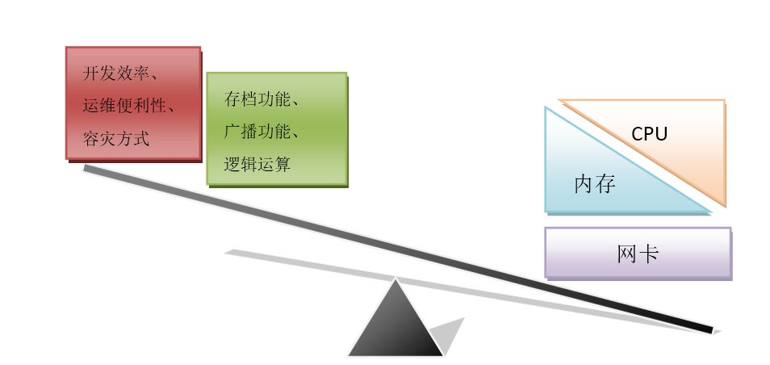

[图：游戏服务器的分析模型]

### 三. 核心的三个架构

​    基于上述的分析模型，对于游戏服务端架构，最重要的三个部分就是，如何使用CPU、内存、网卡的设计：
​    **1.内存架构**：主要决定服务器如何使用内存，以保证尽量少的内存泄漏的可能，以及最大化利用服务器端内存来提高承载量，降低服务延迟。
​    **2.调度架构**：设计如何使用进程、线程、协程这些对于CPU调度的方案。选择同步、异步等不同的编程模型，以提高服务器的稳定性和承载量。同时也要考虑对于开发带来的复杂度问题。现在出现的虚拟化技术，如虚拟机、docker、云服务器等，都为调度架构提供了更多的选择。
​    **3.通信模式**：决定使用何种方式通讯。网络通讯包含有传输层的选择，如TCP/UDP；据表达层的选择，如定义协议；以及应用层的接口设计，如消息队列、事件分发、远程调用等。
​    本文的讨论，也主要是集中于对以上三个架构的分析。

### 四. 游戏服务器模型的进化历程

​    最早的游戏服务器是比较简单的，如UO《网络创世纪》的服务端一张3.5寸软盘就能存下。基本上只是一个广播和存储文件的服务器程序。后来由于国内的外挂、盗版流行，各游戏厂商开始以MUD为模型，建立主要运行逻辑在服务器端的架构。这种架构在MMORPG类产品的不断更新中发扬光大，从而出现了以地图、视野等分布要素设计的分布式游戏服务器。而在另外一个领域，休闲游戏，天然的需要集中超高的在线用户，所以全区型架构开始出现。现代的游戏服务器架构，基本上都希望能结合承载量和扩展性的有点来设计，从而形成了更加丰富多样的形态。
​    本文的讨论主要是选取这些比较典型的游戏服务器模型，分析其底层各种选择的优点和缺点，希望能探讨出更具广泛性，更高开发效率的服务器模型。

## **分服模型**

### 一. 模型描述

​    分服模型是游戏服务器中最典型，也是历久最悠久的模型。其特征是游戏服务器是一个个单独的世界。每个服务器的帐号是独立的，而且只用同一服务器的帐号才能产生线上交互。在早期服务器的承载量达到上限的时候，游戏开发者就通过架设更多的服务器来解决。这样提供了很多个游戏的“平行世界”，让游戏中的人人之间的比较，产生了更多的空间。所以后来以服务器的开放、合并形成了一套成熟的运营手段。一个技术上的选择最后导致了游戏运营方式的模式，是一个非常有趣的现象。

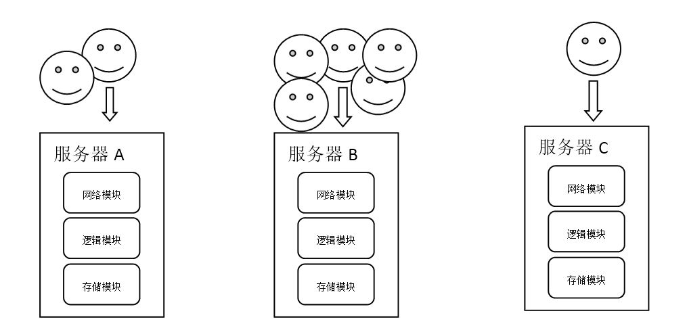

[图：分服模型]

### 二. 调度架构

**1.单进程游戏服务器**
    最简单的游戏服务器只有一个进程，是一个单点。这个进程如果退出，则整个游戏世界消失。在此进程中，由于需要处理并发的客户端的数据包，因此产生了多种选择方法：

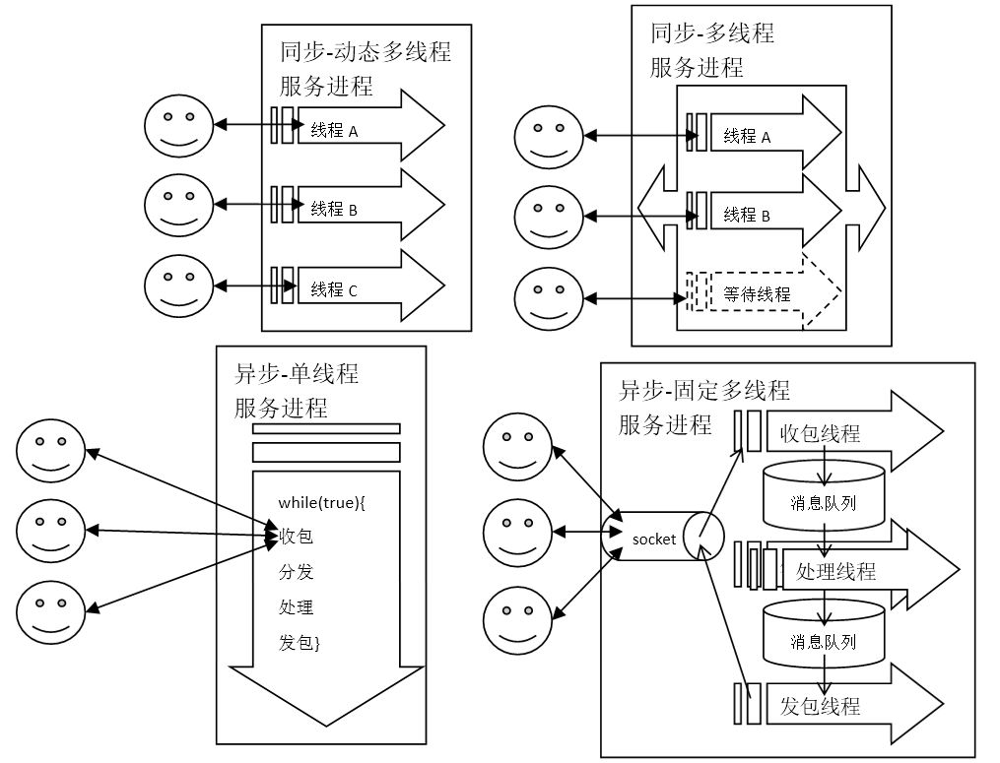
[图：单进程调度模型]

​    **a.同步-动态多线程**：每接收一个用户会话，就建立一个线程。这个用户会话往往就是由客户端的TCP连接来代表，这样每次从socket中调用读取或写出数据包的时候，都可以使用阻塞模式，编码直观而简单。有多少个游戏客户端的连接，就有多少个线程。但是这个方案也有很明显的缺点，就是服务器容易产生大量的线程，这对于内存占用不好控制，同时线程切换也会造成CPU的性能损失。更重要的多线程下对同一块数据的读写，需要处理锁的问题，这可能让代码变的非常复杂，造成各种死锁的BUG，影响服务器的稳定性。
​    **b.同步-多线程池**：为了节约线程的建立和释放，建立了一个线程池。每个用户会话建立的时候，向线程池申请处理线程的使用。在用户会话结束的时候，线程不退出，而是向线程池“释放”对此线程的使用。线程池能很好的控制线程数量，可以防止用户暴涨下对服务器造成的连接冲击，形成一种排队进入的机制。但是线程池本身的实现比较复杂，而“申请”、“施放”线程的调用规则需要严格遵守，否则会出现线程泄露，耗尽线程池。
​    **c.异步-单线程/协程**：在游戏行业中，采用Linux的epoll作为网络API，以期得到高性能，是一个常见的选择。游戏服务器进程中最常见的阻塞调用就是网路IO，因此在采用epoll之后，整个服务器进程就可能变得完全没有阻塞调用，这样只需要一个线程即可。这彻底解决了多线程的锁问题，而且也简化了对于并发编程的难度。但是，“所有调用都不得阻塞”的约束，并不是那么容易遵守的，比如有些数据库的API就是阻塞的；另外单进程单线程只能使用一个CPU，在现在多核多CPU的服务器情况下，不能充分利用CPU资源。异步编程由于是基于“回调”的方式，会导致要定义很多回调函数，并且把一个流程里面的逻辑，分别写在多个不同的回调函数里面，对于代码阅读非常不理。——针对这种编码问题，协程(Coroutine)能较好的帮忙，所以现在比较流行使用异步+协程的组合。不管怎样，异步-单线程模型由于性能好，无需并发思维，依然是现在很多团队的首选。
​    **d.异步-固定多线程**：这是基于异步-单线程模型进化出来的一种模型。这种模型一般有三类线程：主线程、IO线程、逻辑线程。这些线程都在内部以全异步的方式运行，而他们之间通过无锁消息队列通信。
**2.多进程游戏服务器**
​    多进程的游戏服务器系统，最早起源于对于性能问题需求。由于单进程架构下，总会存在承载量的极限，越是复杂的游戏，其单进程承载量就越低，因此开发者们一定要突破进程的限制，才能支撑更复杂的游戏。
​    一旦走上多进程之路，开发者们还发现了多进程系统的其他一些好处：能够利用上多核CPU能力；利用操作系统的工具能更仔细的监控到运行状态、更容易进行容灾处理。多进程系统比较经典的模型是“三层架构”。
​    在多进程架构下，开发者一般倾向于把每个模块的功能，都单独开发成一个进程，然后以使用进程间通信来协调处理完整的逻辑。这种思想是典型的“管道与过滤器”架构模式思想——把每个进程看成是一个过滤器，用户发来的数据包，流经多个过滤器衔接而成的管道，最后被完整的处理完。由于使用了多进程，所以首选使用单进程单线程来构造其中的每个进程。这样对于程序开发来说，结构清晰简单很多，也能获得更高的性能。

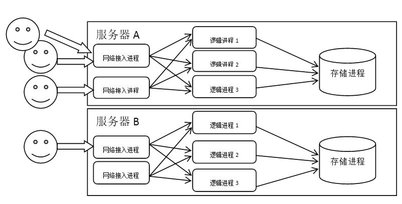
[图:经典的三层模型]

​    尽管有很多好处，但是多进程系统还有一个需要特别注意的问题——数据存储。由于要保证数据的一致性，所以存储进程一般都难以切分成多个进程。就算对关系型数据做分库分表处理，也是非常复杂的，对业务类型有依赖的。而且如果单个逻辑处理进程承载不了，由于其内存中的数据难以分割和同步，开发者很难去平行的扩展某个特定业务逻辑。他们可能会选择把业务逻辑进程做成无状态的，但是这更加加重了存储进程的性能压力，因为每次业务处理都要去存储进程处拉取或写入数据。
​    除了数据的问题，多进程也架构也带来了一系列运维和开发上的问题：首先就是整个系统的部署更为复杂了，因为需要对多个不同类型进程进行连接配置，造成大量的配置文件需要管理；其次是由于进程间通讯很多，所以需要定义的协议也数量庞大，在单进程下一个函数调用解决的问题，在多进程下就要定义一套请求、应答的协议，这造成整个源代码规模的数量级的增大；最后是整个系统被肢解为很多个功能短小的代码片段，如果不了解整体结构，是很难理解一个完整的业务流程是如何被处理的，这让代码的阅读和交接成本巨高无比，特别是在游戏领域，由于业务流程变化非常快，几经修改后的系统，几乎没有人能完全掌握其内容。

### 三. 内存架构

​    由于服务器进程需要长期自动化运行，所以内存使用的稳定是首要大事。在服务器进程中，就算一个触发几率很小的内存泄露，都会积累起来变成严重的运营事故。需要注意的是，不管你的线程和进程结构如何，内存架构都是需要的，除非是Erlang这种不使用堆的函数式语言。
**1.动态内存**
​    在需要的时候申请内存来处理问题，是每个程序员入门的时候必然要学会的技能。但是，如何控制内存释放却是一个大问题。在C/C++语言中，对于堆的控制至关重要。有一些开发者会以树状来规划内存使用，就是一般只new/delete一个主要的类型的对象，其他对象都是此对象的成员（或者指针成员），只要这棵树上所有的对象都管理好自己的成员，就不会出现内存漏洞，整个结构也比较清晰简单。

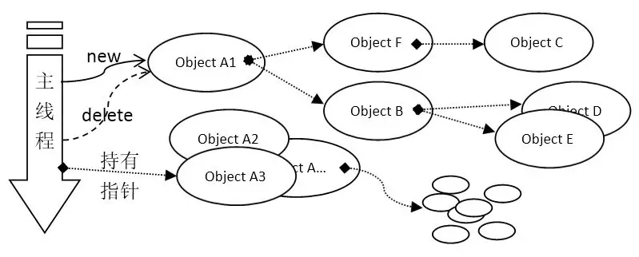

[图:对象树架构]

​    在Objective C语言中，有所谓autorealse的特性，这种特性实际上是一种引用计数的技术。由于能配合在某个调度模型下，所以使用起来会比较简单。同样的思想，有些开发者会使用一些智能指针，配合自己写的框架，在完整的业务逻辑调用后一次性清理相关内存。

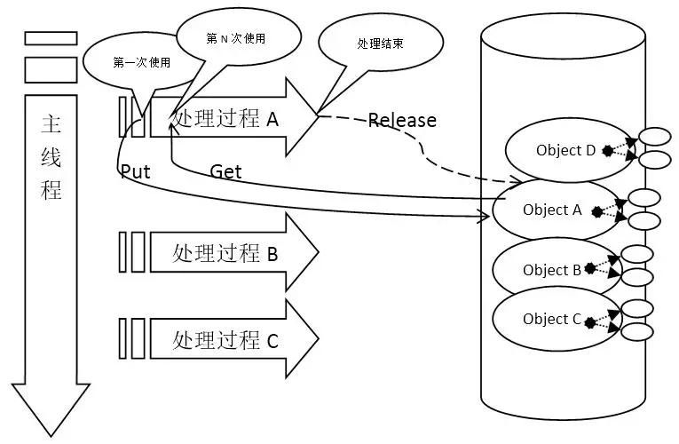

[图:根据业务处理调度管理内存池]

​    在带虚拟机的语言中，最常见的是JAVA，这个问题一般会简单一些，因为有自动垃圾回收机制。但是，JAVA中的容器类型、以及static变量依然是可能造成内存泄露的原因。加上无规划的使用线程，也有可能造成内存的泄露——有些线程不会退出，而且在不断增加，最后耗尽内存。所以这些问题都要求开发者专门针对static变量以及线程结构做统一设计、严格规范。
**2.预分配内存**
​    动态分配内存在小心谨慎的程序员手上，是能发挥很好的效果的。但是游戏业务往往需要用到的数据结构非常多，变化非常大，这导致了内存管理的风险很高。为了比较彻底的解决内存漏洞的问题，很多团队采用了预先分配内存的结构。在服务器启动的时候分配所有的变量，在运行过程中不调用任何new关键字的代码。
​    这样做的好处除了可以有效减少内存漏洞的出现概率，也能降低动态分配内存所消耗的性能。同时由于启动时分配内存，如果硬件资源不够的话，进程就会在启动时失败，而不是像动态分配内存的程序一样，可能在任何一个分配内存的时候崩溃。然而，要获得这些好处，在编码上首先还是要遵循“动态分配架构”中对象树的原则，把一类对象构造为“根”对象，然后用一个内存池来管理这些根对象。而这个内存池能存放的根对象的数目，就是此服务进程的最大承载能力。一切都是在启动的时候决定，非常的稳妥可靠。

[图:预分配内存池]

​    不过这样做，同样有一些缺点：首先是不太好部署，比如你想在某个资源较小的虚拟机上部署一套用来测试，可能一位内没改内存池的大小，导致启动不成功。每次更换环境都需要修改这个配置。其次，是所有的用到的类对象，都要在根节点对象那里有个指针或者引用，否则就可能泄漏内存。由于对于非基本类型的对象，我们一般不喜欢用拷贝的方式来作为函数的参数和返回值，而指针和应用所指向的内存，如果不能new的话，只能是现成的某个对象的成员属性。这回导致程序越复杂，这类的成员属性就越多，这些属性在代码维护是一个不小的负担。
​    要解决以上的缺点，可以修改内存池的实现，为动态增长，但是具备上限的模型，每次从内存池中“获取”对象的时候才new。这样就能避免在小内存机器上启动不了的问题。对于对象属性复杂的问题，一般上需要好好的按面向对象的原则规划代码，做到尽量少用仅仅表示函数参数和返回值的属性，而是主要是记录对象的“业务状态”属性为主，多花点功夫在构建游戏的数据模型上。

### 四. 进程间通讯手段

​    在多进程的系统中，进程间如何通讯是一个至关重要的问题，其性能和使用便利性，直接决定了多进程系统的技术效能。
**1.Socket通讯**
​    TCP/IP协议是一种通用的、跨语言、跨操作系统、跨机器的通讯方案。这也是开发者首先想到的一种手段。在使用上，有使用TCP和UDP两个选择。一般我们倾向在游戏系统中使用TCP，因为游戏数据的逻辑相关性比较强，UDP由于可能存在的丢包和重发处理，在游戏逻辑上的处理一般比较复杂。由于多进程系统的进程间网络一般情况较好，UDP的性能优势不会特别明显。
​    要使用TCP做跨进程通讯，首先就是要写一个TCP Server，做端口监听和连接管理；其次需要对可能用到的通信内容做协议定制；最后是要编写编解码和业务逻辑转发的逻辑。这些都完成了之后，才能真正的开始用来作为进程间通信手段。
​    使用Socket编程的好处是通用性广，你可以用来实现任何的功能，和任何的进程进行协作。但是其缺点也异常明显，就是开发量很大。虽然现在有一些开源组件，可以帮你简化Socket Server的编写工作，简化连接管理和消息分发的处理，但是选择目标建立连接、定制协议编解码这两个工作往往还是要自己去做。游戏的特点是业务逻辑变化很多，导致协议修改的工作量非常大。因此我们除了直接使用TCP/IP socket以外，还有很多其他的方案可以尝试。

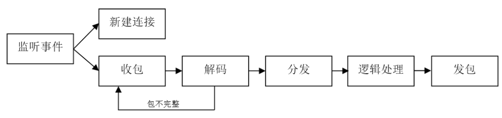
[图:TCP通讯]

**2.消息队列**
    在多进程系统中，如果进程的种类比较多，而且变化比较快，大量编写和配置进程之间的连接是一件非常繁琐的工作，所以开发者就发明了一种简易的通讯方法——消息队列。这种方法的底层还是Socket通讯实现，但是使用者只需要好像投递信件一样，把消息包投递到某个“信箱”，也就是队列里，目标进程则自动不断去“收取”属于自己的“信件”，然后触发业务处理。
    这种模型的好处是非常简单易懂，使用者只需要处理“投递”和“收取”两个操作即可，对于消息也只需要处理“编码”和“解码”两个部分。在J2EE规范中，就有定义一套消息队列的规范，叫JMS，Apache ActiveMQ就是一个应用广泛的实现者。在Linux环境下，我们还可以利用共享内存，来承担消息队列的存储器，这样不但性能很高，而且还不怕进程崩溃导致未处理消息丢失。

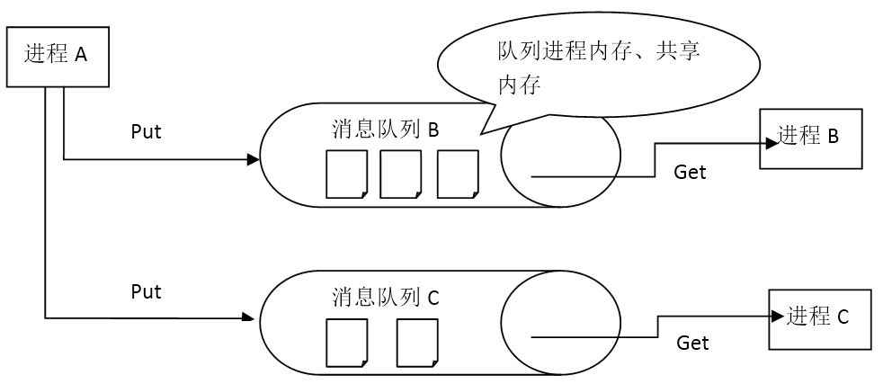

[图:消息队列]

​    需要注意的是，有些开发者缺乏经验，使用了数据库，如MySQL，或者是NFS这类运行效率比较低的媒介作为队列的存储者。这在功能上虽然可以行得通，但是操作一频繁，就难以发挥作用了。如以前有一些手机短信应用系统，就用MySQL来存储“待发送”的短信。
​    消息队列虽然非常好用，但是我们还是要自己对消息进行编解码，并且分发给所需要的处理程序。在消息到处理程序之间，存在着一个转换和对应的工作。由于游戏逻辑的繁多，这种对应工作完全靠手工编码，是比较容易出错的。所以这里还有进一步的改进空间。
**3.远程调用**
​    有一些开发者会希望，在编码的时候完全屏蔽是否跨进程在进行调用，完全可以好像调用本地函数或者本地对象的方法一样。于是诞生了很多远程调用的方案，最经典的有Corba方案，它试图实现能在不同语言的代码直接，实现远程调用。JAVA虚拟机自带了RMI方案的支持，在JAVA进程之间远程调用是比较方便的。在互联网的环境下，还有各种Web Service方案，以HTTP协议作为承载，WSDL作为接口描述。
​    使用远程调用的方案，最大好处是开发的便捷，你只需要写一个函数，就能在任何一个其他进程上对此函数进行调用。这对游戏开发来说，就解决了多进程方案最大的一个开发效率问题。但是这种便捷是有成本的：一般来说，远程调用的性能会稍微差一点，因为需要用一套统一的编解码方案。如果你使用的是C/C++这类静态语言，还需要使用一种IDL语言来先描述这种远程函数的接口。但是这些困难带来的好处，在游戏开发领域还是非常值得的。

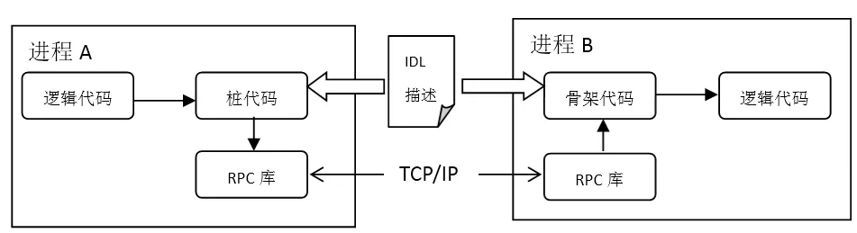
[图:远程调用]

### 五. 容灾和扩容手段

​    在多进程模型中，由于可以采用多台物理服务器来部署服务进程，所以为容灾和扩容提供了基础条件。
​    在单进程模型下，容灾常常使用的热备服务器，依然可以在多进程模型中使用，但是开着一台什么都不做的服务器完全是为了做容灾，多少有点浪费。所以在多进程环境下，我们会启动多个相同功能的服务器进程，在请求的时候，根据某种规则来确定对哪个服务进程发起请求。如果这种规则能规避访问那些“失效”了的服务进程，就自动实现了容灾，如果这个规则还包括了“更新新增服务进程”的逻辑，就可以做到很方便的扩容了。而这两个规则，统一起来就是一条：对服务进程状态的集中保存和更新。
​    为了实现上面的方案，常常会架设一个“目录”服务器进程。这个进程专门负责搜集服务器进程的状态，并且提供查询。ZooKeeper就是实现这种目录服务器的一个优秀工具。

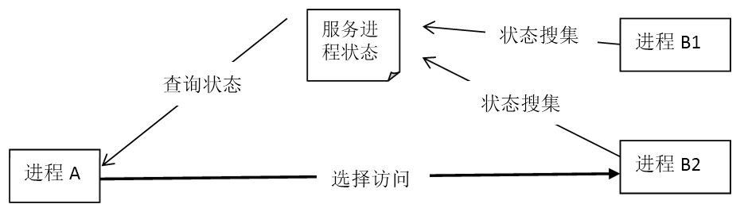
[图:服务器状态管理]

​    尽管用简单的目录服务器可以实现大部分容灾和扩容的需求，但是如果被访问进程的内存中有数据存在，那么问题就比较复杂了。对于容灾来说，新的进程必须要有办法重建那个“失效”了的进程内存中的数据，才可能完成容灾功能；对于扩容功能来说，新加入的进程，也必须能把需要的数据载入到自己的内存中才行，而这些数据，可能已经存在于其他平行的进程中，如何把这部分数据转移过来，是一个比较耗费性能和需要编写相当多代码的工作。——所以一般我们喜欢对“无状态”的进程来做扩容和容灾。

## **全服分线模型**

### 一. 模型描述

​    由于多进程服务器模型的发展，游戏开发者们首先发现，由于游戏业务的特点，那些需要持久化的数据，一般都是玩家的存档，以及一些游戏本身需要用的，在运行期只读的数据。这对于存储进程的分布，提供了非常有利的条件。于是玩家数据可以存放于同一个集群中，可以不再和游戏服务器绑定在一起，因为登录的时候便可根据玩家的ID去存储集群中定位想要存取的存储进程。

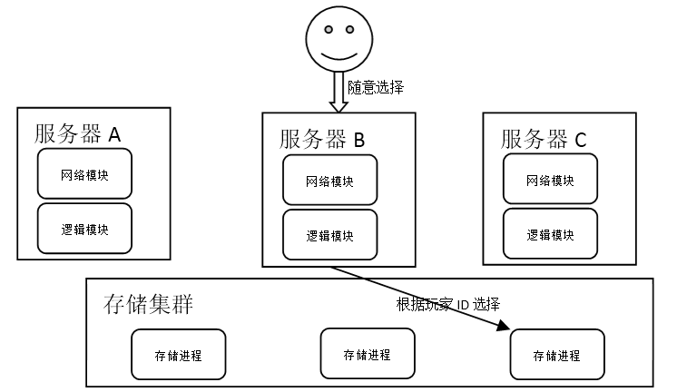

[图-全区分线模型]

### 二. 存储的挑战

**1.需求：扩容和容灾**
    在全区分线模型下，游戏玩家可以随便选择任何一个服务器登录，自己的帐号数据都可以提取出来玩。这种显然比每个服务器重新“练”一个号要省事的多。而且这样也可以和朋友们约定去一个负载较低的服务器一起玩，而不用苦苦等待某一个特定的服务器变得空闲。然而，这些好处所需要付出的代价，是在存储层的分布式设计。这种设计有一个最需要解决的问题，就是游戏服务器系统的扩容和容灾。
    从模型上说，扩容是加入新的服务器，容灾是减掉失效的服务器。这两个操作在无状态的服务器进程上操作，都只是更新一下连接配置表，然后重启一下即可。但是，由于游戏存在大量的状态，包括运行时内存中的状态，以及持久化的存储状态，这就让扩容和容灾需要更多的处理才能成功。
    最普通的情况下，在扩容和容灾的时候，首先需要通知所有玩家下线，把内存中的状态数据写入持久化数据进程；然后根据需要的配置，把持久化数据重新“搬迁”到新的变化后的服务器上。——如果一个游戏有几千万用户，这样的数据搬迁将会耗时非常长，玩家也被迫等待很长的时间才能重新登录游戏。所以在这种模型下，对于数据存储的设计是最关键的地方。
**2.分区分服的关系型数据库**
    我们常常会使用MySQL这种关系型数据库来存放游戏数据。由于SQL能够表述非常复杂的数据操作，这对于游戏数据的一些后期处理有非常好的支持：如客服需要发奖励，需要撤销某些错误的运营数据，需要封停某些特征的玩家……但是，分布式数据库也是最难做分布的。一般来说我们都需要通过某一主键字段做分库和分表；而另外一些如唯一关键字等数据，就需要一些技巧来处理。

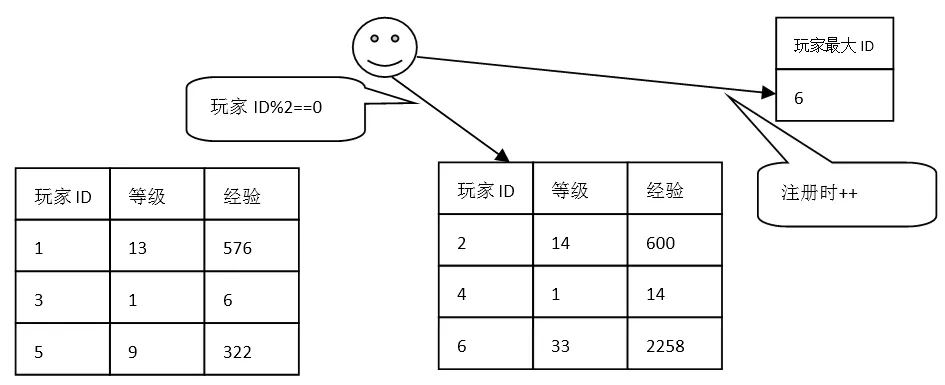

[图-分表分库]

​    以玩家ID作为分表分库是一个非常自然的选择，但是这种方案，往往需要在逻辑代码中，对玩家数据按照自定义的规则，做存储进程的选择。但是如果发现这个分表分库的算法（原则）不符合需求，就需要把大量的数据做搬迁。如上图是按玩家ID做奇偶规则分布到两个表中，一旦需要增加第三台服务器，数据存储的目的服务器编号就变成了id%3，这样就需要把好多数据需要从原来的第一、二台数据库中拷贝出来，非常麻烦。
​    有的开发者会预先建立几十个表（如120个表=2x3x4x5），一开始是全部都放在一个服务器上，然后在增加数据库服务器的时候，把对应的整个表搬迁出来。这样能减轻在搬迁数据的时候造成的复杂度，但还是需要搬迁数据的。最后如果与建立的表还是放不下了，依然还是需要很复杂和耗时的重新拷贝数据。
**3.NoSQL**
​    在很多开发者绞尽脑汁折腾MySQL的时候，NoSQL横空出世了。实际上在很早，目录型存储进程就在DNS等特定领域默默工作了。NoSQL系统最大的好处正是关系型数据库最大的弱点——分布。
​    由于主键只有一个，因此内置的分布功能使用起来非常简便。而且游戏玩家数据，绝大多数的操作都是根据主键来读写的。“自古以来”游戏就有“SL大法”之称，其本质就是对存档数据的简单读、写。在网游的早期版本MUD游戏时代，玩家存档只是简单的放在硬盘的文件上，文件名就是玩家的ID。这些，都说明了游戏中的玩家数据，其读写都是有明显约束的——玩家ID。这和NoSQL简直是天作之合。

[图-NoSQL]

​    NoSQL的确是非常适合用来存储游戏数据。特别是有些服务器如Redis还带有丰富的字段值类型。但是，NoSQL本身往往不带很复杂的容灾热备机制，这是需要额外注意的。而且NoSQL的访问延迟虽然比关系型数据库快很多，但是毕竟要经过一层网络。这对于那些发展了很多年的ORM库来说，缺乏了一个本地缓存的功能。这就导致了NoSQL还不能简单的取代掉所有服务器上的“状态”。而这些正是分布式缓存所希望达成的目标。
**4.分布式缓存**
​    在业界用的比较多的缓存系统有memcached，开发者有时候也会使用诸如Hibernate这样的ROM库提供的cache功能。但是这些缓存系统在使用上往往会有一些限制，最主要的限制是“无法分布式使用”，也就是说缓存系统本身成为性能瓶颈后，就没有办法扩容了。或者在容灾的情景下，缓存系统往往容易变成致命的单点。
​    Orcale公司有一款叫Coherence的产品，就是一种能很好解决以上问题的“能分布式使用”的产品。他利用局域网的组播功能来做节点间的状态同步，同时采用节点互相备份的方案来分布数据。这款产品还使用Map接口来提供功能。这让整个缓存系统既使用简单又功能强大。更重要的是，它能让用户对于数据的存取特性做配置，从而提供用户可接受的数据风险下的更高性能——本地缓存。
​    由于游戏的数据，真正变化频繁的，往往不是“关键”的需要安全保障数据，如玩家的位置、玩家在某次战斗中的HP、子弹怪物的位置等等。而那些非常重要的数据，如等级、装备，又变化的不频繁。这就给了开发者针对数据特性做优化以很大的空间。而且，大部分数据的读、写频率都有典型的不平衡状态。普遍游戏数据都是读多写少。少量的日志、上报数据是写多、几乎不读。
​    对于缓存系统来说，有三个重要的因数决定了在游戏开发中的地位。首先是其使用的便利性，因为游戏的数据结构变化非常频繁，如果要很繁琐的配置数据结构，则不会适合游戏开发；其次是要能提供近似本地内存的性能，由于游戏服务器逻辑基本上都是在频繁的读写某一特定数据块，如玩家位置、经验、HP等等，而且游戏对于处理延迟也有较高的需求（WEB应用在2秒以内都可以忍受，游戏则要求最好能在20ms以内完成）。要能同时满足这两点，是不太容易的。

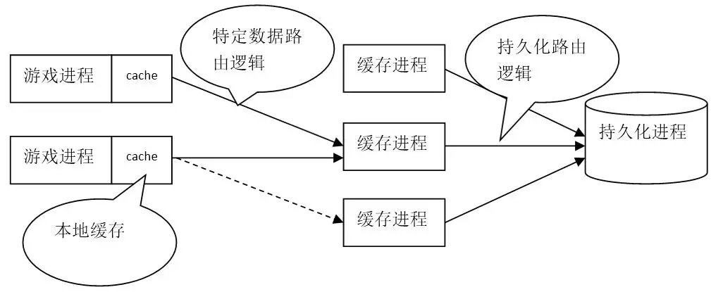

[图-分布式缓存]

**5.集成缓存的NoSQL**
    根据上面的描述，读者应该也会想到，如果数据库系统，或者叫持久化系统，自带了缓存，是否更好呢？这样确实是会更好的，而且特别是对于NOSQL系统来说，能以一些内部的算法策略，来降低前端逻辑开发的复杂程度。一般来说，我们需要对集成缓存的NOSQL系统有以下几方面的需求：首先是冷热数据自动交换，就是对于常用数据有算法来判别其冷热，然后换入到内存以提高存取性；其次是分布式扩容和容灾功能，由于NOSQL是可以知道数据的主关键字的，所以自然就可以自动的去划分数据所在的分段，从而可以自动化的寻找到目标存储位置来做操作；最后是数据导出功能，由于NOSQL支持的查询索引只能是主键，对于很多后台游戏操作来说是不够的，所以一定要能够到处到传统的SQL服务器上去。
    在这方面，有很多产品都做过一定的尝试，比如在Redis或者MangoDB上做插件修改，或者以ORM系统封装MySQL以试图构造这种系统等等。

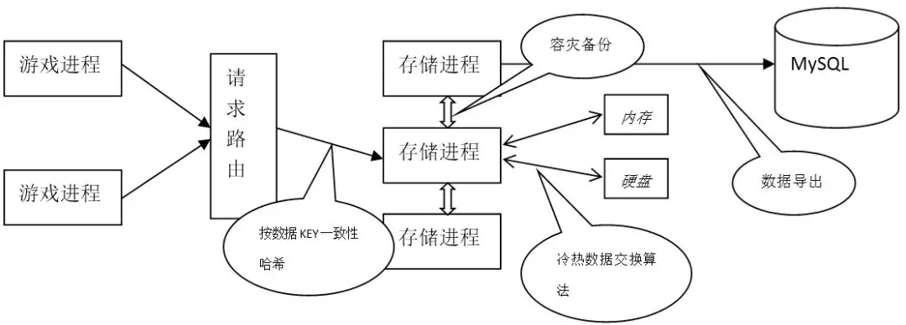

[图-集成缓存的NOSQL]

### 三. 跳线和开房间

**1.开房间型游戏模型**
    在全区分线服务器模型中，最早出现在开房间类型的游戏中。因为海量玩家需要临时聚合到一个个小的在线服务单元上互动。比如一起下棋、打牌等。这类游戏玩法和MMORPG有很大的不同，在于其在线广播单元的不确定性和广播数量很小。
    这一类游戏最重要的是其“游戏大厅”的承载量，每个“游戏房间”受逻辑所限，需要维持和广播的玩家数据是有限的，但是“游戏大厅”需要维持相当高的在线用户数，所以一般来说，这种游戏还是需要做“分服”的。典型的游戏就是《英雄联盟》《穿越火线》这一类游戏了。而“游戏大厅”里面最有挑战性的任务，就是“自动匹配”玩家进入一个“游戏房间”，这需要对所有在线玩家做搜索和过滤。

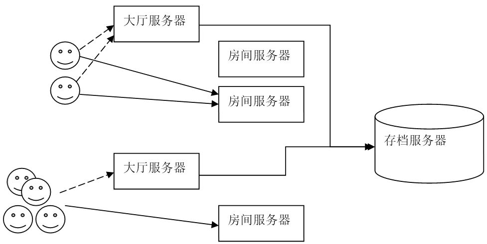
[图-开房间型游戏]

​    这类游戏服务器，玩家先登录“大厅服务器”，然后选择组队游戏的功能，服务器会通知参与的所有游戏客户端，新开一条连接到房间服务器上，这样所有参与的用户就能在房间服务器里进行游戏交互了。
​    由于“大厅服务器”只负责“组队”，所以其承载力会比具体的房间服务器更高一些，但这里仍然会是性能瓶颈。所以一般我们需要尽量减少大厅服务器的功能，比如把登录功能单独列出来、把玩家的购买物品商城功能也单独出来等等。最后，我们也可以直接想办法把“组队”功能也按组队逻辑做一定划分，比如不同的组队玩法、副本类型、组队用户等级等等。
​    虽然这种模型已经可以对很多游戏做很好的承载了，但是在大厅服务器这里依然无法做到平行扩展，原因是玩家的在线数据比较难分布到不同的服务进程上去，而且还带有大量复杂的数据查询逻辑。
**2.专用聊天服务器**

不管是MMORPG还是开房间类游戏，聊天一直都是网络游戏中一个重要的功能。而这个功能在“在线人数”很多，“聊天频道”很多的情况下，会给性能带来非常大的挑战。在很多类型的页游和少部分手机游戏里面，在线聊天甚至是唯一的“带公共状态”的服务。
​    聊天服务处理点对点的聊天，还有群聊。用户可能会添加好友、建立好友群组等各种功能。这些功能，都是和一般的游戏逻辑有一定差别的功能。这些功能往往并不是非常容易实现。很多游戏都期望建立类似腾讯QQ的游戏聊天功能，但是QQ是一整个公司在做开发，要用仅仅一个游戏团队做成这么完整的功能，是有一定困难的。
​    因此游戏开发者们常常会专门的针对聊天功能来开发一系列的服务进程，以便能让游戏的聊天功能独立出来，做到负载分流和代码重用的逻辑。很多网游系统，其聊天系统从客户端来说就是和主游戏进程分开的。
​    聊天服务器的本质是对客户端数据做广播，从而让玩家可以交互，所以有很多游戏开发者也直接拿聊天服务器来做棋牌游戏的房间服务器，或者反过来用。由于在游戏“分服”里面单独部署了聊天服务器，这类服务器也往往被用来承担做“跨服玩法”的进程。比如跨服团队战、跨服副本等等。不管这些服务器最终叫什么名字，实际上他们承担的主要功能还是广播，而且是运行玩家“二次登录”的广播服务器。以至于后来，有部分游戏直接全部都用聊天服务器来代替原始的“游戏服务器”，这样还能实现一个叫“跳线”的功能，也就是玩家从一个“在线环境”跳到另外一个“在线环境”去。——这些都是对于“广播”功能的灵活运用。

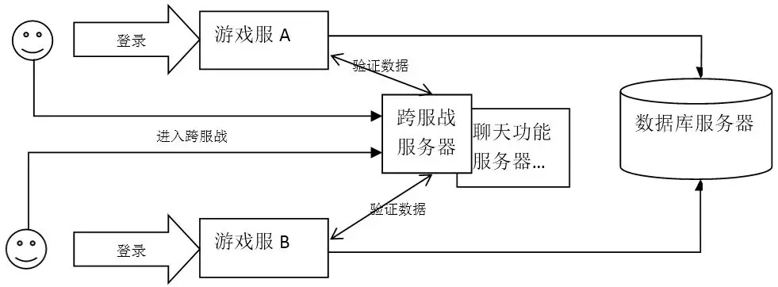

[图-专用聊天服务器]

## **全服全线模型**

尽管分服的游戏模型已经运营了很多年，但是有一些游戏运营商还是希望能让尽量多的玩家一起玩。因为网游的人气越活跃，产生的交互越多，游戏的乐趣也可能越多。这一点最突出表现在棋牌类网游上。如联众、QQ游戏这类产品，无不是希望更多玩家能同时在线接入一个“大”服务器，从而找到可以一起玩的伙伴。在手游时代，由于手机本身在线时间不稳定，所以想要和朋友一起玩本来就比较困难，如果再以“服务器”划分区域，交互的乐趣就更少了，所以同样也呼唤这一个“大”服务器，能容纳下所有此款游戏的玩家。因此，开发者们在以前积累的分服模型和分线模型基础上，开发出满足海量在线互动需求的一系列游戏服务器模型——全服全线模型。

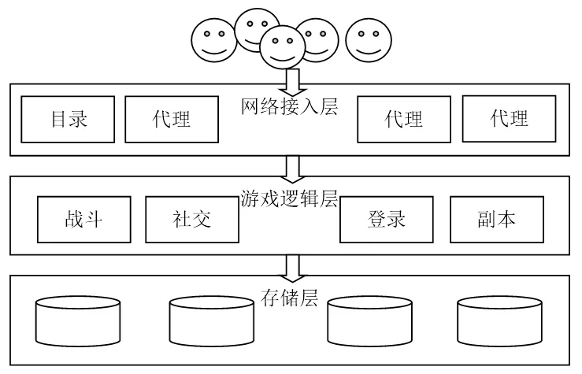

[图-全服全线模型]

### 一. 服务进程的组织

**1. 静态配置**
    全服全线模型的本质是一个各种不同功能进程组成的分布式系统，因此这些进程间的关系是在运维部署期间必须关注的信息。最简单的处理方法，就是预先规划出具体的进程数量、以及进程部署的物理位置，然后通过一套配置文件来描述这个规划的内容。对于每个进程，需要配置列明每个进程的pid文件位置；内部通讯用的地址，如IP+端口或者消息队列ID；启动和停止脚本路径；日志路径等等……由于有了一套这样的配置文件，我们还可以编写工具对所有的这些进程进行监控和操作批量启停。

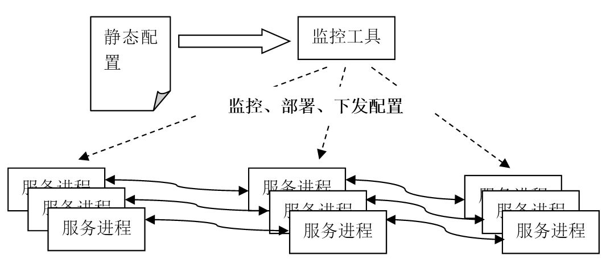 

[图-静态配置]

​    虽然我们可以以静态配置为基础做很丰富的管理工具，但是这种做法还是有可以改进的空间：每次扩容、更换故障服务器或者搬迁服务器（这在运营中很常见），我们都必须手工修改静态配置数据，由于是人工操作，就总会产生很多错误，根据个人经验，游戏运营事故中的70%以上，是跟运维操作有关；由于整个分布式系统被切分成大量的进程，对于新进入此项目的程序员来说，要完整的理解这个系统，需要在思想上跨越层层阻隔：每个进程的功能、它们部署的关联、每个进程间的协议报的含义、每个业务流程具体的跨进程过程……这要花费很多时间才能搞明白的。而且大部分游戏的这种架构并不统一，每个游戏都可能需要重新理解一次，知识无法重用；在开发测试上，由于分布式系统的复杂性，要多搭几个开发、测试环境也是很费时间的，以至于这项工作甚至要安排专人来负责，这对于小型游戏开发团队来说几乎是不可承担的成本。因此我们还需要一些更加自动化，更加容易理解的全服全线游戏服务器模型。
**2.基于中心点的动态组织**
​    SOA架构模式是业界一个比较经典的分布式软件架构模式，这个架构的特点是能动态的组织一个非常复杂的分布式服务系统。这个系统可以包含提供各种各样供的服务程序，而这些服务程序都以同一个标准接口来使用，并且服务自己会注册自己到集群中，以便请求方能找到自己。这种架构使用Web Serivce来作为服务接口标准，通过发布WSDL来提供接口API，这极大的降低了开发者对这些服务的使用成本。在游戏领域，服务器端提供的功能程序，实际上也是非常多样的，如果要构建一个分布式的系统，在这个方面是非常适合SOA架构的思想的；然而，游戏却很少使用HTTP协议及其之上的Web Service做通讯层，因为这个协议性能太低。不过，类似SOA的，基于中心节点的动态组织的服务管理思路，却依然适用。

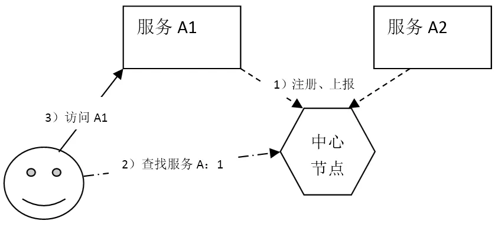
[图-基于中心点的动态组织]

​    一般来说我们会使用一组目录服务器来充当“中心点”，代表整个集群。开源产品中最好的产品就是ZooKeeper了。当然也有一些开发者自己编写这样的目录服务器。由于每个服务进程会自己上报负载和状态，所以每个进程只需要配置自己提供的服务即可：服务名字、服务接口。对于请求方来说，一般都可以预先编写目标服务接口的类库，用来编程，有些项目还使用RPC功能，使用IDL语言配置直接生成这些接口类库。当需要请求的时候，执行“名字查找”-“路由选择”-“发起请求”就可以完成整个过程。由于有“查找”-“路由”的过程，所以如果目标服务故障、或者新增了服务提供者，请求方就能自动获得这些信息，从而达到自动动态扩容或容灾的效果，这些都是无需专门去做配置的。
**3.服务化与云**
​    尽管动态组织的架构有如此多优点，但是开发者还是需要自己部署和维护中心节点。对于一些常用的服务，如网络代理服务、数据存储服务，用户还是要自己去安装，以及想办法接入到这套体系中去。这对于开发、测试还是有一定的运维工作压力的。于是一些开发团队就把这类工作集中起来，预先部署一套大的集群中心系统，所有开发者都直接使用，而不是自己去安装部署，这就成为了服务化，或者云服务。

[图-服务化、云]

​    使用专人维护的服务化集群确实是一个轻松愉快的过程。但是游戏开发和运营过程中，往往需要多套环境，如各个不同版本的测试环境、给不同运营平台搭建的环境、海外运营的环境等等……这些环境会大大增加维护服务化集群的工作量，对于解决这个问题，建立高度自动化运维的私有云，成为一个需要解决的问题放上了桌面。提高集群的运维效率，降低工作复杂程度，需要一些特别的技术，而虚拟化技术正式解决这些问题的最新突破。

### 二. 提高开发效率所用的结构

**1.使用RPC提高网络接口编写效率**
    在分布式系统中，如果所有的接口都需要自己定义数据协议报来做交互，这个网络编程的工作量将会非常的大，因为对于一个普通的通信接口来说，至少包括了：一个请求包结构、一个响应包结构、四段代码，包括请求响应包的编码和解码、一个接收数据做分发的代码分支、一个发送回应的调用。由于分布式的游戏服务器进程非常多，一个类似登录这样的操作，可能需要历经三、四个进程的合作处理，这就导致了接近十个数据结构的定义和无数段类似的代码。而这些代码，如果在单进程的环境下，仅仅只是三、四个函数定义而已。
    因此很多开发者投入很大精力，让网络通信的编写过程，尽量简化成类似函数的编写一样。这就是前文所述的远程调用的方法。在全区全线的游戏中，如果是比较重度的游戏，采用RPC方式做开发，会大大降低开发的复杂程度。当然也有一些比较轻度的游戏，还是采用传统的协议包编解码、分发逻辑调用的做法。
**2.简化数据处理**
    在分布式系统中，对于避免单点、容灾、扩容中最复杂的问题，就是在内存中的数据。由于内存中有游戏业务的数据，所以一般我们不敢随便停止进程，也难以把一个进程的服务替换为另外一个进程。然而，游戏数据对比其他业务，还是非常有特点的：
    **a**.写入越不频繁的数据，价值越高。比如过关、升级、获得重要装备。
    **b**.大量数据都是读非常频繁，而写非常不频繁的，如玩家的等级、经验。
    **c**.大量写入频繁的数据，实际上是不太重要，可以有一定损失，比如玩家位置，在某个关卡内的HP/MP等……
    **d**.因此，只要我们能按数据的特性，对游戏中需要处理的数据做一定分类，就能很好的解决分布式中的这些问题。
    **e**.首先我们要对数据的分布做规划，一般来说采用按玩家ID做分布，这样能让服务进程中内存的数据缓存高度命中。常用的手法有用一致性哈希来选择路由，调用相关的服务进程。
    **f**.其次对于读频繁而写不频繁的数据，我们采用读缓存而写不缓存的策略。每个服务进程都保留其读缓存数据，如果需要扩容和容灾，仅仅需要修改服务访问的路由即可。
    **g**.再次对于读不频繁而写频繁的数据，我们采用写缓存和读不缓存的策略。由于这些数据丢失掉一些是不要紧的，所以容灾处理就直接忽略即可，对于扩容，只需要对所有服务进程都做一次回写即可。
    **h**.最后，有一些数据是读和写都频繁的数据，比如玩家位置，HP/MP这类，我们采用读写都缓存，由于数据重要性不高，只要我们多分几个服务进程即可降低故障时影响的范围；在扩容的时候调用全节点清理读缓存和回写脏数据即可。
    在和持久化设备打交道的时候，传统的ORM类库往往能帮我们把数据存入关系型数据库，然而，使用一个自带数据热备的NOSQL也是很好的选择。因为这样能节省大量的分库分表逻辑代码。
**3.自动化部署集群环境**
    最新的虚拟化技术给分布式系统提供能更好的部署手段，以Docker为标志的虚拟化平台，可以很好的提高服务化集群的管理。我们可以把每个服务进程打包成一个映像文件，放入Docker虚拟机中运行，也可以把一组互相关联的服务进程打包运行。这些环境问题都由Docker处理了。
    但是，我们同时需要注意的是，如果我们的进程的资源是静态分配的（前文提到），在Docker的虚拟机中可能因为内存不足等原因直接无法启动。这就需要我们把完全静态分配资源的程序，修改为有资源限制，但是动态分配的程序。这样我们才能在任何可以部署Docker的机器上部署我们的游戏服务器。

### 三. 分布式难点：状态同步

**1.分布式接入层**
    一般来说，我们全线服务器系统碰到的第一个问题，就是大量并发的网络请求。特别是大量玩家都在一起交互，产生了大量由于状态同步而需要广播的数据包。这些网络请求的处理，显然应该独立出来成为单独的进程。同时这些网络接入进程，还应该是一个集群中的成员。这就诞生了分布式接入服务层。
    这些网路接入进程的第一个功能，就是把并发的连接，代理成为后端一个串行的连接，这可以让后端服务进程的处理逻辑更简单，而且网络处理消耗变得更小。
    其次，网络接入进程需要支持广播功能。如果只是普通的广播实现，很多人会需要拷贝很多次需要广播的内容，然后挨个对Socket做发送。这其实是一个消耗很高的操作。而单独的网络接入进程，可以善用“零拷贝”等技术，大大降低广播的性能开销。而且还可以通过多个进程一起做广播操作，以达到更大的在线同步区域。
    最后，网络接入进程需要支持一些额外的有用功能，包括通讯的加密、压缩、流量控制、过载保护等等。有些团队还把用户的登录鉴权也加入网络接入功能中。

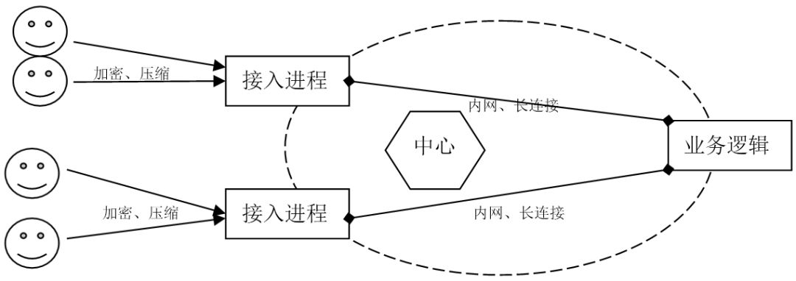)
[图-分布式接入层]

**2.使用P2P**
    网络状态同步产生的广播请求中，绝大多数都是客户端之间的网络状态，因此我们在可以使用P2P的客户端之间，直接建立P2P的UDP数据连接，会比通过服务器转发降低非常多的负载。在一些如赛车、音乐、武打类型的著名游戏中，都有使用P2P技术。而接入进程天然的就是一个P2P撮合服务器。
    有些游戏为了进一步降低延迟，还对所有的玩家状态，只同步输入动作，以及死亡、技能等重要状态，让怪物和一般状态通过计算获得，这样就更能节省玩家的带宽，提高及时性。加上一些动作预测技术，在客户端上能表现的非常流畅。

## **展望**

### 一. 可重用的游戏业务模版

​    游戏服务端的各种架构中，以前往往比较关注那些非功能性的需求：容灾性、扩容、承载量，延迟。而在现在手游时代，开发效率越来越重要，有些团队甚至不设专门的服务器端程序员。因此游戏服务端架构应该更多的关注业务开发的效率。
​    现代游戏中，只要是带RPG元素的，角色系统、物品系统、技能系统、任务系统就都会具备，而且都有一批比较稳定的核心逻辑。只要是能在线交互的，就有好友系统、邮件系统、聊天系统、公会系统等。另外商城系统、活动系统、公告系统更是每个游戏都似乎要重复发明的轮子。
​    游戏的后端应用也有很多可重用的部分，比如客服系统、数据统计平台、官网数据接口等等。这些在游戏服务端框架中往往是最后再添加进去的。
​    如果把以上的问题都统一考虑起来，我们实际上是可以在一个稳定的底层架构上，构造出一整套常用的游戏业务逻辑模板，用来减少游戏领域的业务代码开发。所以这样一套可以运行各种业务逻辑模版的底层架构，正是游戏服务端架构发展的方向。

### 二. 动态资源调度的PaaS云

​    现在有的团队已经在搭建自己的Docker云，这可以让游戏服务器在虚拟云上动态的生长，从而达到真正的动态扩容和动态容灾。加上如果游戏服务器不再是一个个服务进程，而是真正意义上的一个个服务，可以动态的加入或者离开云环境，那么这就是一个游戏领域的PaaS系统。我热切的希望能看到，可以用一套SDK，开发或重用那些成型的业务模版，然后动态注册到服务云中就能运行，这样一种游戏服务器架构。