# 13 游戏跨服架构进化之路

 江贵龙，游戏行业从业8年，历任多款游戏项目服务器主程，服务器负责人。 关注游戏服务器架构及优化，监控预警，智能运维，数据统计分析等。

### 1.背景

​    虽然游戏市场竞争激烈，产品格局变动较大,但游戏产业一直处于稳步增长阶段，无论是在端游，页游，手游还是已经初露端倪的H5游戏。可以预见，游戏类型中，MMOARPG游戏仍然会是引领市场的主流趋势，贡献着大部分流水，市场上也仍然在不断涌现精品。研发团队对MMO游戏的探索从来未间断过,从付费模式的改变，到题材多元化，次时代的视觉效果，更成熟的玩法及数值体系，本文主要针对跨服玩法上的探索和实现做一些思考和分析。
​    根据2016年《中国游戏产业报告》数据显示，随着游戏人口红利逐渐消失，获取用户的成本居高不下，几年来至少翻了十倍以上，目前平均导量成本页游为10~15元/人，手游在15~20元/人，其中IOS上成本30~50元/人,“洗”用户模式的效果正在变得微弱，用户流失严重。让我们先来看看滚服玩法的局限性，滚服洗量模式下存在着如下的弊端：


### 2.设计目标

​    在上述背景下，一款长留存，低流失的精品游戏就成了平台方，渠道商，研发方追捧的目标，设想一下，如果让所有服务器玩家通过“跨域体系”实现自由畅通交互，在此基础上，玩家可以体验到前所未有的“国战系统”——7×24小时昼夜不停服的国家战争，随时开战；突破单地图承载容量极限的国战对决，带来真正万人国战的刺激体验，形成全区玩家能够互动的游戏社交环境。依托平台运营来打造一款真正意义上摆脱传统游戏运营模式的全新产品，为平台吸纳足够的市场份额，大幅降低流失率。
​    我们的蓝图是开创“1=1000”模式，让所有玩家，身处一个服务器却如同同时存在于所有服务器，这种打破服务器屏障的设定，杜绝了游戏出现“被迫滚服”现象出现，玩家不用再担心鬼服人烟稀少，不用担心交易所一无所有，所有的数据共享，让玩家轻松Hold住全世界。


### 3.进化过程

​    项目组那时面临的现状是游戏各种档期计划、宣传推广安排都已经就绪，两个月后该独代项目要在腾讯平台按时上线，开发不能因引入跨服机制而导致所有完成度100%的功能都要去分别去增加跨服的支持，而技术人员在跨服功能开发这块经验的积累上也不充分。
技术小组分析了时下项目的现状，跨服业务需求及现有的框架结构，明确了几点原则： 
​    1.为了实现跨服，游戏代码从底层架构到上层业务逻辑的代码改动成本尽量降低
​    2.业务逻辑里尽量少关心或者不用关心是否在本服或者跨服，降低开发人员的跨服功能开发复杂度，提高开发的效率，缩短开发周期。
那么，我们需要解决哪些技术疑点呢？

**3.1 客户端直连还是服务器转发**
    a)如果直连，那么，跨服玩法时客户端要维持两个连接，在跨服里，要模拟玩家登陆，绑定session的过程，游戏服和跨服两边要同时维护两份玩家数据，如何做到数据的同步？跨服要暴露给玩家，需要有公网访问IP和端口。对客户端连接管理来说较复杂。
    b)如果通过大区服务器消息转发，那么，服务器之间做RPC通信，连接管理，消息需额外做一步跳转，性能能否满足？跨不跨服，对于客户端来说透明，跨服隐藏在大区之后，更加安全，不需再浪费公网IP和端口。
    综合考虑了下，采用了B方案。

**3.1.1 RPC框架设计需求**
    那么，我们需要先准备一套高性能轻量级的RPC框架。
    业界有很多典型的RPC框架，比如Motan、Thrift、gRPC、Hessian、Hprose，Wildfly,Dubbo,DubboX，为什么我们还要重复造轮子呢？综合考虑了下，框架要满足以下几点业务需求:
    1.该框架要简单、易用、支持高并发的跨服请求；
    2.根据现有的游戏服务器框架，会有很多定制化的场景；
    3.通过NIO TCP长连接获取服务，但无需跨语言的需求；
    4.支持同步请求，异步请求，异步回调CallBack；
    5.要有服务发现的功能，要有Failfast能力；
    6.具备负载均衡，分组等路由策略；
    基于有以上的诉求，结合团队以前的开发经验，于是就决定自主研发。
    我们选用的技术栈有 Netty、Apache Commons Pool、Redis等。
    框架分为服务提供方(RPC Server)、服务调用方(RPC Client)、注册中心(Registry)三个角色，基于Redis为服务注册中心，通过其Pub/Sub实现服务动态的注册和发现。Server 端会在服务初始化时向Registry 注册声明所提供的服务；Client 向 Registry 订阅到具体提供服务的 Server 列表，根据需要与相关的 Server 建立连接，进行 RPC 服务调用。同时，Client 通过 Registry 感知 Server 的状态变更。三者的交互关系如右图： 


图1、RPC框架三者关系

**3.1.2 RPC请求的有序性**
    连接池在设计过程中，比较重要的是要考虑请求的顺序性，也就是先请求的先完成。
    如果玩家的跨服请求通过不同的RPC连接并发执行，就有可能单个玩家请求因错序而导致逻辑矛盾，比如玩家移动，见图2：

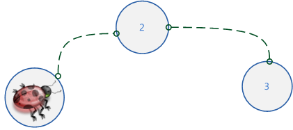


图2、玩家移动

​    玩家移动是很频繁的，如果A请求让玩家从位置1移动到位置2，B请求从位置2移动到位置3，有可能B请求先被跨服接收处理，这就会产生逻辑问题。 
​    那么，如何做到请求的有序性呢？其本质是让同一份数据的访问能串行化，方法就是让同一个玩家的跨服请求通过同一条RPC连接执行，加上逻辑上的有效性验证，如图3所示：

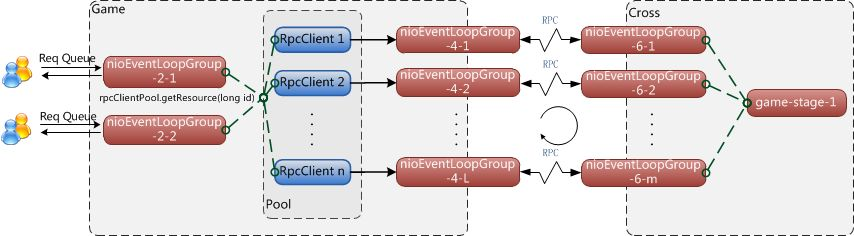

**3.1.3 同步RPC实现细节**
    限于篇幅，这里只讲同步请求的RPC连接池实现。
    同步请求的时序图如图4：

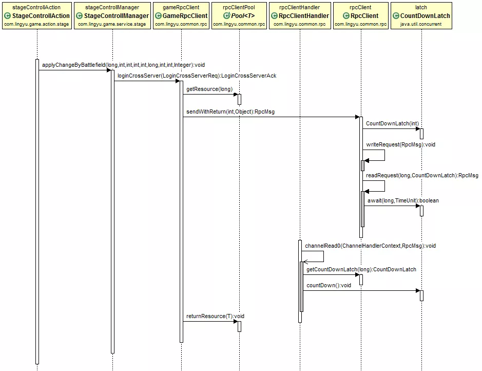

上图为进入跨服战场的一次同步请求,场景切换控制器StageControllAction发起进入跨服战场的请求applyChangeByBattlefield(),场景管理器StageControllManager首先要调用登录跨服的RPC请求GameRpcClient.loginCrossServer(LoginCrossServerReq)，
​    跨服RPC请求的工作流是这样的:

```
public LoginCrossServerAck loginCrossServer(LoginCrossServerReqreq)throws ServiceException {
    //从连接池中获取一个连接
    RpcClient rpcClient = rpcClientPool.getResource(req.getRoleId());
    try {
        //发起一次同步RPC请求
        RpcMsg msg = rpcClient.sendWithReturn(MsgType.RPC_LoginCrossServerReq, req);
        return JSON.parseObject(msg.getContent(), LoginCrossServerAck.class);
    } finally {
        //将连接放回连接池中
        rpcClientPool.returnResource(rpcClient);
    }
}
```

​    该请求第一步先从连接池里获取一个连接RpcClient rpcClient = rpcClientPool.getResource(roleId),然后发起一个同步请求RpcClient.sendWithReturn(),等待直到结果返回，然后把资源归还连接池。
​    我们重点来看看sendWithReturn代码实现:

```
private ChannelsocketChannel;
private Map<Long, CountDownLatch>watchDog = new ConcurrentHashMap<>();
private Map<Long, RpcMsg>responses = new ConcurrentHashMap<>();
/**同步请求*/
public RpcMsg sendWithReturn(intmsgType, Objectmsg) throws ServiceException {
    RpcMsg rpcMsg = RpcMsg.newBuilder().setServer(false).setSync(true).setSeqId(buildSeqId()).        setTimestamp(System.nanoTime()).setType(msgType).setContent(JSON.toJSONString(msg)).build();
    //创建一把共享锁
    CountDownLatch latch = new CountDownLatch(1);
    watchDog.put(rpcMsg.getSeqId(), latch);
    writeRequest(rpcMsg);
    return readRequest(rpcMsg.getSeqId(), latch);
}

/**发送消息*/
publicvoid writeRequest(RpcMsgmsg)throws ServiceException {
    if (channel.isActive()) {
        channel.writeAndFlush(msg);
    }
}

/**阻塞等待返回*/
protected RpcMsg readRequest(longseqId, CountDownLatchlatch)throws ServiceException {
    try {
        //锁等待
        if (timeout <= 0) {
            //无限等待，直到有返回
            latch.await();
        }
        else {
            //超时等待
            latch.await(timeout, TimeUnit.MILLISECONDS);
        }
    }
    catch (InterruptedExceptione) {
        throw new ServiceException(e);
    }
    //解锁后或者超时后继续往下走
    watchDog.remove(seqId);
    RpcMsg response = responses.remove(seqId);
    if (response == null) {
        throw new ServiceException("read request timeout");
    }
    return response;
}

//获得锁
CountDownLatch latch = rpcClient.getCountDownLatch(msg.getSeqId());
if (latch != null) {
    rpcClient.setResponse(msg.getSeqId(), msg);
    //解锁  
    latch.countDown();
}
```

​    测试场景为分别在连接数在1,8,并发数1,8，数据大小在22byte，94byte，2504byte情况下，做测试，消息同步传输，原样返回,以下是针对同步请求压力测试的结果(取均值):

| 连接数 | 并发数 | 请求类型 | 数据大小（bytes） | 平均TPS | 平均响应时间(ms) |
| ------ | ------ | -------- | ----------------- | ------- | ---------------- |
| 1      | 1      | Sync     | 22                | 5917    | 0.169            |
| 8      | 1      | Sync     | 22                | 6849    | 0.146            |
| 8      | 8      | Sync     | 22                | 25125   | 0.0398           |
| 8      | 8      | Sync     | 94                | 20790   | 0.0481           |
| 8      | 8      | Sync     | 2504              | 16260   | 0.0725           |

**3.2 服务器之间主动推，还是被动拉取**
**3.2.1被动拉取模式(Pull)**
    由于我们的游戏服务器和跨服服务器代码基本一致，所以只要能在跨服中获得游戏功能所要的数据，那么，就能完成任何原有的功能，并且改造成本基本为零，我们选择了被动拉取。
    这里要提出一个概念:数据源的相对性。
    提供数据方，C向B请求一份数据，B是C的数据源，B向A请求一份数据，A是B的数据源。


图5、数据源的相对性

​    一个玩家跨服过去后，往游戏原服拉取数据的细节图如图6：

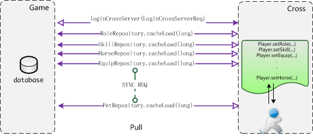

图6、被动拉取模式

​    玩家先跨服过去，loginCrossServer(LoginCrossServerReq)，然后，在用到任意数据时(主角，技能，坐骑，装备，宠物等)，反向同步请求各个系统的数据。
​    我们的实现如图7所示:

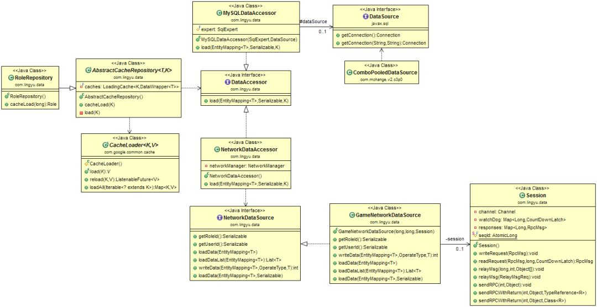

图7、被动拉取UML图

```
public abstractclass AbstractCacheRepository<T, Kextends Serializable> {
    private final LoadingCache<K, DataWrapper<T>>caches;
    public AbstractCacheRepository() {
        Type mySuperClass = this.getClass().getGenericSuperclass();
        Type type = ((ParameterizedType)mySuperClass).getActualTypeArguments()[0];
        AnnotationEntityMaker maker = new AnnotationEntityMaker();
        EntityMapping<T> entityMapping = maker.make((Class<T>) type);
        CacheLoader<K, DataWrapper<T>> loader = new CacheLoader<K, DataWrapper<T>>() {
            @Override
                public DataWrapper<T> load(K entityId) throws Exception {
                return new DataWrapper<T>(this.load(entityId, entityId));
            }
            //根据不同的访问接口访问数据
            public T load(Serializable roleId, K entityId) {
                return this.getDataAccessor(roleId).load(entityMapping, roleId, entityId);
            }
            public DataAccessor getDataAccessor(SerializableroleId) {
                return DataContext.getDataAccessorManager().getDataAccess(roleId);
            }
        };
        caches = CacheBuilder.newBuilder().expireAfterAccess(300, TimeUnit.SECONDS).build(loader);
    }
    public T cacheLoad(K entityId) {
        return this.load(entityId);
    }
    private T load(K entityId) {
        return caches.getUnchecked(entityId).getEntity();
    }
}
```

​    1) 玩家在游戏本服，获取Role数据，通过RoleRepository.cacheLoad(long roleId)，先从Cache里读取，没有，则调用访问器MySQLDataAccessor.load(EntityMapping em,Serializable roleId, K id)从数据库读取数据。
​    2) 玩家在跨服，获取Role数据，通过RoleRepository.cacheLoad(long roleId)，先从Cache里读取，没有，则调用访问器NetworkDataAccessor.load(EntityMappingem, Serializable roleId, K id)，通过RPC远程同步调用读取数据session.sendRPCWithReturn(),该方法的实现可以参考上述的RpcClient.sendWithReturn()，相类似。
​    关于被动拉取的优缺点介绍，在下文另有论述。总之，由于被动拉取的一些我们始料未及的缺陷存在，成为了我们服务器端开发部分功能的噩梦，从选择该模式时就埋下了一个天坑。

**3.2.2主动推送模式(Push)** 
    为了解决了上面碰到的一系列问题， 并且还能坚持最初的原则，我们做了如下几点优化
优化方案有如下几点：
    1.如果玩家在本服，和调整前一样的处理流程，如果玩家在跨服，客户端请求的指令，发布的事件，异步事件需要在场景Stage线程处理的，就转发到跨服，需要在其他个人业务线程（bus）,公共业务线程（public）处理的，仍旧在本服处理。
    2.场景业务线程不再允许有DB操作
    3.内部指令的转发、事件分发系统、异步事件系统要在底层支持跨服
    4.玩家在登录本服时就会构PlayerTemplate, 场景用到的数据会实时更新，玩家去跨服，则会把场景中用到的数据PlayerTemplate主动推送给跨服。

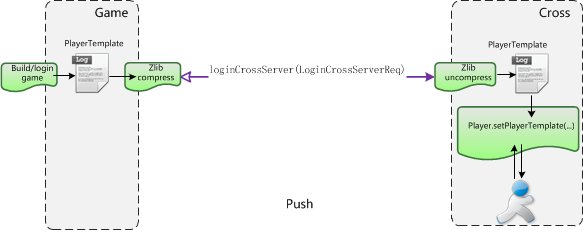

图8、主动推送模式

​    主动推送模式图示显示如图8所示:

| 方案对比                         |                                                              |                                                              |
| -------------------------------- | ------------------------------------------------------------ | ------------------------------------------------------------ |
| 基本参数                         | 被动拉取模式                                                 | 主动推送模式                                                 |
| 改动工作量                       | 既实现了原先的既定目标，改动成本基本为零，对于进度紧张的项目来说，是个极大的诱惑 | 需屏蔽在Stage线程中针对DB的CRUD操作，构建PlayerTemplate而引发的一系列改动 |
| 服务器之间的内部指令和事件分发量 | 由于个人业务数据和场景业务数据都在跨服处理，所以不需要进行跨进程通信 | 对于服务器之间内部指令，事件分发增加了一定的量               |
| 数据中心问题                     | 数据中心进行了转移，把本服的数据更新给锁住。如果部分数据没锁住，就会导致数据的不同步，或者说，本服数据做了更新而导致回档的风险。而如果跨服宕机，则有5分钟的回档风险 | 不变不转移，从根本上规避了数据回档的风险                     |
| 通信数据量                       | 大量数据的迁移，比如要获得一个道具，需要把这个玩家的所有的道具的数据从本服迁移到跨服，大大增加的了数据的通信量 | 只把跨服所需要的场景数据推送过去，数据量大大降低             |
| 用户体验                         | 为了不让一些游戏数据回档，我们不得不对某些功能做显式屏蔽，但这样带来的体验就很不好，当跨服后，点击获取邮件，会显示你在跨服不允许获取提取附件；屏蔽公会的操作，比如公会捐献，公会领工资，因为不可能把整个公会的数据给同步到跨服中 | 所有的功能都不会被屏蔽                                       |
| 开发活动的难易度                 | 由于每个游戏区的活动系统(开服活动，和服活动，节日活动，商业化冲KPI的活动)的差异性，给编码带来了很大复杂性。 | 涉及到的所有商业化活动的功能开发和本服一样简单               |
| 充值问题                         | 充值回调都是到游戏区本服，那怎么办呢，就必须同步这个数据到跨服 | 在处理充值回调时不用再考虑是否在跨服                         |
| RPC性能问题                      | 因为要跨服从本服拉取数据，这个请求必须是同步的，所以同步的RPC请求的频繁导致了跨服性能的降低，特别是当某个跨服活动刚开启时，有很多玩家涌入这个场景，会发生很多同步请求（role,item,skill,horse,pet,achievement…），导致部分玩家的卡在跨服场景跳转过程中,具体实现请参考上述同步请求代码实现sendWithReturn | 去掉了跨服从游戏服拉数据的需求，改成了跨服时本地推送一次场景需要用得到的数据，基本去掉了99%同步RPC请求。 |
| 消息转发量                       | 需要把所有玩家的请求都转发到跨服，转发量非常大,60+%的消息其实是没必要转发到跨服去处理的 | 除了场景上的操作的Action请求，不需要再被转发到跨服去执行，极大的降低了消息的转发量 |


看下事件分发代码的改造:

```
/**事件分发器*/
public abstract class AbEvent {
    private static AtomicLong seq = new AtomicLong(System.currentTimeMillis());
    /**事件订阅*/
    public abstract void subscribe();
    /**事件监听器*/
    protected abstract List<HandlerWrapper> getHandlerPipeline();
    /**事件分发*/
    protected void dispatch() {
        id = seq.incrementAndGet();
        List<HandlerWrapper> handlerList = this.getHandlerPipeline();
        DispatchEventReq<AbEvent> req = new DispatchEventReq<>();
        req.setRoleId(roleId);
        req.setEntity(this);
        for (HandlerWrapper wrapper : handlerList) {
            byte group = wrapper.getGroup();
            if (group == 0) {
                // 同线程串行执行
                eventManager.syncCall(wrapper, this);
            }
            else {
                // 非同线程异步执行,可能去远程执行
                this.advancedAsyncCall(req, wrapper);
            }
        }
    }
}

/** 跨服接收消息分发的事件 */
@Override
public <T> void dispatchEvent(Session session, DispatchEventReq<T> msg) {
    T event = msg.getEntity();
    List<String> list = msg.getHandlerList();
    long roleId = msg.getRoleId();
    for (String e : list) {
        HandlerWrapper wrapper = eventManager.getHandlerWrapper(e, event);
        eventManager.asyncCall(roleId, wrapper, event);
    }
}
```

​    如下图，举个例子，在跨服怪物死亡后，会抛出 MonsterDeadEvent事件，在跨服进程直接处理场景的监听对应的逻辑： 场景中道具掉落，尸体处理；其他的监听逻辑抛回游戏服处理，根据这事件,任务模块处理完成任务，获得奖励;成就模块处理完成成就，获得奖励; 主角模块获得经验，金币等奖励;活动模块处理完成活动，获得奖励。

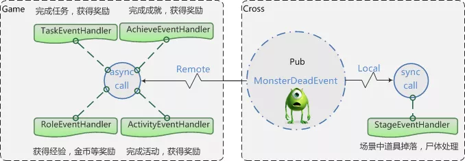

图9、杀怪事件分发

**3.3 其他方面的优化**
**3.3.1 消息组播机制**
    消息组播的优化，在跨服，来自同一服的全部玩家广播从分别单独消息转发，改成一个消息发回本服，然后再广播给玩家（比如来自同一个服n个玩家，原本广播一条消息，服务器之间之间要处理n个RPC消息，现在只需要处理1个消息,降到了原先的1/n）

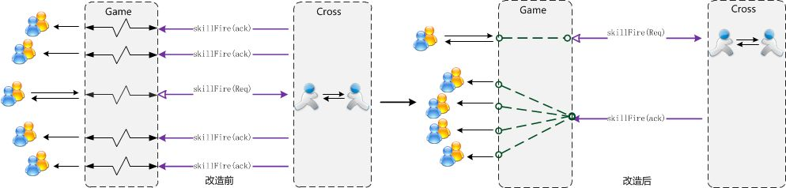

图10、消息组播机制 

**3.3.2 通信数据量**
    一个完整的PlayerTemplate模版数据由于包含了玩家在场景里用到的所有数据，比如角色、宠物、坐骑、装备、神器、法宝、时装、技能、翅膀等等，数据量比较大，平均能达到5KB左右，需要在服务器之间传输时做zlib压缩，比如，做了压缩后，11767 Byte的玩家数据能压缩到2337Byte，压缩率可达到19.86%。

**3.3.3 序列化/反序列化**
    改造前，所有的请求都需要先在本服做AMF3反序列化，如果请求是需要转发到跨服的,再通过JSON序列化传输给跨服，在跨服通过JSON反序列化，最终该请求被处理。
    但实际上，中间过程JSON序列化和反序列化似乎是没有必要的，经过改造，对需要转发给跨服的请求，在本服先不做AMF3反序列化，发送到跨服后再处理，这样就少了一次JSON的序列化和反序列化，同时收益了另外的一个好处:降低了传输的字节

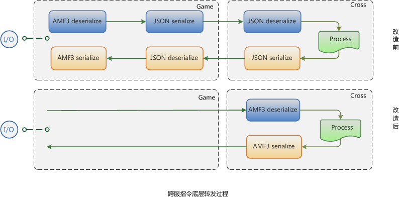


图12、占用字节对比

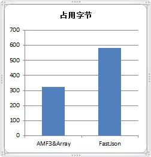

图11、序列化和反序列化

**3.3.4 内存占用优化**
    Oracle JVM目前只能在JVM停止运行的时候才能做到释放占有内存，直到下次重启，所以为了防止资源浪费，各种类型的跨服服务器，游戏服务器都需要设置不同的启动参数。启动参数的设定根据我们自行设置的公式，如下所示。
    但内存占用仍然会经常突破预警线90%，由于一旦系统分配内存发现不够时，就会触发自我保护机制，进行OOM killer,所以需要预留很大的内存给每个JVM进程，而且每次维护的时候去脚本修改内存也比较麻烦。

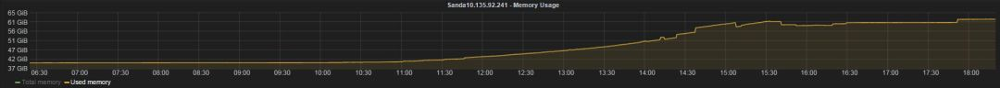

​    内存占用状况如上图，服务器更新维护后，内存占用一路上扬，一直到最后维持在一定的值，不会回收，除非等下次维护或者系统触发OOM killer。 
​    基于阿里 JVM 1.8，只要开启-XX:+DeallocateHeapPages，CMS能在不重启应用的情况下把不使用的HEAP归还给系统的物理内存,这样，我们就不需要预留很多空间给JVM，再也不用担心被误杀了。
​    拿我们一款内测阶段的游戏举例，使用了ALI JVM后， 64内存配置的机器最后开到了24个新区，相比起以前64G内存的机器，单台只能放9个独立的游戏区的状况下，单区的成本将会节省62.5% 机器资源，非常可观。完美的解决了内存经常吃紧的问题，并大幅节省了成本。

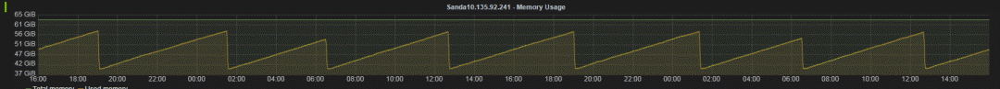

​    上图就是使用了Ali JDK后的锯齿形效果，每隔一定时间闲置内存会被系统回收，这在Oracle JVM是难以做到的。

**3.3.5 服务器分组机制**
    不定向跨服是指任意游戏区的玩家都有可能匹配到一起进行游戏玩法的体验，比如跨服战场，比如跨服副本匹配，如右图所示:

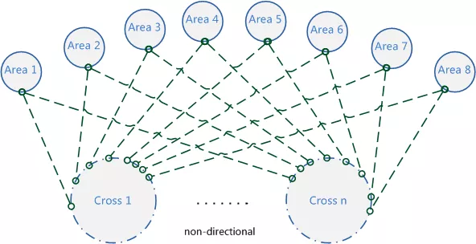

图15、服务器未分组前

​    如何在游戏正式大区中选择几个服做灰度服，又不影响不定向跨服体验;以及如何解决新老服玩家战力发展不在同一起跑线而导致的不平衡问题曾一度让人纠结。

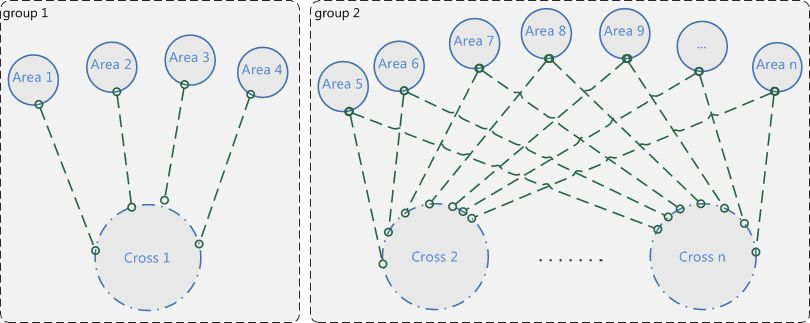

图16、服务器分组后


比如游戏产品推出了大型资料片，想先做下灰度测试，让1~4区的玩家先做下新功能的体验，同时又能防止玩家穿了一件旧版本不存在的装备而在跨服环境下报异常，根据运营需求通过分组，就很完美的解决了上述问题。

**3.3.6 战区自动分配机制***

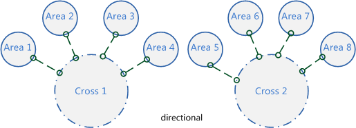

图17、战区自动分配

​    调整后，每一种基于战区的跨服类型都可以自定义调整时间间隔，到时间点全局服务器（global server）系统自动根据全区的活跃战力匹配进行调整，让运营人员从繁杂的配置中解脱出来。定向跨服是指在一定时间内会固定参与跨服玩法的几个国家，常用于战区中国家之间对战，如右图所示，需要运营在后台配置;当一段时间后，随着玩家流失，又需要运营根据战力进行战区的调整，对运营人员的要求比较高

**3.3.7 跨服断线重连机制**
    比如战场系统或组队副本，由于网络状况而掉线，如果重新登录后，没法进入，将会严重影响战场的战况，顺风局马上就可能会变成逆风局，主力DPS掉线副本就有可能通不了，这个机制就弥补了这块的缺陷。

### 4.支持的玩法

​    目前，我们已经能支持任意的游戏区玩家可以到任意的跨服服务器进行游戏功能的体验。比如已经实现的跨服组队副本、跨服战场、跨服国战、跨服皇城争夺、跨服资源战、虫群入侵战、跨服押镖、挖矿争夺等。
​    也支持玩家在本服就可以进行跨服互动，比如和别的区的玩家聊天、加好友、送礼等无缝交互，及国家拍卖行，世界拍卖行的跨服贸易。
​    甚至支持玩家穿越到另外的游戏区做任意的游戏体验，比如一区的玩家听说二区服在举行抢亲活动，
​    你可以跑到2区去观赏参与，也跑到任意的区的中央广场去显摆你的极品套装。

### 5.跨服在线数据

​    如图18，跨服定向玩法有战区国家玩法，虫群入侵，跨服押镖，挖矿争夺, 跨服皇城争夺，跨服国战等，如下图所示，我们可以看出这种玩法的规律:每次活动开启，跨服就会迎来一波波玩家涌入，活动一结束，玩家就会离开，4个跨服进程支持了7600在线的玩家。

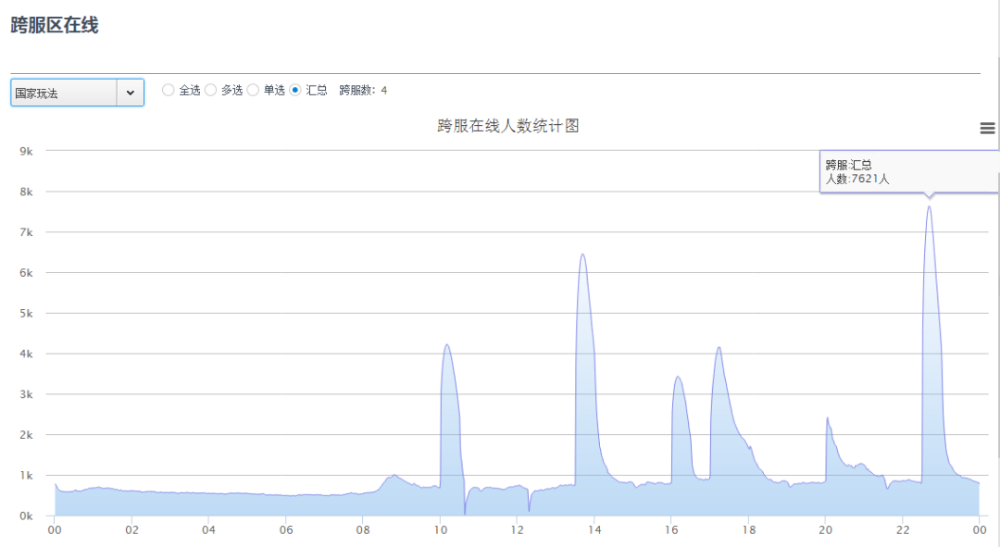

图18、定向跨服在线图


​    如图19，跨服非定向性玩法有跨服组队副本，跨服战场等，支持负载均衡，可以随时动态增加跨服。如右图所示，这些玩法的规律是24小时随时可以体验进入，在线比较稳定，8个跨服进程支持了28000在线的玩家。

 

 图19、不定向跨服在线图 

​    图20是游戏某个跨服玩法的截图，可以看出，该游戏当时具有很高的人气。当时的最高DAU为650467，最高PCU为143319


图20、跨服玩法在线截图


​    图21为跨服通信拓扑图，属于整体架构的核心部分，关于这一部分的说明见图表:6 技术架构


图21、游戏服&跨服通信拓扑图

| 服务器种类                 | 说明                                                         |
| -------------------------- | ------------------------------------------------------------ |
| 游戏逻辑服务器 Game Server | 1.网关，跟玩家保持连接， 提供对外访问,转发消息，直接与客户消息交互； 2.协议的加密解密,压缩解压缩 3.游戏逻辑服务器，核心逻辑的实现都在这里; 4. Game 会缓存玩家的数据，定时持久化更新的数据到数据库，而对于非在线玩家，用LRU算法； 5.不同Game server间可以跨区通信，跨区加好友，聊天等 6.和全局服务器进行RPC 通信，进行递交申请匹配等请求 7.和跨服服务器进行RPC 通信，承担跨服后的指令转发 |
| 跨服服务器Cross  Server    | 处理跨服相关的逻辑，任意区的玩家可以到达到任意的的跨服服务器, 根据负载压力无限动态扩展 |
| 全局服务器 Gobal Server    | 控制跨服服务器的负载均衡，处理要跨服的玩家的匹配处理，分配跨服房间等 |
| Redis                      | 做战区的Pub/Sub服务                                          |

关于整体架构的介绍，后续的文章会和大家分享。

### 6.小结

此套架构历经了《大闹天宫OL》、《诸神黄昏》、《暴风王座》、《惊天动地》，《三打白骨精》、《英雄领主》、《封神霸业》等先后近两万组服务器运行的验证和团队的技术积累。

图22、我们的游戏产品

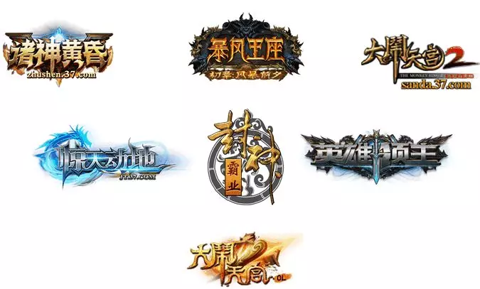

​    本文从当前游戏市场发展的背景出发，提出了设计自由交互的“跨域体系”的必要性，然后在实现跨服架构过程中对设计目标、原则、存在的技术难点进行了思考，实现了一套用于跨服通信的高吞吐的RPC通信框架，先后体验了被动拉取模式带来的坑，和改成主动推送模式带来的便利。并且，对该架构设计在消息组播，通信量，消息序列化/反序列化，服务器分组，战区自动分配，断线重连等进行了多方面机制的分析及深度优化，最后上线实践做了可行性验证，提供了强有力的数据支持，总体表现稳定流畅。