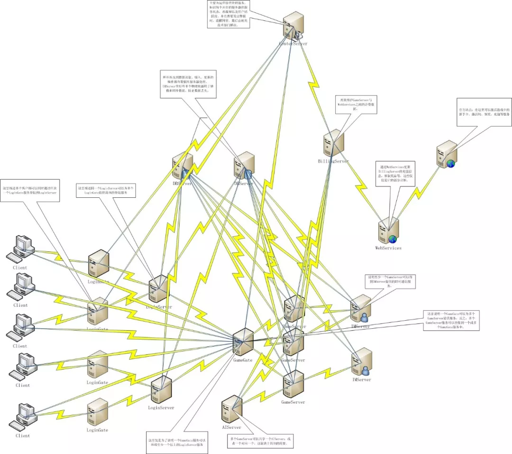
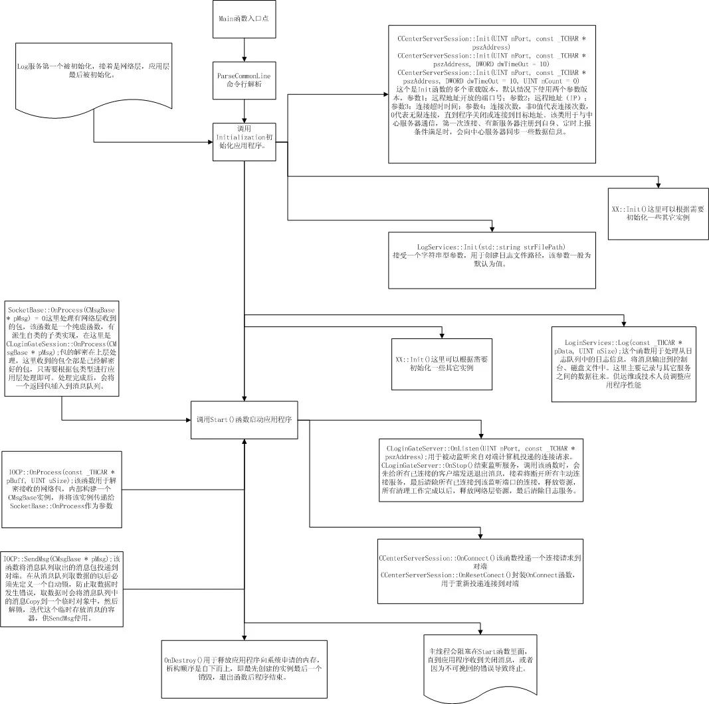
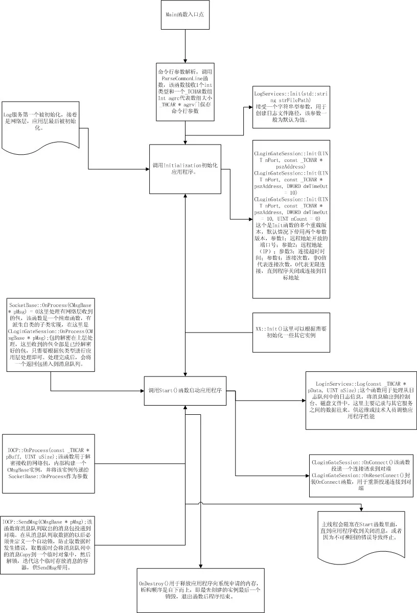

# 2 网络游戏服务器开发框架设计介绍

在开发过程中，会先有一份开发大纲或是一份策划案，但是这些在我的开发中可能不会有，或者即使有，也很有可能是我随性写下来的，但是我会尽可能写好它。

**网络通信层，我会放到单独的SOCKET编程中去讲解，这里的主题是游戏的架构设计以及系统模块间的协同工作。**

所以，在这里假设所有的网络层都已经开发完毕，具体的网络层开发代码不会再这里出现，因为这需要很多年的开发经验，或者对SOCKET有一定的了解才能够讲述清楚或理解，所以我不想再我还没有足够的把握之前去说这样的问题，主要问题是不想让人说我不专业；另一方面是不希望给没有接触过SOCKET编程或了解不多的人带来误导或困扰。

在开发游戏具体功能前，**第一个要做的就是理清系统功能**，这里的系统功能并不是具体的游戏功能，而是从软件角度出发的，行业内部称其为分布式服务器开发，讲的是如何构建一个可移植、可分布到不同网络机器独立或依赖运行的应用程序。

本系列开发教程是我个人游戏经历和工作历程的一个沉淀，也是我个人主观的一个未实现版本，在这里，我希望它可以以教程的方式存在，并去按部就班的一步一步实现出来。所有的源码代码都是开源的，我不会有丝毫保留，这样做的目的是方便很多像我一样的游戏狂热者入门无门，另一方面也是希望前辈们可以对我的错误进行指正。下面将具体描述服务器的划分以及功能实现。

此系列开发教程，总共将分为10个模块：它们分别为

- LoginGate服务器、
- LoginServer服务器、
- GameGate服务器、
- GameServer服务器、
- IMServer服务器、
- AIServer服务器、
- CenterServer服务器、
- BillingServer服务器、
- WebServices服务器、
- DBServer服务器。

1

**LoginGate**：登陆网关服务器，将所有的LoginServer服务器地址暴露给最终用户，每个LoginGate服务可以挂接n个LoginServer，将最终用户的所有请求转发给目标LoginServer。当最终用户通过此服务完成登陆后，会与该服务断开连接，断开连接前，服务器会将数据上报给GameGate服务。

2

**LoginServer**：登陆服务器，仅作于内部服务与LoginGate进行连接，所有的最终用户请求由LoginGate过滤后，转发过来进行处理。与LoginGate的所有通信都是明文，即未加密数据。

3

**GameGate：**游戏网关服务器，与LoginGate协作完成最终用户的登陆过程，每一个服务会连接到唯一一个LoginGate服务上进行注册，LoginGate会将以完成验证登陆的用户信息同步到所有已注册成功的GameGate上，根据注册不同的GameGate类型信息，LoginGate会发生不同的通过认证的最终用户信息。

GameGate挂接n个GameServer服务到自身，此服务将所有注册到自身的GameServer信息发送给最终用户，提供用户选择具体的区或线路进行游戏（区和线路在不同的游戏设定中有不同的定义），在这里区的定义对应的是GameGate，每一个GameGate可以表示物理或逻辑上的多个游戏分区，每个分区由至少一个GameServer组成；

线路定义为GameServer，每一个GameServer代表一条线路，线路之间互相不可见，但是可以通过IMServer进行一些扩展通信，例如公会、好友、聊天等服务可以设置透明通信或隐藏通信。透明通信由IMServer向目标GameServer转发请求，并进行处理；隐藏通信仅在当前GameServer进行处理，不会做跨越性操作。

4

**GameServer**：游戏服务器，作为内部服务与GameGate协作处理最终用户的请求，这个服务主要处理游戏逻辑，例如战斗。此服务启动后，会根据配置文件的配置信息进行相应的服务注册，该服务启动成功后，会注册到GameGate和IMServer、AIServer服务器，它们分别提供最终用户游戏、交友、公会、聊天和智能体的移动、创建、销毁等服务。**作为整个游戏的核心处理服务器**，会处理掉大部分的用户交互服务请求，只有在不能处理的情况下，才会请求其它服务协同处理。

5

**IMServer**：IM通信服务器，全称InstantMessaging（译为即时通讯），ICQ、MSN、QQ等聊天工具都属于此范畴。此服务的作用是提供物理或逻辑不同位置的GameServer上的最终用户通讯的一个媒介，用户成功登陆GameServer时，会将自己的好友、公会信息注册到此服务上，当需要跨GameServer服务时，共IMServer使用。此服务主要提供聊天、交友、交易、公会等社交类行为服务，该服务可以直接或间接的与最终用户进行通信，但最终用户无法直接与该服务进行通信，比如请求操作，所有的用户操作都由GameServer转发，IMServer可以选择性的直接反馈最终用户或通过GameServer反馈。

6

**AIServer：**人工智能服务器，全称Artificial Intelligence（译为人工智能），例如现代服务性机器人（自动吸尘器、智能探测仪、智能防爆装置等）都属于人工智能范畴。这里的人工智能主要体现在游戏中的NPC、MONSTER等有行为表现物体。GameServer启动后会连接到此服务进行注册，并获取所需智能体的信息，以反馈给最终用户，并最终显示在用户应用程序中。该服务主要控制智能体的移动、攻击、创建、销毁等行为，另外包括在战斗中或非战斗状态下的行为，比如游走在街道上的商品小贩；在搜索到攻击目标时，主动或召集附近的战斗单位一起攻击用户，都属于该服务的工作内容。

7

**CenterServer：**中心服务器，用于监控、更新已注册到此服务的状态，比如电信1区（傲视天地）服务器的运行状态等。此服务主要是管理除自身以外的所有服务程序的运行状态，以及时反馈给技术活运维人员。

8

**BillingServer：**计费服务器，用于计算用户在游戏中的消耗、增值；比如XX在游戏中购买了一个双倍经验卡，消耗10金币，或者用户通过网站形式进行充值，都会通过该服务反馈给用户最终结果。

9

**WebServices：**网站服务，主要用于网站与游戏之间的交互。比如XX用户通过网站进行充值服务，充值成功后，通知计费服务以响应用户操作；或通过网站进行游戏激活、礼品领取等，都需要此服务与游戏应用程序进行交互，以体现实时的变化。

10

DBServer：用于全局数据维护，例如更新、查询、插入、删除操作；这些数据包含用户账号、充值、代金卷、点卡、月卡以及游戏中需要用到的角色数据。

服务器整体架构图分布示意图：

LoginGate内部运行示意图：

LoginServer内部运行示意图：

由于其它服务器模块程序的内部图与这两个类似，所以就不在这个上面耽搁太多时间，下一篇将讲述具体的游戏开发，网络库使用的是开源库ACE，下载地址http://download.dre.vanderbilt.edu/previous_versions/ACE-5.8.0.zip。
