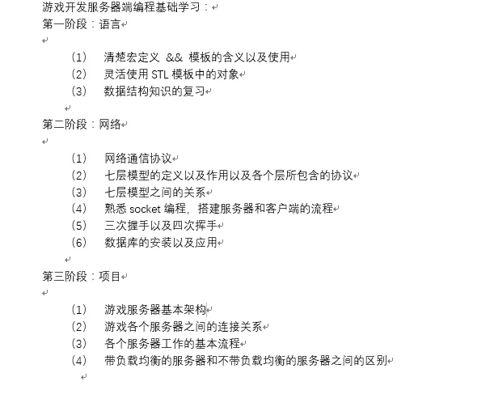
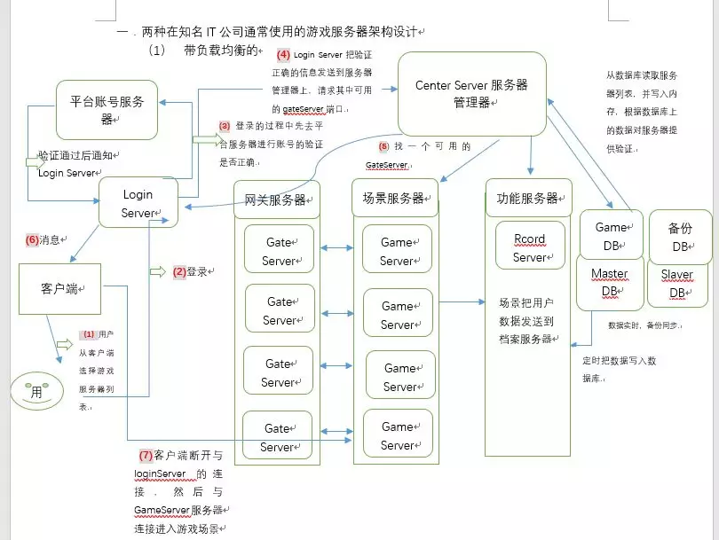

# 3 游戏后端开发需要掌握的知识

这篇是从网上找到牛人的**博客总结**下来的：

**实战方面：**

（1）两种在知名IT公司使用的游戏服务器架构设计

**点击图片可以放大**

1

**各个服务器的功能以及作用：**

-  **CenterServer服务器管理器：**管理所有的服务器，分配服务器的端口，负责全局的逻辑（管理），对各功能服务器和场景服务器提供服务，保证服务器的合法性
- **DBserver**角色档案缓冲服务器
- **GameServer**逻辑服务器：玩家的实时同步在里面实现
- **GateServer**网关服务器：负责消息转发
- **LoginServer登录服务器：**连接账号数据

2

**不带负载均衡的和带负载均衡：**

**相同点：**

​    与带负载均衡大概的架构相同

**不同点：**

-  不带负载均衡

     Gate Server 和Game Server之间是**一对一**的关系，每个Game Server能容纳的玩家数量是一定的，正常情况下一个Gate Server的对应一个Game Server实时在线人数能达到3000人，一旦达到峰值，就会找下一个对应的Game Server。

    各个**Gate Server服务器之间是不通信**的

    

    

- 带负载均衡

     一个Gate Server的**对应多个**Game Server

    **各个GateServer之间可以互相通信**，而且还可以随意扩展，通过配置文件可以实现配置

3

**服务器的工作过程：**

1. 用户从客户端**选择**游戏服务器列表
2. **登录**到Login Server,在登陆的过程中
3. 先去平台服务器进行账号的**验证**
4. 验证通过后会通知Login Server，然后Login Server会把验证的消息发送    到center Server，**请求**其中的Gate Server的地址和端口
5. Center Server会找一个可用的Gate Server信息,**发送回**LoginServer
6. Login Server会把**消息发送**给客户端
7. 客户端**断开**与Login Server的连接，然后与Game Server 连接进入游戏场景中