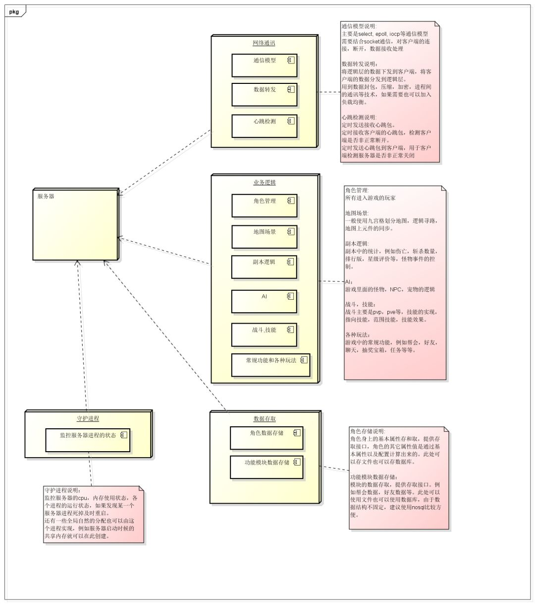
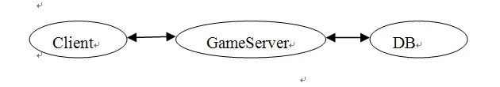
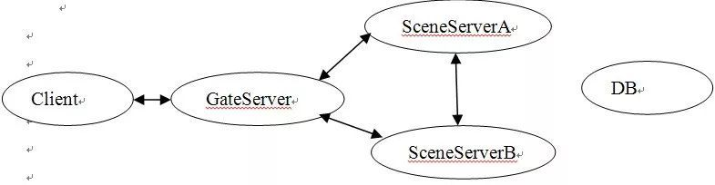
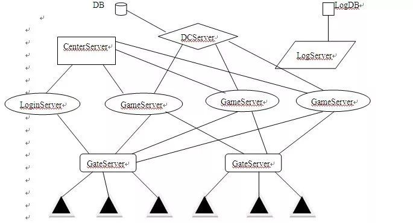
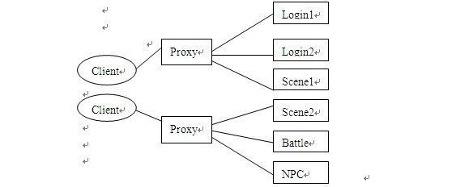
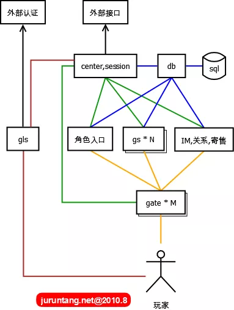
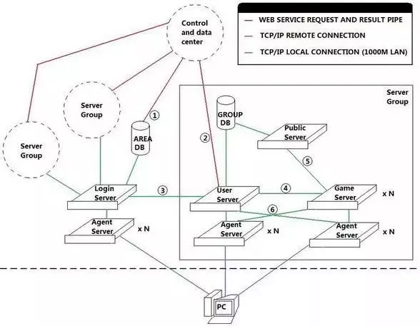

# 4 关于游戏服务端架构的整理

一个大型的网落游戏服务器应该包含几个模块：网络通讯，业务逻辑，数据存储，守护监控（不是必须）。其中业务逻辑可能根据具体需要，又划分为好几个子模块。

这里说的模块可以指一个进程，或者一个线程方式存在，本质上就是一些类的封装。

对于服务器的并发性，要么采用单进程多线程，要么采用多进程单线程的方式，说说两种方式的优缺点：

## 一、单进程多线程的服务器设计模式，只有一个进程，但一个进程包好多个线程：

网络通讯层，业务逻辑，数据存储，分别在独立的线程中，无守护进程。

**优点：**

1. 数据共享和交换方便，使用全局变量或者单例就可以，数据存储方便。
2. 单进程，服务器框架结构相对简单，编码容易。

**缺点：**

1. 所有功能只能在单个物理服务器上，不能做成分布式。
2. 不方便监控各个线程状态，容易死锁
3. 一个线程出错，例如内存非法访问，栈空间被破坏，那么服务器进程就退出，所有玩家掉线，影响大。

## 二、多进程单线程的服务器设计模式，多个进程，每个进程只有一个线程：

网路通讯，业务逻辑，数据存储，守护进程，分别在不同的进程。

**优点：**

1. 各个进程可以分布在不同的物理服务器上，可以做成分布式的服务器框架，例如可以将数据存储单独放到一个物理服务器上，供几个区的服务器使用。将网络通讯进程独立出来，甚至可以做成导向服务器，实现跨服战。
2. 可以通过守护进程监控其它进程状态，例如有进程死掉，马上重启该进程，或者某个进程cpu使用率接近100%（基本可以判断是某个逻辑死循环了）, 强制kill掉该进程，然后重启。
3. 单个服务器进程异常退出，只要不是网络通讯进程（一般这个都会比较稳定，没什么逻辑），那么就可以及时被守护进程重启，不会造成玩家掉线，只会造成在1-2秒内，某个逻辑功能无法使用，甚至玩家都感觉不到。
4. 服务器通过共享内存进行数据交换，那么如果其中一个服务器死掉，数据还在，可以保护用户数据（当然多线程也可以使用共享内存）。
5. 并发性相对多线程要高点。

**缺点：**

1. 不方便使用互斥锁，因为进程切换的时间片远远于线程切换，对于一个高并发服务器是无法允许这么高时间片的切换代价的。因此必须设计好服务器的框架，尽量避开使用锁机制，但要保证数据不出错。
2. 多进程编程，在各个进程间会有很多通讯，跨服务器进程的异步消息较多，会让服务器的编码难度加大。

下面先按照一个游戏的功能，将服务器的功能分块框架画出来:

**点击图片可放大**



以上是一个游戏服务器最基础的功能框架图，接下来要做的就是设计服务器的框架了

### 1.   早期的MMORPG服务器结构

```
Client<->GameServer<->DB 
```

所有业务数据集中处理



**优点:**

简单,快速开发

**缺点:**

1. 所有业务放在一起,系统负担大大增加.一个bug可能导致整个服务器崩溃,造成所有玩家掉线甚至丢失等严重后果。
2. 开服一刹那,所有玩家全部堆积在同一个新手村.->>>>卡，客户端卡（同屏人数过多渲染/广播风暴） 服务器卡(处理大量同场景消息/广播风暴)

### 2.   中期-用户分离集群式

```
                GameServe1
Client            |                    DB
                GameServer2
```

玩家不断增多->分线->程序自动或玩家手动选择进入
**缺点:**运营到后期,随着每条线玩家的减少, 互动大大减少。

### 3.   中后期 数据分离集群式



按地图划分服务器,当前主流
**新手村问题**：《天龙八部》提出了较好的解决方案，建立多个平行的新手村地图，一主多副，开服时尽可能多的同时容纳新用户的涌入，高等级玩家从其它地图回新手村只能到达主新手村。

### 4.   当前主流的网络游戏架构



注：在GateServer和CenterServer之间是有一条TCP连接的。而GameServer和LogServer之间的连接可以是UDP连接。这是有一个大概的图，很多地方需要细化。
**GateServer:**网关服务器,AgentServer、ProxyServer

**优点:** 

1. 作为网络通信的中转站，负责维护将内网和外网隔离开，使外部无法直接访问内部服务器，保障内网服务器的安全，一定程度上较少外挂的攻击。
2. 网关服务器负责解析数据包、加解密、超时处理和一定逻辑处理，这样可以提前过滤掉错误包和非法数据包。
3. 客户端程序只需建立与网关服务器的连接即可进入游戏，无需与其它游戏服务器同时建立多条连接，节省了客户端和服务器程序的网络资源开销。
4. 在玩家跳服务器时，不需要断开与网关服务器的连接，玩家数据在不同游戏服务器间的切换是内网切换，切换工作瞬问完成，玩家几乎察觉不到，这保证了游戏的流畅性和良好的用户体验。

**缺点:** 

1. 网关服务器成为高负载情况下的通讯瓶颈问题
2. 由于网关的单节点故障导致整组服务器无法对外提供服务的问题

**解决：**

- **多网关技术。**顾名思义，“多网关” 就是同时存在多个网关服务器，比如一组服务器可以配置三台GameGme。当负载较大时，可以通过增加网关服务器来增加网关的总体通讯流量，当一台网关服务器宕机时，它只会影响连接到本服务器的客户端，其它客户端不会受到任何影响。
- **DCServer:**数据中心服务器。主要的功能是缓存玩家角色数据，保证角色数据能快速的读取和保存
- **CenterServer**:全局服务器/中心服务器,也叫WorldServer. 主要负责维持GameServer之间数据的转发和数据广播。另外一些游戏系统也可能会放到Center上处理，比如好友系统,公会系统。

**改进:**

将网关服务器细化为LogingateServer和多个GameGateServer.

### 5.   按业务分离式集群

由于网络游戏存在很多的业务，如聊天，战斗，行走，NPC等，可以将某些业务分到单独的服务器上。这样每个服务器的程序则会精简很多。而且一些大流量业务的分离,可以有效的提高游戏服务器人数上限。



**优点：**

1. 业务的分离使得每种服务器的程序变的简单，这样可以降低出错的几率。即使出错，也不至于影响到每一个整个游戏的进行,而且通过快速启动另一台备用服务器替换出错的服务器。
2. 业务的分离使得流量得到了分散，进而相应速度回得到提升 。
3. 大部分业务都分离了成了单独的服务器,所以可以动态的添加，从而提高人数上限。

**改进：**
甚至可以将登陆服务器细化拆分建角色,选择角色服务器

### 6.   一种简单实用的网络游戏服务器架构

下图中每个方框表示一个独立的进程APP组件，每个服务进程如果发生宕机会影响部分用户，整体服务但不会全部中断。在宕机进程重启后，又可以并入整体，全部服务得以继续。



- **gls：**game login server，游戏登录服务器，某种程序上，其不是核心组件，gls调用外部的接口，进行基本的用户名密码认证。此外需要实现很多附属的功能：登录排队 （对开服非常有帮助），GM超级登录通道（GM可以不排队进入游戏），封测期间激活用户控制，限制用户登录，控制客户端版本等。
- **db：**实质上是后台sql的大内存缓冲，隔离了数据库操作，比较内存中的数据，只把改变的数据定时批量写入sql。系统的算法，开发稳定性都要求非常高。
- **center：**所有组件都要在这里注册，在线玩家的session状态都在这里集中存放，和各组件有心跳连接。所有对外的接口也全部通过这里。
- **角色入口**：玩家登录游戏后的选择角色
- **gs：**game server，最核心组件，同一地图，所有游戏逻辑相关的功能，都在这里完成。
- **gate：**建立和用户的常链接，主要作sockt转发，屏蔽恶意包，对gs进行保护。协议加密解密功能，一个gate共享多个gs，降低跳转地图连接不上的风险。
- **IM，关系，寄售：**表示其它组件，负责对应的跨地图发生全局的游戏逻辑。

### 7.另一个架构图



- 1-  这是一条WebService的管道，在用户激活该区帐号，或者修改帐号密码的时候，通过这条通道来插入和更新用户的帐号信息。
- 2-  这也是一条WebService管道，用来获取和控制用户该该组内的角色信息，以及进行付费商城代币之类的更新操作。
- 3-  这是一条本地的TCP/IP连接，这条连接主要用来进行服务器组在登陆服务器的注册，以及登陆服务器验证帐户后，向用户服务器注册帐户登陆信息，以及进行对已经登陆的帐户角色信息进行操作（比如踢掉当前登陆的角色），还有服务器组的信息更新（当前在线玩家数量等）。
- 4-  这也是一条本地TCP/IP连接，这条连接用来对连接到GameServer的客户端进行验证，以及获取角色数据信息，还有传回GameServer上角色的数据信息改变。
- 5-  这条连接也是一条本地的TCP/IP连接，它用来进行公共信息服务器和数个游戏服务器间的交互，用来交换一些游戏世界级的信息（比如公会信息，跨服组队信息，跨服聊天频道等）。
- 6-  这里的两条连接，想表达的意思是，UserServer和GameServer的Agent是可以互换使用的，也就是玩家进入组内之后，就不需要再切换 Agent。如果不怕乱套，也可以把登陆服务器的Agent也算上，这样用户整个过程里就不需要再更换Agent，减少重复连接的次数，也提高了稳定性。 （毕竟连接次数少了，也降低了连不上服务器的出现几率）

在这个架构里面，**GameServer实际上是一个游戏逻辑的综合体，**里面可以再去扩展成几个不同的逻辑服务器，通过PublicServer进行公共数据交换。

**UserServer实际上扮演了一个ServerGroup的领头羊的角色**，它负责向LoginServer注册和更新服务器组的信息（名字，当前人数），并且对Agent进 行调度，对选择了该组的玩家提供一个用户量最少的Agent。同时，**它也兼了一个角色管理服务器的功能**，发送给客户端当前的角色列表，角色的创建，删除， 选择等管理操作，都是在这里进行的。而且，**它还是一个用户信息的验证服务器**，GameServer需要通过它来进行客户端的合法性验证，以及获取玩家选择 的角色数据信息。
采用这种架构的游戏，通常有以下表现：

- 1- 用户必须激活一个大区，才能在大区内登陆自己的帐号。
- 2- 用户启动客户端的时候，弹出一个登陆器，选择大区。
- 3- 用户启动真正的客户端的时候，一开始就是输入帐号密码。
- 4- 帐号验证完成之后，进行区内的服务器选择。
- 5- 服务器选择完成之后，进入角色管理。同时，角色在不同的服务器里不能共享。

## 三、正文网络通讯

### 1.网络协议

根据游戏类型   实时性要求/是否允许丢包 来决定 TCP/UDP协议

#### a.TCP:面向连接,可靠,保证顺序,慢,有延迟

**TCP**每次发送一个数据包后都要等待接收方发送一个应答信息，这样TCP才可以确认数据包通过因特网完整地送到了接收方。如果在一段时间内TCP没有收到 接收方的应答，他就会停止发送新的数据包，转而去重新发送没有收到应答2的数据包，并且持续这种发送状态知道收到接收方的应答。所以这会造成网络数据传输 的延迟，若网络情况不好，发送方会等待相当长一段时间
**UDP**:无连接,不可靠,不保证顺序,快

#### b.长连接/短连接

**长连接**，指在一个TCP连接上可以连续发送多个数据包，在TCP连接保持期间，如果没有数据包发送，需要双方发检测包以维持此连接，一般需要自己做在线维
**连接→数据传输→保持连接(心跳)→数据传输→保持连接(心跳)→……→关闭连接**
**短连接，**是指通信双方有数据交互时，就建立一个TCP连接，数据发送完成后，则断开此TCP连接,如Http
**连接→数据传输→关闭连接**

### 2.IO模型

**Unix5中io模型**

1. 阻塞IO (Blocking I/O Model)
2. 非阻塞IO (Nonblocking I/O Model)
3. IO复用 (I/O Multiplexing Model)
4. 信号驱动IO (Signal-Driven I/O Model)
5. 异步IO (Asynchronous I/O Model)

**IO分两个阶段：**

1. 通知内核准备数据。
2. 数据从内核缓冲区拷贝到应用缓冲区

**根据这2点IO类型可以分成：**

1. 阻塞IO，在两个阶段上面都是阻塞的。
2. .非阻塞IO，在第1阶段，程序不断的轮询直到数据准备好，第2阶段还是阻塞的
3. IO复用，在第1阶段，当一个或者多个IO准备就绪时，通知程序，第2阶段还是阻塞的，在第1阶段还是轮询实现的，只是所有的IO都集中在一个地方，这个地方进行轮询
4. 信号IO，当数据准备完毕的时候，信号通知程序数据准备完毕，第2阶段阻塞
5. 异步IO，1，2都不阻塞

同时阻塞多个I/O操作。而且可以同时对多个读操作，多个写操作的I/O函数进行检测，直到有数据可读或可写时，才真正调用I/O操作函数

**Java#Selector**
允许套接口进行信号驱动I/O,并安装一个信号处理函数，进程继续运行并不阻塞**。当数据准备好时**，进程会收到一个SIGIO信号，可以在信号处理函数中调用I/O操作函数处理数据.

**Java#NIO2**
发出系统调用后,直接返回。通知IO操作完成。
前四种同步IO，最后一种异步IO.**二者区别**:第二个阶段必须要求进程主动调用recvfrom.而异步io则将io操作全部交给内核完成,完成后发信号通知。此期间,用户不需要去检查IO操作的状态，也不需要主动的去拷贝数据。

### 3.线程阻塞的原因:

1. Thread.sleep(),线程放弃CPU，睡眠N秒,然后恢复运行
2. 线程要执行一段同步代码,由于无法获得相关的锁,阻塞。获得同步锁后，才可以恢复运行。
3. 线程执行了一个对象的wait方法，进入阻塞状态,只有等到其他线程执行了该对象的notify、nnotifyAll，才能将其唤醒。
4. IO操作,等待相关资源
    **阻塞线程的共同特点是**：放弃CPU,停止运行，只有等到导致阻塞的原因消除，才能恢复运行 。或者被其他线程中断，该线程会退出阻塞状态，并抛出InterruptedException.

### 4.阻塞/非阻塞/同步/异步

同步/异步关注的是消息如何通知的机制。而阻塞和非阻塞关注的是处理消息。是两组完全不同的概念。

### 5.几个常用概念

```
Select Poll
Epoll(Linux) Kqueue(FreeBSD)   
IOCP    Windows
```

**Reactor**
Dispatcher（分 发器），Notifer（通知器）, 事件到来时，使用Dispatcher（分发器）对Handler进行分派，这个Dispatcher要对所有注册的Handler进行维护。同时，有一 个Demultiplexer（分拣器）对多路的同步事件进行分拣。

**Proactor**
Proactor和Reactor都是并发编程中的设计模式.用于派发/分离IO操作事件的。这里所谓的IO事件也就是诸如read/write的IO操作。"派发/分离"就是将单独的IO事件通知到上层模块。两个模式不同的地方在于，Proactor用于异步IO，而Reactor用于同步IO。

**两个模式的相同点**，都是对某个IO事件的事件通知(即告诉某个模块，这个IO操作可以进行或已经完成)。在结构上，两者也有相同点：demultiplexor负责提交IO操作(异步)、查询设备是否可操作(同步)，然后当条件满足时，就回调handler。
**不同点在于**，异步情况下(Proactor)，当回调handler时，表示IO操作已经完成；同步情况下(Reactor)，回调handler时，表示IO设备可以进行某个操作(can read or can write)，handler这个时候开始提交操作。

### 6.网络通讯框架

**TCP Server框架:**
Apache MINA(Multipurpose Infrastructure for Network Applications)2.0.4
Netty 3.5.0Final
Grizzly 2.2
**Quickserv****e****r**是一个免费的开源Java库，用于快速创建健壮的多线程、多客户端TCP服务器应用程序。使用QuickServer，用户可以只集中处理应用程序的逻辑/协议
**Cindy ：**强壮，可扩展，高效的异步I/O框架
**xSocket：**一个轻量级的基于nio的服务器框架用于开发高性能、可扩展、多线程的服务器。该框架封装了线程处理、异步读/写等方面
ACE 6.1.0 C++ADAPTIVE CommunicationEnvironment,
**SmaxFoxServer 2.X ：**专门为Adobe Flash设计的跨平台socket服务器

### 7.消息编码协议

AMF/JSON/XML/自定义/ProtocolBuffer

无论是做何种网络应用，必须要解决的问题之一就是应用层从字节流中拆分出消息的问题，也就是对于 TCP 这种字节流协议，接收方应用层能够从字节流中识别发送方传输的消息.

1. 使用特殊字符或者字符串作为消息的边界，应用层解析收到的字节流时，遇见此字符或者字符串则认为收到一个完整的消息
2. 为每个消息定义一个长度，应用层收到指定长度的字节流则认为收到了一个完整的消息
    消息分隔标识（separator）、消息头（header）、消息体（body）

```
 len | message_id | data 
 |separator |     header   | body |
 | len       | message_id | data

```

### 8. 粘包:

**TCP粘包**是指发送方发送的若干包数据到接收方接收时粘成一包，从接收缓冲区看，后一包数据的头紧接着前一包数据的尾。

1. 发送方引起的粘包是由TCP协议本身造成的，TCP为提高传输效率，发送方往往要收集到足够多的数据后才发送一包数据。若连续发送几次的数据都很少，通常TCP会根据优化算法把这些数据合成一包后一次发送出去，这样接收方就收到了粘包数据。
2. 接收方引起的粘包是由于接收方用户进程不及时接收数据，从而导致粘包现象。这是因为接收方先把收到的数据放在系统接收缓冲区，用户进程从该缓冲区取数据， 若下一包数据到达时前一包数据尚未被用户进程取走，则下一包数据放到系统接收缓冲区时就接到前一包数据之后，而用户进程根据预先设定的缓冲区大小从系统接 收缓冲区取数据，这样就一次取到了多包数据

**解决措施:**

1. 对于发送方引起的粘包现象，用户可通过编程设置来避免，TCP提供了强制数据立即传送的操作指令push，TCP软件接收到该操作指令后，就立即将本段数据发送出去，而不必等待发送缓冲区满；
    TCP-NO-DELAY-关闭了优化算法,不推荐

2. 对于接收方引起的粘包，则可通过优化程序设计、精简接收进程工作量、提高接收进程优先级等措施，使其及时接收数据，从而尽量避免出现粘包现象-当发送频率高时依然可能出现粘包

3. 接收方控制，将一包数据按结构字段，人为控制分多次接收，然后合并，通过这种手段来避免粘包。-效率低

4. 接收方创建一预处理线程，对接收到的数据包进行预处理，将粘连的包分开

    

    #### 分包算法思路:

**基本思路**是首先将待处理的接收数据（长度设为m）强行转换成预定的结构数据形式，并从中取出数据结构长度字段，即n，而后根据n计算得到第一包数据长度

- 

    1) 若n<m，则表明数据流包含多包数据，从其头部截取n个字节存入临时缓冲区，剩余部分数据一次继续循环处理，直至结束。
    2) 若n=m，则表明数据流内容恰好是一完整结构数据，直接将其存入临时缓冲区即可。
    3) 若n>m，则表明数据流内容尚不够构成一个完整结构数据，需留待与下一包数据合并后再行处理。

- 在单位设计上必须从头到尾贯彻面向对象的“继承”观念先设计基础单位A ，再在之上扩展到所有的单位，也就是说，所有的普通单位都可以追溯到一个起源的对象，否则代码量会让你想死,然后就能获得所有的单位和建筑物了。

------

#### 地图寻路

寻路的问题在于自然的移动，追着一个单位打，或者进入射程中停下来，比起如何自然的经过一个单位打，成为了一个，为什么你要在A站或者B站坐公交的问题，Why，如何才能符合逻辑的设计---敌人进攻的单位，这个AI，不但是策略的问题，还是行为的问题，所以，将敌人的最终目标确定在哪里呢？

回答：AI 和 行为控制模块要分成两个模块来做

------

#### 行为控制模块复制地图上所有单位的移动、攻击等动作，目标、目的的指示；

这必须是一个独立的模块，可以避免为每个单位都写逻辑的同时，让大部分单位战斗起来有个统一的目的；这么做的好处是，大部分的CPU时间都在一段高效率的代码上，由这个模块负责按照顺序给每个单位下达动作指令

如果有必要 还需要一个监控模块，监控单位的状态改变

------

#### AI :

就是上面写过的 Why ， 我要在A站乘车 还是B站乘车的逻辑，我是优先攻击单位，还是优先攻击建筑物的逻辑。。。本虎还没想明白，这是一个逻辑怪圈。。。。