# 5 各类游戏对应的服务端架构

### 类型一：卡牌、跑酷等弱交互服务端

卡牌跑酷类因为交互弱，玩家和玩家之间不需要实时面对面PK，打一下对方的离线数据，计算下排行榜，买卖下道具即可，所以**实现往往使用简单的 HTTP服务器：**

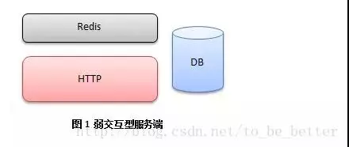

登录时可以使用**非对称加密**（RSA, DH），服务器根据客户端uid，当前时间戳还有服务端私钥，计算哈希得到的加密 key 并发送给客户端。之后双方都用 **HTTP通信**，并用那个key进行**RC4加密**。客户端收到key和时间戳后保存在内存，用于之后通信，服务端不需要保存 key，因为每次都可以根据客户端传上来的 uid 和 时间戳 以及服务端自己的私钥计算得到。**用模仿 TLS的行为，**来保证多次 HTTP请求间的客户端身份，并通过时间戳保证同一人两次登录密钥不同。
每局开始时，访问一下，请求一下关卡数据，玩完了又提交一下，验算一下是否合法，获得什么奖励，数据库用单台 MySQL或者 MongoDB即可，后端的 Redis做缓存（可选）。

如果要实现通知，那么让客户端定时15秒**轮询**一下服务器，**如果有消息**就取下来，**如果没消息**可以逐步放长轮询时间，比如30秒；**如果有消息**，就缩短轮询时间到10秒，5秒，即便两人聊天，延迟也能自适应。
此类服务器用来实现一款三国类策略或者卡牌及酷跑的游戏已经绰绰有余，这类游戏因为逻辑简单，玩家之间交互不强，**使用 HTTP来开发的话，开发速度快，调试只需要一个浏览器就可以把逻辑调试清楚了。**

### 类型2：第一代游戏服务器 1978

1978年，英国著名的财经学校University of Essex的学生 Roy Trubshaw编写了世界上第一个MUD程序《MUD1》，在University of Essex于1980年接入 ARPANET之后加入了不少外部的玩家，甚至包括国外的玩家。《MUD1》程序的源代码在 ARPANET共享之后出现了众多的改编版本，至此MUD才在全世界广泛流行起来。不断完善的 MUD1的基础上产生了**开源的 MudOS**（1991），成为众多网游的鼻祖：

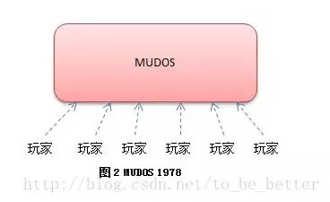

MUDOS采用 **C语言开发**，因为玩家和玩家之间有比较强的交互（聊天，交易，PK），MUDOS使用**单线程无阻塞套接字**来服务所有玩家，所有玩家的请求都发到**同一个线程去处****理**，**主线程**每隔1秒钟更新一次所有对象（网络收发，更新对象状态机，处理超时，刷新地图，刷新NPC）。
游戏世界采用**房间的形式组织**起来，每个房间有东南西北四个方向可以移动到下一个房间，由于欧美最早的网游都是地牢迷宫形式的，因此场景的基本单位被称为 “房间”。

MUDOS使用一门称为**LPC的脚本语言**来描述整个世界（包括房间拓扑，配置，NPC，以及各种剧情）。游戏里面的高级玩家（巫师），可以不断的通过修改脚本来为游戏添加房间以及增加剧情。早年 MUD1上线时只有17个房间，Roy Trubshaw毕业以后交给他的师弟 Richard Battle，在 Richard Battle手上，不断的添加各种玩法到一百多个房间，终于将 MUD发扬光大。
用户使用 Telnet之类的客户端用 **Tcp协议**连接到 MUDOS上，使用纯文字进行游戏，每条指令用回车进行分割。比如 1995年国内第一款 MUD游戏《侠客行》，你敲入*：”go east”，*游戏就会提示你：“*后花园 - 这里是归云庄的后花园，种满了花草，几个庄丁正在浇花。此地乃是含羞草生长之地。这里唯一的出口是 north。这里有：花待 阿牧（A mu），还有二位庄丁（Zhuang Ding）”，*然后你继续用文字操作，查看阿牧的信息*：“look a mu”，*系统提示：“*花待 阿牧（A mu）他是陆乘风的弟子，受命在此看管含羞草。他看起来三十多岁，生得眉清目秀，端正大方，一表人才。他的武艺看上去【不是很高】，出手似乎【极轻】”。*然后你可以选择击败他获得含羞草，但是你吃了含羞草却又可能会中毒死亡。在早期网上资源贫乏的时候，这样的游戏有很强的代入感。
**用户数据保存在文件**中，每个用户**登录时**，从文本文件里把用户的数据全部加载进来，**操作全部在内存里面进行，**无需马上刷回磁盘。用户**退出了**，或者每隔5分钟检查到数据改动了，都会**保存到磁盘**。这样的系统在当时每台服务器承载个4000人同时游戏，不是特别大的问题。从1991年的 MUDOS发布后，全球各地都在为他改进，扩充，退出新版本，随着 Windows图形机能的增强。1997游戏《UO》在 MUDOS的基础上为角色增加的x,y坐标，为每个房间增加了地图，并且为每个角色增加了动画，形成了第一代的图形网络游戏。
因为**游戏内容基本可以通过 LPC脚本进行定制**，所以MUDOS也成为名副其实的第一款服务端引擎，引擎一次性开发出来，然后制作不同游戏内容。后续国内的《万王之王》等游戏，很多都是跟《UO》一样，直接在 MUDOS上进行二次开发，加入房间的地图还有角色的坐标等要素，该架构一直为国内的第一代 MMORPG提供了稳固的支持，直到 2003年，还有游戏基于 MUDOS开发。
虽然后面图形化增加了很多东西，但是这些MMORPG后端的本质还是 MUDOS。

随着游戏内容的越来越复杂，架构变得越来越吃不消了，各种负载问题慢慢浮上水面，于是有了我们的第二代游戏服务器。

### 类型3：第二代游戏服务器 2003

2000年后，网游已经脱离最初的文字MUD，进入**全面图形化年代**。最先承受不住的其实是很多小文件，用户上下线，频繁的读取写入用户数据，导致负载越来越大。随着在线人数的增加和游戏数据的增加，服务器变得不抗重负。同时早期 EXT磁盘分区比较脆弱，稍微停电，容易发生大面积数据丢失。因此第一步就是拆分文件存储到数据库去。

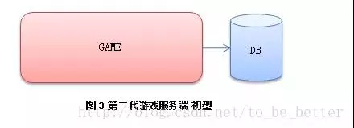

此时游戏服务端已经脱离陈旧的 MUDOS体系，各个公司在参考 MUDOS结构的情况下，开始自己用 C再重新开发自己的游戏服务端。并且**脚本**也抛弃了 LPC，**采用扩展性更好的 Python或者 Lua来代替**。由于主逻辑使用单线程模型，随着游戏内容的增加，传统单服务器的结构进一步成为瓶颈。于是有人开始拆分游戏世界，变为下面的模型：

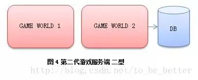

游戏服务器压力拆分后得以缓解，但是两台游戏服务器同时访问数据库，大量重复访问，大量数据交换，使得数据库成为下一个瓶颈。于是形成了**数据库前端代理（DB Proxy）**，游戏服务器不直接访问数据库而是访问代理，再有代理访问数据库，同时提供内存级别的cache。早年 MySQL4之前没有提供存储过程，这个前端代理一般和 MySQL跑在同一台上，它转化游戏服务器发过来的高级数据操作指令，拆分成具体的数据库操作，一定程度上代替了存储过程：

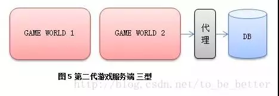

但是这样的结构并没有持续太长时间，因为玩家切换场景经常要切换连接，中间的状态容易错乱。而且游戏服务器多了以后，相互之间数据交互又会变得比较麻烦，于是人们拆分了网络功能，**独立出一个网关服务 Gate**（有的地方叫 Session，有的地方叫 LinkSvr之类的，名字不同而已）：

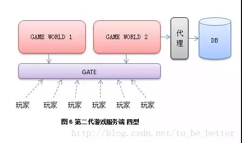

把网络功能单独提取出来，让用户统一去连接一个网关服务器，再有网关服务器转发数据到后端游戏服务器。而游戏服务器之间数据交换也统一连接到网管进行交换。这样类型的服务器基本能稳定的为玩家提供游戏服务，一台网关服务1-2万人，后面的游戏服务器每台服务5k-1w，依游戏类型和复杂度不同而已，图中隐藏了很多不重要的服务器，如登录和管理。这是目前应用最广的一个模型，到今天仍然很多新项目会才用这样的结构来搭建。
人都是有惯性的，按照先前的经验，似乎把 **MUDOS拆分**的越开性能越好。于是大家继续想，**网关可以拆分呀**；**基础服务如聊天交易可以拆分**呀；还可以**提供web接口，数据库可以拆分呀**，于是有了下面的模型：

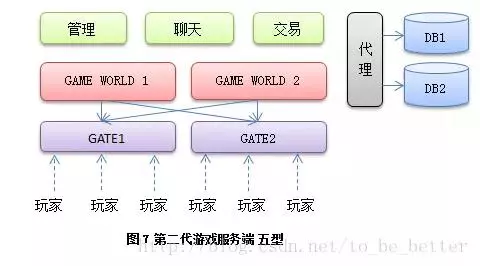

**这样的模型好用么？**确实有成功游戏使用类似这样的架构，并且发挥了它的性能优势，比如一些大型 MMORPG。但是有**两个挑战**：

- 每增加一级服务器，状态机复杂度可能会翻倍，导致研发和找bug的成本上升；
- 并且对开发组挑战比较大，一旦项目时间吃紧，开发人员经验不足，很容易弄挂。

比如我见过某上海一线游戏公司的一个 RPG上来就要上这样的架构，我看了下他们团队成员的经验，问了下他们的上线日期，劝他们用前面稍微简单一点的模型。人家自信得很，认为有成功项目是这么做的，他们也要这么做，自己很想实现一套。于是他们义无反顾的开始编码，项目做了一年多，然后，就没有然后了。
现今在游戏成功率不高的情况下，**一开始上一套比较复杂的架构需要考虑投资回报率**，比如你的游戏上线半年内 PCU会去到多少？如果一个 APRG游戏，每组服务器5千人都到不了的话，那么选择一套更为贴近实际情况的结构更为经济。即使后面你的项目真的超过5千人朝着1万人目标奔的话，相信那个时候你的项目已经挣大钱了 ，你数着钱加着班去逐步迭代，一次次拆分它，相信心里也是乐开花的。
上面这些类型基本都是从拆分 MUDOS开始，将 MUDOS中的各个部件从单机一步步拆成分布式。虽然今天任然很多新项目在用上面某一种类似的结构，或者自己又做了其他热点模块的拆分。因为他们**本质上都是对 MUDOS的分解**，故将他们归纳为第二代游戏服务器。

### 类型4：第三代游戏服务器 2007

从魔兽世界开始无缝世界地图已经深入人心，比较以往游戏玩家走个几步还需要切换场景，每次切换就要等待 LOADING个几十秒是一件十分破坏游戏体验的事情。于是**对于 2005年以后的大型 MMORPG来说，无缝地图已成为一个标准配置**。比较以往按照地图来切割游戏而言，无缝世界并不存在一块地图上面的人有且只由一台服务器处理了：

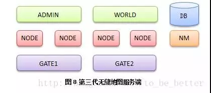

每台 Node服务器用来管理一块地图区域，由 NodeMaster（NM）来为他们提供总体管理。更高层次的 World则提供大陆级别的管理服务。这里省略若干细节服务器，比如传统数据库前端，登录服务器，日志和监控等，统统用 ADMIN概括。在这样的结构下，玩家从一块区域走向另外一块区域需要简单处理一下：

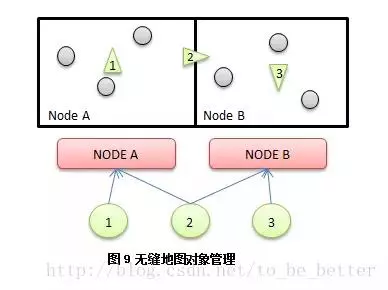

玩家1完全由节点A控制，玩家3完全由节点B控制。而处在两个节点边缘的2号玩家，则同时由A和B提供服务。玩家2从A移动到B的过程中，会同时向A请求左边的情况，并向B请求右边的情况。但是此时玩家2还是属于A管理。直到玩家2彻底离开AB边界很远，才彻底交由B管理。**按照这样的逻辑将世界地图分割为一块一块的区域，交由不同的 Node去管理。**
对于一个 Node所负责的区域，地理上没必要连接在一起，比如大陆的四周边缘部分和高山部分的区块人比较少，可以统一交给一个Node去管理，而这些区块在地理上并没有联系在一起的必要性。一个 Node到底管理哪些区块，可以根据游戏实时运行的负载情况，定时维护的时候进行更改 NodeMaster 上面的配置。
于是碰到第一个问题是很多 Node服务器需要和玩家进行通信，需要问管理服务器特定UID为多少的玩家到底在哪台 Gate上，以前按场景切割的服务器这个问题不大，问了一次以后就可以缓存起来了，但是现在服务器种类增加不少，玩家又会飘来飘去，按UID查找玩家比较麻烦；另外一方面 GATE需要动态根据坐标计算和哪些 Node通信，导致逻辑越来越厚，于是把：**“用户对象”从负责连接管理的 GATE中切割出来**势在必行于是有了下面的模型：

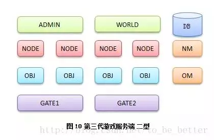

网关服务器再次退回到精简的网络转发功能，而用户逻辑则由按照 UID划分的 OBJ服务器来承担，GATE是按照网络接入时的负载来分布，而 OBJ则是按照资源的编号（UID）来分布，这样和一个用户通信直接根据 UID计算出 OBJ服务器编号发送数据即可。而**新独立出来的 OBJ则提供了更多高层次的服务**：

- **对象移动**：管理具体玩家在不同的 Node所管辖的区域之间的移动，并同需要的 Node进行沟通。
- **数据广播**：Node可以给每个用户设置若干 TAG，然后通知 Object Master 按照TAG广播。
- **对象消息**：通用消息推送，给某个用户发送数据，直接告诉 OBJ，不需要直接和 GATE打交道。
- **好友聊天**：角色之间聊天直接走 OBJ/OBJ MASTER。

整个服务器主体分为三层以后，**NODE专注场景，OBJ专注玩家对象，GATE专注网络。**这样的模型在无缝场景服务器中得到广泛的应用。但是随着时间的推移，负载问题也越来越明显，做个活动，远来不活跃的区域变得十分活跃，靠每周维护来调整还是比较笨重的，于是有了动态负载均衡。
**动态负载均衡有两种方法**，第一种是**按照负载**，由 Node Master 定时动态移动修改一下各个 Node的边界，而不同的玩家对象按照先前的方法从一台 Node上迁移到另外一台 Node上：

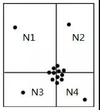

这样 Node Master定时查找地图上的热点区域，计算新的场景切割方式，然后告诉其他服务器开始调整，具体处理方式还是和上面对象跨越边界移动的方法一样。
但是上面这种方式实现相对复杂一些，于是人们设计出了更为简单直接的一种新方法：

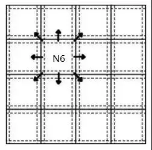

还是将地图按照标准尺寸均匀切割成静态的网格，每个格子由一个具体的Node负责，但是**根据负载情况，能够实时的迁移到其他 Node上。**

在迁移分为三个阶段：准备，切换，完成。三个状态由Node Master负责维护。准备阶段新的 Node开始同步老 Node上面该网格的数据，完成后告诉NM；NM确认OK后同时通知新旧 Node完成切换。完成切换后，如果 Obj服务器还在和老的 Node进行通信，老的 Node将会对它进行纠正，得到纠正的 OBJ将修正自己的状态，和新的 Node进行通信。

很多无缝动态负载均衡的服务端宣称自己支持无限的人数，但不意味着 MMORPG游戏的人数上限真的可以无限扩充，因为这样的体系会受制于网络带宽和客户端性能。**带宽决定了同一个区域最大广播上限，而客户端性能决定了同一个屏幕到底可以绘制多少个角色。**

从无缝地图引入了分布式对象模型开始，已经完全脱离 MUDOS体系，成为一种新的服务端模型。又由于动态负载均衡的引入，让无缝服务器如虎添翼，**容纳着超过上一代游戏服务器数倍的人数上限，并提供了更好的游戏体验**，我们称其为第三代游戏服务端架构。网游以大型多人角色扮演为开端，RPG网游在相当长的时间里一度占据90%以上，使得基于 MMORPG的服务端架构得到了蓬勃的发展，然而随着玩家对RPG的疲惫，各种非MMORPG游戏如雨后春笋般的出现在人们眼前，受到市场的欢迎。

### 类型5：战网游戏服务器

**经典战网服务端和 RPG游戏有两个区别：RPG是分区分服的**，北京区的用户和广州区的用户老死不相往来。而战网，虽然每局游戏一般都是 8人以内，但全国只有一套服务器，所有的玩家都可以在一起游戏，而玩家和玩家之使用 P2P的方式连接在一起，组成一局游戏：

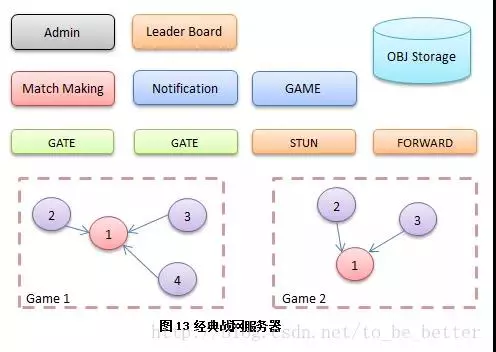

玩家通过 **Match Making 服务器**使用：创建、加入、自动匹配、邀请 等方式组成一局游戏。服务器会选择一个人做 Host，其他人 P2P连接到做主的玩家上来。STUN是帮助玩家之间建立 P2P的牵引服务器，而由于 P2P联通情况大概只有 75%，实在联不通的玩家会通过 Forward进行转发。
大量的连接对战，体育竞技游戏采用类似的结构。P2P有网状模型（所有玩家互相连接），和星状模型（所有玩家连接一个主玩家）。复杂的游戏状态在网状模型下难以形成一致，因此星状P2P模型经受住了历史的考验。除去游戏数据，支持语音的战网系统也会将所有人的语音数据发送到做主的那个玩家机器上，通过混音去重再编码的方式返回给所有用户。
战网类游戏，以竞技、体育、动作等类型的游戏为主，较慢节奏的 RPG（包括ARPG）有本质上的区别，而激烈的游戏过程必然带来到较 RPG复杂的多的同步策略，这样的同步机制往往带来的是很多游戏结果由客户端直接计算得出，那在到处都是破解的今天，**如何保证游戏结果的公正呢？**
主要方法就是**投票法**，所有客户端都会独立计算，然后传递给服务器。如果结果相同就更新记录，如果结果不一致，会采取类似投票的方式确定最终结果。同时记录本剧游戏的所有输入，在可能的情况下，找另外闲散的游戏客户端验算整局游戏是否为该结果。并且记录经常有作弊嫌疑的用户，供运营人员封号时参考。

### 类型6：休闲游戏服务器

休闲游戏同战网服务器类似，都是**全区架构，不同的是有房间服务器，还有具体的游戏服务器**，游戏主体不再以玩家 P2P进行，而是连接到专门的游戏服务器处理：

和战网一样的全区架构，用户数据不能象分区的 RPG那样一次性load到内存，然后在内存里面直接修改。全区架构下，**为了应对一个用户同时玩几个游戏，**用户数据需要区分基本数据和不同的游戏数据，而游戏数据又需要区分积分数据、和文档数据。胜平负之类的积分可以直接提交增量修改，而更为普遍的文档类数据则需要提供读写令牌，写令牌只有一块，读令牌有很多块。同帐号同一个游戏同时在两台电脑上玩时，最先开始的那个游戏获得写令牌，可以操作任意的用户数据。而后开始的那个游戏除了可以提交胜平负积分的增量改变外，对用户数据采用只读的方式，保证游戏能运行下去，但是会提示用户，游戏数据锁定。

### 类型7：现代动作类网游

从早期的韩国动作游戏开始，传统的战网动作类游戏和 RPG游戏开始尝试融合。单纯的动作游戏玩家容易疲倦，留存也没有 RPG那么高；而单纯 RPG战斗却又慢节奏的乏味，无法满足很多玩家激烈对抗的期望，于是**二者开始融合成为新一代的：动作 + 城镇 模式**。玩家在城镇中聚集，然后以开副本的方式几个人出去以动作游戏的玩法来完成各种 RPG任务。**本质就是一套 RPG服务端+副本服务端。**由于每次副本时人物可以控制在8人以内，因此可以获得更为实时的游戏体验，让玩家玩的更加爽快。

### 思考

说了那么多的游戏服务器类型，其实也差不多了，剩下的类型大家拼凑一下其实也就是这个样子而已。**游戏服务端经历了那么多结构上的变迁，内部开发模式是否依然不变？究竟是继续延续传统的开发方式？还是有了更多突破性的方法？经历那么多次架构变迁，后面是否有共通的逻辑？未来的发展还会存在哪些困难？游戏服务端开发如何达到最终的彼岸？**