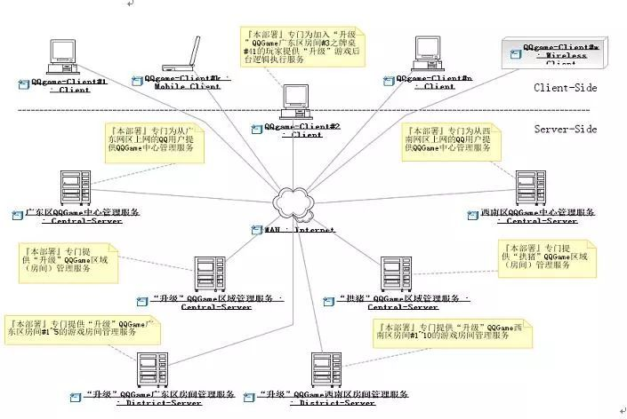
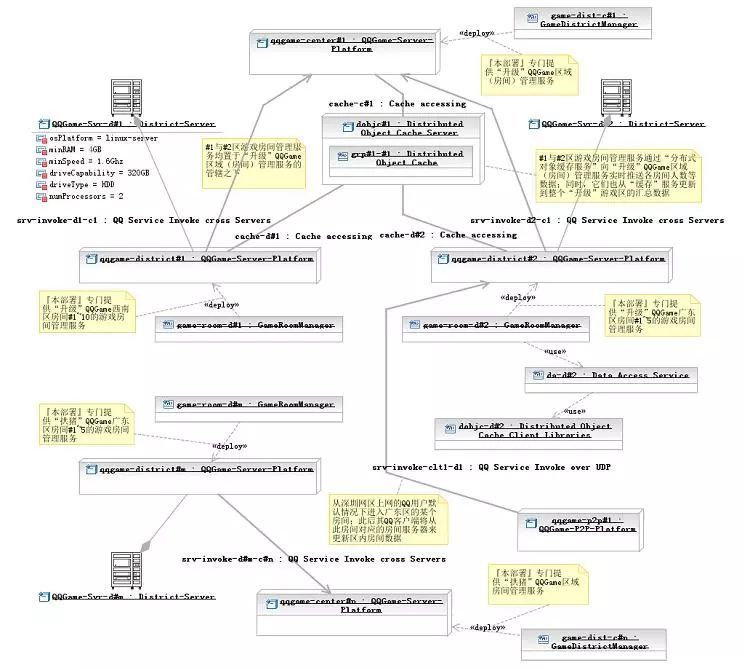
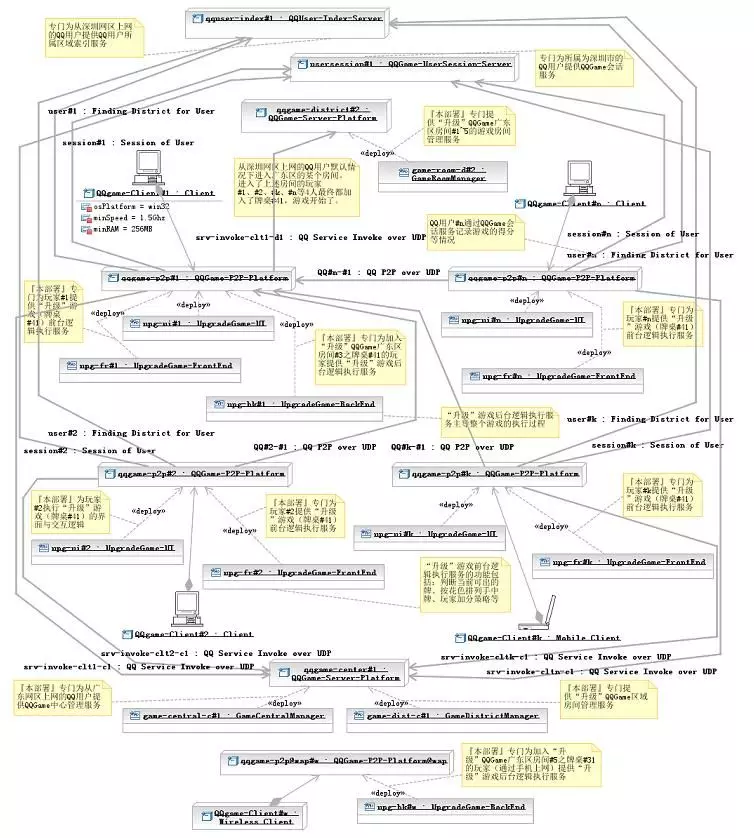
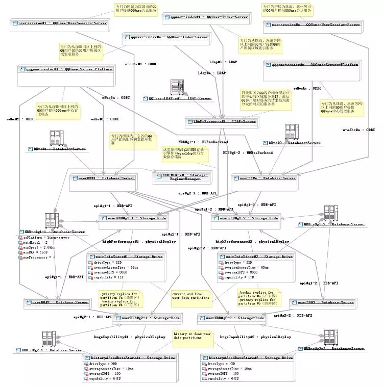

# 6 从腾讯QQgame高性能服务器集群架构看“分而治之”与“自治”等分布式架构设计原则

腾讯QQGame游戏同时在线的玩家数量极其庞大，为了方便组织玩家组队游戏，腾讯设置了大量游戏室（房间），玩家可以选择进入属意的房间，并在此房间内找到可以加入的游戏组（牌桌、棋盘等）。玩家选择进入某个房间时，必须确保此房间当前人数未满（通常上限为400），否则进入步骤将会失败。玩家在登入QQGame后，会从服务器端获取某类游戏下所有房间的当前人数数据，玩家可以据此找到未满的房间以便进入。

如上篇所述的原因，如果待进入房间的人数接近上限时，玩家的进入请求可能失败，这是因为服务器在收到此进入请求之前可能有若干其他玩家也请求进入这个房间，造成房间人数达到上限。

这一问题是无法通过上篇所述调整协作分配的方法来解决的，这是因为：要进入的房间是由玩家来指定的，无法在服务器端完成此项工作，游戏软件必须将服务器端所维护的所有房间人数数据复制到玩家的客户端，并让玩家在界面上看到这些数据，以便进行选择。

这样，上篇所述的客户端与服务器端协作分配原则（谁掌握数据，谁干活），还得加上一些限制条件，并让位于另一个所谓"用户驱动客户端行为"原则--如果某个功能的执行是由用户来推动的，则这个功能的实现应当放在客户端（或者至少由客户端来控制整个协作），并且客户端必须持有此功能所依赖相关数据的副本，这个副本应当尽量与服务器端的源保持同步。

**图一"进入房间"失败示意**

QQGame还存在一个**明显的不足**，就是：玩家如果在游戏一段时间后，离开了某个房间，并且想进入其它房间，这时QQGame并不会刷新所有房间的当前人数，造成玩家据此信息所选的待进入房间往往实际上人数已满，使得进入步骤失败。笔者碰到的最糟情形是重复3、4次以上，才最后成功进入另外某个房间。**此缺陷其实质是完全放弃了客户端数据副本与服务器端的源保持同步的原则。**

实际上，QQGame的开发者有非常充分的理由来为此缺陷的存在进行**辩护**：QQGame同时在线的用户数超过百万甚至千万数量级，如果所有客户端要实时（所谓实时，就玩家的体验容忍度而言，可以定为不超过1秒的延迟）地从服务器端获取更新数据，那么**最终只有一个结果--系统彻底崩溃。**

设想一下每秒千万次请求的吞吐量，以普通服务器每秒上百个请求的处理能力（这个数据是根据服务请求处理过程可能涉及到I/O操作来估值的，纯内存处理的情形可能提高若干数量级），需要成千上万台服务器组成集群方能承受（高可用性挑战）；而随着玩家不断地进入或退出游戏房间，相关数据一直在快速变化中，

- 正向来看，假设有一台中心服务器持有这些数据，那么需要让成千上万台服务器与中心保持这些动态数据的实时同步（数据一致性挑战）；
- 相对应的，逆向来看，玩家进入房间等请求被分配给不同的服务器来处理，一旦玩家进入房间成功则对应服务器内的相关数据被改变，那么假定中的中心服务器就需要实时汇集所有工作服务器内发生的数据变动（数据完整性挑战）。

同时处理上万台服务器的数据同步，**这需要什么样的中心服务器呢？**即使有这样的超级服务器存在，那么**Internet网较大的（而且不稳定的）网络通讯延迟又怎么解决呢？**

对于**软件缺陷**而言，可以**在不同的层面来加以解决**--从设计、到需求、甚至是直接在业务层面来解决（例如，08年北京奥运会网上购票系统，为了解决订票请求拥塞而至系统崩溃的缺陷，最后放弃了原先"先到先得"的购票业务流程，改为：用户先向系统发订票申请，系统只是记录下来而不进行处理，而到了空闲时，在后台随机抽选幸运者，为他们一一完成订票业务）。当然解决方案所处的层面越高，可能就越让人不满意。

就上述进入房间可能遭遇失败的缺陷而言，**最简便的解决方案**就是：在需求层面调整系统的操作方式，即**增加一个类似上篇所述"自动快速加入游戏"的功能--"自动进入房间"功能。**系统在服务器端为玩家找到一个人数较多又未满的房间，并尝试进入（注意，软件需求是由用户的操作目标所驱动的，玩家在此的目标就是尽快加入一个满意的游戏组，因此由系统来替代玩家选择目标房间同样符合相关目标）。而为了方便玩家手工选择要进入的房间，则应当增加一个"刷新当前各房间人数"的功能。另外，**还可以调整房间的组织模式，**例如以地域为单位来划分房间，像深圳（长城宽带）区房间1、四川（电信）房间3、北美区房间1等，在深圳上网的玩家将被系统引导而优先进入深圳区的房间。

不管怎样，解决软件缺陷的王道还是在设计层面。**要解决上述缺陷，架构设计师就必须同时面对高可用、数据一致性、完整性等方面的严峻挑战。**

在思考相关解决方案时，我们将应用若干与高性能服务器集群架构设计相关的一些重要原则。首先是"分而治之"原则，即将大量客户端发出的服务请求进行适当的划分（例如，所有从深圳长城宽带上网的玩家所发出的服务请求分为一组），分别分配给不同的服务器（例如，将前述服务请求分组分配给放置于深圳数据中心的服务器）来加以处理。对于QQGame千万级的并发服务请求数而言，采用Scale Up向上扩展，即升级单个服务器处理能力的方式基本上不予考虑（没有常规的主机能处理每秒上千万的请求）。唯一可行的，只有Scale Out向外扩展，即利用大量服务器集群做负载均衡的方式，这实质上就是"分而治之"原则的具体应用。

**图二 分而治之"下的QQGame游戏服务集群部署**

然而，要应用"分而治之"原则进行Scale Out向外扩展，还依赖于**其它的条件**。如果各服务器在处理被分配的服务请求时，其行为与其它服务器的行为结果产生交叉（循环）依赖，换句话讲就是**共享了某些数据**（**例如**，服务器A处理客户端a发来的进入房间#n请求，而同时，服务器B也在处理客户端b发来的进入房间#n请求，此时服务器A与B的行为存在循环依赖--因为两者要同时访问房间#n的数据，这一共享数据会造成两者间的循环依赖），则各服务器之间必须确保这些共享数据的一致完整性，否则就可能发生逻辑错误（**例如**，假定房间#n的人数差一个就满了，服务器A与B在独自处理的情况下，将同时让客户端a与b的进入请求成功，于是房间#n的最终人数将超出上限）。

而要做到此点，**各服务器的处理进程之间就必须保持同步**（实际上就是排队按先后顺序访问共享数据，**例如**：服务器A先处理，让客户端a进入房间成功，此时房间#n满员；此后服务器B更新到房间#n满的数据，于是客户端b的进入请求处理结果失败），这样，原来将海量请求做负载均衡的意图就彻底失败了，多台服务器的并发处理能力在此与一台实质上并没有区别。

由此，**我们导出了另外一个所谓"处理自治"（或称"行为独立"）的原则**，即所有参与负载均衡的服务器，其处理对应服务请求的行为应当不循环依赖于其它服务器，换句话讲，就是各服务器的行为相对独立（**注意：**在这里，非循环依赖是允许的，下文中我们来分析为什么）。

由此可见，**简单的负载均衡策略对于QQGame而言是解决不了问题的**。我们必须找到一种途径，使得在使用大量服务器进行"分而治之"的同时，同时有确保各个服务器"处理自治"。**此间的关键就在于"分而治之"的"分"字上**。前述将某个地域网段内上网的玩家所发出的服务请求分到一组，并分配给同一服务器的做法，其目的不外乎是尽可能地减少网络通讯延迟带来的负面影响。但它不能满足"处理自治"的要求，为了确保自治，应当让同一台服务器所处理的请求本身是"自治"（准确的说法是"自闭包"Closure）的。同一台服务器所处理的所有请求组成一个服务请求集合，这个集合如果与其它任何与其无交集的（请求）集合（包含此集合的父集合除外）不循环依赖，则此服务请求集合是"自闭包"的，而处理此请求集合的服务器，其"行为独立"。

我们可以将针对同一房间的进入请求划分到同一服务请求分组，这些请求相互之间当然是存在循环依赖的，但与其它分组中的请求却不存在循环依赖（本房间内人数的变化不会影响到其它房间），而将它们都分配给同一服务器（不妨命名为"房间管理服务器"，简称"房间服务器"）后，那个服务器将是"处理自治"的。

**图三 满足"处理自治"条件的QQ游戏区域"房间管理"服务部署**

那么接下来要解决的问题，就是玩家所关注的某个游戏区内，所有房间当前人数数据的**实时更新问题**。其解决途径与上述的方法类似，我们还是**将所有获取同一区内房间数据的服务请求归为一组，并交给同一服务器处理。**与上文所述场景不同的是，这个服务器需要实时汇集本区内所有房间服务器的房间人数数据。我们可以让每个房间服务器一旦发生数据变更时，就向此服务器（不妨命名为"游戏区域管理服务器"，简称"区服务器"）推送一个变更数据记录，而推送的数据只需包含房间Id和所有进入的玩家Id（房间服务器还包含其它细节数据，例如牌桌占位数据）便可。

另外，由于一个区内的玩家数可能是上十万数量级，一个服务器根本承担不了此种负荷，那么**怎么解决这一矛盾呢？**如果深入分析，我们会发现，更新区内房间数据的请求是一种数据只读类请求，它不会对服务器状态造成变更影响，因此这些请求相互间不存在依赖关系；这样，我们可以将它们再任意划分为更小的分组，而同时这些分组仍然保持"自闭包"特性，然后分配给不同的区服务器。**多台区服务器来负责同一区的数据更新请求**，负载瓶颈被解决。

当然，此前，**还需将这些区服务器分为1台主区服务器和n台从属区服务器**；主区服务器负责汇集本区内所有房间服务器的房间人数数据，从属区服务器则从主区服务器实时同步区房间数据副本。

更好的做法，则是如『图五』所示，由房间服务器来充当从属区服务器的角色，玩家进入某个房间后，在玩家进入另外一个房间之前，其客户端都将从此房间对应的房间服务器来更新区内房间数据。要注意的是，图中房间服务器的数据更新利用了所谓的"分布式对象缓存服务"。

玩家进入某个房间后，还要加入某个游戏组才能玩游戏。上篇所述的方案，是让第一个加入某个牌桌的用户，其主机自动充当本牌桌的游戏服务器；而其它玩家要加入此牌桌，其加入请求应当发往第一个加入的用户主机；此后开始游戏，其对弈过程将由第一个加入用户的主机来主导执行。

那么此途径是否同样也符合上述的前两个设计原则呢？游戏在执行的过程中，根据输赢结果，玩家要加分或减分，同时还要记录胜负场数。这些数据必须被持久化（比如在数据库中保存下来），因此游戏服务器（『图六』中的设计，是由4个部署于QQ客户端的"升级"游戏前台逻辑执行服务，加上1个"升级"游戏后台逻辑执行服务，共同组成一个牌桌的"升级"游戏服务）在处理相关游戏执行请求时，将依赖于玩家游戏账户数据服务（『图六』中的所谓"QQGame会话服务"）；

不过这种依赖是非循环的，即玩家游戏账户数据服务器的行为反过来并不依赖于游戏服务器。上文中曾提到，"处理自治"原则中非循环依赖是允许的。这里游戏服务器在处理游戏收盘请求时，要调用玩家游戏账户数据服务器来更新相关数据；因为不同玩家的游戏账户数据是相互独立的，此游戏服务器在调用游戏账户数据服务器时，逻辑上不受其它游戏服务器调用游戏账户数据服务器的影响，不存在同步等待问题；所以，游戏服务器在此能够达成负载均衡的意图。
**点击图片可以放大**

**图****四 存在"非循环依赖"的QQ游戏客户端P2P服务与交互逻辑部署**

不过，在上述场景中，虽然不存在同步依赖，但是**性****能依赖还是存在的**，游戏账户数据服务器的处理性能不够时，会造成游戏服务器长时间等待。为此，我们**可以应用分布式数据库表水平分割的技术，**将QQ玩家用户以其登记的行政区来加以分组，并部署于对应区域的数据库中（例如，深圳的玩家数据都在深圳的游戏账户数据库中）。

**点击图片可以放大**

**图五 满足"自闭包"条件的QQ分布式数据库（集群）部署**

实际上，我们由此还可以推论出一个数据库表水平分割的原则--任何数据库表水平分割的方式，必须确保同一数据库实例中的数据记录是"自闭包"的，即**不同数据库实例中的数据记录相互间不存在循环依赖。**

总之，初步满足QQGame之苛刻性能要求的分布式架构现在已经是初具雏形了，但仍然有很多涉及性能方面的细节问题有待解决。例如，Internet网络通讯延迟的问题、服务器之间协作产生的性能瓶颈问题等等。笔者将在下篇中继续深入探讨这些话题。