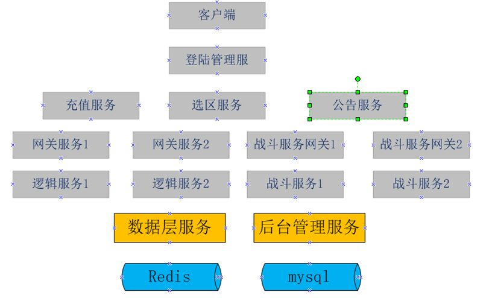

# 8 大型多人在线游戏服务器架构设计

由于大型多人在线游戏服务器理论上需要支持无限多的玩家，所以对服务器端是一个非常大的考验。服务器必须是**安全的，可维护性高的，可伸缩性高的，可负载均衡的，支持高并发请求的**。面对这些需求，我们在设计服务器的时候就需要慎重考虑，特别是架构的设计，如果前期设计不好，最后面临的很可能是重构。

一款游戏服务器的架构都是慢慢从小变大的，不可能一下子就上来一个完善的服务器构架，目前流行的说法是游戏先上线，再扩展。所以说我们在做架构的时候，一定要把底层的基础组件做好，方便以后扩展，但是刚开始的时候留出一些接口，并不实现它，将来游戏业务的发展，再慢慢扩展。当然，如果前期设计的不好，后期业务扩展了，但架构没办法扩展，只能加班加点搞了。

面对庞大的数据量我们想到的唯一个解决方案就是分而治之，即采用**分布式**的方式去解决它。把紧凑独立的功能单独拿出来做。分担到不同的物理服务器上面去运行。而且做到可以动态扩展。这就需要我们考虑好模块的划分，尽量要业务独立，关联性低。

前期，由于游戏需要尽快上线，开发周期短，我们需要把服务尽快的跑起来，这个时候的目标应该是尽快完成测试版本开发，单台服务器支持的人数可以稍微低一些，但是当人数暴涨时，我们可以能过多开几组服务来支持新增涨的用户量，即可以平衡扩展就可以了。到后期我们再把具体的模块单独拿出来支持，比如前期逻辑服务器上包括:活动，关卡，背包，技能，好友管理等。后期我们可以把好友，背包管理或其它的单独做一个服务进程，部署在不同的物理服务器上面。我们先按分区的服务进行设计，后面在部署的时候可以部署为世界服务器，下面是一个前期的架构图，下面我们从每个服务器的功能说起：

# 

### 1，登陆管理服务

负责用户的登陆验证，如果有注册功能的话，也可以放在这里。一般手机游戏直接走**sdk验证**。网页游戏和客户端游戏会有注册功能，也可以叫用户管理服务。

**1.1 用户登陆验证**
负责接收客户端的用户登陆请求，验证账号的合法性，是否在黑名单（被封号的用户），是否在白名单（一般是测试账号，服务未开启时也可以进入）。如果是sdk登陆，此服务向第三方服务发起回调请求。

**1.2 登陆安全加密**
使用加密的传输协议，见通信协议部分。

**1.3 是否在白名单内**
白名单是给内部测试人员使用的，在服务器未开启的状态下，白名单的用户可以提前进入游戏进行游戏测试。

**1.4 判断是否在黑名单**
黑名单的用户是禁止登陆的，一般这是一些被封号的用户，拒绝登陆。

**1.5 登陆验证**
服务器使用私钥解密密码，进行验证，如果是sdk登陆，则直接向第三方服务发起回调。

**1.6 登陆令牌（token）生成**
当用户登陆验证成功之后，服务器端需要生成一个**登陆令牌token**,这个token具有时效性，当用户客户端拿到这个token之后，如果在一定时间内没有登陆游戏成功，那么这个token将失败，用户需要重新申请token,token存储在登陆服务这，向外提供用户是否已登陆的接口，其它服务器想验证如果是否登陆，就拿那个服务收到的token来此验证。

**1.7 显示用户角色信息**
当用户登陆成功之后，显示最近登陆的角色信息。

### 2，显示公告

用户登陆成功之后，请求公告服务器，获取最新的公告，公告服务先根据**token**和**Userid**验证用户是否已登陆，公告有可能根据渠道的不同，显示不同的公告。所以 公告一定是要可以根据渠道编辑的。

### 3，选区服务

当用户登陆成功之后，请求服务器分区列表服务器，显示当前所有的大区列表。

**3.1 验证用户是否已登陆**
向登陆服务器请求验证是否已登陆。

**3.2 大区列表显示**
大区列表信息中只显示大区id和大区名称。这样做是为了安全考虑，不一次性把大区对应的网关ip和端口暴露出来，也可以减少网络的传输量。

**3.3** 
用户点击选择某个大区，客户端拿到大区id再向选区服务请求获取此大区对应的网关ip地址和端口。根据负载算法计算得出。

**3.4 网关的选择**
选区服务会维护一份网关的配置列表。一个大区对应一到多个网关，当配置有多个网关时，需要定时检测各个网关是否连接正常，如果发现有网关连接不上，需要把大区对应的网关信息设置为无效，不再参与网关的分配，并发出报警。
一般对于网关的选择，可以使用用户**id求余法加虚网关节点法**。这样在网关节点数量固定的情况下，一个用户总是会被分配到同一个网关上面。但是如果只是使用求余法的话，可能会造成用户分布不均衡，这里可以通过增加网关的虚拟节点（其它就是增加某个网关的权重，让用户多来一些到这个网关上面），这个可以参考哈稀一致性算法。包括后面说到的一个网关对应多个逻辑服务器，也可以使用同样的方法。这部分可以抽象出来一个模块使用。

**3.5**
选区服务对内要提供修改服务器状态的接口，比如维护中…

### 4，登陆网关

**4.1 建立连接**
收到客户端的建立连接请求之后，记录此channel和对应的连接建立时间。并设置如果在一定时间内未收到登陆请求，则断开连接。返回给客户端登陆超时。

**4.2 登陆请求**
收到登陆请求后，移除记录的channelid信息，向登陆服务器验证用户是否已登陆过,并向外广播用户角色登陆成功的消息。

**4.3**
登陆成功后，接收网关的其它的消息

**4.4 客户端消息合法性验证**
在向逻辑服务器转发消息之前验证消息的合法性，具体验证方法见协议安全验 证。

**4.5**
将客户端消息转发送到对应的逻辑服务器。

### 5 通信协议

**5.1协议序列化和返回序列化**
可以直接使用**protobuf**，直接对协议进行序列化和反序列化。

**5.2协议组成**
**5.2.1 包头构成**
包总长度，加密字符串长度，加密字符串内容，userId,playerId,版本号，内包内容。
**5.2.2 包体组成**
请求的逻辑信息，是protobuf后对应的二进制数据。

| 包总长度 | 加密内容 | UserId | playerId | 请求序列id | 版本号 | 内包内容 |
| -------- | -------- | ------ | -------- | ---------- | ------ | -------- |
| Int      | 64       | Long   | Long     | Long       | int    | varchar  |
| 4        | 64       | 8      | 8        | 8          | 4      | 变长     |

**5.3 协议内容加密**
如果协议明文传输的话，被篡改的风险就非常大，所以我们要对传输协议进行加密传输，由于协议内容大小不固定，为了保证效率，采用对称加密算法，首先客户端使用**AES**的公钥对消息内容加密（上表中userid之后的信息），客户端把加密后的报文发送到服务器端。AES的公钥在用户第一次连接时获取。

**5.4 协议完整性验证**
尽管我们对消息做了加密，但也不是万无一失的，为了进一步确保消息没有被篡改，我们需要对消息的完整性进行检测，使用数字摘要的方式，首先客户端对userid及之后的协议信息进行AES加密，加密之后取它的**md5**值，md5值用于验证数据的完整性。这个md5值会被传送到服务器，如果协议信息被修改了，那个md5就会不同。

**5.5 保证md5数字摘要的值的安全**
为了防止非法用户修改协议内容后，模拟客户端操作重新生成新的数字摘要信息，我们对生成的数字摘要信息进行二次加密，这次使用**RSA**的公钥对md5的值进行加密，将加密的内容和其它信息一起发送到服务器。服务器根据ip向登陆服务器拿到AES的公钥和RSA的私钥，先用RSA 私钥取出客户端加密的md5值，服务器端计算userid后面的数据的md5值，如果两个md5值一样，说明安全的。如果不一样，说明用户是非法的，加入黑名单。因为RAS使用公钥加密，必须使用对应的私钥才能解密，而且不同的公钥对应的私钥不同，这样就算非法用户重新生成了数字摘要，在服务器端也是验证不通过的。

**5.6 取出明文信息**
当服务器收到报文后，对报文进行数子摘要验证通过之后，服务器端使用用户自己对应的AES的公钥，解密数据，获得明文数据。为了保证安全，每个用户的AES公钥可能不一样。

### 6 发布订阅服务

发布订阅是一种分布式的解耦方式，它使用模块更加独立，模块间的数据交互更加方便，发布订阅模式是一种一对多的关系，发布方不关心谁订阅了它，只要想获得它发布的消息的服务，都可以去订阅它。发布方式是异步的，它增强了系统的处理性能，增加了系统的吞吐量。目前的大多数消息队列都支持发布订阅模式，比如**rabbitmq,activemq,kafka**等消息队列。发布订阅服务可以单独部署，增强了系统的扩展性和稳定性。

### 7，RPC调用

在服务器内部不同的服务有时候需要信息交互。为了方便服务之间的调用，我们引入了**RPC**的概念。客户端调用一个api之后，底层会把此调用发送到远程的服务上处理，远程服务处理完之后再返回结果。rpc的作用就是封装底层协议的序列化和反序列化，它让用户感觉不到调用被发送到了远程服务，而感觉还是在本地一样

**7.1 同步rpc**
当调用一个同步的rpc之后，结果并不是立刻返回，而是在等待rpc服务器端的返回。同步rpc可以直接使用带同步的socket实现。或者http请求。另一种方式是调用rpc方法之后，在本地自旋，直到服务端返回。

**7.2 异步rpc**
异步rpc调用之后，结果是立刻返回的，它的处理方式是把业务放在回调方法里面，而不是一直占用线程在那里等待数据的返回，这样就可以记空闲的线程去处理另外的消息，当消息从服务器端返回后，会去调用那个回调方法。

### 8，合服要提前设计好

现在大多数的游戏都是分区分服的，经过一段时间的运营之后，有些老的大区可能在线人数非常的少了，为了节约成本，首先会在一台物理机器上运行多个大区对应的进程，再过一段时间，可能需要把不同区的数据合并起来到一个数据库中。而对用户来说是感觉不到变化的。
为什么说合服要提交设计好呢?因为如果设计不好，后期在合服的时候会遇到很多问题， 比如用户唯一主键问题，表与表主键关联重复问题，那么在合服存在的情况下，如何保证用户的唯一性呢，也就是我一个用户在两个大区都建立了账号，这个时候userid是一样的，还有一个角色id，如果角色id不是全局唯一的，也可能重复。而角色id如果参与了表外键设计，一重复数据就乱了。
首先，要保证**用户的唯一性**。而且各个表的外键引用也必须是唯一的，即合服之后不会再发生改变。那么有几个键需要全局唯一，**userid（用户id）**，**roleId(角色id)**，为了区分用户原来所在的区，需要记录角色所在的大区id,所以一个userid和一个大区id来确定一个唯一的角色id,而角色的其它信息使用角色id做外键引用。这样合服就可以直接把两个库的数据合并到一起了。
这个只是用角色数据举个例子，在数据库中，凡是独立存在的，最好都使用全局唯一id，比如公会，每个服都会有公会，但每个服的公会id不能都是从一开始，即不能使用数据库自增的方式。