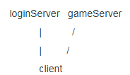
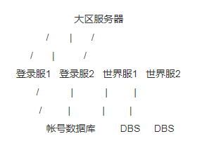
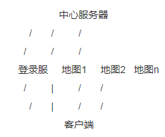
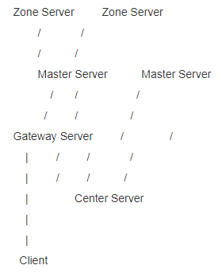
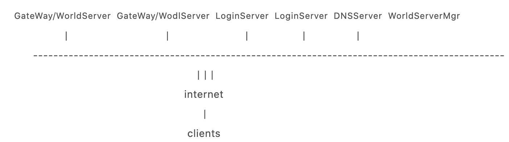

# 9 百万用户级游戏服务器架构设计

### 服务器结构探讨 -- 最简单的结构

所谓服务器结构，也就是如何将服务器各部分合理地安排，以实现最初的功能需求。所以，结构本无所谓正确与错误；当然，优秀的结构更有助于系统的搭建，对系统的可扩展性及可维护性也有更大的帮助。

好的结构不是一蹴而就的，而且每个设计者心中的那把尺都不相同，所以这个优秀结构的定义也就没有定论。在这里，我们不打算对现有游戏结构做评价，而是试着从头开始搭建一个我们需要的**MMOG结构**。

对于一个最简单的游戏服务器来说，它只需要能够接受来自客户端的连接请求，然后处理客户端在游戏世界中的移动及交互，也即游戏逻辑处理即可。如果我们把这两项功能集成到一个服务进程中，则最终的结构很简单：


嗯，太简单了点，这样也敢叫服务器结构？好吧，现在我们来往里面稍稍加点东西，让它看起来更像是服务器结构一些。

一般来说，我们在接入游戏服务器的时候都会要提供一个帐号和密码，验证通过后才能进入。关于为什么要提供用户名和密码才能进入的问题我们这里不打算做过多讨论，云风曾对此也提出过类似的疑问，并给出了只用一个标识串就能进入的设想，有兴趣的可以去看看他们的讨论。但不管是采用何种方式进入，照目前看来我们的服务器起码得提供一个帐号验证的功能。

我们把观察点先集中在一个大区内。在大多数情况下，一个大区内都会有多组游戏服，也就是多个游戏世界可供选择。简单点来实现，我们完全可以抛弃这个大区的概念，认为一个大区也就是放在同一个机房的多台服务器组，各服务器组间没有什么关系。这样，我们可为每组服务器单独配备一台登录服。最后的结构图应该像这样：



该结构下的玩家操作流程为，先选择大区，再选择大区下的某台服务器，即某个游戏世界，点击进入后开始帐号验证过程，验证成功则进入了该游戏世界。但是，如果玩家想要切换游戏世界，他只能先退出当前游戏世界，然后进入新的游戏世界重新进行帐号验证。

早期的游戏大都采用的是这种结构，有些游戏在实现时采用了一些技术手段使得在切换游戏服时不需要再次验证帐号，但整体结构还是未做改变。

该结构存在一个服务器资源配置的问题。因为登录服处理的逻辑相对来说比较简单，就是将玩家提交的帐号和密码送到数据库进行验证，和生成会话密钥发送给游戏服和客户端，操作完成后连接就会立即断开，而且玩家在以后的游戏过程中不会再与登录服打任何交道。这样处理短连接的过程使得系统在大多数情况下都是比较空闲的，但是在某些时候，由于请求比较密集，比如开新服的时候，登录服的负载又会比较大，甚至会处理不过来。

另外在实际的游戏运营中，有些游戏世界很火爆，而有些游戏世界却非常冷清，甚至没有多少人玩的情况也是很常见的。所以，我们能否更合理地配置登录服资源，使得整个大区内的登录服可以共享就成了下一步改进的目标。

### 服务器结构探讨 -- 登录服的负载均衡

回想一下我们在玩wow时的操作流程：运行wow.exe进入游戏后，首先就会要求我们输入用户名和密码进行验证，验证成功后才会出来游戏世界列表，之后是排队进入游戏世界，开始游戏…

可以看到跟前面的描述有个很明显的不同，那就是要先验证帐号再选择游戏世界。这种结构也就使得登录服不是固定配备给个游戏世界，而是全区共有的。

我们可以试着从实际需求的角度来考虑一下这个问题。正如我们之前所描述过的那样，登录服在大多数情况下都是比较空闲的，也许我们的一个拥有20个游戏世界的大区仅仅使用10台或更少的登录服即可满足需求。而当在开新区的时候，或许要配备40台登录服才能应付那如潮水般涌入的玩家登录请求。所以，登录服在设计上应该能满足这种动态增删的需求，我们可以在任何时候为大区增加或减少登录服的部署。

当然，在这里也不会存在要求添加太多登录服的情况。还是拿开新区的情况来说，即使新增加登录服满足了玩家登录的请求，游戏世界服的承载能力依然有限，玩家一样只能在排队系统中等待，或者是进入到游戏世界中导致大家都卡。

另外，当我们在增加或移除登录服的时候不应该需要对游戏世界服有所改动，也不会要求重启世界服，当然也不应该要求客户端有什么更新或者修改，一切都是在背后自动完成。

最后，有关数据持久化的问题也在这里考虑一下。一般来说，使用现有的商业数据库系统比自己手工技术先进要明智得多。我们需要持久化的数据有玩家的帐号及密码，玩家创建的角色相关信息，另外还有一些游戏世界全局共有数据也需要持久化。

好了，需求已经提出来了，现在来考虑如何将其实现。

对于负载均衡来说，已有了成熟的解决方案。一般最常用，也最简单部署的应该是基于**DNS的负载均衡系统**了，其通过在DNS中为一个域名配置多个IP地址来实现。最新的DNS服务已实现了根据服务器系统状态来实现的动态负载均衡，也就是实现了真正意义上的负载均衡，这样也就有效地解决了当某台登录服当机后，DNS服务器不能立即做出反应的问题。当然，如果找不到这样的解决方案，自己从头打造一个也并不难。而且，通过DNS来实现的负载均衡已经包含了所做的修改对登录服及客户端的透明。

而对于数据库的应用，在这种结构下，登录服及游戏世界服都会需要连接数据库。从数据库服务器的部署上来说，可以将帐号和角色数据都放在一个中心数据库中，也可分为两个不同的库分别来处理，基到从物理上分到两台不同的服务器上去也行。

但是对于不同的游戏世界来说，其角色及游戏内数据都是互相独立的，所以一般情况下也就为每个游戏世界单独配备一台数据库服务器，以减轻数据库的压力。所以，整体的服务器结构应该是一个大区有一台帐号数据库服务器，所有的登录服都连接到这里。而每个游戏世界都有自己的游戏数据库服务器，只允许本游戏世界内的服务器连接。

最后，我们的服务器结构就像这样：



这里既然讨论到了大区及帐号数据库，所以顺带也说一下关于激活大区的概念。wow中一共有八个大区，我们想要进入某个大区游戏之前，必须到官网上激活这个区，这是为什么呢？

一般来说，在各个大区帐号数据库之上还有一个总的帐号数据库，我们可以称它为中心数据库。比如我们在官网上注册了一个帐号，这时帐号数据是只保存在中心数据库上的。而当我们要到一区去创建角色开始游戏的时候，在一区的帐号数据库中并没有我们的帐号数据，所以，我们必须先到官网上做一次激活操作。这个激活的过程也就是从中心库上把我们的帐号数据拷贝到所要到的大区帐号数据库中。

### 服务器结构探讨 -- 简单的世界服实现

讨论了这么久我们一直都还没有进入游戏世界服务器内部，现在就让我们来窥探一下里面的结构吧。

对于现在大多数MMORPG来说，游戏服务器要处理的基本逻辑有移动、聊天、技能、物品、任务和生物等，另外还有地图管理与消息广播来对其他高级功能做支撑。如纵队、好友、公会、战场和副本等，这些都是通过基本逻辑功能组合或扩展而成。

在所有这些基础逻辑中，与我们要讨论的服务器结构关系最紧密的当属地图管理方式。决定了地图的管理方式也就决定了我们的服务器结构，我们仍然先从最简单的实现方式开始说起。

回想一下我们曾战斗过无数个夜晚的暗黑破坏神，整个暗黑的世界被分为了若干个独立的小地图，当我们在地图间穿越时，一般都要经过一个叫做传送门的装置。世界中有些地图间虽然在地理上是直接相连的，但我们发现其游戏内部的逻辑却是完全隔离的。可以这样认为，一块地图就是一个独立的数据处理单元。

既然如此，我们就把每块地图都当作是一台独立的服务器，他提供了在这块地图上游戏时的所有逻辑功能，至于内部结构如何划分我们暂不理会，先把他当作一个黑盒子吧。

当两个人合作做一件事时，我们可以以对等的关系相互协商着来做，而且一般也都不会有什么问题。当人数增加到三个时，我们对等的合作关系可能会有些复杂，因为我们每个人都同时要与另两个人合作协商。正如俗语所说的那样，三个和尚可能会碰到没水喝的情况。当人数继续增加，情况就变得不那么简单了，我们得需要一个管理者来对我们的工作进行分工、协调。游戏的地图服务器之间也是这么回事。

一般来说，我们的游戏世界不可能会只有一块或者两块小地图，那顺理成章的，也就需要一个地图管理者。先称它为游戏世界的中心服务器吧，毕竟是管理者嘛，大家都以它为中心。

中心服务器主要维护一张地图ID到地图服务器地址的映射表。当我们要进入某张地图时，会从中心服上取得该地图的IP和port告诉客户端，客户端主动去连接，这样进入他想要去的游戏地图。在整个游戏过程中，客户端始终只会与一台地图服务器保持连接，当要切换地图的时候，在获取到新地图的地址后，会先与当前地图断开连接，再进入新的地图，这样保证玩家数据在服务器上只有一份。

我们来看看结构图是怎样的：



很简单，不是吗。但是简单并不表示功能上会有什么损失，简单也更不能表示游戏不能赚钱。早期不少游戏也确实采用的就是这种简单结构。

### 服务器结构探讨 -- 继续世界服

都已经看出来了，这种每切换一次地图就要重新连接服务器的方式实在是不够优雅，而且在实际游戏运营中也发现，地图切换导致的卡号，复制装备等问题非常多，这里完全就是一个事故多发地段，如何避免这种频繁的连接操作呢？

最直接的方法就是把那个图倒转过来就行了。客户端只需要连接到中心服上，所有到地图服务器的数据都由中心服来转发。很完美的解决方案，不是吗？

这种结构在实际的部署中也遇到了一些挑战。对于一般的MMORPG服务器来说，单台服务器的承载量平均在2000左右，如果你的服务器很不幸地只能带1000人，没关系，不少游戏都是如此；如果你的服务器上跑了3000多玩家依然比较流畅，那你可以自豪地告诉你的策划，多设计些大量消耗服务器资源的玩法吧，比如大型国战、公会战争等。

2000人，似乎我们的策划朋友们不大愿意接受这个数字。我们将地图服务器分开来原来也是想将负载分开，以多带些客户端，现在要所有的连接都从中心服上转发，那连接数又遇到单台服务器的可最大承载量的瓶颈了。

这里有必要再解释下这个数字。我知道，有人一定会说，才带2000人，那是你水平不行，我随便写个TCP服务器都可带个五六千连接。问题恰恰在于你是随便写的，而MMORPG的服务器是复杂设计的。如果一个演示socket API用的echo服务器就能满足MMOG服务器的需求，那写服务器该是件多么惬意的事啊。

但我们所遇到的事实是，服务器收到一个移动包后，要向周围所有人广播，而不是echo服务器那样简单的回应；服务器在收到一个连接断开通知时要向很多人通知玩家退出事件，并将该玩家的资料写入数据库，而不是echo服务器那样什么都不需要做；服务器在收到一个物品使用请求包后要做一系列的逻辑判断以检查玩家有没有作弊；服务器上还启动着很多定时器用来更新游戏世界的各种状态……

其实这么一比较，我们也看出资源消耗的所在了：服务器上大量的复杂的逻辑处理。再回过头来看看我们想要实现的结构，我们既想要有一个唯一的入口，使得客户端不用频繁改变连接，又希望这个唯一入口的负载不会太大，以致于接受不了多少连接。

仔细看一看这个需求，我们想要的仅仅只是一台管理连接的服务器，并不打算让他承担太多的游戏逻辑。既然如此，那五六千个连接也还有满足我们的要求。至少在现在来说，一个游戏世界内，也就是一组服务器内同时有五六千个在线的玩家还是件让人很兴奋的事。事实上，在大多数游戏的大部分时间里，这个数字也是很让人眼红的。

什么？你说梦幻、魔兽还有史先生的那个什么征途远不止这么点人了！噢，我说的是大多数，是大多数，不包括那些明星。你知道大陆现在有多少游戏在运营吗？或许你又该说，我们不该在一开始就把自己的目标定的太低！好吧，我们还是先不谈这个。

继续我们的结构讨论。一般来说，我们把这台负责连接管理的服务器称为网关服务器，因为内部的数据都要通过这个网关才能出去，不过从这台服务器提供的功能来看，称其为反向代理服务器可能更合适。我们也不在这个名字上纠缠了，就按大家通用的叫法，还是称他为网关服务器吧。

网关之后的结构我们依然可以采用之前描述的方案，只是，似乎并没有必要为每一个地图都开一个独立的监听端口了。我们可以试着对地图进行一些划分，由**一个Master Server来管理一些更小的Zone Server**，玩家通过网关连接到Master Server上，而实际与地图有关的逻辑是分派给更小的Zone Server去处理。

最后的结构看起来大概是这样的：




### 服务器结构探讨 -- 最终的结构

如果我们就此打住，可能马上就会有人要嗤之以鼻了，就这点古董级的技术也敢出来现。好吧，我们还是把之前留下的问题拿出来解决掉吧。

一般来说，当某一部分能力达不到我们的要求时，最简单的解决方法就是在此多投入一点资源。既然想要更多的连接数，那就再加一台网关服务器吧。新增加了网关服后需要在大区服上做相应的支持，或者再简单点，有一台主要的网关服，当其负载较高时，主动将新到达的连接重定向到其他网关服上。

而对于游戏服来说，有一台还是多台网关服是没有什么区别的。每个代表客户端玩家的对象内部都保留一个代表其连接的对象，消息广播时要求每个玩家对象使用自己的连接对象发送数据即可，至于连接是在什么地方，那是完全透明的。当然，这只是一种简单的实现，也是普通使用的一种方案，如果后期想对消息广播做一些优化的话，那可能才需要多考虑一下。

既然说到了优化，我们也稍稍考虑一下现在结构下可能采用的优化方案。

首先是当前的Zone Server要做的事情太多了，以至于他都处理不了多少连接。这其中最消耗系统资源的当属生物的AI处理了，尤其是那些复杂的寻路算法，所以我们可以考虑把这部分AI逻辑独立出来，由一台单独的AI服务器来承担。

然后，我们可以试着把一些与地图数据无关的公共逻辑放到Master Server上去实现，这样Zone Server上只保留了与地图数据紧密相关的逻辑，如生物管理，玩家移动和状态更新等。

还有聊天处理逻辑，这部分与游戏逻辑没有任何关联，我们也完全可以将其独立出来，放到一台单独的聊天服务器上去实现。

最后是数据库了，为了减轻数据库的压力，提高数据请求的响应速度，我们可以在数据库之前建立一个数据库缓存服务器，将一些常用数据缓存在此，服务器与数据库的通信都要通过这台服务器进行代理。缓存的数据会定时的写入到后台数据库中。

好了，做完这些优化我们的服务器结构大体也就定的差不多了，暂且也不再继续深入，更细化的内容等到各个部分实现的时候再探讨。

好比我们去看一场晚会， 
舞台上演员们按着预定的节目单有序地上演着，但这就是整场晚会的全部吗？显然不止，在幕后还有太多太多的人在忙碌着，甚至在晚会前和晚会后都有。我们的游戏服务器也如此。

在之前描述的部分就如同舞台上的演员，是我们能直接看到的，幕后的工作人员我们也来认识一下。

现实中有警察来维护秩序，游戏中也如此，这就是我们常说的GM。GM可以采用跟普通玩家一样的拉入方式来进入游戏，当然权限会比普通玩家高一些，也可以提供一台GM服务器专门用来处理GM命令，这样可以有更高的安全性，GM服一般接在中心服务器上。

在以时间收费的游戏中，我们还需要一台计费的服务器，这台服务器一般接在网关服务器上，注册玩家登录和退出事件以记录玩家的游戏时间。

任何为用户提供服务的地方都会有日志记录，游戏服务器当然也不例外。从记录玩家登录的时间，地址，机器信息到游戏过程中的每一项操作都可以作为日志记录下来，以备查错及数据挖掘用。至于搜集玩家机器资料所涉及到的法律问题不是我们该考虑的。

差不多就这么多了吧，接下来我们会按照这个大致的结构来详细讨论各部分的实现。

### 服务器结构探讨 —— 一点杂谈

再强调一下，服务器结构本无所谓好坏，只有是否适合自己。我们在前面探讨了一些在现在的游戏中见到过的结构，并尽我所知地分析了各自存在的一些问题和可以做的一些改进，希望其中没有谬误，如果能给大家也带来些启发那自然更好。

突然发现自己一旦罗嗦起来还真是没完没了。接下来先说说我在开发中遇到过的一些困惑和一基础问题探讨吧，这些问题可能有人与我一样，也曾遇到过，或者正在被困扰中，而所要探讨的这些基础问题向来也是争论比较多的，我们也不评价其中的好与坏，只做简单的描述。

首先是服务器操作系统，linux与windows之争随处可见，其实在大多数情况下这不是我们所能决定的，似乎各大公司也基本都有了自己的传统，如网易的freebsd，腾讯的linux等。如果真有权利去选择的话，选自己最熟悉的吧。

决定了OS也就基本上确定了网络IO模型，windows上的**IOCP**和linux下的**epool**，或者直接使用现有的网络框架，如**ACE**和**asio**等，其他还有些商业的网络库在国内的使用好像没有见到，不符合中国国情嘛。:)

然后是网络协议的选择，以前的选择大多倾向于UDP，为了可靠传输一般自己都会在上面实现一层封装，而现在更普通的是直接采用本身就很可靠的TCP，或者TCP与UDP的混用。早期选择UDP的主要原因还是带宽限制，现在宽带普通的情况下TCP比UDP多出来的一点点开销与开发的便利性相比已经不算什么了。当然，如果已有了成熟的可靠UDP库，那也可以继续使用着。

还有消息包格式的定义，这个曾在云风的blog上展开过激烈的争论。消息包格式定义包括三段，包长、消息码和包体，争论的焦点在于应该是消息码在前还是包长在前，我们也把这个当作是信仰问题吧，有兴趣的去云风的blog上看看，论论。

另外早期有些游戏的包格式定义是以特殊字符作分隔的，这样一个好处是其中某个包出现错误后我们的游戏还能继续。但实际上，我觉得这是完全没有必要的，真要出现这样的错误，直接断开这个客户端的连接可能更安全。而且，以特殊字符做分隔的消息包定义还加大了一点点网络数据量。

最后是一个纯技术问题，有关**socket连接数**的最大限制。开始学习网络编程的时候我犯过这样的错误，以为port的定义为unsigned short，所以想当然的认为服务器的最大连接数为65535，这会是一个硬性的限制。而实际上，一个socket描述符在windows上的定义是unsigned int，因此要有限制那也是四十多亿，放心好了。

在服务器上port是监听用的，想象这样一种情况，web server在80端口上监听，当一个连接到来时，系统会为这个连接分配一个socket句柄，同时与其在80端口上进行通讯；当另一个连接到来时，服务器仍然在80端口与之通信，只是分配的socket句柄不一样。这个socket句柄才是描述每个连接的唯一标识。按windows网络编程第二版上的说法，这个上限值配置影响。

好了，废话说完了，我们开始进入登录服的设计吧。

### 登录服的设计 -- 功能需求

正如我们在前面曾讨论过的，登录服要实现的功能相当简单，就是帐号验证。为了便于描述，我们暂不引入那些讨论过的优化手段，先以最简单的方式实现，另外也将基本以**mangos**的代码作为参考来进行描述。

想象一下帐号验证的实现方法，最容易的那就是把用户输入的明文用帐号和密码直接发给登录服，服务器根据帐号从数据库中取出密码，与用户输入的密码相比较。

这个方法存在的安全隐患实在太大，明文的密码传输太容易被截获了。那我们试着在传输之前先加一下密，为了服务器能进行密码比较，我们应该采用一个可逆的加密算法，在服务器端把这个加密后的字串还原为原始的明文密码，然后与数据库密码进行比较。既然是一个可逆的过程，那外挂制作者总有办法知道我们的加密过程，所以，这个方法仍不够安全。

哦，如果我们只是希望密码不可能被还原出来，那还不容易吗，使用一个不可逆的散列算法就行了。用户在登录时发送给服务器的是明文的帐号和经散列后的不可逆密码串，服务器取出密码后也用同样的算法进行散列后再进行比较。比如，我们就用使用最广泛的md5算法吧。噢，不要管那个王小云的什么论文，如果我真有那么好的运气，早中500w了，还用在这考虑该死的服务器设计吗？

似乎是一个很完美的方案，外挂制作者再也偷不到我们的密码了。慢着，外挂偷密码的目的是什么？是为了能用我们的帐号进游戏！如果我们总是用一种固定的算法来对密码做散列，那外挂只需要记住这个散列后的字串就行了，用这个做密码就可以成功登录。

嗯，这个问题好解决，我们不要用固定的算法进行散列就是了。只是，问题在于服务器与客户端采用的散列算法得出的字串必须是相同的，或者是可验证其是否匹配的。很幸运的是，伟大的数学字们早就为我们准备好了很多优秀的这类算法，而且经理论和实践都证明他们也确实是足够安全的。

这其中之一是一个叫做**SRP**的算法，全称叫做**Secure Remote Password**，即安全远程密码。wow使用的是第6版，也就是SRP6算法。有关其中的数学证明，如果有人能向我解释清楚，并能让我真正弄明白的话，我将非常感激。不过其代码实现步骤倒是并不复杂，mangos中的代码也还算清晰，我们也不再赘述。

登录服除了帐号验证外还得提供另一项功能，就是在玩家的帐号验证成功后返回给他一个服务器列表让他去选择。这个列表的状态要定时刷新，可能有新的游戏世界开放了，也可能有些游戏世界非常不幸地停止运转了，这些状态的变化都要尽可能及时地让玩家知道。不管发生了什么事，用户都有权利知道，特别是对于付过费的用户来说，我们不该藏着掖着，不是吗？

这个游戏世界列表的功能将由大区服来提供，具体的结构我们在之前也描述过，这里暂不做讨论。登录服将从大区服上获取到的游戏世界列表发给已验证通过的客户端即可。好了，登录服要实现的功能就这些，很简单，是吧。

确实是太简单了，不过简单的结构正好更适合我们来看一看游戏服务器内部的模块结构，以及一些服务器共有组件的实现方法。这就留作下一篇吧。

### 服务器公共组件实现 -- mangos的游戏主循环

当阅读一项工程的源码时，我们大概会选择从main函数开始，而当开始一项新的工程时，第一个写下的函数大多也是main。那我们就先来看看，游戏服务器代码实现中，main函数都做了些什么。

由于我在读技术文章时最不喜看到的就是大段大段的代码，特别是那些直接Ctrl+C再Ctrl+V后未做任何修改的代码，用句时髦的话说，一点技术含量都没有！所以在我们今后所要讨论的内容中，尽量会避免出现直接的代码，在有些地方确实需要代码来表述时，也将会选择使用伪码。

先从mangos的登录服代码开始。mangos的登录服是一个**单线程**的结构，虽然在数据库连接中可以开启一个独立的线程，但这个线程也只是对无返回结果的执行类SQL做缓冲，而对需要有返回结果的查询类SQL还是在主逻辑线程中阻塞调用的。

登录服中唯一的这一个线程，也就是主循环线程对监听的socket做**select操作**，为每个连接进来的客户端读取其上的数据并立即进行处理，直到服务器收到SIGABRT或SIGBREAK信号时结束。

所以，mangos登录服主循环的逻辑，也包括后面游戏服的逻辑，主循环的关键代码其实是在**SocketHandler**中，也就是那个Select函数中。检查所有的连接，对新到来的连接调用OnAccept方法，有数据到来的连接则调用OnRead方法，然后socket处理器自己定义对接收到的数据如何处理。

很简单的结构，也比较容易理解。

只是，在对性能要求比较高的服务器上，select一般不会是最好的选择。如果我们使用windows平台，那IOCP将是首选；如果是linux，epool将是不二选择。我们也不打算讨论基于IOCP或是基于epool的服务器实现，如果仅仅只是要实现服务器功能，很简单的几个API调用即可，而且网上已有很多好的教程；如果是要做一个成熟的网络服务器产品，不是我几篇简单的技术介绍文章所能达到。

另外，在服务器实现上，网络IO与逻辑处理一般会放在不同的线程中，以免耗时较长的IO过程阻塞住了需要立即反应的游戏逻辑。

数据库的处理也类似，会使用异步的方式，也是避免耗时的查询过程将游戏服务器主循环阻塞住。想象一下，因某个玩家上线而发起的一次数据库查询操作导致服务器内所有在线玩家都卡住不动将是多么恐怖的一件事！

另外还有一些如事件、脚本、消息队列、状态机、日志和异常处理等公共组件，我们也会在接下来的时间里进行探讨。

### 服务器公共组件实现 -- 继续来说主循环

前面我们只简单了解了下mangos登录服的程序结构，也发现了一些不足之处，现在我们就来看看如何提供一个更好的方案。

正如我们曾讨论过的，为了游戏主逻辑循环的流畅运行，所有比较耗时的IO操作都会分享到单独的线程中去做，如网络IO，数据库IO和日志IO等。当然，也有把这些分享到单独的进程中去做的。

另外对于大多数服务器程序来说，在运行时都是作为精灵进程或服务进程的，所以我们并不需要服务器能够处理控制台用户输入，我们所要处理的数据来源都来自网络。

这样，主逻辑循环所要做的就是不停要取消息包来处理，当然这些消息包不仅有来自客户端的玩家操作数据包，也有来自GM服务器的管理命令，还包括来自数据库查询线程的返回结果消息包。这个循环将一直持续，直到收到一个通知服务器关闭的消息包。

主逻辑循环的结构还是很简单的，复杂的部分都在如何处理这些消息包的逻辑上。我们可以用一段简单的伪码来描述这个循环过程：

```
while (Message* msg = getMessage()) 
{ 
    if (msg为服务器关闭消息) 
　　     break; 　　　　 
    处理msg消息; 
}
```

这里就有一个问题需要探讨了，在getMessage()的时候，我们应该去哪里取消息？前面我们考虑过，至少会有三个消息来源，而我们还讨论过，这些消息源的IO操作都是在独立的线程中进行的，我们这里的主线程不应该直接去那几处消息源进行阻塞式的IO操作。

很简单，让那些独立的IO线程在接收完数据后自己送过来就是了。好比是，我这里提供了一个仓库，有很多的供货商，他们有货要给我的时候只需要交到仓库，然后我再到仓库去取就是了，这个仓库也就是消息队列。消息队列是一个普通的队列实现，当然必须要提供多线程互斥访问的安全性支持，其基本的接口定义大概类似这样：

```
IMessageQueue 
{ 
    void putMessage(Message*);
    Message* getMessage(); 
}
```

网络IO，数据库IO线程把整理好的消息包都加入到主逻辑循环线程的这个消息队列中便返回。有关消息队列的实现和线程间消息的传递在ACE中有比较完全的代码实现及描述，还有一些使用示例，是个很好的参考。

这样的话，我们的主循环就很清晰了，从主线程的消息队列中取消息，处理消息，再取下一条消息……

### 服务器公共组件实现 -- 消息队列

既然说到了消息队列，那我们继续来稍微多聊一点吧。

我们所能想到的最简单的消息队列可能就是使用**stl的****list**来实现了，即消息队列内部维护一个list和一个互斥锁，putMessage时将message加入到队列尾，getMessage时从队列头取一个message返回，同时在getMessage和putMessage之前都要求先获取锁资源。

实现虽然简单，但功能是绝对满足需求的，只是性能上可能稍稍有些不尽如人意。其最大的问题在频繁的锁竞争上。

对于如何减少锁竞争次数的优化方案，**Ghost Cheng**提出了一种。提供一个队列容器，里面有多个队列，每个队列都可固定存放一定数量的消息。网络IO线程要给逻辑线程投递消息时，会从队列容器中取一个空队列来使用，直到将该队列填满后再放回容器中换另一个空队列。而逻辑线程取消息时是从队列容器中取一个有消息的队列来读取，处理完后清空队列再放回到容器中。

这样便使得只有在对队列容器进行操作时才需要加锁，而IO线程和逻辑线程在操作自己当前使用的队列时都不需要加锁，所以锁竞争的机会大大减少了。

这里为每个队列设了个最大消息数，看来好像是打算只有当IO线程写满队列时才会将其放回到容器中换另一个队列。那这样有时也会出现IO线程未写满一个队列，而逻辑线程又没有数据可处理的情况，特别是当数据量很少时可能会很容易出现。Ghost Cheng在他的描述中没有讲到如何解决这种问题，但我们可以先来看看另一个方案。

这个方案与上一个方案基本类似，只是不再提供队列容器，因为在这个方案中只使用了两个队列，arthur在他的一封邮件中描述了这个方案的实现及部分代码。两个队列，一个给逻辑线程读，一个给IO线程用来写，当逻辑线程读完队列后会将自己的队列与IO线程的队列相调换。所以，这种方案下加锁的次数会比较多一些，IO线程每次写队列时都要加锁，逻辑线程在调换队列时也需要加锁，但逻辑线程在读队列时是不需要加锁的。

虽然看起来锁的调用次数是比前一种方案要多很多，但实际上大部分锁调用都是不会引起阻塞的，只有在逻辑线程调换队列的那一瞬间可能会使得某个线程阻塞一下。另外对于锁调用过程本身来说，其开销是完全可以忽略的，我们所不能忍受的仅仅是因为锁调用而引起的阻塞而已。

两种方案都是很优秀的优化方案，但也都是有其适用范围的。Ghost Cheng的方案因为提供了多个队列，可以使得多个IO线程可以总工程师的，互不干扰的使用自己的队列，只是还有一个遗留问题我们还不了解其解决方法。arthur的方案很好的解决了上一个方案遗留的问题，但因为只有一个写队列，所以当想要提供多个IO线程时，线程间互斥地写入数据可能会增大竞争的机会，当然，如果只有一个IO线程那将是非常完美的。

### 服务器公共组件实现 -- 环形缓冲区

消息队列锁调用太频繁的问题算是解决了，另一个让人有些苦恼的大概是这太多的内存分配和释放操作了。频繁的内存分配不但增加了系统开销，更使得内存碎片不断增多，非常不利于我们的服务器长期稳定运行。也许我们可以使用内存池，比如SGI STL中附带的小内存分配器。但是对于这种按照严格的先进先出顺序处理的，块大小并不算小的，而且块大小也并不统一的内存分配情况来说，更多使用的是一种叫做环形缓冲区的方案，mangos的网络代码中也有这么一个东西，其原理也是比较简单的。

就好比两个人围着一张圆形的桌子在追逐，跑的人被网络IO线程所控制，当写入数据时，这个人就往前跑；追的人就是逻辑线程，会一直往前追直到追上跑的人。如果追上了怎么办？那就是没有数据可读了，先等会儿呗，等跑的人向前跑几步了再追，总不能让游戏没得玩了吧。那要是追的人跑的太慢，跑的人转了一圈过来反追上追的人了呢？那您也先歇会儿吧。要是一直这么反着追，估计您就只能换一个跑的更快的追逐者了，要不这游戏还真没法玩下去。

前面我们特别强调了，按照严格的先进先出顺序进行处理，这是环形缓冲区的使用必须遵守的一项要求。也就是，大家都得遵守规定，追的人不能从桌子上跨过去，跑的人当然也不允许反过来跑。至于为什么，不需要多做解释了吧。

环形缓冲区是一项很好的技术，不用频繁的分配内存，而且在大多数情况下，内存的反复使用也使得我们能用更少的内存块做更多的事。

在网络IO线程中，我们会为每一个连接都准备一个环形缓冲区，用于临时存放接收到的数据，以应付半包及粘包的情况。在解包及解密完成后，我们会将这个数据包复制到逻辑线程消息队列中，如果我们只使用一个队列，那这里也将会是个环形缓冲区，IO线程往里写，逻辑线程在后面读，互相追逐。可要是我们使用了前面介绍的优化方案后，可能这里便不再需要环形缓冲区了，至少我们并不再需要他们是环形的了。因为我们对同一个队列不再会出现同时读和写的情况，每个队列在写满后交给逻辑线程去读，逻辑线程读完后清空队列再交给IO线程去写，一段固定大小的缓冲区即可。没关系，这么好的技术，在别的地方一定也会用到的。

### 服务器公共组件实现 -- 发包的方式

前面一直都在说接收数据时的处理方法，我们应该用专门的IO线程，接收到完整的消息包后加入到主线程的消息队列，但是主线程如何发送数据还没有探讨过。

一般来说最直接的方法就是逻辑线程什么时候想发数据了就直接调用相关的socket API发送，这要求服务器的玩家对象中保存其连接的socket句柄。但是直接send调用有时候有会存在一些问题，比如遇到系统的发送缓冲区满而阻塞住的情况，或者只发送了一部分数据的情况也时有发生。我们可以将要发送的数据先缓存一下，这样遇到未发送完的，在逻辑线程的下一次处理时可以接着再发送。

考虑数据缓存的话，那这里这可以有两种实现方式了，一是为每个玩家准备一个缓冲区，另外就是只有一个全局的缓冲区，要发送的数据加入到全局缓冲区的时候同时要指明这个数据是发到哪个socket的。如果使用全局缓冲区的话，那我们可以再进一步，使用一个独立的线程来处理数据发送，类似于逻辑线程对数据的处理方式，这个独立发送线程也维护一个消息队列，逻辑线程要发数据时也只是把数据加入到这个队列中，发送线程循环取包来执行send调用，这时的阻塞也就不会对逻辑线程有任何影响了。

采用第二种方式还可以附带一个优化方案。一般对于广播消息而言，发送给周围玩家的数据都是完全相同的，我们如果采用给每个玩家一个缓冲队列的方式，这个数据包将需要拷贝多份，而采用一个全局发送队列时，我们只需要把这个消息入队一次，同时指明该消息包是要发送给哪些socket的即可。有关该优化的说明在云风描述其连接服务器实现的blog文章中也有讲到，有兴趣的可以去阅读一下。

### 服务器公共组件实现 -- 状态机

有关State模式的设计意图及实现就不从设计模式中摘抄了，我们只来看看游戏服务器编程中如何使用State设计模式。

首先还是从mangos的代码开始看起，我们注意到登录服在处理客户端发来的消息时用到了这样一个结构体：

```
struct AuthHandler 
{ 
    eAuthCmd cmd; 
    uint32 status; 
    bool (AuthSocket::*handler)(void); 
};
```

该结构体定义了每个消息码的处理函数及需要的状态标识，只有当前状态满足要求时才会调用指定的处理函数，否则这个消息码的出现是不合法的。这个status状态标识的定义是一个宏，有两种有效的标识，**STATUS_CONNECTED和STATUS_AUTHED**，也就是未认证通过和已认证通过。而这个状态标识的改变是在运行时进行的，确切的说是在收到某个消息并正确处理完后改变的。

我们再来看看设计模式中对State模式的说明，其中关于State模式适用情况里有一条，当操作中含有庞大的多分支的条件语句，且这些分支依赖于该对象的状态，这个状态通常用一个或多个枚举变量表示。

描述的情况与我们这里所要处理的情况是如此的相似，也许我们可以试一试。那再看看State模式提供的解决方案是怎样的，State模式将每一个条件分支放入一个独立的类中。

由于这里的两个状态标识只区分出了两种状态，所以，我们仅需要两个独立的类，用以表示两种状态即可。然后，按照State模式的描述，我们还需要一个Context类，也就是状态机管理类，用以管理当前的状态类。稍作整理，大概的代码会类似这样：

状态基类接口： 

```
StateBase 
{ 
    void Enter() = 0; 
    void Leave() = 0; 
    void Process(Message* msg) = 0; 
};
```

状态机基类接口： 

```
MachineBase 
{ 
    void ChangeState(StateBase* state) = 0;
    StateBase* m_curState; 
};
```

我们的逻辑处理类会从MachineBase派生，当取出数据包后交给当前状态处理，前面描述的两个状态类从StateBase派生，每个状态类只处理该状态标识下需要处理的消息。当要进行状态转换时，调用MachineBase的ChangeState()方法，显示地告诉状态机管理类自己要转到哪一个状态。所以，状态类内部需要保存状态机管理类的指针，这个可以在状态类初始化时传入。具体的实现细节就不做过多描述了。

使用状态机虽然避免了复杂的判断语句，但也引入了新的麻烦。当我们在进行状态转换时，可能会需要将一些现场数据从老状态对象转移到新状态对象，这需要在定义接口时做一下考虑。如果不希望执行拷贝，那么这里公有的现场数据也可放到状态机类中，只是这样在使用时可能就不那么优雅了。 
　　
正如同在设计模式中所描述的，所有的模式都是已有问题的另一种解决方案，也就是说这并不是唯一的解决方案。放到我们今天讨论的State模式中，就拿登录服所处理的两个状态来说，也许用mangos所采用的遍历处理函数的方法可能更简单，但当系统中的状态数量增多，状态标识也变多的时候，State模式就显得尤其重要了。

比如在游戏服务器上玩家的状态管理，还有在实现NPC人工智能时的各种状态管理，这些就留作以后的专题吧。

### 服务器公共组件 -- 事件与信号

关于这一节，这几天已经打了好几遍草稿，总觉得说不清楚，也不好组织这些内容，但是打铁要趁热，为避免热情消退，先整理一点东西放这，好继续下面的主题，以后如果有机会再回来完善吧。本节内容欠考虑，希望大家多给点意见。

有些类似于**QT中的event与signal**，我将一些动作请求消息定义为事件，而将状态改变消息定义为信号。比如在QT应用程序中，用户的一次鼠标点击会产生一个鼠标点击事件加入到事件队列中，当处理此事件时可能会导致某个按钮控件产生一个clicked()信号。

对应到我们的服务器上的一个例子，玩家登录时会发给服务器一个请求登录的数据包，服务器可将其当作一个用户登录事件，该事件处理完后可能会产生一个用户已登录信号。

这样，与QT类似，对于事件我们可以重定义其处理方法，甚至过滤掉某些事件使其不被处理，但对于信号我们只是收到了一个通知，有些类似于Observe模式中的观察者，当收到更新通知时，我们只能更新自己的状态，对刚刚发生的事件我不已不能做任何影响。

仔细来看，事件与信号其实并无多大差别，从我们对其需求上来说，都只要能注册事件或信号响应函数，在事件或信号产生时能够被通知到即可。但有一项区别在于，事件处理函数的返回值是有意义的，我们要根据这个返回值来确定是否还要继续事件的处理，比如在QT中，事件处理函数如果返回true，则这个事件处理已完成，QApplication会接着处理下一个事件，而如果返回false，那么事件分派函数会继续向上寻找下一个可以处理该事件的注册方法。信号处理函数的返回值对信号分派器来说是无意义的。

简单点说，就是我们可以为事件定义过滤器，使得事件可以被过滤。这一功能需求在游戏服务器上是到处存在的。

关于事件和信号机制的实现，网络上的开源训也比较多，比如FastDelegate，sigslot，boost::signal等，其中sigslot还被Google采用，在libjingle的代码中我们可以看到他是如何被使用的。

在实现事件和信号机制时或许可以考虑用同一套实现，在前面我们就分析过，两者唯一的区别仅在于返回值的处理上。

另外还有一个需要我们关注的问题是事件和信号处理时的优先级问题。在QT中，事件因为都是与窗口相关的，所以事件回调时都是从当前窗口开始，一级一级向上派发，直到有一个窗口返回true，截断了事件的处理为止。对于信号的处理则比较简单，默认是没有顺序的，如果需要明确的顺序，可以在信号注册时显示地指明槽的位置。

在我们的需求中，因为没有窗口的概念，事件的处理也与信号类似，对注册过的处理器要按某个顺序依次回调，所以优先级的设置功能是需要的。

最后需要我们考虑的是事件和信号的处理方式。在QT中，事件使用了一个事件队列来维护，如果事件的处理中又产生了新的事件，那么新的事件会加入到队列尾，直到当前事件处理完毕后，QApplication再去队列头取下一个事件来处理。而信号的处理方式有些不同，信号处理是立即回调的，也就是一个信号产生后，他上面所注册的所有槽都会立即被回调。这样就会产生一个递归调用的问题，比如某个信号处理器中又产生了一个信号，会使得信号的处理像一棵树一样的展开。我们需要注意的一个很重要的问题是会不会引起循环调用。

关于事件机制的考虑其实还很多，但都是一些不成熟的想法。在上面的文字中就同时出现了消息、事件和信号三个相近的概念，而在实际处理中，经常发现三者不知道如何界定的情况，实际的情况比我在这里描述的要混乱的多。

这里也就当是挖下一个坑，希望能够有所交流。

再谈登录服的实现

离我们的登录服实现已经太远了，先拉回来一下。

关于登录服、大区服及游戏世界服的结构之前已做过探讨，这里再把各自的职责和关系列一下。



其中DNSServer负责带负载均衡的域名解析服务，返回LoginServer的IP地址给客户端。WorldServerMgr维护当前大区内的世界服列表，LoginServer会从这里取世界列表发给客户端。LoginServer处理玩家的登录及世界服选择请求。GateWay/WorldServer为各个独立的世界服或者通过网关连接到后面的世界服。

在mangos的代码中，我们注意到登录服是从数据库中取的世界列表，而在wow官方服务器中，我们却会注意到，这个世界服列表并不是一开始就固定，而是动态生成的。当每周一次的维护完成之后，我们可以很明显的看到这个列表生成的过程。刚开始时，世界列表是空的，慢慢的，世界服会一个个加入进来，而这里如果有世界服当机，他会显示为离线，不会从列表中删除。但是当下一次服务器再维护后，所有的世界服都不存在了，全部重新开始添加。

从上面的过程描述中，我们很容易想到利用一个临时的列表来保存世界服信息，这也是我们增加WorldServerMgr服务器的目的所在。GateWay/WorldServer在启动时会自动向WorldServerMgr注册自己，这样就把自己所代表的游戏世界添加到世界列表中了。类似的，如果DNSServer也可以让LoginServer自己去注册，这样在临时LoginServer时就不需要去改动DNSServer的配置文件了。

WorldServerMgr内部的实现很简单，监听一个固定的端口，接受来自WorldServer的主动连接，并检测其状态。这里可以用一个心跳包来实现其状态的检测，如果WorldServer的连接断开或者在规定时间内未收到心跳包，则将其状态更新为离线。另外WorldServerMgr还处理来自LoginServer的列表请求。由于世界列表并不常变化，所以LoginServer没有必要每次发送世界列表时都到WorldServerMgr上去取，LoginServer完全可以自己维护一个列表，当WorldServerMgr上的列表发生变化时，WorldServerMgr会主动通知所有的LoginServer也更新一下自己的列表。这个或许就可以用前面描述过的事件方式，或者就是观察者模式了。

WorldServerMgr实现所要考虑的内容就这些，我们再来看看LoginServer，这才是我们今天要重点讨论的对象。

前面探讨一些服务器公共组件，那我们这里也应该试用一下，不能只是停留在理论上。先从状态机开始，前面也说过了，登录服上的连接会有两种状态，一是帐号密码验证状态，一是服务器列表选择状态，其实还有另外一个状态我们未曾讨论过，因为它与我们的登录过程并无多大关系，这就是升级包发送状态。三个状态的转换流程大致为：


这个版本检查的和决定下一个状态的过程是在LogonState中进行的，下一个状态的选择是由当前状态来决定。密码验证的过程使用了SRP6协议，具体过程就不多做描述，每个游戏使用的方式也都不大一样。而版本检查的过程就更无值得探讨的东西，一个if-else即可。

升级状态其实就是文件传输过程，文件发送完毕后通知客户端开始执行升级文件并关闭连接。世界选择状态则提供了一个列表给客户端，其中包括了所有游戏世界网关服务器的IP、PORT和当前负载情况。如果客户端一直连接着，则该状态会以每5秒一次的频率不停刷新列表给客户端，当然是否值得这样做还是有待商榷。

整个过程似乎都没有值得探讨的内容，但是，还没有完。当客户端选择了一个世界之后该怎么办？wow的做法是，当客户端选择一个游戏世界时，客户端 
会主动去连接该世界服的IP和PORT，然后进入这个游戏世界。与此同时，与登录服的连接还没有断开，直到客户端确实连接上了选定的世界服并且走完了排队过程为止。这是一个很必要的设计，保证了我们在因意外情况连接不上世界服或者发现世界服正在排队而想换另外一个试试时不会需要重新进行密码验证。

但是我们所要关注的还不是这些，而是客户端去连接游戏世界的网关服时服务器该如何识别我们。打个比方，有个不自觉的玩家不遵守游戏规则，没有去验证帐号密码就直接跑去连接世界服了，就如同一个不自觉的乘客没有换登机牌就直接跑到登机口一样。这时，乘务员会客气地告诉你要先换登机牌，那登机牌又从哪来？检票口换的，人家会先验明你的身份，确认后才会发给你登机牌。一样的处理过程，我们的登录服在验明客户端身份后，也会发给客户端一个登机牌，这个登机牌还有一个学名，叫做session key。

客户端拿着这个session key去世界服网关处就可正确登录了吗？似乎还是有个疑问，他怎么知道我这个key是不是造假的？没办法，中国的假货太多，我们不得不到处都考虑假货的问题。方法很简单，去找给他登机牌的那个检票员问一下，这张牌是不是他发的不就得了。可是，那么多的LoginServer，要一个个问下来，这效率也太低了，后面排的长队一定会开始叫唤了。那么，LoginServer将这个key存到数据库中，让网关服自己去数据库验证？似乎也是个可行的方案。

如果觉得这样给数据库带来了太大的压力的话，也可以考虑类似WorldServerMgr的做法，用一个临时的列表来保存，甚至可以将这个列表就保存到WorldServerMgr上，他正好是全区唯一的。这两种方案的本质并无差别，只是看你愿意将负载放在哪里。而不管在哪里，这个查询的压力都是有点大的，想想，全区所有玩家呢。所以，我们也可以试着考虑一种新的方案，一种不需要去全区唯一一个入口查询的方案。

那我们将这些session key分开存储不就得了。一个可行的方案是，让任意时刻只有一个地方保存一个客户端的session key，这个地方可能是客户端当前正连接着的服务器，也可以是它正要去连接的服务器。让我们来详细描述一下这个过程，客户端在LoginServer上验证通过时，LoginServer为其生成了本次会话的session key，但只是保存在当前的LoginServer上，不会存数据库，也不会发送给WorldServerMgr。如果客户端这时想要去某个游戏世界，那么他必须先通知当前连接的LoginServer要去的服务器地址，LoginServer将session key安全转移给目标服务器，转移的意思是要确保目标服务器收到了session key，本地保存的要删除掉。转移成功后LoginServer通知客户端再去连接目标服务器，这时目标服务器在验证session key合法性的时候就不需要去别处查询了，只在本地保存的session key列表中查询即可。

当然了，为了session key的安全，所有的服务器在收到一个新的session key后都会为其设一个有效期，在有效期过后还没来认证的，则该session key会被自动删除。同时，所有服务器上的session key在连接关闭后一定会被删除，保证一个session key真正只为一次连接会话服务。

但是，很显然的，wow并没有采用这种方案，因为客户端在选择世界服时并没有向服务器发送要求确认的消息。wow中的session key应该是保存在一个类似于WorldServerMgr的地方，或者如mangos一样，就是保存在了数据库中。不管是怎样一种方式，了解了其过程，代码实现都是比较简单的，我们就不再赘述了。

文章转载自：

https://blog.csdn.net/GoOnDrift/article/details/18843483

https://blog.csdn.net/erlib/article/details/8936990