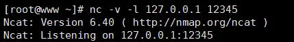
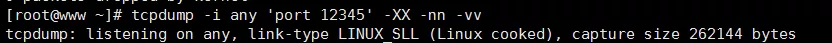
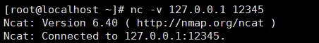
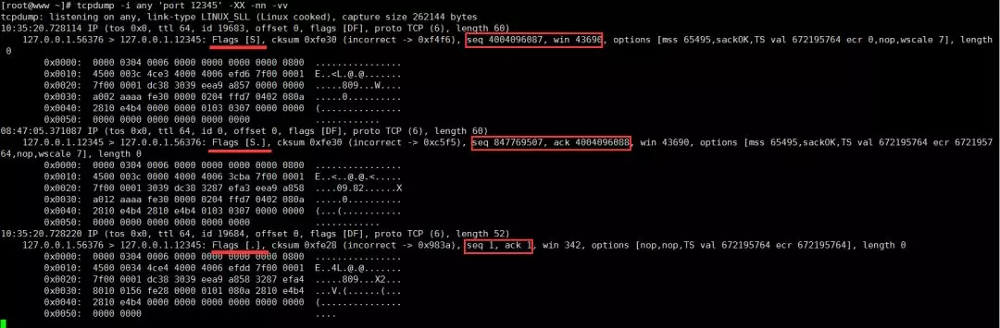
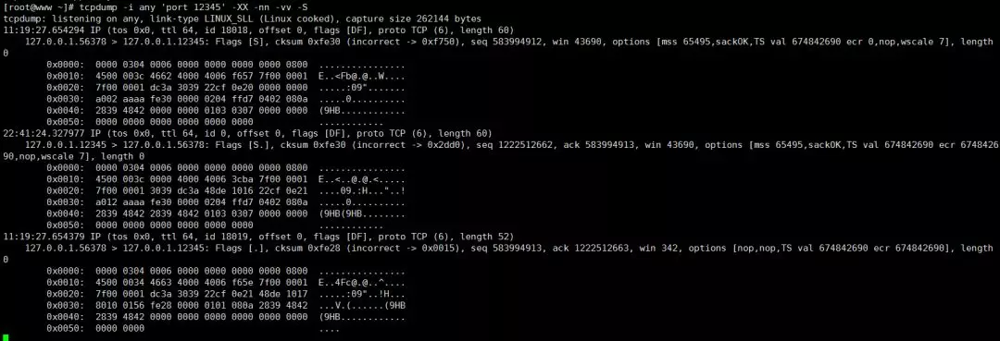
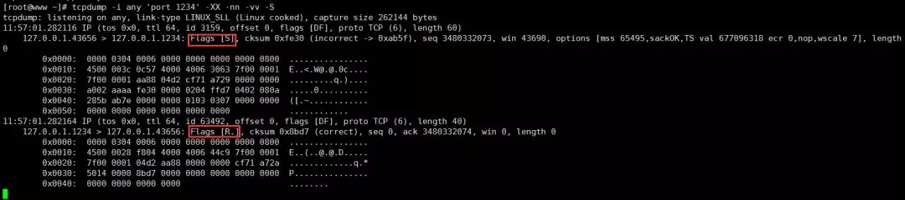
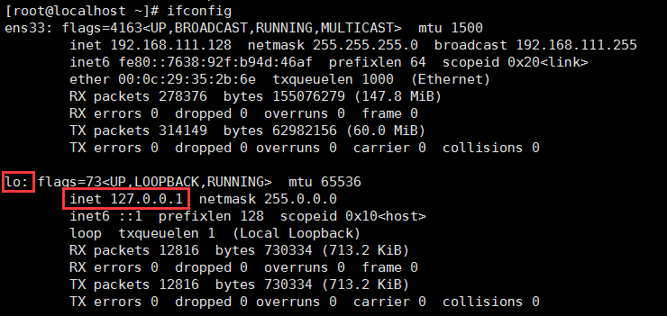
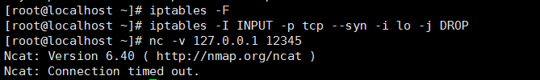
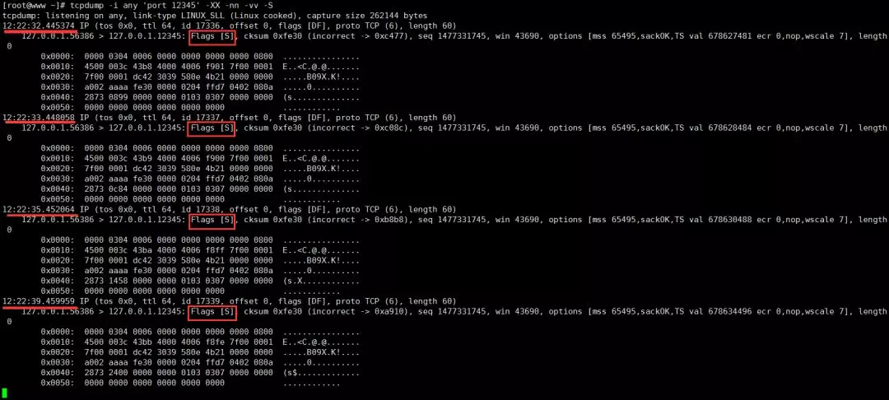

## Linux tcpdump 使用介绍

**tcpdump** 是 Linux 系统提供一个非常强大的抓包工具，熟练使用它，对我们排查网络问题非常有用。如果你的机器上还没有安装，可以使用如下命令安装：

```
yum install tcpdump
```

如果要使用 **tcpdump** 命令必须具有 **sudo** 权限。

**tcpdump** 常用的选项有：

- **-i** 指定要捕获的目标网卡名，网卡名可以使用前面章节中介绍的 **ifconfig** 命令获得；如果要抓所有网卡的上的包，可以使用 **any** 关键字。

  ```
  ## 抓取网卡ens33上的包
  tcpdump -i ens33
  ## 抓取所有网卡上的包
  tcpdump -i any
  ```

- **-X** 以 ASCII 和十六进制的形式输出捕获的数据包内容，减去链路层的包头信息；**-XX** 以 ASCII 和十六进制的形式输出捕获的数据包内容，包括链路层的包头信息。

- **-n** 不要将 ip 地址显示成别名的形式；**-nn** 不要将 ip 地址和端口以别名的形式显示。

- **-S** 以绝对值显示包的 ISN 号（包序列号），默认以上一包的偏移量显示。

- **-vv** 抓包的信息详细地显示；**-vvv** 抓包的信息更详细地显示。

- **-w** 将抓取的包的原始信息（不解析，也不输出）写入文件中，后跟文件名：

  ```
  tcpdump -i any -w filename  
  ```

- **-r** 从利用 **-w** 选项保存的包文件中读取数据包信息。

除了可以使用选项以外，**tcpdump** 还支持各种数据包过滤的表达式，常见的形式如下：

```
## 仅显示经过端口 8888 上的数据包（包括tcp:8888和udp:8888）
tcpdump -i any 'port 8888'

## 仅显示经过端口是 tcp:8888 上的数据包
tcpdump -i any 'tcp port 8888'

## 仅显示从源端口是 tcp:8888 的数据包
tcpdump -i any 'tcp src port 8888'

## 仅显示源端口是 tcp:8888 或目标端口是 udp:9999 的包 
tcpdump -i any 'tcp src port 8888 or udp dst port 9999'

## 仅显示地址是127.0.0.1 且源端口是 tcp:9999 的包 ，以 ASCII 和十六进制显示详细输出，
## 不显示 ip 地址和端口号的别名
tcpdump -i any 'src host 127.0.0.1 and tcp src port 9999' -XX -nn -vv
```

下面我们通过三个具体的操作实例来演示一下使用 **tcpdump** 的抓包过程。

**实例一 ：连接一个正常的侦听端口**

假设我的服务器端的地址是 **127.0.0.0.1:12345**，使用 nc 命令在一个 shell 窗口创建一个服务器程序并在这个地址上进行侦听。

```
nc –v -l 127.0.0.0.112345
```

效果如下图所示：



在另外一个 shell 窗口开启 tcpdump 抓包：

```
tcpdump -i any 'port 12345' -XX -nn -vv
```

效果如下：



然后再开一个 shell 窗口，利用 nc 命令创建一个客户端去连接服务器：

```
nc -v 127.0.0.1 12345
```

效果如下：



我们抓到的包如下：



由于我们没有在客户端和服务器之间发送任何消息，其实抓到的包就是 TCP 连接的三次握手数据包，分析如下：

三次握手过程是客户端先给服务器发送一个 **SYN**，然后服务器应答一个 **SYN + ACK**，应答的序列号是递增 **1** 的，表示应答哪个请求，即从 **4004096087** 递增到 **4004096088**，接着客户端再应答一个 **ACK**。这个时候，我们发现发包序列号和应答序列号都变成 **1**了，这是 tcpdump 使用相对序号，我们加上 **-S** 选项后就变成绝对序列号了。

我们按 Ctrl + C 中断 tcpdump 抓包过程，并停止用 nc 开启的客户端和服务器程序，然后在前面的 tcpdump 命令后面加上 **-S** 选项重新开启抓包，使用命令如下：

```
tcpdump -i any 'port 12345' -XX -nn -vv -S
```

然后再按顺序用 nc 命令再次启动下服务器和客户端程序。再次得到抓包结果：



这次得到的包的序号就是绝对序号了。

**实例二：连接一个不存在的侦听端口**

**实例一**演示的是正常的 TCP 连接三次握手过程捕获到的数据包。假如我们连接的**服务器 ip 地址存在**，但**监听端口号不存在**，我们看下 tcpdump 抓包结果。除了在一个 shell 窗口启动一个 tcpdump 抓包监测，在另外一个 shell 窗口用 nc 命令去连接一个不存在的侦听端口即可。


抓包数据如下：



这个时候客户端发送 **SYN**，服务器应答 **ACK+RST**，这个应答包会导致客户端的 connect 连接失败返回。

**实例三：连接一个很遥远的 ip，或者网络繁忙的情形**

实际情形中，还存在一种情况就是客户端访问一个很遥远的 ip，或者网络繁忙，服务器对客户端发送的 TCP 三次握手的网络 SYN 报文没有应答，会出现什么情况呢？

我们通过设置防火墙规则来模拟一下这种情况。使用 **iptables -F** 先将防火墙的已有规则都清理掉，然后给防火墙的 INPUT 链上增加一个规则：丢弃本地网卡 lo（也就是 127.0.0.1 这个回环地址）上的所有 SYN 包。

```
iptables -F
iptables -I INPUT -p tcp --syn -i lo -j DROP
```




> 如果读者对 CentOS 的防火墙 iptables 命令有兴趣，可以使用 man iptables 在 man 手册中查看更详细的帮助。

在开启 tcpdump 抓包之后和设置防火墙规则之后，利用 nc 命令去连接 127.0.0.1:12345 这个地址。整个过程操作效果图如下：



接着，我们得到 tcpdump 抓到的数据包如下：



通过抓包数据我们可以看到：如果连接不上，一共重试了 **5** 次，重试的时间间隔是 1 秒，2秒，4秒，8秒，16秒，最后返回超时失败。这个重试次数在 **/proc/sys/net/ipv4/tcp_syn_retries** 内核参数中设置，默认为 **6** 。

> TCP 四次挥手与三次握手基本上类似，这里就不贴出 tcpdump 抓包的详情了，强烈建议不熟悉这块的读者实际练习一遍。
