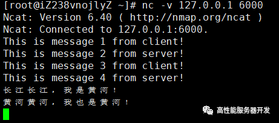
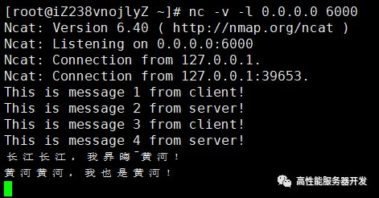
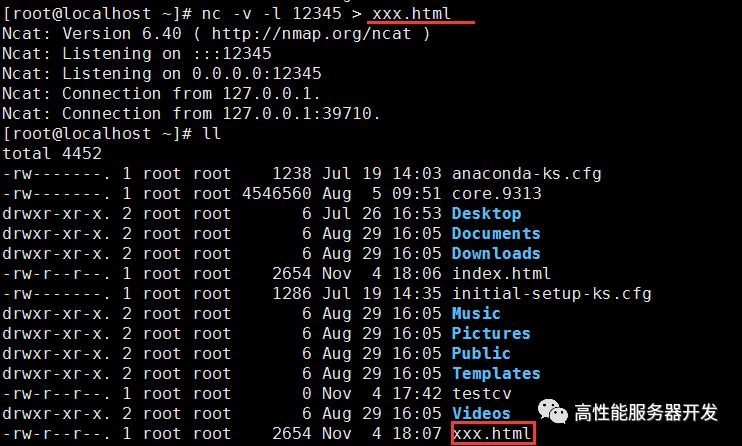

## Linux 网络故障排查的瑞士军刀

**nc** 即 **n**et**c**at 命令，这个工具在排查网络故障时非常有用，功能非常强大，因而被业绩称为网络界的“瑞士军刀”，请读者务必掌握。默认系统是没有这个命令的，你需要安装一下，安装方法：

```
yum install nc
```

**nc** 命令常见的用法是模拟一个服务器程序被其他客户端连接，或者模拟一个客户端连接其他服务器，连接之后就可以进行数据收发。我们来逐一介绍一下：

- **模拟一个服务器程序**

  使用 **-l** 选项（单词 **l**isten 的第一个字母）在某个 ip 地址和端口号上开启一个侦听服务，以便让其他客户端连接。通常为了显示更详细的信息，会带上 **-v** 选项。

  示例如下：

  ```
  [root@iZ238vnojlyZ ~]# nc -v -l 127.0.0.1 6000
  Ncat: Version 6.40 ( http://nmap.org/ncat )
  Ncat: Listening on 127.0.0.1:6000
  ```

  这样就在 **6000** 端口开启了一个侦听服务器，我们可以通过 **127.0.0.1:6000** 去连接上去；如果你的机器可以被外网访问，你可以使用 **0.0.0.0** 这样的侦听地址，示例：

  ```
  [root@iZ238vnojlyZ ~]# nc -v -l 0.0.0.0 6000
  Ncat: Version 6.40 ( http://nmap.org/ncat )
  Ncat: Listening on 0.0.0.0:6000
  ```

- 模拟一个客户端程序

  用 **nc** 命令模拟一个客户端程序时，我们不需要使用 **-l** 选项，直接写上 ip 地址（或域名，**nc** 命令可以自动解析域名）和端口号即可，示例如下：

  ```
  ## 连接百度 web 服务器
  [root@iZ238vnojlyZ ~]# nc -v www.baidu.com 80
  Ncat: Version 6.40 ( http://nmap.org/ncat )
  Ncat: Connected to 115.239.211.112:80.
  ```

  输出提示我们成功连接上百度 Web 服务器。

我们知道客户端连接服务器一般都是操作系统随机分配一个可用的端口号连接到服务器上去，使用 **nc** 命令作为客户端时可以使用 **-p** 选项指定使用哪个端口号连接服务器，例如，我们希望通过本地 5555 端口连接百度的 Web 服务器，可以这么输入：

```
[root@iZ238vnojlyZ ~]# nc -v -p 5555 www.baidu.com 80
Ncat: Version 6.40 ( http://nmap.org/ncat )
Ncat: Connected to 115.239.211.112:80.
```

再开一个 shell 窗口，我们使用上文中介绍的 **lsof** 命令验证一下，是否确实通过 **5555** 端口连接上了百度 Web 服务器。

```
[root@iZ238vnojlyZ ~]# lsof -Pni | grep nc
nc        32610    root    3u  IPv4 113369437      0t0  TCP 120.55.94.78:5555->115.239.211.112:80 (ESTABLISHED)
```

结果确实如我们所期望的。

当然，当使用 **nc** 命令与对端建立连接后，我们可以发送消息。下面通过一个具体的例子来演示一下这个过程

1. 使用 **nc -v -l 0.0.0.0 6000** 模拟一个侦听服务，再新建一个 shell 窗口利用 **nc -v 127.0.0.1 6000** 模拟一个客户端程序连接刚才的服务器。
2. 此时在客户端和服务器就可以相互发消息了。我们可以达到一个简化版的 IM 软件聊天效果：

**客户端效果：**



**服务器端效果：**




> 果你在使用 nc 命令发消息时不小心输入错误，可以使用 **Ctrl + Backspace** 键删除。

**nc** 命令默认会将 **\n** 作为每条消息的结束标志，如果你指定了 **-C** 选项，将会使用 **\r\n** 作为消息结束标志。

**nc** 命令不仅可以发消息，同时也能发文件。我们也来演示一下：

需要注意的是是**接收文件的一方是服务器端，发送文件的一方是客户端**。

1. 服务器端命令：

   ```
   nc -l ip地址 端口号 > 接收的文件名
   ```

2. 客户端命令：

   ```
   nc ip地址 端口号 < 发送的文件名
   ```

**服务器端效果**：



**客户端效果：**


> 意：这里客户端发送一个文件叫 **index.html**，服务器端以文件名 **xxx.html** 来保存，也就是说服务器端保存接收的文件名时不一定要使用客户端发送的文件名。

根据上面的介绍，当我们需要调试我们自己的服务器或者客户端程序时，又不想自己开发相应的对端，我们就可以使用 **nc** 命令去模拟。

当然，**nc** 命令非常强大，其功能远非本节介绍的这些，读者如果有兴趣可以去 **nc** 的 man 手册上获取更多的信息。
