## 从抓包的角度分析connect()函数的连接过程

这篇文章主要是从**tcp**连接建立的角度来分析客户端程序如何利用**connect**函数和服务端程序建立tcp连接的，了解**connect**函数在建立连接的过程中底层协议栈做了哪些事情。

### tcp三次握手

在正式介绍connect函数时，我们先来看一下tcp三次握手的过程，下面这个实验是客户端通过telnet远程登录服务端的例子，telnet协议是基于tcp协议，我们可以通过**wireshark**抓包工具看到客户端和服务端之间三次握手的过程，**12.1.1.1**是客户端的ip地址，**12.1.1.2**是服务端的ip地址。

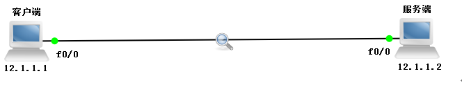

下面是我们通过**wireshark**抓取到的tcp三次握手的数据包：

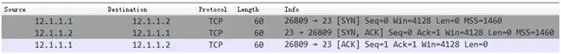

我们看到客户端远程登录服务端时，首先发送了一个**SYN**报文，其中目标端口为**23**（远程登录telnet协议使用23端口），初始序号**seq = 0**，并设置自己的窗口**rwnd = 4128**（rwnd是一个对端通告的接收窗口，用于流量控制）**。**

然后服务端回复了一个**SYN + ACK**报文，初始序号**seq = 0**，**ack = 1（在前一个包的seq基础上加1）**，同时也设置自己的窗口**rwnd = 4128**。

然后客户端收到服务端的**SYN + ACK**报文时，回复了一个**ACK**报文，表示确认建立tcp连接，序号为**seq = 1**， **ack = 1\**（在前一个包的seq基础上加1）\****， 设置窗口**rwnd = 4128**，此时客户端和服务端之间已经建立tcp连接。

### connect函数

前面我们在介绍tcp三次握手的时候说过，客户端在跟服务端建立tcp连接时，通常是由客户端主动向目标服务端发起tcp连接建立请求，服务端被动接受tcp连接请求；同时服务端也会发起tcp连接建立请求，表示服务端希望和客户端建立连接，然后客户端会接受连接并发送一个确认，这样双方就已经建立好连接，可以开始通信。

这里说明一下：可能有的小伙伴会感到疑惑，为啥服务端也要跟客户端建立连接呢？其实这跟tcp采用全双工通信的方式有关。对于全双工通信，简单来说就是两端可以同时收发数据，如下图所示：

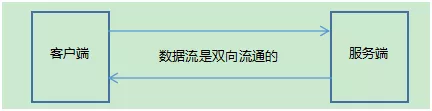

我们再回到正题，那么在网络编程中，肯定也有对应的函数做到跟上面一样的事情，没错，就是connect（连接）。顾名思义，connect函数就是用于客户端程序和服务端程序建立tcp连接的。

一般来说，客户端使用connect函数跟服务端建立连接，肯定要指定一个ip地址和端口号（相当于客户端的身份标识），要不然服务端都不知道你是谁？凭什么跟你建立连接。同时还得指明服务端的ip地址和端口号，也就是说，你要跟谁建立连接。

**connect**函数原型：

```
int connect(int sockfd, const struct sockaddr *addr, socklen_t addrlen);
```

参数说明：
**sockfd**：客户端的套接字文件描述符
**addr**：要连接的套接字地址，这是一个传入参数，指定了要连接的套接字地址信息（例如IP地址和端口号）
**addrlen**：是一个传入参数，参数addr的大小，即sizeof(addr)

**返回值说明**：连接建立成功返回0，失败返回-1并设置errno

connect函数在建立tcp连接的过程中用到了一个非常重要的队列，那就是未决连接队列，这个队列用来管理tcp的连接，包括已完成三次握手的tcp连接和未完成三次握手的tcp连接，下面我们就来详细介绍一下未决连接队列。

**未决连接队列**
未决连接队列是指服务器接收到客户端的连接请求，但是**尚未被处理**（也就是未被**accept**，后面会说）的连接，可以理解为未决连接队列是一个容器，这个容器存储着这些尚未被处理的链接。

当一个客户端进程使用 connect 函数发起请求后，服务器进程就会收到连接请求，然后检查未决连接队列是否有空位，如果未决队列满了，就会拒绝连接，那么客户端调用的connect 函数返回失败。

如果未决连接队列有空位，就将该连接加入未决连接队列。**当 connect 函数成功返回后，表明tcp的“三次握手”连接已完成，此时accept函数获取到一个客户端连接并返回。**

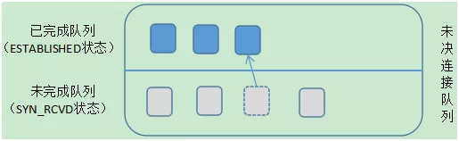

在上图中，在未决连接队列中又分为2个队列：

**未完成队列（未决队列）**：即客户端已经发出SYN报文并到达服务器，但是在tcp三次握手连接完成之前，这些套接字处于SYN_RCVD状态，服务器会将这些套接字加入到未完成队列。

**已完成队列**：即刚刚完成tcp三次握手的tcp连接，这些套接字处于ESTABLISHED状态，服务器会将这些套接字加入到已完成队列。

我们来看一下连接建立的具体过程，如图所示：

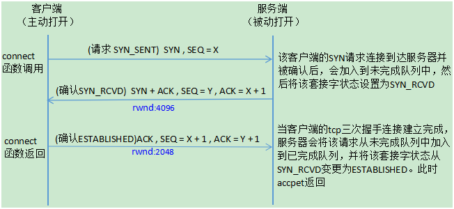

服务端首先调用**listen**函数监听客户端的连接请求，然后调用**accept**函数阻塞等待取出未决连接队列中的客户端连接，如果未决连接队列一直为空，这意味着没有客户端和服务器建立连接，那么**accept**就会一直阻塞。

当客户端一调用**connect**函数发起连接时，如果完成tcp三次握手，那么**accept**函数会取出一个客户端连接（注意：是已经建立好的连接）然后立即返回。

上面就是客户端和服务端在网络中的状态变迁的具体过程，前面我们在学习tcp三次握手的过程中还知道，服务端和客户端在建立连接的时候会设置自己的一个接收缓冲区窗口rwnd的大小。

服务端在发送SYN + ACK数据报文时会设置并告知对方自己的接收缓冲区窗口大小，客户端在发送ACK数据报文时也会设置并告知对方自己的接收缓冲区窗口大小。

注意，accept函数调用成功，返回的是一个已经完成tcp三次握手的客户端连接。如果在三次握手的过程中(最后一步)，服务端没有接收到客户端的ACK，则说明三次握手还没有建立完成，accept函数依然会阻塞。

关于tcp三次握手连接建立的几种状态：**SYN_SENT**，**SYN_RCVD**，**ESTABLISHED**。
**SYN_SENT**：当客户端调用connect函数向服务端发送**SYN**包时，客户端就会进入 **SYN_SENT**状态，并且还会等待服务器发送第二个**SYN + ACK**包，因此**SYN_SENT**状态就是表示客户端已经发送**SYN**包。

**SYN_RCVD**：当服务端接收到客户端发送的**SYN**包并确认时，服务端就会进入 **SYN_RCVD**状态，这是tcp三次握手建立的一个很短暂的中间状态，一般很难看到， **SYN_RCVD**状态表示服务端已经确认收到客户端发送的**SYN**包。

**ESTABLISHED**：该状态表示tcp三次握手连接建立完成。

对于这两个队列需要注意几点注意：

**1.** 未完成队列和已完成队列的总和不超过listen函数的backlog参数的大小。**listen**函数的签名如下：

```
int listen(int sockfd, int backlog);
```

**2.** 一旦该连接的tcp三次握手完成，就会从未完成队列加入到已完成队列中

**3.** 如果未决连接队列已满，当又接收到一个客户端SYN时，服务端的tcp将会忽略该SYN，也就是不会理客户端的SYN，但是服务端并不会发送RST报文，原因是：客户端tcp可以重传SYN，并期望在超时前未决连接队列找到空位与服务端建立连接，这当然是我们所希望看到的。如果服务端直接发送一个RST的话，那么客户端的connect函数将会立即返回一个错误，而不会让tcp有机会重传SYN，显然我们也并不希望这样做。

但是不排除有些linux实现在未决连接队列满时，的确会发送RST。但是这种做法是不正确的，因此我们最好忽略这种情况，处理这种额外情况的代码也会降低客户端程序的健壮性。

### connect函数出错情况

由于**connect**函数是在建立tcp连接成功或失败才返回，返回成功的情况本文上面已经介绍过了。这里我们介绍**connect**函数返回失败的几种情况：
**第一种**
当客户端发送了**SYN**报文后，没有收到确认则返回**ETIMEDOUT**错误，值得注意的是，失败一次并不会马上返回**ETIMEDOUT**错误。即当你调用了connect函数，客户端发送了一个**SYN**报文，没有收到确认就等6s后再发一个**SYN**报文，还没有收到就等24s再发一个（不同的linux系统设置的时间可能有所不同，这里以BSD系统为主）。这个时间是累加的，如果总共等了75s后还是没收到确认，那么客户端将返回ETIMEDOUT错误。

对于linux系统，改变这个系统上限值也比较容易，由于需要改变系统配置参数，你需要root权限。
相关的命令是**sysctl net.ipv4.tcp_syn_retries**(针对于ipv4)。
在设置该值时还是要比较保守的，因为每次syn包重试的间隔都会增大(比如BSD类的系统实现中间隔会以2到3倍增加)，所有tcp_syn_retries的一个微小变化对connect超时时间的影响都非常大，不过扩大这个值也不会有什么坏处，因为你代码中设置的超时值都能够生效。但是如果代码中没有设置connect的超时值，那么connect就会阻塞很久，你发现对端机器down掉的间隔就更长。
作者建议设置这个值到6或者7，最多8。6对应的connect超时为45s，7对应90s，8对应190s。

你能通过以下命令修改该值:

```
sysctl -w net.ipv4.tcp_syn_retries=6
```

查看该值的命令是:

```
sysctl net.ipv4.tcp_syn_retries
```

如果希望重启后生效，将**net.ipv4.tcp_syn_retries = 6**放入**/etc/sysctl.conf**中。

这种情况一般是发生在服务端的可能性比较大，也就是服务端当前所处网络环境流量负载过高，网络拥塞了，然后服务端收到了客户端的**SYN**报文却来不及响应，或者发送的响应报文在网络传输过程中老是丢失，导致客户端迟迟收不到确认，最后返回ETIMEDOUT错误。

我们可以简单复现一下这种情况，这个实验是基于CentOS系统进行的，具体过程如下所示：

1. 首先通过**iptables -F**把Centos上的防火墙规则清理掉，然后再通过**iptables -I INPUT -p tcp --syn -i lo -j DROP**命令把本地的所有SYN包都过滤掉（模拟服务端当前网络不稳定）。

执行以下命令：

```
1iptables -F
2iptables -I INPUT -p tcp --syn -i lo -j DROP
```

2. 然后通过**nc**命令向本地的环回地址**127.0.0.1**发起tcp连接请求（相当于自己跟自己发起tcp连接），来模拟客户端跟服务端发起tcp连接，但是服务器端就是不响应，最后导致客户端的tcp连接建立请求超时，并终止tcp连接。

    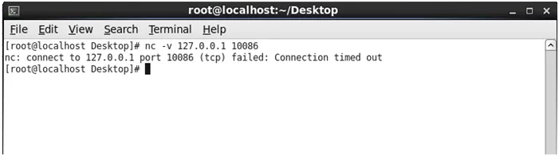

3. 然后再通过**tcpdump**工具把客户端和服务端建立tcp连接过程中的数据报都抓取下来，由于我们设置的服务器侦听端口号是10086，这里我们可以通过**tcpdump -i any port 10086**命令来过滤所有网卡的10086端口的数据包。

    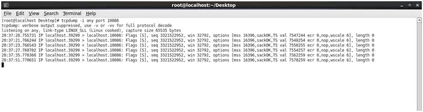

    如上图所示，**localhost.39299**代表客户端，**localhost.10086**代表服务端，客户端总共向服务端发送了6个**SYN**报文，这6个**SYN**包的间隔时间分别是1s，2s，4s，8s，16s，这些时间累积加起来总共为31s，其实客户端在发送最后一个**SYN**报文时还等待了一段时间，然后才超时。也就是说，客户端在发送了第一个**SYN**报文时，会设置了一个计时器并开始计时，在最后一个**SYN**报文还没收到服务端的确认时，这个计时器就会超时，然后关闭tcp连接。

**第二种**
客户端连接一个服务器没有侦听的端口。

过程是：客户端发送了一个**SYN**报文后，然后服务端回复了一个**RST**报文，说明这是一个异常的tcp连接，服务端发送了**RST**报文重置这个异常的tcp连接。

这种情况一般为拒绝连接请求，比如：客户端想和服务端建立tcp连接，但是客户端的连接请求中使用了一个不存在或没有侦听的端口（比如：这个端口超出**65535**的范围），那么服务端就可以发送**RST**报文段拒绝这个请求。

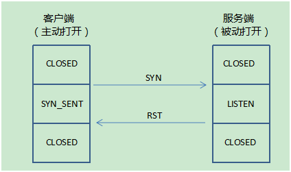

拒绝连接一般是由服务器主动发起的，因为客户端发起请求连接携带的目的端口，可能服务器并没有开启**LISTEN**状态。因此服务器在收到这样的报文段后会发送一个**RST**报文段，在这个报文里把**RST**和**ACK**都置为1，它确认了**SYN**报文段并同时重置了该tcp连接，然后服务器等待另一个连接。客户端在收到**RST+ACK**报文段后就会进入**CLOSED**状态。

这里以通过20000不存在的端口远程登录为例：

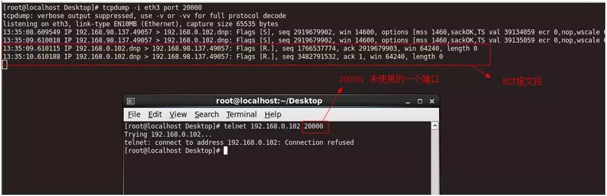

**tcpdump**抓取到的数据包如下：

```
113:35:08.609549 IP 192.168.98.137.49057 > 192.168.0.102.dnp: Flags [S], seq 2919679902, win 14600, options [mss 1460,sackOK,TS val 39134059 ecr 0,nop,wscale 6], length 0
213:35:09.610018 IP 192.168.98.137.49057 > 192.168.0.102.dnp: Flags [S], seq 2919679902, win 14600, options [mss 1460,sackOK,TS val 39135059 ecr 0,nop,wscale 6], length 0
313:35:09.610115 IP 192.168.0.102.dnp > 192.168.98.137.49057: Flags [R.], seq 1766537774, ack 2919679903, win 64240, length 0
413:35:10.610188 IP 192.168.0.102.dnp > 192.168.98.137.49057: Flags [R.], seq 3482791532, ack 1, win 64240, length 0
```

通过分析**tcpdump**工具抓取的数据发现，**RST**报文段不携带数据。

**第三种**
如果客户端调用**connect**函数向服务端发送了一个**SYN**报文，这个SYN报文在网络传输过程中经过某个路由器时，正好这个路由器出问题了，缺少到达目的地的路由，不能把这个**SYN**报文转发给目的地址，那么该路由器会丢弃这个**SYN**报文，并同时给客户端发送一个**Destination unreachable**（主机不可达）的**ICMP**差错报文。客户端的linux内核会保存这个Destination unreachable的ICMP差错报文，同时按第一种情况继续发送SYN报文，如果在规定的时间超时后还没收到服务端的响应报文，那么linux内核会把保存的ICMP差错报文作为**EHOSTUNREACH**或**ENETUNREACH**错误返回给客户端的应用进程。

下面的这个实验就是用来说明第三种情况，帮助理解，大家能看明白就行了，可以不用去做这个实验，当然，有兴趣的同学可以去模拟一下。

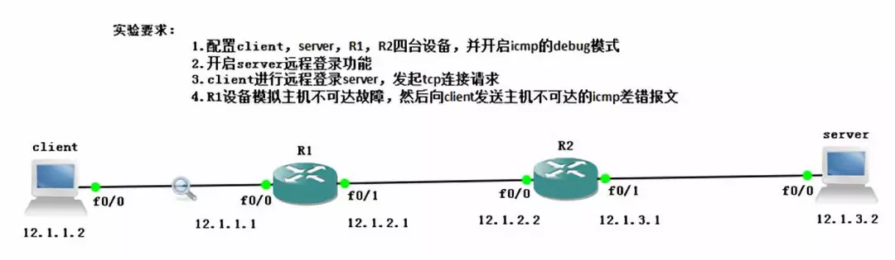

然后client远程登录server成功。

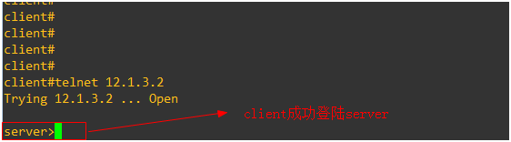

上图中没有指定telnet端口号，使用默认端口号23。

这是抓取到的数据包，**client**在远程登录**server**时，发起了SYN连接请求。

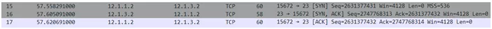

现在我们来模拟**client**设备出故障，删除R1设备到server的路由信息

```
no ip route 12.1.3.0 255.255.255.0 12.1.2.2
```

**client**再登录**server**时就会失败，我们从抓取到的数据包可以发现，**client**发送了一个**SYN**报文，然后R1设备收到这个**SYN**报文时，发现自己不能到达**server**，于是会把这个**SYN**报文丢弃掉，并向**client**发送了一个目标主机不可达的ICMP差错报文，于是client发送了RST报文来关闭这条异常的tcp连接。

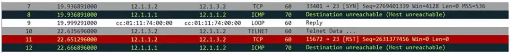


**学习知识不仅要知其然也要知其所以然，这是我想通过这篇文章传达的一个理念，文中一步步的实验探索体现了学习知识动手实践的重要性，这是非常值得提倡的。**