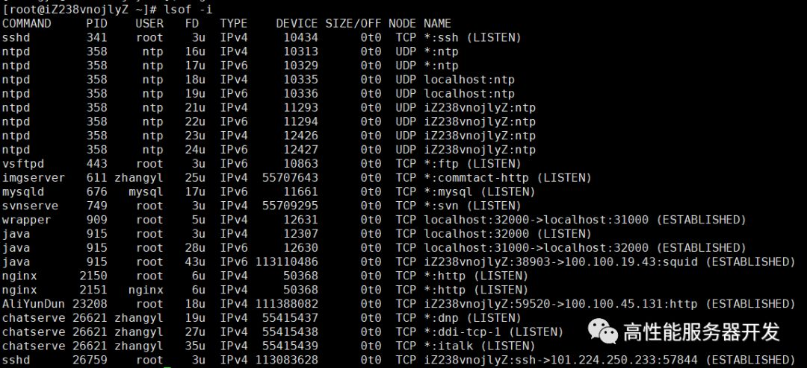
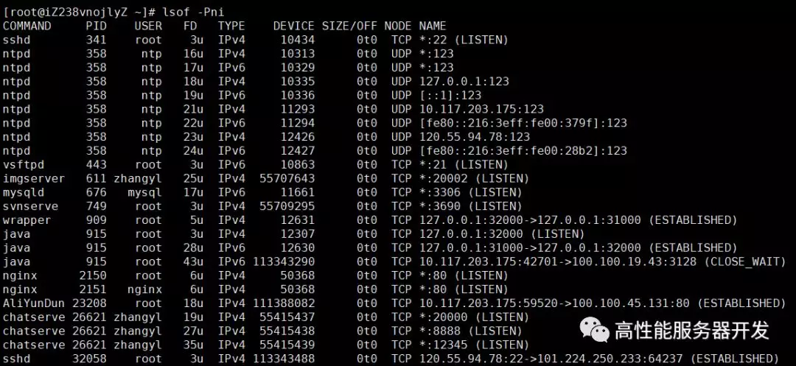

## 做 Java 或者 C++ 开发都应该知道的 lsof 命令

**lsof** 命令是 Linux 系统的扩展工具，它的含义是 **l**i**s**t **o**pened **f**iledesciptor （**列出已经打开的文件描述符**），在 Linux 系统中，所有的与资源句柄相关的东西都可以统一抽象成**文件描述符**（filedescriptor，简称 fd）。一个文件句柄是一个 fd，一个 socket 对象也可以称之为 fd 等等。

默认情况下，系统是不存在这个命令的，你需要安装一下，使用如下命令安装：

```
yum install lsof
```

我们来看一下这个命令的使用效果：

```
COMMAND     PID   TID    USER   FD      TYPE             DEVICE  SIZE/OFF       NODE NAME
systemd       1          root  cwd       DIR              202,1      4096          2 /
nscd        453   469    nscd    8u  netlink                          0t0      11017 ROUTE
nscd        453   470    nscd  cwd       DIR              202,1      4096          2 /
nscd        453   470    nscd  rtd       DIR              202,1      4096          2 /
nscd        453   470    nscd  txt       REG              202,1    180272     146455 /usr/sbin/nscd
nscd        453   470    nscd  mem       REG              202,1    217032     401548 /var/db/nscd/hosts
nscd        453   470    nscd  mem       REG              202,1     90664     132818 /usr/lib64/libz.so.1.2.7
nscd        453   470    nscd  mem       REG              202,1     68192     133155 /usr/lib64/libbz2.so.1.0.6
nscd        453   470    nscd  mem       REG              202,1    153192     133002 /usr/lib64/liblzma.so.5.0.99
nscd        453   470    nscd  mem       REG              202,1     91496     133088 
nscd        453   471    nscd    5u  a_inode                0,9         0       4796 [eventpoll]
nscd        453   471    nscd    6r      REG              202,1    217032     401548 /var/db/nscd/hosts
nscd        453   471    nscd    7u     unix 0xffff880037497440       0t0      11015 /var/run/nscd/socket
nscd        453   471    nscd    8u  netlink                          0t0      11017 ROUTE
imgserver   611       zhangyl  cwd       DIR              202,1      4096    1059054 /home/zhangyl/flamingoserver
imgserver   611       zhangyl  rtd       DIR              202,1      4096          2 /
imgserver   611       zhangyl  txt       REG              202,1   4788917    1057044 /home/zhangyl/flamingoserver/imgserver
imgserver   611       zhangyl   24u  a_inode                0,9         0       4796 [eventfd]
imgserver   611       zhangyl   25u     IPv4           55707643       0t0        TCP *:commtact-http (LISTEN)
imgserver   611       zhangyl   26r      CHR                1,3       0t0       4800 /dev/null
imgserver   611   613 zhangyl   32w      REG              202,1    131072    2754609 /home/zhangyl/flamingoserver/imgcache/258bfb8945288a117d98d440986d7a03
```

结果显示中列出了各个进程打开的各种 fd 类型，对于 Uinx Socket，**lsof** 命令会显示出其详细的路径，打开的文件 fd 亦是如此。

使用 **lsof** 命令有三点需要注意：

- 默认情况下，**lsof** 的输出比较多，我们可以使用 grep 命令过滤我们想要查看的进程打开的 fd 信息，如：

  ```
  lsof -i | grep myapp
  ```

  或者使用 **lsof -p pid** 也能过滤出指定的进程打开的 fd 信息：

  ```
  [root@iZ238vnojlyZ ~]# lsof -p 26621
  COMMAND     PID    USER   FD      TYPE   DEVICE SIZE/OFF    NODE NAME
  chatserve 26621 zhangyl  cwd       DIR    202,1     4096 1059054 /home/zhangyl/flamingoserver
  chatserve 26621 zhangyl  rtd       DIR    202,1     4096       2 /
  chatserve 26621 zhangyl  txt       REG    202,1  8027035 1051942 /home/zhangyl/flamingoserver/chatserver
  chatserve 26621 zhangyl  mem       REG    202,1    61928  141417 /usr/lib64/libnss_files-2.17.so
  chatserve 26621 zhangyl  mem       REG    202,1    44096  143235 /usr/lib64/librt-2.17.so
  chatserve 26621 zhangyl  mem       REG    202,1    19520  137064 /usr/lib64/libdl-2.17.so
  chatserve 26621 zhangyl  mem       REG    202,1  2112384  132824 /usr/lib64/libc-2.17.so
  chatserve 26621 zhangyl  mem       REG    202,1   142304  132850 /usr/lib64/libpthread-2.17.so
  chatserve 26621 zhangyl  mem       REG    202,1    88720  135291 /usr/lib64/libgcc_s-4.8.5-20150702.so.1
  chatserve 26621 zhangyl  mem       REG    202,1  1141560  137077 /usr/lib64/libm-2.17.so
  chatserve 26621 zhangyl  mem       REG    202,1   999944  140059 /usr/lib64/libstdc++.so.6.0.19
  chatserve 26621 zhangyl  mem       REG    202,1  9879756  269001 /usr/lib64/mysql/libmysqlclient.so.20.3.4
  chatserve 26621 zhangyl  mem       REG    202,1   164440  133622 /usr/lib64/ld-2.17.so
  chatserve 26621 zhangyl    0u      CHR      1,3      0t0    4800 /dev/null
  chatserve 26621 zhangyl    1u      CHR      1,3      0t0    4800 /dev/null
  chatserve 26621 zhangyl    2u      CHR      1,3      0t0    4800 /dev/null
  chatserve 26621 zhangyl    3u  a_inode      0,9        0    4796 [eventpoll]
  chatserve 26621 zhangyl    4u  a_inode      0,9        0    4796 [timerfd]
  chatserve 26621 zhangyl    5u  a_inode      0,9        0    4796 [eventfd]
  chatserve 26621 zhangyl    7u  a_inode      0,9        0    4796 [eventpoll]
  ```

- **lsof** 命令只能查看到当前用户有权限查看到的进程 fd 信息，对于其没有权限的进程，最右边一列会显示 “**Permission denied**”。如下所示：

  ```
  sshd      26759          root  cwd   unknown                              /proc/26759/cwd (readlink: Permission denied)
  sshd      26759          root  rtd   unknown                              /proc/26759/root (readlink: Permission denied)
  sshd      26759          root  txt   unknown                              /proc/26759/exe (readlink: Permission denied)
  sshd      26759          root NOFD                                        /proc/26759/fd (opendir: Permission denied)
  bash      26761          root  cwd   unknown                              /proc/26761/cwd (readlink: Permission denied)
  bash      26761          root  rtd   unknown                              /proc/26761/root (readlink: Permission denied)
  bash      26761          root  txt   unknown                              /proc/26761/exe (readlink: Permission denied)
  bash      26761          root NOFD                                        /proc/26761/fd (opendir: Permission denied)
  ```

- **lsof** 命令第一栏进程名在显示的时候，默认显示前 n 个字符，这样如果我们需要显示完整的进程名以方便过滤的话，可以使用 **+c** 选项。用法如下：

  ```
  #最左侧的程序名最大显示 15 个字符
  [zhangyl@iZ238vnojlyZ ~]$ lsof +c 15
  ```

  当然，如果你设置值太大， **lsof** 便不会采用你设置的最大值，而是使用默认最大值。

上文也介绍了，socket 也是一种 fd，如果需要仅显示系统的网络连接信息，使用的是 **-i** 选项即可，这个选项可以形象地显示出系统当前的出入连接情况：



看到图中的连接方向了吧？

当然，和 **netstat** 命令一样，**lsof -i** 默认也会显示 ip 地址和端口号的别名，我们只要使用 **-n** 和 **-P** 选项就能相对应地显示 ip 地址和端口号了，综合起来就是 **lsof -Pni**：


