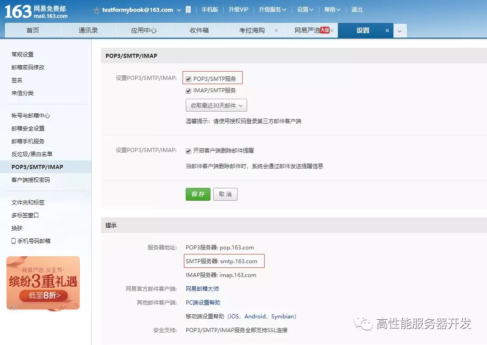
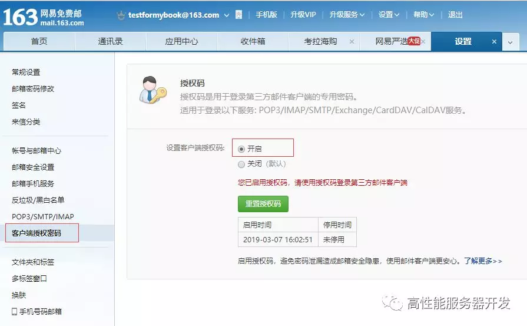
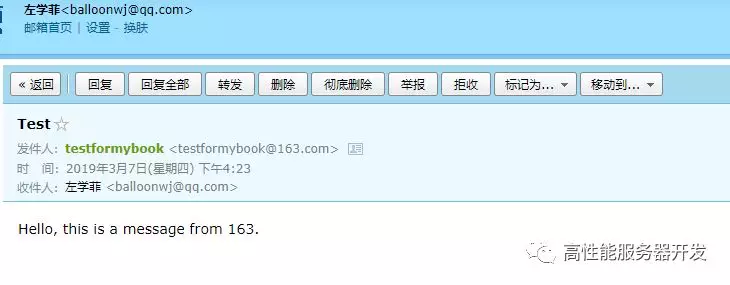
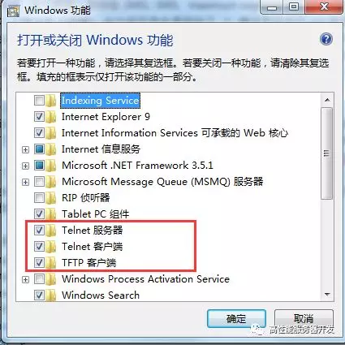

## 利用 telnet 命令发电子邮件

**telnet** 命令是我们最常用的网络调试命令之一。如果你的机器上还没有安装 **telnet** 命令，可以使用如下命令安装一下：

```
yum install telnet 
```

如果一个服务程序对外开启了侦听服务，我们都可以使用 **telnet ip port** 来连接上去，例如：

```
[root@localhost ~]# telnet 120.55.94.78 8888
Trying 120.55.94.78...
Connected to 120.55.94.78.
Escape character is '^]'.
```

> 如果不指定端口号，**telnet** 会使用默认 **23** 号端口。

反过来说，可以通过 **telnet** 命令去检测指定 ip 地址和端口号的侦听服务是否存在。知道这点很重要，我们可以利用这个去检测一个服务是否可以正常连接。举个例子，比如某次从某处得到一个代码下载地址，这是一个 svn 地址：**svn://120.55.94.78/mycode/mybook**。为了检测这个 svn 服务是否还能正常对外服务，我们可以先用 **ping** 命令去检测一下到达这个 ip：**120.55.94.78** 的网络是否畅通：

```
[root@localhost ~]# ping 120.55.94.78
PING 120.55.94.78 (120.55.94.78) 56(84) bytes of data.
64 bytes from 120.55.94.78: icmp_seq=1 ttl=128 time=15.3 ms
64 bytes from 120.55.94.78: icmp_seq=2 ttl=128 time=14.3 ms
64 bytes from 120.55.94.78: icmp_seq=3 ttl=128 time=16.4 ms
64 bytes from 120.55.94.78: icmp_seq=4 ttl=128 time=16.1 ms
64 bytes from 120.55.94.78: icmp_seq=5 ttl=128 time=15.5 ms
^C
--- 120.55.94.78 ping statistics ---
5 packets transmitted, 5 received, 0% packet loss, time 4007ms
rtt min/avg/max/mdev = 14.343/15.568/16.443/0.723 ms
```

如果网络畅通，我们再用 telnet 去连接上去，由于 svn 服务器使用的默认端口是 **3690**，我们执行如下命令：

```
[root@localhost ~]# telnet 120.55.94.78 3690
Trying 120.55.94.78...
Connected to 120.55.94.78.
Escape character is '^]'.
( success ( 2 2 ( ) ( edit-pipeline svndiff1 absent-entries commit-revprops depth log-revprops atomic-revprops partial-replay ) ) ) 
```

如上所示，证明这个 svn 服务是正常开启对外服务的。反之，如果 **telnet** 命令连不上，说明这个服务不能被外部网络正常连接，我们就没必要去做进一步的尝试了。

同样的道理，对于一个 Web 服务，如 baidu.com，由于我们平常都可以通过 **www.baidu.com** 去访问百度的页面，Web 服务器默认的端口号是 **80**，我们使用 **telnet www.baidu.com 80** 应该也可以连接成功的：

```
[root@localhost ~]# telnet www.baidu.com 80
Trying 115.239.211.112...
Connected to www.baidu.com.
Escape character is '^]'.
hello
HTTP/1.1 400 Bad Request

Connection closed by foreign host.
```

我们使用 **telnet** 命令连接上以后，我们随意发送了一个 **hello** 消息，由于是非法的 http 请求，被服务器关闭了连接。

**telnet** 命令不仅可以连接某个服务器，还能与服务器进行交互，这通常用于操作一些接受纯文本数据的服务器程序，如 FTP 服务、邮件服务等等。为了演示如何利用 **telnet** 命令收发数据，我们这里利用 **telnet** 命令来模拟给某个邮箱发送一封邮件，发送邮件我们通常使用的是 SMTP 协议，该协议默认使用的端口为 **25**。

假设我们的发件地址是：testformybook@163.com，收件地址是：balloonwj@qq.com。

其中发件地址是一个 163 邮箱，如果你没有的话可以去申请一个，申请后进入邮箱，在**设置**页面获得网易邮箱的 smtp 服务的服务器地址：



我们得到的地址 smptp 地址是 **smtp.163.com**，端口号是 **25**。

同时，我们需要开启客户端授权，设置一个客户端授权码：



我们这里将授权码设置为 **2019hhxxttxs**。

> 早些年很多邮件服务器允许在其他客户端登陆只需要输入正确的邮件服务器地址、用户名和密码就可以了，后来出于安全考虑，很多邮箱采用了授权码机制，在其他第三方客户端登陆该邮箱时需要输入授权码（不是密码），且需要用户主动打开允许第三方客户端登陆的配置选项。

配置完成以后，我们现在就可以利用 **telnet** 命令连接 163 邮件服务器并发送邮件了，由于在登陆的过程中需要验证用户名和授权码，而且用户名和授权码必须使用 base64 编码之后的，我们先将用户名和授权码的 base64 码准备好，用的时候直接拷贝过去：

|     原文      |      base64 码       |
| :-----------: | :------------------: |
| testformybook | dGVzdGZvcm15Ym9vaw== |
| 2019hhxxttxs  |   MjAxOWhoeHh0dHhz   |

如果你不知道 base64 编码的原理，可以从网上搜索找一个 base64 编解码工具，例如：https://base64.supfree.net/。

在整个演示过程我们一共需要使用如下 SMTP 协议命令：

|    命令    |            含义            |
| :--------: | :------------------------: |
|    helo    | 向 smtp 服务器发送问候信息 |
| auth login |        请求登陆验证        |
|    data    |      请求输入邮件正文      |

**SMTP 协议** 是文本协议，每一个数据包以 **\r\n** 结束（Windows 系统下默认换行符）。

我们来看一下演示过程：

```
[root@localhost ~]# telnet smtp.163.com 25
Trying 220.181.12.14...
Connected to smtp.163.com.
Escape character is '^]'.
220 163.com Anti-spam GT for Coremail System (163com[20141201])
helo 163.com
250 OK
auth login
334 dXNlcm5hbWU6
dGVzdGZvcm15Ym9vaw==
334 UGFzc3dvcmQ6
MjAxOWhoeHh0dHhz
235 Authentication successful
mail from: <testformybook@163.com>
250 Mail OK
rcpt to:  <balloonwj@qq.com>
250 Mail OK
data
354 End data with <CR><LF>.<CR><LF>
from:testformybook@163.com
to: balloonwj@qq.com
subject: Test

Hello, this is a message from 163.

.
250 Mail OK queued as smtp10,DsCowADHAgQS1IBcwtExJA--.62308S2 1551946998
Connection closed by foreign host.
[root@localhost ~]# 
```

我们来分析一下上述操作过程：

1. 使用 **telnet smtp.163.com 25** 连接 163 邮件服务器；连接成功以后，服务器给我们发送了一条欢迎消息：

   ```
   220 163.com Anti-spam GT for Coremail System (163com[20141201])\r\n
   ```

2. 接着，必须向服务器发送一条问候消息，使用 **helo 163.com**，当然 **163.com** 这个是问候内容，可以随意填写，然后回车，最终组成的数据包内容是：

   ```
   helo 163.com\r\n
   ```

3. 接着服务器会回复一条状态码是 **250** 的消息，这里是：

   ```
   250 OK\r\n
   ```

4. 我们再输入命令 **auth login** 请求验证，然后按回车，实际发送给服务器的是：

   ```
   auth login\r\n
   ```

5. 服务器应答状态码 **334**：

   ```
   334 dXNlcm5hbWU6\r\n
   ```

   **dXNlcm5hbWU6** 是字符串 **username: ** 的 base64 码。

6. 我们输入我们的用户名 **testformybook** 的 base64 码，然后按回车：

   ```
   dGVzdGZvcm15Ym9vaw==\r\n
   ```

7. 服务器应答状态码 **334**：

   ```
   334 UGFzc3dvcmQ6\r\n
   ```

   **UGFzc3dvcmQ6** 是字符串 **Password:** 的 base64 码。这里实际上要求我们输入的是上文介绍的授权码，而不是密码。

8. 我们输入 **MjAxOWhoeHh0dHhz**，并回车：

   ```
   MjAxOWhoeHh0dHhz\r\n
   ```

   服务器提示我们授权成功（应答状态码 **235**）：

   ```
   235 Authentication successful\r\n
   ```

9. 接着输入邮件的发件地址和收件地址，服务器也会给我们响应的应答（应答状态码 **250**）：

   ```
   mail from: <testformybook@163.com>\r\n
   250 Mail OK\r\n
   rcpt to:  <balloonwj@qq.com>\r\n
   250 Mail OK\r\n
   ```

10. 接着输入 **data** 命令设置邮件的主题、正文、对方收到邮件后显示的的发件人信息等：

    ```
    data\r\n
    354 End data with <CR><LF>.<CR><LF>
    ```

    服务器应答 **354**，并且提示，如果确定结束输入邮件正文就先按一个回车键，再输入一个点 **.**，再接着回车，这样邮件就发送出去了。

11. 服务器应答 **250**：

    ```
    250 Mail OK queued as smtp10,DsCowADHAgQS1IBcwtExJA--.62308S2 1551946998
    ```

12. 如果我们想退出，输入 **quit** 或 **close** 都可以。

最终，这封邮件就发出去了，我们去 **balloonwj@qq.com** 这个邮箱查看一下：



> 如果你在实际实验时，对端没有收到邮件，请查看下你的垃圾箱或者邮箱反垃圾邮件设置，有可能被邮箱反垃圾邮件机制给拦截了。

上述在组装 SMTP 协议包时涉及到很多状态码，常见的 SMTP 状态码含义如下：

```
211 帮助返回系统状态
214 帮助信息
220 服务准备就绪
221 关闭连接
235 用户验证成功
250 请求操作就绪
251 用户不在本地，转寄到其他路径
334 等待用户输入验证信息
354 开始邮件输入
421 服务不可用
450 操作未执行，邮箱忙
451 操作中止，本地错误
452 操作未执行，存储空间不足
500 命令不可识别或语言错误
501 参数语法错误
502 命令不支技
503 命令顺序错误
504 命令参数不支持
550 操作未执行，邮箱不可用
551 非本地用户
552 中止存储空间不足
553 操作未执行，邮箱名不正确
554 传输失败
```

> 由于我们使用的开发机器以 Windows 居多，默认情况下，Windows 系统的 telnet 命令是没有开启的，我们可以在【控制面板】- 【程序】- 【程序和功能】- 【打开或关闭Windows功能】中打开telnet功能。如下图所示：


