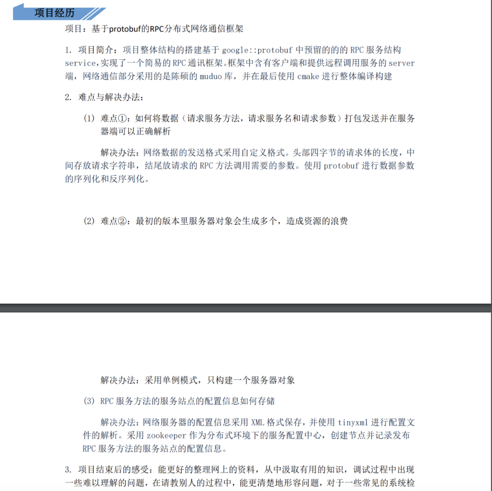
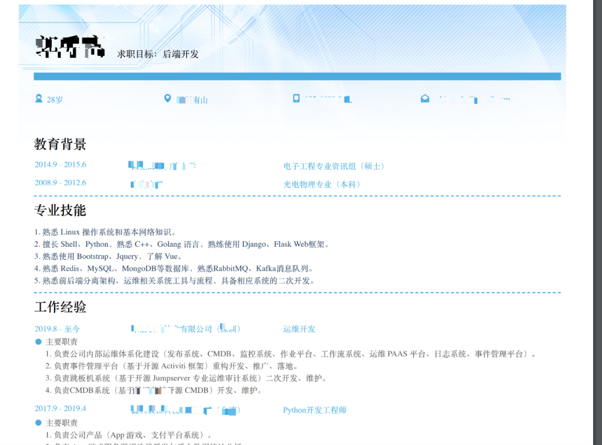
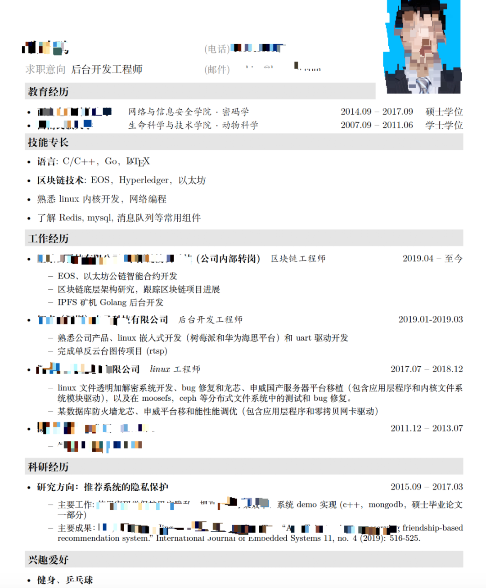
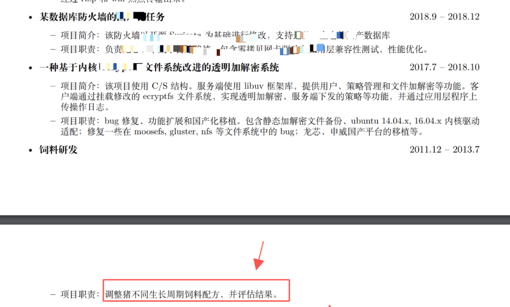
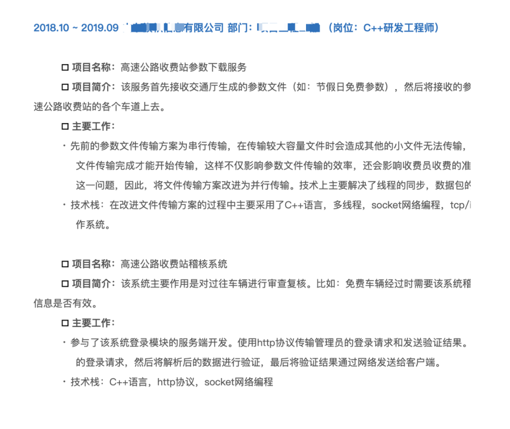
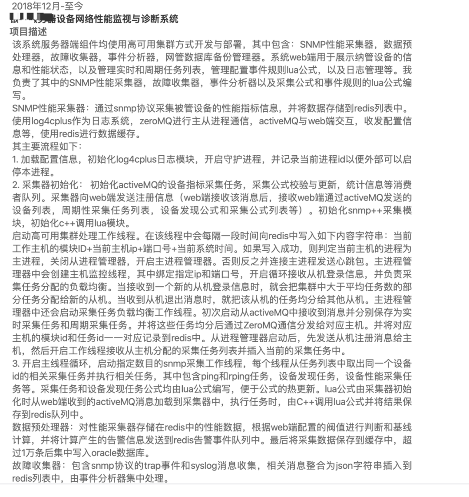
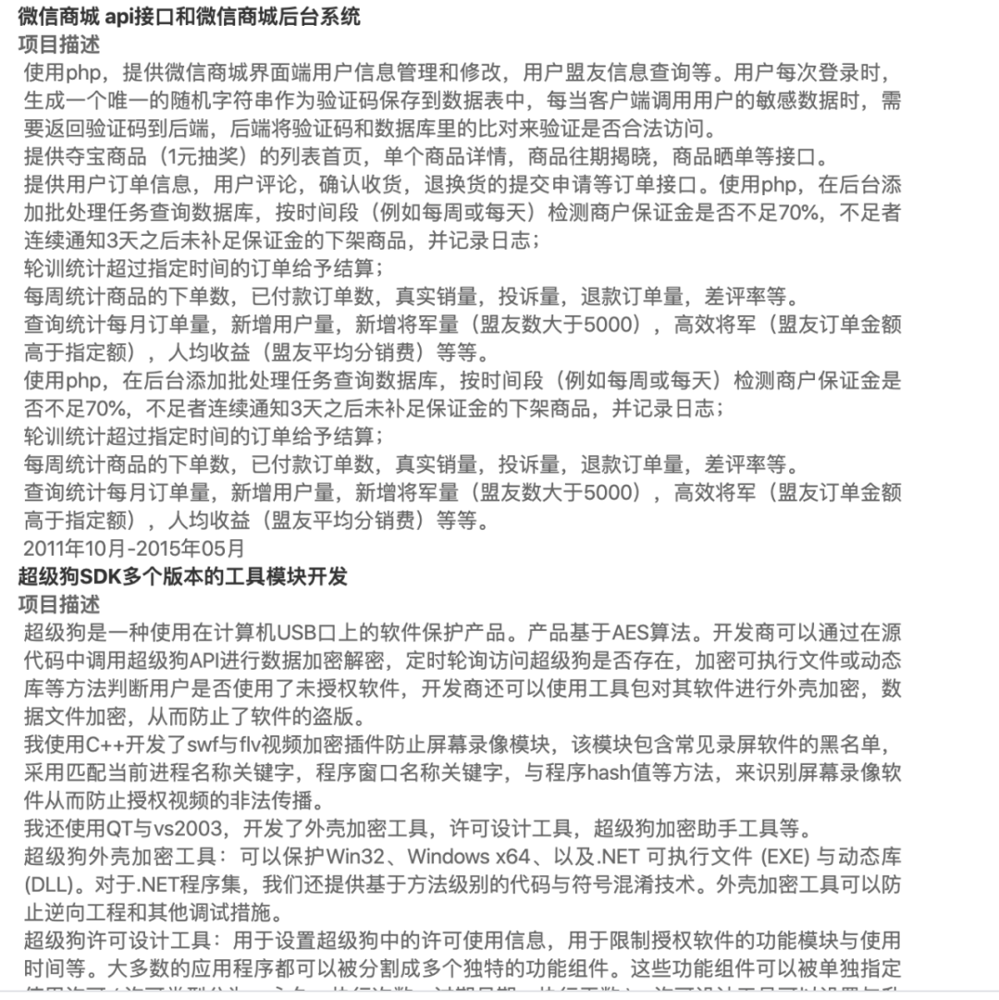
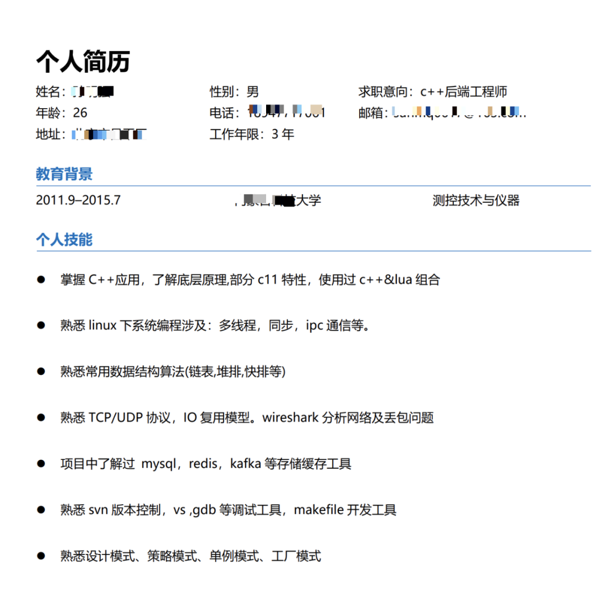

## 程序员如何写简历

笔者工作多年后面试了很多公司，例如 [2018 年年初横扫各大互联网公司](http://mp.weixin.qq.com/s?__biz=MzU2MTkwMTE4Nw==&mid=2247486817&idx=1&sn=d16ee32eb1cb422f39222af29d1a835e&chksm=fc70f68dcb077f9b09e765abaad4599d03af94f5ffe18b34454bd04c854b2642201d3d90af33&scene=21#wechat_redirect)，也作为面试官面试了很多人，看过不少的简历。现在疫情快过去了，很多小伙伴开始准备简历看新机会了，但是不少小伙伴遇到以下两种情况：

1. **投了很多公司，邀请面试的寥寥无几；**
2. **面试的时候被面试官问的哑口无言。**

造成以上原因很大一部分是因为简历的问题，本文将结合自身的面试和被面试的经历和大家聊一聊简历怎么写。我们先来分析一些简历素材。

### 简历一




这是一位毕业生的简历，大家看下这个简历存在什么问题？

**分析：**

简历中写了自己做的一个项目，项目描述中将该项目描述成 RPC、分布式网络框架，试问从项目描述来看，哪里体现出该项目使用了 RPC 框架和分布式？且不说没用到，就算用了，一般按大多数应届生的经验水平是很难在面试时经得住面试官在分布式等问题上的追问的，这非常容易给自己面试挖坑，一般校招或者对应届生的项目要求并不会太高，但是自己在简历中写上这些“分布式”、“RPC”等高大上的术语，如果实际并未掌握，只能是给自己埋雷。

另外，求职者的项目是一个网络通信库，但是通信协议不是自己的（Protobuf），网络库也是别人的（Muduo），那这个项目有自己的东西吗？一般作为面试官对应届生没有多少项目经验是可以理解的，但是如果把别人的东西拿来自己加个壳，并写在简历中，这就没多大意义了。如果该同学尝试自己设计了一种通信协议，哪怕最终实现的不是很好，面试官也可能非常喜欢，因为融入了自己的创作和思考；退一步说，用 protobuf 也是可以的，如果面试时能说得清楚 protobuf 的序列化和反序列化的原理和该库的结构，也是 OK 的。

**面试结果：**

该同学在面试时因这个项目被面试官死怼，铩羽而归。

### 简历二




**分析：**

这个简历我第一眼看到之后，我猜想应该很少有 HR 或者猎头联系该同学面试吧，后来和当事人确认下，果不其然。该简历的问题有以下几点：

1. 简历中列举的技术栈非常多，如 Linux 、Shell、Python、C++、Golang、Django、Flask、Bootstrap、JQuery......面试者真的掌握了这么多技术吗？另外，求职目标写的是“后端开发”，虽然 HR 可能不知道 Bootstrap、vue 等是前端技术，但技术面试官不知道吗？你一个求职后端职位的，你写许多前端技术干嘛？体现自己全栈吗？按作者的年龄和工作经历，很多技术只是了解或者使用过，并不一定掌握，且不说面试容易被问到而答不出来，最主要的是这份简历让人一看就觉得求职者没有自己专精的领域。说白了，啥可能都知道，但啥都没掌握好。所以大多数公司看到这样一份简历直接就 pass 掉了。
2. 求职目标写的是“后端开发”，位置不够显眼，其次求职目标后端开发一词描述太泛，这位同学本意是求职 C++ 后台开发，但是这样一写，php、Java、golang、python 等不算后端开发吗？所以建议把求职的职位稍微缩小点范围。

**面试结果：**

基本无面试邀请。


### 简历三




**分析**

1. 同学醒醒，你已经毕业工作三年了，还把毕业的硕士论文贴到简历中。。。。。。问题是，你这个毕业论文中还有 “ demo” 字样，可能你的毕业论文获过奖，但是大多数 HR 和 面试官都看不懂里面的行业术语，但是一定能看懂 “demo” 这个词，demo 给大家的感觉好像高大上不起来吧。。。。。。
2. 这位同学作为一个非科班（动物科学）转计算机行业的人，已经成功入行三年了，为啥还要把自己本科的专业放在这么明显的位置，是强调自己转行不易、很努力吗？- -! 如果你不是科班出身，或者不是名牌大学（清华、北大、复旦、武大等）毕业，尤其是毕业几年了，就不要把学历和毕业院校放在这么显眼的位置吧，可以放在“兴趣爱好”之前。
3. 求职意向也是一样的问题；
4. 技术专长描述的也不好，一般我们看用人单位的招聘信息，也都是先写通用技术后写专业领域的技术，所以通用技术指的是算法数据结构、操作系统原理、网络编程等等；专业的技术，指的是 C++、Java、golang、python 等语言、各种框架、开源软件等。
5. 另外，如果长得不是特别帅的话，就不建议放自己的照片了。。。。。。


### 简历四




**分析**

这个简历看完我是真的醉了。

大哥，我知道你没有拿得出手的项目经历和技术，可是你求职的是开发岗位，你也不至于把饲养猪的经历写进简历吧，虽然有些大厂自己给员工养猪吃，但是程序开发和养猪毕竟是两码事吧。。。。。。


### 简历五




**分析**

这份简历的项目描述也得太详细了，尤其是业务部分，感觉像项目招标书或者项目售前方案。。如果你求职的是技术开发类岗位，且你求职的下家公司与你简历中的项目不是同一个类型，那就把项目业务内容写得简略点，描述项目经历时多写一些技术内容。。。。。。说实话这份简历适合去应聘项目经理，尤其是公路局的项目经理。。。。。。

### 简历六






**分析**

这是一位大哥的简历，大哥已经工作十三年了，请读者看看这个项目经历描述是否有 13 年的水平？这项目描述实在太细了，首先可能把之前公司的商业技术机密全部泄露了。。。。。其次，和上面的简历六一样，多写点技术内容少写点业务内容不行吗，简历六可以应聘项目经理，这份简历可以应聘产品经理。。。。。。需求写的太细了，你确定是要找后端开发吗。。。。。。

### 简历七




**分析**

人常说，一份文案的整洁程度可以反映一个人的细致程度。这份简历存在两个问题：

1. 个人技能这一块分类很混乱，例如“掌握 C++ 应用，理解底层原理,部分 c11 特性”中底层原理和 C++ 应用有什么关系，完全可以分开写嘛，另外 C++11已经目前已经被广泛使用，如果你不熟悉就不要写，写熟悉部分是熟悉多少？是告诉面试官自己这方面掌握的不好吗？原本面试时面试官可能不会问，看到这个可能说不定忍不住问几个 C++11 的东西；“多线程，同步，ipc通信等”中的“同步”难道不是针对多线程讲的吗？“熟悉设计模式、策略模式、单例模式、工厂模式”中策略模式、单例模式、工厂模式难道不是设计模式的一种吗？为何和设计模式一起用顿号并列起来？
2. 简历中标点符号一会儿中文的逗号，一会儿英文的逗号，像 C++、Linux 这样的专用名词一会儿首字母大写，一会儿小写，导致整个排版脏乱不堪。

### 总结

成功的方法都差不多，错误的情形千奇百怪。因文章篇幅，就不贴更多的简历了，看完上面七份简历，你是否也有类似的情形呢？下面给大家总结一下投递简历注意事项和如何写技术简历。

**一、**投递简历时，如果投递到企业或者 HR 的邮箱，一定要在邮件主题中写清楚来意，一般是【XXX 求职或者应聘 XXX 职位】，例如【张小方应聘后端 C++ 开发岗位】，不然邮件很容易被忽略或者被邮件垃圾过滤系统所过滤，简历根本到不了 HR 或者面试官手里；简历附件的文件名尽量写清楚附件的内容，如 【XXX 求职 XXX 岗位】.pdf/doc/docx 的简历，如【张小方应聘字节跳动资深开发的简历】.pdf。切记文件不要出现类似“新建文件夹.pdf”、“新建压缩包.zip”、“1111.doc”、“简历.pdf”这样的文件命名，被 HR 下载后放在电脑上难以寻找，给别人阅读你的简历造成不便。


**二、**如果你是通过微信、QQ 等 IM 工具发给别人的简历，在求职期间为了方便交流，一定不要把自己的微信昵称、QQ 名、头像设置成不易识别的非主流名，如微信名设置成一片空白或者一片空白的头像或者根本很难搜索或者 at 出来的名字。举个例子，笔者曾见过一个面试者把自己的头像设置成一张母猪头，我原本计划和这位求职者多聊几句，看到这种头像实感不适，只好放弃。大家都很忙，尤其是在候选人众多的情况下，没人愿意在你身上因为这种问题花过多的时间。当然，如果你对那些特别的 IM 昵称有特殊的嗜好，建议在求职期间改成正常的，等找到工作后再改回去。

> 成年人的世界，没人会刻意迁就你，方便别人等于给自己机会。


**三、**简历中不要出现病句、错误的标点符号，尤其不要把一些重要的技术名词写错，非行首非行末的英文单词或者数字左右各一个空格。


**四、**简历的首部把自己的联系信息写清楚，不要写许多非重要信息，一般写上自己的姓名、电话、邮箱、性别、年龄、求职意向即可，像身高、体重啥的就别写了，没人对你身高、体重感兴趣。。。。。。另外不要留一些让人产生分裂印象的联系方式，如姓名和邮箱明显感觉不是一个人，如你的姓名是你自己，你的邮箱联系地址像你的老婆的.....


**五、**如果你不是科班出身或者不是名校出身，尤其是非应届生，就不要把你的教育经历放在简历醒目位置，一般建议把教育经历放到简历尾部。教育经历一定不要作假哦。


**六、**定位清楚自己求职的职位，如一般不要写求职“软件开发”、“后端开发”这样的字眼，这样的求职意向描述范围太宽泛了，既不利于企业筛选，也降低了你的获得面试邀请的机会。建议写成“C++ 软件开发”、“JAVA 后端开发”、“Linux C++ 后端开发 ”等具体职位描述。


**七、**写自己的技术栈的时候，要根据技术类型分清楚，尽量把不相关的技术分成不同的条目，先写通用技术再写专业的技术，最后写业务技术，下面是一份样例：

```
1. 熟悉常用的算法和数据结构；
2. 熟悉多线程编程技术，熟悉常见的线程同步、进程通信技术；
3. 熟悉网络编程，熟悉 TCP/IP 通信原理，熟悉 HTTP、FTP 等常用协议；
4. 熟悉 C/C++，熟悉 C++11，良好的面向对象思维和编码风格；
5. 熟悉 Linux 系统常用操作，熟练使用 gcc/gdb 等 Linux 下开发工具；
6. 熟悉 mysql、redis 等数据库原理，熟悉常见数据库调优技术；
7. 熟悉 kafka、RabbitMQ 等消息中间件；
8. 熟悉金融交易系统，有大宗交易系统开发经验。
```


**八、**从业经历建议分成工作经历和项目经历，工作经历写清楚从某年某月到某年某月你在哪家公司担任某某职位即可，项目经历介绍你的具体项目经历，如果你投递的下家公司和你的项目的业务是同行或者类似行业，可以多写一点项目业务介绍，反之粗略的交代下项目的背景、业务内容即可，多写点技术描述，写清楚你在这个项目中利用何种技术解决了或者达到了或者实现了什么效果，或者给公司或团队带来了什么收益，或者写你在该项目中遇到技术难题的攻关过程，千万不要写类似“通过该项目，我学习到了XXX”，企业招你来是干活的不是专门给你学习的，你给企业干活企业给你付工资，你这样写，是想不拿工资还给企业交学费吗？

项目中的技术描述要根据求职职位做一些收敛，尽量写自己掌握的或者熟悉的技术术语，这样一定程度上可以在面试时把面试话题往自己熟悉的技术栈上引；少出现自己不熟悉的技术栈或者技术术语，这样面试时容易出错，甚至出现不知所措的场景。

如果你的工作经历不长，你在项目中的角色可能是负责单个服务或者单个服务中的部分模块，此时写项目经历时可以多写点技术细节，如网络通信的协议细节、队列数据交换的设计细节、程序对数据加工的细节等等；但是如果你已经工作三年及以上的高级开发者，描写项目经历时，要侧重写一点对项目整体的框架或者架构的认知，如消息在各个服务中的流转过程、每个服务的作用、核心服务的结构、技术重难点等等。千万不要再像记流水账一样交代每个技术细节。

描述技术栈时针对自己求职的公司职位或者求职意向来写，例如求职开发职位，就弱化一些自己曾经做过的一些测试、运维或者项目经理的工作描述；求职后端开发，就不要写类似于 MFC、QT、VUE 等技术术语了；求职 Java 开发，就不要在简历中大写特写 C++、Python 等其他语种的项目或模块经历。尤其不要写与职位无关的经历，如果存在的话可以一笔带过。

项目描述中不要泄露之前公司的机密信息。

针对自己心仪的公司，要准备专门的简历，不要一份简历到处投递。


**九、**如果你有一些出色的开源项目或者已经发布的、可以被公众看到的产品展示，可以在简历中附上 GitHub 地址、技术博客地址或者项目上线地址。有的求职者博客少有高质量原创，或者 GitHub 的项目工程组织、代码风格混乱，甚至只有一个 README.md，这种就不要往简历中写了。大凡面试官看到求职者贴了技术博客或者 GitHub 地址都会要打开看一下的。


**十、**自我描述或者自我评价建议写一些积极的、与工作、学习相关的，例如乐观好学、沟通能力、组织能力、团队合作能力，不要写一些无关紧要的，或者自曝短处的描述，如喜欢玩英雄联盟，有强迫症，爱与人较真等。


限于笔者经验水平有限，文中一家之言难免有失偏颇，欢迎读者友善的提出自己的建议和意见，另外感谢文中提供简历精彩出演的各位知识星球小伙伴。
