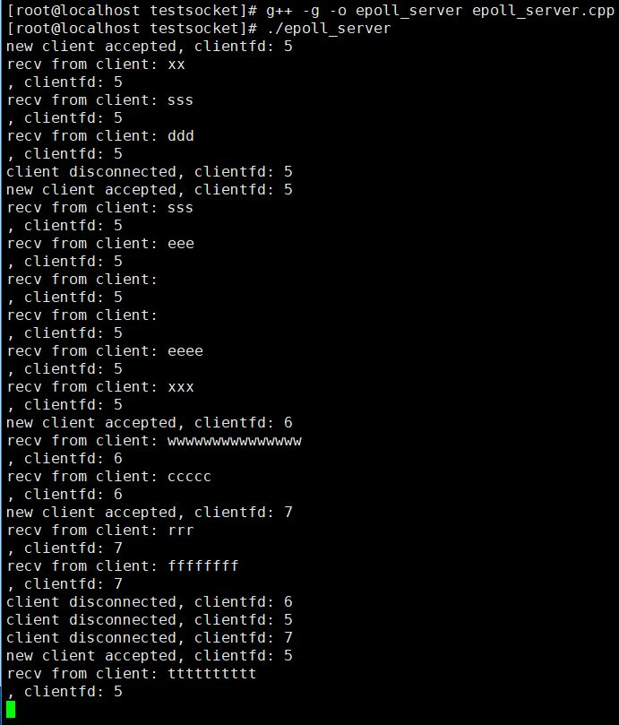

# Linux epoll 模型（含LT 模式和 ET 模式详解）

综合 **select** 和 **poll** 的一些优缺点，Linux 从内核 2.6 版本开始引入了更高效的 epoll 模型，本节我们来详细介绍 epoll 模型。

要想使用 epoll 模型，必须先需要创建一个 epollfd，这需要使用 **epoll_create** 函数去创建：

```
#include <sys/epoll.h>

int epoll_create(int size);
```

参数 **size** 从 Linux 2.6.8 以后就不再使用，但是必须设置一个大于 0 的值。**epoll_create** 函数调用成功返回一个非负值的 epollfd，调用失败返回 -1。

有了 epollfd 之后，我们需要将我们需要检测事件的其他 fd 绑定到这个 epollfd 上，或者修改一个已经绑定上去的 fd 的事件类型，或者在不需要时将 fd 从 epollfd 上解绑，这都可以使用 **epoll_ctl** 函数：

```
int epoll_ctl(int epfd, int op, int fd, struct epoll_event* event);
```

**参数说明：**

- 参数 **epfd** 即上文提到的 epollfd；

- 参数 **op**，操作类型，取值有 **EPOLL_CTL_ADD**、**EPOLL_CTL_MOD** 和 **EPOLL_CTL_DEL**，分别表示向 epollfd 上添加、修改和移除一个其他 fd，当取值是 **EPOLL_CTL_DEL**，第四个参数 **event** 忽略不计，可以设置为 NULL；

- 参数 **fd**，即需要被操作的 fd；

- 参数 **event**，这是一个 **epoll_event** 结构体的地址，**epoll_event** 结构体定义如下：

  ```
  struct epoll_event
  {
    uint32_t     events;      /* 需要检测的 fd 事件，取值与 poll 函数一样 */
    epoll_data_t data;        /* 用户自定义数据 */
  };
  ```

  **epoll_event** 结构体的 **data** 字段的类型是 **epoll_data_t**，我们可以利用这个字段设置一个自己的自定义数据，它本质上是一个 Union 对象，在 64 位操作系统中其大小是 8 字节，其定义如下：

  ```
  typedef union epoll_data
  {
    void*         ptr;
    int          fd;
    uint32_t     u32;
    uint64_t     u64;
  } epoll_data_t;
  ```

- **函数返回值**：**epoll_ctl** 调用成功返回 0，调用失败返回 -1，你可以通过 **errno** 错误码获取具体的错误原因。

创建了 epollfd，设置好某个 fd 上需要检测事件并将该 fd 绑定到 epollfd 上去后，我们就可以调用 **epoll_wait** 检测事件了，**epoll_wait** 函数签名如下：

```
int epoll_wait(int epfd, struct epoll_event* events, int maxevents, int timeout);
```

参数的形式和 **poll** 函数很类似，参数 **events** 是一个 **epoll_event** 结构数组的首地址，这是一个输出参数，函数调用成功后，**events** 中存放的是与就绪事件相关 **epoll_event** 结构体数组；参数 **maxevents** 是数组元素的个数；**timeout** 是超时时间，单位是毫秒，如果设置为 0，**epoll_wait** 会立即返回。

当 **epoll_wait** 调用成功会返回有事件的 fd 数目；如果返回 0 表示超时；调用失败返回 -1。

**epoll_wait** 使用示例如下：

```
while (true)
{
    epoll_event epoll_events[1024];
    int n = epoll_wait(epollfd, epoll_events, 1024, 1000);
    if (n < 0)
    {
        //被信号中断
        if (errno == EINTR)
            continue;

        //出错，退出
        break;
    }
    else if (n == 0)
    {
        //超时，继续
        continue;
    }

    for (size_t i = 0; i < n; ++i)
    {
        // 处理可读事件
        if (epoll_events[i].events & POLLIN)
        {
        }
        // 处理可写事件
        else if (epoll_events[i].events & POLLOUT)
        {
        }
        //处理出错事件
        else if (epoll_events[i].events & POLLERR)
        {
        }
    }
}
```

## epoll_wait 与 poll 的区别

通过前面介绍 **poll** 与 **epoll_wait** 函数的介绍，我们可以发现：

**epoll_wait** 函数调用完之后，我们可以直接在 **event** 参数中拿到所有有事件就绪的 fd，直接处理即可（**event** 参数仅仅是个出参）；而 **poll** 函数的事件集合调用前后数量都未改变，只不过调用前我们通过 **pollfd** 结构体的 **events** 字段设置待检测事件，调用后我们需要通过 **pollfd** 结构体的 **revents** 字段去检测就绪的事件（ 参数 **fds** 既是入参也是出参）。

举个生活中的例子，某人不断给你一些苹果，这些苹果有生有熟，调用 **epoll_wait** 相当于：

```
1. 你把苹果挨个投入到 epoll 机器中(调用 epoll_ctl);
2. 调用 epoll_wait 加工，你直接通过另外一个袋子就能拿到所有熟苹果。
```

调用 **poll** 相当于：

```
1. 把收到的苹果装入一个袋子里面然后调用 poll 加工；
2. 调用结束后，拿到原来的袋子，袋子中还是原来那么多苹果，只不过熟苹果被贴上了标签纸，你还是需要挨个去查看标签纸挑选熟苹果。 
```

当然，这并不意味着，**poll** 函数的效率不如 **epoll_wait**，一般在 fd 数量比较多，但某段时间内，就绪事件 fd 数量较少的情况下，**epoll_wait** 才会体现出它的优势，也就是说 socket 连接数量较大时而活跃连接较少时 epoll 模型更高效。

## LT 模式和 ET 模式

与 poll 的事件宏相比，epoll 新增了一个事件宏 **EPOLLET**，这就是所谓的**边缘触发模式**（**E**dge **T**rigger，ET），而默认的模式我们称为 **水平触发模式**（**L**evel **T**rigger，LT）。这两种模式的区别在于：

- 对于水平触发模式，一个事件只要有，就会一直触发；
- 对于边缘触发模式，只有一个事件从无到有才会触发。

这两个词汇来自电学术语，你可以将 fd 上有数据认为是**高电平**，没有数据认为是**低电平**，将 fd 可写认为是**高电平**，fd 不可写认为是**低电平**。那么水平模式的触发条件是状态处于高电平，而边缘模式是状态改为高电平，即：

**水平模式的触发条件**

```
1. 低电平 => 高电平
2. 高电平 => 高电平
```

**边缘模式的触发条件**

```
1. 低电平 => 高电平
```

说的有点抽象，以 socket 的读事件为例，对于水平模式，只要 socket 上有未读完的数据，就会一直产生 POLLIN 事件；而对于边缘模式，socket 上第一次有数据会触发一次，后续 socket 上存在数据也不会再触发，除非把数据读完后，再次产生数据才会继续触发。对于 socket 写事件，如果 socket 的 TCP 窗口一直不饱和，会一直触发 POLLOUT 事件；而对于边缘模式，只会触发一次，除非 TCP 窗口由不饱和变成饱和再一次变成不饱和，才会再次触发 POLLOUT 事件。

**socket 可读事件水平模式触发条件：**

```
1. socket上无数据 => socket上有数据
2. socket上有数据 => socket上有数据
```

**socket 可读事件边缘模式触发条件：**

```
1. socket上无数据 => socket上有数据
```

**socket 可写事件水平模式触发条件：**

```
1. socket可写   => socket可写
2. socket不可写 => socket可写
```

**socket 可写事件边缘模式触发条件：**

```
1. socket不可写 => socket可写
```

也就是说，如果对于一个非阻塞 socket，如果使用 epoll 边缘模式去检测数据是否可读，触发可读事件以后，一定要一次性把 socket 上的数据收取干净才行，也就是一定要循环调用 recv 函数直到 recv 出错，错误码是**EWOULDBLOCK**（**EAGAIN** 一样）；如果使用水平模式，则不用，你可以根据业务一次性收取固定的字节数，或者收完为止。边缘模式下收取数据的代码示例如下：

```
bool TcpSession::RecvEtMode()
{
    //每次只收取256个字节
    char buff[256];
    while (true)
    {       
        int nRecv = ::recv(clientfd_, buff, 256, 0);
        if (nRecv == -1)
        {
            if (errno == EWOULDBLOCK)
                return true;
            else if (errno == EINTR)
                continue;

            return false;
        }
        //对端关闭了socket
        else if (nRecv == 0)
            return false;

        inputBuffer_.add(buff, (size_t)nRecv);
    }

    return true;
}
```

最后，我们来看一个 epoll 模型的完整例子：

```
/**
 * 演示 epoll 通信模型，epoll_server.cpp
 * zhangyl 2019.03.16
 */
#include <sys/types.h> 
#include <sys/socket.h>
#include <arpa/inet.h>
#include <unistd.h>
#include <fcntl.h>
#include <sys/epoll.h>
#include <poll.h>
#include <iostream>
#include <string.h>
#include <vector>
#include <errno.h>

int main(int argc, char* argv[])
{
    //创建一个侦听socket
    int listenfd = socket(AF_INET, SOCK_STREAM, 0);
    if (listenfd == -1)
    {
        std::cout << "create listen socket error." << std::endl;
        return -1;
    }

    //将侦听socket设置为非阻塞的
    int oldSocketFlag = fcntl(listenfd, F_GETFL, 0);
    int newSocketFlag = oldSocketFlag | O_NONBLOCK;
    if (fcntl(listenfd, F_SETFL,  newSocketFlag) == -1)
    {
        close(listenfd);
        std::cout << "set listenfd to nonblock error." << std::endl;
        return -1;
    }

    //初始化服务器地址
    struct sockaddr_in bindaddr;
    bindaddr.sin_family = AF_INET;
    bindaddr.sin_addr.s_addr = htonl(INADDR_ANY);
    bindaddr.sin_port = htons(3000);
    if (bind(listenfd, (struct sockaddr *)&bindaddr, sizeof(bindaddr)) == -1)
    {
        std::cout << "bind listen socket error." << std::endl;
        close(listenfd);
        return -1;
    }

    //启动侦听
    if (listen(listenfd, SOMAXCONN) == -1)
    {
        std::cout << "listen error." << std::endl;
        close(listenfd);
        return -1;
    }

    //复用地址和端口号
    int on = 1;
    setsockopt(listenfd, SOL_SOCKET, SO_REUSEADDR, (char *)&on, sizeof(on));
    setsockopt(listenfd, SOL_SOCKET, SO_REUSEPORT, (char *)&on, sizeof(on));

    //创建epollfd
    int epollfd = epoll_create(1);
    if (epollfd == -1)
    {
        std::cout << "create epollfd error." << std::endl;
        close(listenfd);
        return -1;
    }

    epoll_event listen_fd_event;
    listen_fd_event.events = POLLIN;
    listen_fd_event.data.fd = listenfd;

    //将侦听socket绑定到epollfd上去
    if(epoll_ctl(epollfd, EPOLL_CTL_ADD, listenfd, &listen_fd_event) == -1)
    {
        std::cout << "epoll_ctl error." << std::endl;
        close(listenfd);
        return -1;
    }

    int n;
    while (true)
    {       
        epoll_event epoll_events[1024];
        n = epoll_wait(epollfd, epoll_events, 1024, 1000);
        if (n < 0)
        {
            //被信号中断
            if (errno == EINTR)
                continue;

            //出错，退出
            break;
        }
        else if (n == 0)
        {
            //超时，继续
            continue;
        }

        for (size_t i = 0; i < n; ++i)
        {
            // 事件可读
            if (epoll_events[i].events & POLLIN)
            {
                if (epoll_events[i].data.fd == listenfd)
                {
                    //侦听socket，接受新连接
                    struct sockaddr_in clientaddr;
                    socklen_t clientaddrlen = sizeof(clientaddr);
                    //接受客户端连接, 并加入到fds集合中
                    int clientfd = accept(listenfd, (struct sockaddr *)&clientaddr, &clientaddrlen);
                    if (clientfd != -1)
                    {
                        //将客户端socket设置为非阻塞的
                        int oldSocketFlag = fcntl(clientfd, F_GETFL, 0);
                        int newSocketFlag = oldSocketFlag | O_NONBLOCK;
                        if (fcntl(clientfd, F_SETFL,  newSocketFlag) == -1)
                        {
                            close(clientfd);
                            std::cout << "set clientfd to nonblock error." << std::endl;                        
                        }
                        else
                        {
                            epoll_event client_fd_event;
                            client_fd_event.events = POLLIN;
                            client_fd_event.data.fd = clientfd;                         
                            if(epoll_ctl(epollfd, EPOLL_CTL_ADD, clientfd, &client_fd_event) != -1)
                            {
                                std::cout << "new client accepted, clientfd: " << clientfd << std::endl;
                            }
                            else
                            {
                                std::cout << "add client fd to epollfd error." << std::endl;
                                close(clientfd);                            
                            }
                        }       
                    }
                }
                else 
                {
                    //普通clientfd,收取数据
                    char buf[64] = { 0 };
                    int m = recv(epoll_events[i].data.fd, buf, 64, 0);
                    if (m == 0)
                    {
                        //对端关闭了连接，从epollfd上移除clientfd
                        if(epoll_ctl(epollfd, EPOLL_CTL_DEL, epoll_events[i].data.fd, NULL) != -1)
                        {
                            std::cout << "client disconnected, clientfd: " << epoll_events[i].data.fd << std::endl;
                        }
                        close(epoll_events[i].data.fd);
                    }
                    else if (m < 0)
                    {                                           
                        //出错，从epollfd上移除clientfd
                        if (errno != EWOULDBLOCK && errno != EINTR)
                        {
                            if(epoll_ctl(epollfd, EPOLL_CTL_DEL, epoll_events[i].data.fd, NULL) != -1)
                            {
                                std::cout << "client disconnected, clientfd: " << epoll_events[i].data.fd << std::endl;
                            }
                            close(epoll_events[i].data.fd);
                        }
                    }
                    else
                    {
                        //正常收到数据
                        std::cout << "recv from client: " << buf << ", clientfd: " << epoll_events[i].data.fd << std::endl;
                    }
                }
            }
            else if (epoll_events[i].events & POLLERR)
            {
                //TODO: 暂且不处理
            }

        }// end  outer-for-loop
    }// end  while-loop


    //关闭侦听socket
    //（理论上应该关闭包括所有clientfd在内的fd，但这里只是为了演示问题，就不写额外的代码来处理啦）
    close(listenfd);            

    return 0;
}
```

编译上述程序生成 **epoll_server** 并启动，然后使用 **nc** 命令启动三个客户端给服务器发数据效果如下图所示：


