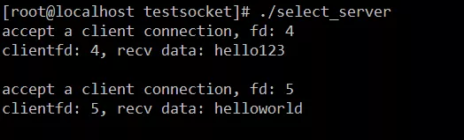
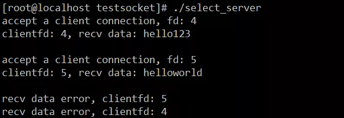
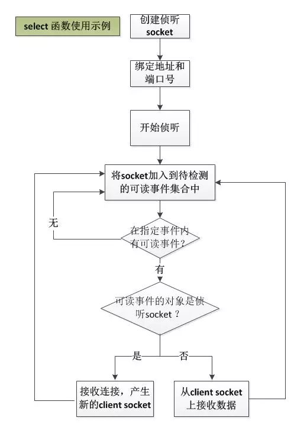
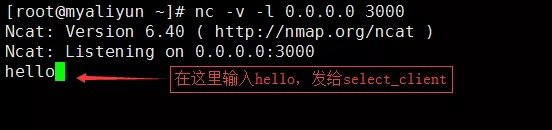
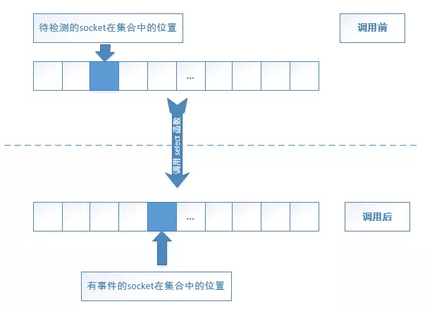
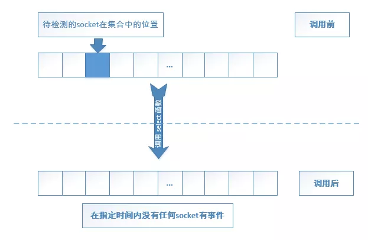
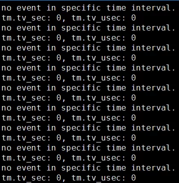

## select 函数重难点解析

**select** 函数是网络通信编程中非常常用的一个函数，因此应该熟练掌握它。虽然它是 BSD 标准之一的 Socket 函数之一，但在 Linux 和 Windows 平台，其行为表现还是有点区别的。我们先来看一下 Linux 平台上的 select 函数。

#### Linux 平台下的 select 函数

**select** 函数的作用是检测一组 socket 中某个或某几个是否有“**事件**”，这里的“**事件”**一般分为如下三类：

- 可读事件，一般意味着可以调用 **recv** 或 **read** 函数从该 socket 上读取数据；如果该 socket 是侦听 **socket**（即调用了 **bind** 函数绑定过 ip 地址和端口号，并调用了 **listen** 启动侦听的 socket），可读意味着此时可以有新的客户端连接到来，此时可调用 **accept** 函数接受新连接。
- 可写事件，一般意味着此时调用 **send** 或 **write** 函数可以将数据“发出去”。
- 异常事件，某个 socket 出现异常。

函数签名如下：

```
int select(int nfds, 
           fd_set *readfds,
           fd_set *writefds,
           fd_set *exceptfds,
           struct timeval *timeout);
```

参数说明：

- 参数 **nfds**， Linux 下 socket 也称 fd，这个参数的值设置成所有需要使用 select 函数监听的 fd 中最大 fd 值加 1。

- 参数 **readfds**，需要监听可读事件的 fd 集合。

- 参数 **writefds**，需要监听可写事件的 fd 集合。

- 参数 **exceptfds**，需要监听异常事件 fd 集合。

  **readfds**、**writefds** 和 **exceptfds** 类型都是 **fd_set**，这是一个结构体信息，其定义位于 **/usr/include/sys/select.h** 中：

  ```
  /* The fd_set member is required to be an array of longs.  */
  typedef long int __fd_mask;
  
  /* Some versions of <linux/posix_types.h> define this macros.  */
  #undef  __NFDBITS
  /* It's easier to assume 8-bit bytes than to get CHAR_BIT.  */
  #define __NFDBITS       (8 * (int) sizeof (__fd_mask))
  #define __FD_ELT(d)     ((d) / __NFDBITS)
  #define __FD_MASK(d)    ((__fd_mask) 1 << ((d) % __NFDBITS))
  
  /* fd_set for select and pselect.  */
  typedef struct
  {
    /* XPG4.2 requires this member name.  Otherwise avoid the name
       from the global namespace.  */
  #ifdef __USE_XOPEN
    __fd_mask fds_bits[__FD_SETSIZE / __NFDBITS];
  # define __FDS_BITS(set) ((set)->fds_bits)
  #else
    // 在我的centOS 7.0 系统中的值：
    // __FD_SETSIZE = 1024
    //__NFDBITS = 64
    __fd_mask __fds_bits[__FD_SETSIZE / __NFDBITS];     
  # define __FDS_BITS(set) ((set)->__fds_bits)
  #endif
  } fd_set;
  
  /* Maximum number of file descriptors in 'fd_set'.  */
  #define FD_SETSIZE              __FD_SETSIZE
  ```

  我们假设未定义宏 **__USE_XOPEN**，将上面的代码整理一下：

  ```
  typedef struct
  { 
    long int __fds_bits[16];     
  } fd_set;
  ```

  将一个 fd 添加到 fd_set 这个集合中需要使用 **FD_SET** 宏，其定义如下：

  ```
  void FD_SET(int fd, fd_set *set);
  ```

  其实现如下：

  ```
  #define FD_SET(fd,fdsetp) __FD_SET(fd,fdsetp)
  ```

  **FD_SET** 在内部又是通过宏 **__FD_SET** 来实现的，**__FD_SET** 的定义如下（位于 **/usr/include/bits/select.h** 中）：

  ```
  #if defined __GNUC__ && __GNUC__ >= 2
  
  # if __WORDSIZE == 64
  #  define __FD_ZERO_STOS "stosq"
  # else
  #  define __FD_ZERO_STOS "stosl"
  # endif
  
  # define __FD_ZERO(fdsp) \
  do {                                                                        \
    int __d0, __d1;                                                           \
    __asm__ __volatile__ ("cld; rep; " __FD_ZERO_STOS                         \
                          : "=c" (__d0), "=D" (__d1)                          \
                          : "a" (0), "0" (sizeof (fd_set)                     \
                                          / sizeof (__fd_mask)),              \
                            "1" (&__FDS_BITS (fdsp)[0])                       \
                          : "memory");                                        \
  } while (0)
  
  #else   /* ! GNU CC */
  
  /* We don't use `memset' because this would require a prototype and
   the array isn't too big.  */
  # define __FD_ZERO(set)  \
  do {                                                                        \
    unsigned int __i;                                                         \
    fd_set *__arr = (set);                                                    \
    for (__i = 0; __i < sizeof (fd_set) / sizeof (__fd_mask); ++__i)          \
      __FDS_BITS (__arr)[__i] = 0;                                            \
  } while (0)
  
  #endif  /* GNU CC */
  
  #define __FD_SET(d, set) \
  ((void) (__FDS_BITS (set)[__FD_ELT (d)] |= __FD_MASK (d)))
  #define __FD_CLR(d, set) \
  ((void) (__FDS_BITS (set)[__FD_ELT (d)] &= ~__FD_MASK (d)))
  #define __FD_ISSET(d, set) \
  ((__FDS_BITS (set)[__FD_ELT (d)] & __FD_MASK (d)) != 0)
  ```

  重点看这一行：

  ```
  ((void) (__FDS_BITS (set)[__FD_ELT (d)] |= __FD_MASK (d)))
  ```

  **__FD_MASK** 和 **__FD_ELT** 宏在上面的代码中已经给出定义：

  ```
  #define __FD_ELT(d)     ((d) / __NFDBITS)
  #define __FD_MASK(d)    ((__fd_mask) 1 << ((d) % __NFDBITS))
  ```

  **__NFDBITS** 的值是 **64** （**8 \* 8**），也就是说 **__FD_MASK (d)** 先计算 fd 与 64 的余数 n，然后执行 1 << n，这一操作实际上是将 fd 的值放在 0～63 这 64 的位置上去，这个位置索引就是 fd 与 64 取模的结果；同理 **__FD_ELT(d)** 就是计算位置索引值了。举个例子，假设现在 fd 的 值是 57，那么在这 64 个位置的 57 位，其值在 64 个长度的二进制中置位是：

  ```
  0000 0010 0000 0000 0000 0000 0000 0000 0000 0000 0000 0000 0000 0000 0000 0000
  ```

  这个值就是 **1 << (57 % 64)** 得到的数字。

  但是前面 fd 数组的定义是：

  ```
  typedef struct
  { 
    long int __fds_bits[16];    //可以看成是128 bit的数组 
  } fd_set;
  ```

  **long int** 占 8 个字节，一个 16 个 **long int**，如果换成二进制的位(**bit**)就是 **8 \* 16** = **128**， 也就是这个数组只用了低 64 位， 高 64 位并没有使用。这说明在我的机器上，select 函数支持操作的最大 fd 数量是 64。

  同理，如果我们需要从 fd_set 上删除一个 fd，我们可以调用 **FD_CLR**，其定义如下：

  ```
  void FD_CLR(int fd, fd_set *set);
  ```

  原理和 **FD_SET** 相同，即将对应的标志位由1变0即可。

  如果，我们需要将 fd_set 中所有的 fd 都清掉，则使用宏 **FD_ZERO**：

  ```
  void FD_ZERO(fd_set *set);
  ```

  当 select 函数返回时， 我们使用 **FD_ISSET** 宏来判断某个 fd 是否有我们关心的事件，**FD_ISSET** 宏的定义如下：

```
int  FD_ISSET(int fd, fd_set *set);
```

**FD_ISSET** 宏本质上就是检测对应的位置上是否置 1，实现如下：

```
#define __FD_ISSET(d, set) \
    ((__FDS_BITS (set)[__FD_ELT (d)] & __FD_MASK (d)) != 0)
```

> 提醒一下： __FD_ELT 和 __FD_MASK 宏前文的代码已经给过具体实现了。

- 参数 **timeout**，超时时间，即在这个参数设定的时间内检测这些 fd 的事件，超过这个时间后 **select** 函数将立即返回。这是一个 **timeval** 类型结构体，其定义如下：

  ```
  struct timeval 
  {
    long    tv_sec;         /* seconds */
    long    tv_usec;        /* microseconds */
  };
  ```

  **select** 函数的总超时时间是 **timeout->tv_sec** 和 **timeout->tv_usec** 之和， 前者的时间单位是秒，后者的时间单位是微妙。

说了这么多理论知识，我们先看一个具体的示例：

```
/**
 * select函数示例，server端, select_server.cpp
 * zhangyl 2018.12.24
 */
#include <sys/types.h> 
#include <sys/socket.h>
#include <arpa/inet.h>
#include <unistd.h>
#include <iostream>
#include <string.h>
#include <sys/time.h>
#include <vector>
#include <errno.h>

//自定义代表无效fd的值
#define INVALID_FD -1

int main(int argc, char* argv[])
{
    //创建一个侦听socket
    int listenfd = socket(AF_INET, SOCK_STREAM, 0);
    if (listenfd == -1)
    {
        std::cout << "create listen socket error." << std::endl;
        return -1;
    }

    //初始化服务器地址
    struct sockaddr_in bindaddr;
    bindaddr.sin_family = AF_INET;
    bindaddr.sin_addr.s_addr = htonl(INADDR_ANY);
    bindaddr.sin_port = htons(3000);
    if (bind(listenfd, (struct sockaddr *)&bindaddr, sizeof(bindaddr)) == -1)
    {
        std::cout << "bind listen socket error." << std::endl;
        close(listenfd);
        return -1;
    }

    //启动侦听
    if (listen(listenfd, SOMAXCONN) == -1)
    {
        std::cout << "listen error." << std::endl;
        close(listenfd);
        return -1;
    }

    //存储客户端socket的数组
    std::vector<int> clientfds;
    int maxfd = listenfd;

    while (true) 
    {   
        fd_set readset;
        FD_ZERO(&readset);

        //将侦听socket加入到待检测的可读事件中去
        FD_SET(listenfd, &readset);

        //将客户端fd加入到待检测的可读事件中去
        int clientfdslength = clientfds.size();
        for (int i = 0; i < clientfdslength; ++i)
        {
            if (clientfds[i] != INVALID_FD)
            {
                FD_SET(clientfds[i], &readset);
            }
        }

        timeval tm;
        tm.tv_sec = 1;
        tm.tv_usec = 0;
        //暂且只检测可读事件，不检测可写和异常事件
        int ret = select(maxfd + 1, &readset, NULL, NULL, &tm);
        if (ret == -1)
        {
            //出错，退出程序。
            if (errno != EINTR)
                break;
        }
        else if (ret == 0)
        {
            //select 函数超时，下次继续
            continue;
        } else {
            //检测到某个socket有事件
            if (FD_ISSET(listenfd, &readset))
            {
                //侦听socket的可读事件，则表明有新的连接到来
                struct sockaddr_in clientaddr;
                socklen_t clientaddrlen = sizeof(clientaddr);
                //4. 接受客户端连接
                int clientfd = accept(listenfd, (struct sockaddr *)&clientaddr, &clientaddrlen);
                if (clientfd == -1)                 
                {           
                    //接受连接出错，退出程序
                    break;
                }

                //只接受连接，不调用recv收取任何数据
                std:: cout << "accept a client connection, fd: " << clientfd << std::endl;
                clientfds.push_back(clientfd);
                //记录一下最新的最大fd值，以便作为下一轮循环中select的第一个参数
                if (clientfd > maxfd)
                    maxfd = clientfd;
            } 
            else 
            {
                //假设对端发来的数据长度不超过63个字符
                char recvbuf[64];
                int clientfdslength = clientfds.size();
                for (int i = 0; i < clientfdslength; ++i)
                {
                    if (clientfds[i] != -1 && FD_ISSET(clientfds[i], &readset))
                    {               
                        memset(recvbuf, 0, sizeof(recvbuf));
                        //非侦听socket，则接收数据
                        int length = recv(clientfds[i], recvbuf, 64, 0);
                        if (length <= 0 && errno != EINTR)
                        {
                            //收取数据出错了
                            std::cout << "recv data error, clientfd: " << clientfds[i] << std::endl;                            
                            close(clientfds[i]);
                            //不直接删除该元素，将该位置的元素置位-1
                            clientfds[i] = INVALID_FD;
                            continue;
                        }

                        std::cout << "clientfd: " << clientfds[i] << ", recv data: " << recvbuf << std::endl;                   
                    }
                }

            }
        }
    }

    //关闭所有客户端socket
    int clientfdslength = clientfds.size();
    for (int i = 0; i < clientfdslength; ++i)
    {
        if (clientfds[i] != INVALID_FD)
        {
            close(clientfds[i]);
        }
    }

    //关闭侦听socket
    close(listenfd);

    return 0;
}
```

我们编译并运行程序：

```
[root@localhost testsocket]# g++ -g -o select_server select_server.cpp 
[root@localhost testsocket]# ./select_server 
```

然后，我们再多开几个 shell 窗口，我们这里不再专门编写客户端程序了，我们使用 Linux 下的 **nc** 指令模拟出两个客户端。

shell 窗口1，连接成功以后发送字符串 **hello123**：

```
[root@localhost ~]# nc -v 127.0.0.1 3000
Ncat: Version 6.40 ( http://nmap.org/ncat )
Ncat: Connected to 127.0.0.1:3000.
hello123
```

shell 窗口2，连接成功以后发送字符串 **helloworld**：

```
[root@localhost ~]# nc -v 127.0.0.1 3000
Ncat: Version 6.40 ( http://nmap.org/ncat )
Ncat: Connected to 127.0.0.1:3000.
helloworld
```

此时服务器端输出结果如下：



注意，由于 **nc** 发送的数据是按换行符来区分的，每一个数据包默认的换行符以**\n** 结束（当然，你可以 **-C** 选项换成\r\n），所以服务器收到数据后，显示出来的数据每一行下面都有一个空白行。

当断开各个客户端连接时，服务器端 select 函数对各个客户端 fd 检测时，仍然会触发可读事件，此时对这些 fd 调用 recv 函数会返回 **0**（recv 函数返回0，表明对端关闭了连接，这是一个很重要的知识点，下文我们会有一章节专门介绍这些函数的返回值），服务器端也关闭这些连接就可以了。

客户端断开连接后，服务器端的运行输出结果：




以上代码是一个简单的服务器程序实现的基本流程，代码虽然简单，但是非常具有典型性和代表性，而且同样适用于客户端网络通信，如果用于客户端的话，只需要用 select 检测连接 socket 就可以了，如果连接 socket 有可读事件，调用 recv 函数来接收数据，剩下的逻辑都是一样的。上面的代码我们画一张流程图如下：




关于上述代码在实际开发中有几个需要注意的事项，这里逐一来说明一下：

**1. select 函数调用前后会修改 readfds、writefds 和 exceptfds 这三个集合中的内容（如果有的话），所以如果您想下次调用 select 复用这个变量，记得在下次调用前再次调用 select 前先使用 FD_ZERO 将集合清零，然后调用 FD_SET 将需要检测事件的 fd 再次添加进去**。

> select 函数调用之后，**readfds**、**writefds** 和 **exceptfds** 这三个集合中存放的不是我们之前设置进去的 fd，而是有相关有读写或异常事件的 fd，也就是说 select 函数会修改这三个参数的内容，这也要求我们**当一个 fd_set 被 select 函数调用后，这个 fd_set 就已经发生了改变，下次如果我们需要使用它，必须使用 FD_ZERO 宏先清零，再重新将我们关心的 fd 设置进去**。这点我们从 **FD_ISSET** 源码也可以看出来：

```
 #define __FD_ISSET(d, set) \
    ((__FDS_BITS (set)[__FD_ELT (d)] & __FD_MASK (d)) != 0)
```

如果调用 select 函数之后没有改变 fd_set 集合，那么即使某个 socket 上没有事件，调用 select 函数之后我们用 **FD_ISSET** 检测，会原路得到原来设置上去的 socket。这是很多初学者在学习 select 函数容易犯的一个错误，我们通过一个示例来验证一下，这次我们把 select 函数用在客户端。

```
/**
 * 验证调用select后必须重设fd_set，select_client.cpp
 * zhangyl 2018.12.24
 */
#include <sys/types.h> 
#include <sys/socket.h>
#include <arpa/inet.h>
#include <unistd.h>
#include <iostream>
#include <string.h>
#include <errno.h>
#include <string.h>

#define SERVER_ADDRESS "127.0.0.1"
#define SERVER_PORT     3000

int main(int argc, char* argv[])
{
    //创建一个socket
    int clientfd = socket(AF_INET, SOCK_STREAM, 0);
    if (clientfd == -1)
    {
        std::cout << "create client socket error." << std::endl;
        return -1;
    }

    //连接服务器
    struct sockaddr_in serveraddr;
    serveraddr.sin_family = AF_INET;
    serveraddr.sin_addr.s_addr = inet_addr(SERVER_ADDRESS);
    serveraddr.sin_port = htons(SERVER_PORT);
    if (connect(clientfd, (struct sockaddr *)&serveraddr, sizeof(serveraddr)) == -1)
    {
        std::cout << "connect socket error." << std::endl;
        close(clientfd);
        return -1;
    }

    fd_set readset;
    FD_ZERO(&readset);

    //将侦听socket加入到待检测的可读事件中去
    FD_SET(clientfd, &readset); 
    timeval tm;
    tm.tv_sec = 5;
    tm.tv_usec = 0; 
    int ret;
    int count = 0;
    fd_set backup_readset;
    memcpy(&backup_readset, &readset, sizeof(fd_set));
    while (true)
    {
        if (memcmp(&readset, &backup_readset, sizeof(fd_set)) == 0)
        {
            std::cout << "equal" << std::endl;
        }
        else
        {
            std::cout << "not equal" << std::endl;
        }

        //暂且只检测可读事件，不检测可写和异常事件
        ret = select(clientfd + 1, &readset, NULL, NULL, &tm);
        std::cout << "tm.tv_sec: " << tm.tv_sec << ", tm.tv_usec: " << tm.tv_usec << std::endl;
        if (ret == -1)
        {
            //除了被信号中断的情形，其他情况都是出错
            if (errno != EINTR)
                break;
        } else if (ret == 0){
            //select函数超时
            std::cout << "no event in specific time interval, count：" << count << std::endl;
            ++count;
            continue;
        } else {
            if (FD_ISSET(clientfd, &readset))
            {
                //检测到可读事件
                char recvbuf[32];
                memset(recvbuf, 0, sizeof(recvbuf));
                //假设对端发数据的时候不超过31个字符。
                int n = recv(clientfd, recvbuf, 32, 0);
                if (n < 0)
                {
                    //除了被信号中断的情形，其他情况都是出错
                    if (errno != EINTR)
                        break;
                } else if (n == 0) {
                    //对端关闭了连接
                    break;
                } else {
                    std::cout << "recv data: " << recvbuf << std::endl;
                }
            }
            else 
            {
                std::cout << "other socket event." << std::endl;
            }
        }
    }       

    //关闭socket
    close(clientfd);

    return 0;
}
```

在 shell 窗口输入以下命令编译程序产生可执行文件 **select_client**：

```
g++ -g -o select_client select_client.cpp
```

这次产生的是客户端程序，服务器程序我们这里使用 Linux **nc** 命令来模拟一下，由于客户端连接的是 **127.0.0.1:3000** 这个地址和端口号，所以我们在另外一个shell 窗口的 **nc** 命令的参数可以这么写：

```
nc -v -l 0.0.0.0 3000
```

执行效果如下：接着我们启动客户端 **select_client**：

```
[root@myaliyun testsocket]# ./select_client 
```

需要注意的是，这里我故意将客户端代码中 select 函数的超时时间设置为5秒，以足够我们在这 5 秒内给客户端发一个数据。如果我们在 5 秒内给客户端发送 **hello** 字符串：



客户端输出如下：

```
[root@myaliyun testsocket]# ./select_client 
equal
recv data: hello

...部分数据省略...
not equal
tm.tv_sec: 0, tm.tv_usec: 0
no event in specific time interval, count：31454
not equal
tm.tv_sec: 0, tm.tv_usec: 0
no event in specific time interval, count：31455
not equal
tm.tv_sec: 0, tm.tv_usec: 0
no event in specific time interval, count：31456
not equal
tm.tv_sec: 0, tm.tv_usec: 0
no event in specific time interval, count：31457
...部分输出省略...
```

除了第一次 **select_client** 会输出 **equal** 字样，后面再也没输出，而 **select** 函数以后的执行结果也是超时，即使此时服务器端再次给客户端发送数据。因此验证了：**select 函数执行后，确实会对三个参数的 fd_set 进行修改** 。**select** 函数修改某个 fd_set 集合可以使用如下两张图来说明一下：





因此在调用 **select** 函数以后， 原来位置的的标志位可能已经不复存在，这也就是为什么我们的代码中调用一次 **select** 函数以后，即使服务器端再次发送数据过来，**select** 函数也不会再因为存在可读事件而返回了，因为第二次 clientfd 已经不在那个 read_set 中了。因此如果复用这些 fd_set 变量，必须按上文所说的重新清零再重新添加关心的 socket 到集合中去。

**2. select 函数也会修改 timeval 结构体的值，这也要求我们如果像复用这个变量，必须给 timeval 变量重新设置值。**

注意观察上面的例子的输出，我们在调用 **select** 函数一次之后，变量 tv 的值也被修改了。具体修改成多少，得看系统的表现。当然这种特性却不是跨平台的，在 Linux 系统中是这样的，而在其他操作系统上却不一定是这样（Windows 上就不会修改这个结构体的值），这点在 Linux man 手册 **select** 函数的说明中说的很清楚：

```
On  Linux,  select()  modifies timeout to reflect the amount
of time not slept; most other implementations do not do this.
(POSIX.1-2001 permits either behavior.)  This causes problems 
both when Linux code which reads timeout is ported to  other 
operating systems, and when code is ported to Linux that reuses
a struct timeval for multiple select()s in a loop without
reinitializing it.  Consider timeout to be undefined after
select() returns.
```

由于不同系统的实现不一样，man 手册的建议将 **select** 函数修改 **timeval** 结构体的值的行为当作是未定义的，言下之意是**如果你要下次使用 select 函数复用这个变量时，记得重新赋值**。这是 select 函数需要注意的第二个地方。

**3. select 函数的 timeval 结构体的 tv_sec 和 tv_sec 如果两个值设置为 0，即检测事件总时间设置为0，其行为是 select 会检测一下相关集合中的 fd，如果没有需要的事件，则立即返回**。

我们将上述 **select_client.cpp** 修改一下，修改后的代码如下：

```
   /**
    * 验证select时间参数设置为0，select_client_tv0.cpp
    * zhangyl 2018.12.25
    */
   #include <sys/types.h> 
   #include <sys/socket.h>
   #include <arpa/inet.h>
   #include <unistd.h>
   #include <iostream>
   #include <string.h>
   #include <errno.h>
   #include <string.h>

   #define SERVER_ADDRESS "127.0.0.1"
   #define SERVER_PORT     3000

   int main(int argc, char* argv[])
   {
       //创建一个socket
       int clientfd = socket(AF_INET, SOCK_STREAM, 0);
       if (clientfd == -1)
       {
           std::cout << "create client socket error." << std::endl;
           return -1;
       }

       //连接服务器
       struct sockaddr_in serveraddr;
       serveraddr.sin_family = AF_INET;
       serveraddr.sin_addr.s_addr = inet_addr(SERVER_ADDRESS);
       serveraddr.sin_port = htons(SERVER_PORT);
       if (connect(clientfd, (struct sockaddr *)&serveraddr, sizeof(serveraddr)) == -1)
       {
           std::cout << "connect socket error." << std::endl;
           close(clientfd);
           return -1;
       }

       int ret;
       while (true)
       {
           fd_set readset;
           FD_ZERO(&readset);
           //将侦听socket加入到待检测的可读事件中去
           FD_SET(clientfd, &readset); 
           timeval tm;
           tm.tv_sec = 0;
           tm.tv_usec = 0; 

           //暂且只检测可读事件，不检测可写和异常事件
           ret = select(clientfd + 1, &readset, NULL, NULL, &tm);
           std::cout << "tm.tv_sec: " << tm.tv_sec << ", tm.tv_usec: " << tm.tv_usec << std::endl;
           if (ret == -1)
           {
               //除了被信号中断的情形，其他情况都是出错
               if (errno != EINTR)
                   break;
           } else if (ret == 0){
               //select函数超时
               std::cout << "no event in specific time interval." << std::endl;
               continue;
           } else {
               if (FD_ISSET(clientfd, &readset))
               {
                   //检测到可读事件
                   char recvbuf[32];
                   memset(recvbuf, 0, sizeof(recvbuf));
                   //假设对端发数据的时候不超过31个字符。
                   int n = recv(clientfd, recvbuf, 32, 0);
                   if (n < 0)
                   {
                       //除了被信号中断的情形，其他情况都是出错
                       if (errno != EINTR)
                           break;
                   } else if (n == 0) {
                       //对端关闭了连接
                       break;
                   } else {
                       std::cout << "recv data: " << recvbuf << std::endl;
                   }
               }
               else 
               {
                   std::cout << "other socket event." << std::endl;
               }
           }
       }       


       //关闭socket
       close(clientfd);

       return 0;
   }
```

执行结果确实如我们预期的，这里 select 函数只是简单地检测一下 clientfd，并不会等待固定的时间，然后立即返回。




**4. 如果将 select 函数的 timeval 参数设置为 NULL，则 select 函数会一直阻塞下去，直到我们需要的事件触发。**

我们将上述代码再修改一下：

```
   /**
    * 验证select时间参数设置为NULL，select_client_tvnull.cpp
    * zhangyl 2018.12.25
    */
   #include <sys/types.h> 
   #include <sys/socket.h>
   #include <arpa/inet.h>
   #include <unistd.h>
   #include <iostream>
   #include <string.h>
   #include <errno.h>
   #include <string.h>

   #define SERVER_ADDRESS "127.0.0.1"
   #define SERVER_PORT     3000

   int main(int argc, char* argv[])
   {
       //创建一个socket
       int clientfd = socket(AF_INET, SOCK_STREAM, 0);
       if (clientfd == -1)
       {
           std::cout << "create client socket error." << std::endl;
           return -1;
       }

       //连接服务器
       struct sockaddr_in serveraddr;
       serveraddr.sin_family = AF_INET;
       serveraddr.sin_addr.s_addr = inet_addr(SERVER_ADDRESS);
       serveraddr.sin_port = htons(SERVER_PORT);
       if (connect(clientfd, (struct sockaddr *)&serveraddr, sizeof(serveraddr)) == -1)
       {
           std::cout << "connect socket error." << std::endl;
           close(clientfd);
           return -1;
       }

       int ret;
       while (true)
       {
           fd_set readset;
           FD_ZERO(&readset);
           //将侦听socket加入到待检测的可读事件中去
           FD_SET(clientfd, &readset); 
           //timeval tm;
           //tm.tv_sec = 0;
           //tm.tv_usec = 0;   

           //暂且只检测可读事件，不检测可写和异常事件
           ret = select(clientfd + 1, &readset, NULL, NULL, NULL);
           if (ret == -1)
           {
               //除了被信号中断的情形，其他情况都是出错
               if (errno != EINTR)
                   break;
           } else if (ret == 0){
               //select函数超时
               std::cout << "no event in specific time interval." << std::endl;
               continue;
           } else {
               if (FD_ISSET(clientfd, &readset))
               {
                   //检测到可读事件
                   char recvbuf[32];
                   memset(recvbuf, 0, sizeof(recvbuf));
                   //假设对端发数据的时候不超过31个字符。
                   int n = recv(clientfd, recvbuf, 32, 0);
                   if (n < 0)
                   {
                       //除了被信号中断的情形，其他情况都是出错
                       if (errno != EINTR)
                           break;
                   } else if (n == 0) {
                       //对端关闭了连接
                       break;
                   } else {
                       std::cout << "recv data: " << recvbuf << std::endl;
                   }
               }
               else 
               {
                   std::cout << "other socket event." << std::endl;
               }
           }
       }       


       //关闭socket
       close(clientfd);

       return 0;
   }
```

我们先在另外一个 shell 窗口用 **nc** 命令模拟一个服务器，监听的 ip 地址和端口号是 **0.0.0.0:3000**：

```
[root@myaliyun ~]# nc -v -l 0.0.0.0 3000
Ncat: Version 6.40 ( http://nmap.org/ncat )
Ncat: Listening on 0.0.0.0:3000
```

然后回到原来的 shell 窗口，编译上述 **select_client_tvnull.cpp**，并使用 gdb 运行程序，这次使用 gdb 运行程序的目的是为了当程序“卡”在某个位置时，我们可以使用 Ctrl + C 把程序中断下来看看程序阻塞在哪个函数调用处：

```
[root@myaliyun testsocket]# g++ -g -o select_client_tvnull select_client_tvnull.cpp 
[root@myaliyun testsocket]# gdb select_client_tvnull
Reading symbols from /root/testsocket/select_client_tvnull...done.
(gdb) r
Starting program: /root/testsocket/select_client_tvnull 
^C
Program received signal SIGINT, Interrupt.
0x00007ffff72e7783 in __select_nocancel () from /lib64/libc.so.6
Missing separate debuginfos, use: debuginfo-install glibc-2.17-196.el7_4.2.x86_64 libgcc-4.8.5-16.el7_4.1.x86_64 libstdc++-4.8.5-16.el7_4.1.x86_64
(gdb) bt
#0  0x00007ffff72e7783 in __select_nocancel () from /lib64/libc.so.6
#1  0x0000000000400c75 in main (argc=1, argv=0x7fffffffe5f8) at select_client_tvnull.cpp:51
(gdb) c
Continuing.
recv data: hello

^C
Program received signal SIGINT, Interrupt.
0x00007ffff72e7783 in __select_nocancel () from /lib64/libc.so.6
(gdb) c
Continuing.
recv data: world
```

如上输出结果所示，我们使用 gdb 的 **r** 命令（run）将程序跑起来后，程序卡在某个地方，我们按 Ctrl + C（代码中的 **^C**）中断程序后使用 **bt** 命令查看当前程序的调用堆栈，发现确实阻塞在 **select** 函数调用处；接着我们在服务器端给客户端发送一个 **hello** 数据：

```
[root@myaliyun ~]# nc -v -l 0.0.0.0 3000
Ncat: Version 6.40 ( http://nmap.org/ncat )
Ncat: Listening on 0.0.0.0:3000
Ncat: Connection from 127.0.0.1.
Ncat: Connection from 127.0.0.1:55968.
hello
```

客户端收到数据后，**select** 函数满足条件，立即返回，并将数据输出来后继续进行下一轮 **select** 检测，我们使用 Ctrl + C 将程序中断，发现程序又阻塞在 **select** 调用处；输入 **c** 命令（continue）让程序继续运行， 此时，我们再用服务器端给客户端发送 **world** 字符串，**select** 函数再次返回，并将数据打印出来，然后继续进入下一轮 select 检测，并继续在 select 处阻塞。

```
[root@myaliyun ~]# nc -v -l 0.0.0.0 3000
Ncat: Version 6.40 ( http://nmap.org/ncat )
Ncat: Listening on 0.0.0.0:3000
Ncat: Connection from 127.0.0.1.
Ncat: Connection from 127.0.0.1:55968.
hello
world
```


**5. 在 Linux 平台上，select 函数的第一个参数必须设置成需要检测事件的所有 fd 中的最大值加1**。所以上文中 **select_server.cpp** 中，每新产生一个 clientfd，我都会与当前最大的 **maxfd** 作比较，如果大于当前的 **maxfd** 则将 **maxfd** 更新成这个新的最大值。其最终目的是为了在 **select** 调用时作为第一个参数（加 1）传进去。

> 在 Windows 平台上，select 函数的第一个值传任意值都可以，Windows 系统本身不使用这个值，只是为了兼容性而保留了这个参数，但是在实际开发中为了兼容跨平台代码，也会按惯例，将这个值设置为最大 socket 加 1。这点请读者注意。

以上是我总结的 Linux 下 select 使用的**五个注意事项**，希望读者能理解它们。


