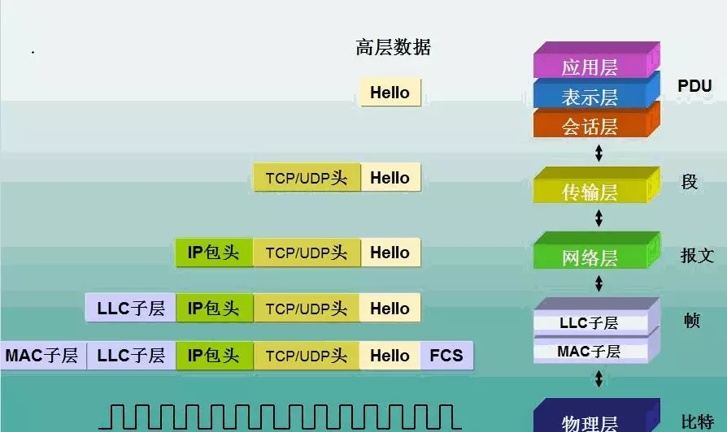
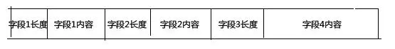
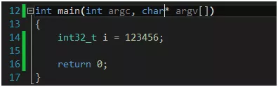
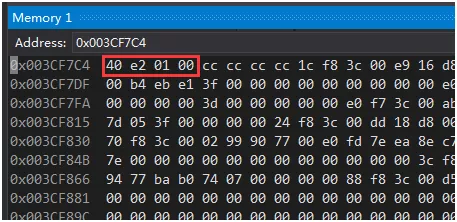
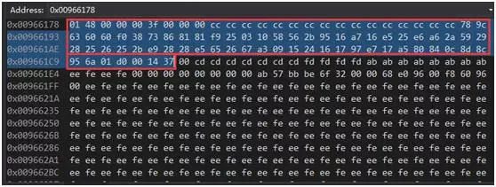
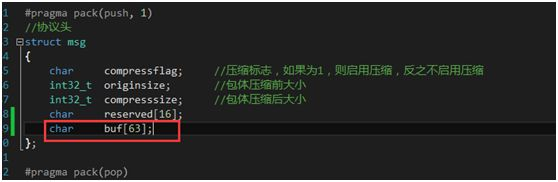
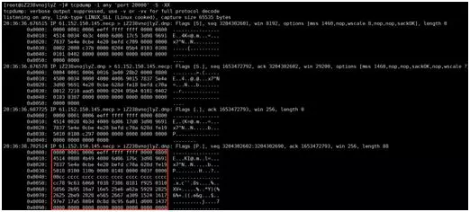
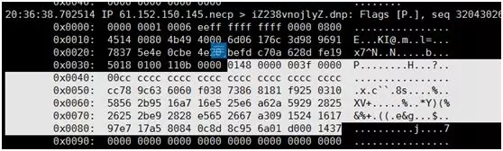

## 服务器开发通信协议设计介绍



## 一、选择TCP还是UDP协议

由于我们的即时通讯软件的用户存在用户状态问题，即用户登录成功以后可以在他的好友列表中看到哪些好友在线，所以客户端和服务器需要保持长连接状态。另外即时通讯软件一般要求信息准确、有序、完整地到达对端，而这也是TCP协议的特点之一。综合这两个所以这里我们选择TCP协议，而不是UDP协议。

## 二、协议的结构

由于TCP协议是流式协议，所谓流式协议即通讯的内容是无边界的字节流：如A给B连续发送了三个数据包，每个包的大小都是100个字节，那么B可能会一次性收到300个字节；也可能先收到100个字节，再收到200个字节；也可能先收到100个字节，再收到50个字节，再收到150个字节；或者先收到50个字节，再收到50个字节，再收到50个字节，最后收到150个字节。也就是说，B可能以任何组合形式收到这300个字节。即像水流一样无明确的边界。为了能让对端知道如何给包分界，目前一般有三种做法：

1. 以固定大小字节数目来分界，上文所说的就是属于这种类型，如每个包100个字节，对端每收齐100个字节，就当成一个包来解析；
2. 以特定符号来分界，如每个包都以特定的字符来结尾（如\n），当在字节流中读取到该字符时，则表明上一个包到此为止。
3. 固定包头+包体结构，这种结构中一般包头部分是一个固定字节长度的结构，并且包头中会有一个特定的字段指定包体的大小。这是目前各种网络应用用的最多的一种包格式。

上面三种分包方式各有优缺点，方法1和方法2简单易操作，但是缺点也很明显，就是很不灵活，如方法一当包数据不足指定长度，只能使用占位符如0来凑，比较浪费；方法2中包中不能有包界定符，否则就会引起歧义，也就是要求包内容中不能有某些特殊符号。而方法3虽然解决了方法1和方法2的缺点，但是操作起来就比较麻烦。我们的即时通讯协议就采用第三种分包方式。所以我们的协议包的包头看起来像这样：

```
struct package_header
{
    int32_t bodysize;
};
```

一个应用中，有许多的应用数据，拿我们这里的即时通讯来说，有注册、登录、获取好友列表、好友消息等各种各样的协议数据包，而每个包因为业务内容不一样可能数据内容也不一样，所以各个包可能看起来像下面这样：

```
struct package_header
{
    int32_t bodysize;
};

//登录数据包
struct register_package
{
    package_header header;
    //命令号
    int32_t cmd;
    //注册用户名
    char username[16];
    //注册密码
    char password[16];
    //注册昵称
    char nickname[16];
    //注册手机号
    char mobileno[16];
};

//登录数据包
struct login_package
{
    package_header header;
    //命令号
    int32_t cmd;
    //登录用户名
    char username[16];
    //密码
    char password[16];
    //客户端类型
    int32_t clienttype;
    //上线类型，如在线、隐身、忙碌、离开等
    int32_t onlinetype;
};

//获取好友列表
struct getfriend_package
{
    package_header header;
    //命令号
    int32_t cmd;
};

//聊天内容
struct chat_package
{
    package_header header;
    //命令号
    int32_t cmd;
    //发送人userid
    int32_t senderid;
    //接收人userid
    int32_t targetid;
    //消息内容
    char chatcontent[8192];
};
```

看到没有？由于每一个业务的内容不一样，定义的结构体也不一样。如果业务比较多的话，我们需要定义各种各样的这种结构体，这简直是一场噩梦。那么有没有什么方法可以避免这个问题呢？有，我受jdk中的流对象的WriteInt32、WriteByte、WriteInt64、WriteString，这样的接口的启发，也发明了一套这样的协议，而且这套协议基本上是通用协议，可用于任何场景。我们的包还是分为包头和包体两部分，包头和上文所说的一样，包体是一个不固定大小的二进制流，其长度由包头中的指定包体长度的字段决定。

```
struct package_protocol
{
    int32_t bodysize;
    //注意：C/C++语法不能这么定义结构体，
    //这里只是为了说明含义的伪代码
    //bodycontent即为一个不固定大小的二进制流
    char    binarystream[bodysize];
};
```

接下来的核心部分就是如何操作这个二进制流，我们将流分为二进制读和二进制写两种流，下面给出接口定义：

```
//写
class BinaryWriteStream
{
public:
    BinaryWriteStream(string* data);
    const char* GetData() const;
    size_t GetSize() const;
    bool WriteCString(const char* str, size_t len);
    bool WriteString(const string& str);
    bool WriteDouble(double value, bool isNULL = false);
    bool WriteInt64(int64_t value, bool isNULL = false);
    bool WriteInt32(int32_t i, bool isNULL = false);
    bool WriteShort(short i, bool isNULL = false);
    bool WriteChar(char c, bool isNULL = false);
    size_t GetCurrentPos() const{ return m_data->length(); }
    void Flush();
    void Clear();
private:
    string* m_data;
};
//读
class BinaryReadStream : public IReadStream
{
private:
    const char* const ptr;
    const size_t      len;
    const char*       cur;
    BinaryReadStream(const BinaryReadStream&);
    BinaryReadStream& operator=(const BinaryReadStream&);
public:
    BinaryReadStream(const char* ptr, size_t len);
    const char* GetData() const;
    size_t GetSize() const;
    bool IsEmpty() const;
    bool ReadString(string* str, size_t maxlen, size_t& outlen);
    bool ReadCString(char* str, size_t strlen, size_t& len);
    bool ReadCCString(const char** str, size_t maxlen, size_t& outlen);
    bool ReadInt32(int32_t& i);
    bool ReadInt64(int64_t& i);
    bool ReadShort(short& i);
    bool ReadChar(char& c);
    size_t ReadAll(char* szBuffer, size_t iLen) const;
    bool IsEnd() const;
    const char* GetCurrent() const{ return cur; }
public:
    bool ReadLength(size_t & len);
    bool ReadLengthWithoutOffset(size_t &headlen, size_t & outlen);
};
```

这样如果是上文的一个登录数据包，我们只要写成如下形式就可以了：

```
std::string outbuf;
BinaryWriteStream stream(&outbuf);
stream.WriteInt32(cmd);
stream.WriteCString(username, 16);
stream.WriteCString(password, 16);
stream.WriteInt32(clienttype);
stream.WriteInt32(onlinetype);
//最终数据就存储到outbuf中去了
stream.Flush();
```

接着我们再对端，解得正确的包体后，我们只要按写入的顺序依次读出来即可：

```
BinaryWriteStream stream(outbuf.c_str(), outbuf.length());
int32_t cmd;
stream.WriteInt32(cmd);
char username[16];
stream.ReadCString(username, 16, NULL);
char password[16];
stream.WriteCString(password, 16, NULL);
int32_t clienttype;
stream.WriteInt32(clienttype);
int32_t onlinetype;
stream.WriteInt32(onlinetype);
```

这里给出BinaryReadStream和BinaryWriteStream的完整实现：

```
//计算校验和
unsigned short checksum(const unsigned short *buffer, int size)
{
    unsigned int cksum = 0;
    while (size > 1)
    {
        cksum += *buffer++;
        size -= sizeof(unsigned short);
    }
    if (size)
    {
        cksum += *(unsigned char*)buffer;
    }
    //将32位数转换成16
    while (cksum >> 16)
        cksum = (cksum >> 16) + (cksum & 0xffff);
    return (unsigned short)(~cksum);
}

bool compress_(unsigned int i, char *buf, size_t &len)
{
    len = 0;
    for (int a = 4; a >= 0; a--)
    {
        char c;
        c = i >> (a * 7) & 0x7f;
        if (c == 0x00 && len == 0)
            continue;
        if (a == 0)
            c &= 0x7f;
        else
            c |= 0x80;
        buf[len] = c;
        len++;
    }
    if (len == 0)
    {
        len++;
        buf[0] = 0;
    }
    //cout << "compress:" << i << endl;
    //cout << "compress len:" << len << endl;
    return true;
}

bool uncompress_(char *buf, size_t len, unsigned int &i)
{
    i = 0;
    for (int index = 0; index < (int)len; index++)
    {
        char c = *(buf + index);
        i = i << 7;
        c &= 0x7f;
        i |= c;
    }
    //cout << "uncompress:" << i << endl;
    return true;
}

BinaryReadStream::BinaryReadStream(const char* ptr_, size_t len_)
    : ptr(ptr_), len(len_), cur(ptr_)
{
    cur += BINARY_PACKLEN_LEN_2 + CHECKSUM_LEN;
}

bool BinaryReadStream::IsEmpty() const
{
    return len <= BINARY_PACKLEN_LEN_2;
}

size_t BinaryReadStream::GetSize() const
{
    return len;
}

bool BinaryReadStream::ReadCString(char* str, size_t strlen, /* out */ size_t& outlen)
{
    size_t fieldlen;
    size_t headlen;
    if (!ReadLengthWithoutOffset(headlen, fieldlen)) {
        return false;
    }
    // user buffer is not enough
    if (fieldlen > strlen) {
        return false;
    }
    // 偏移到数据的位置
    //cur += BINARY_PACKLEN_LEN_2;    
    cur += headlen;
    if (cur + fieldlen > ptr + len)
    {
        outlen = 0;
        return false;
    }
    memcpy(str, cur, fieldlen);
    outlen = fieldlen;
    cur += outlen;
    return true;
}

bool BinaryReadStream::ReadString(string* str, size_t maxlen, size_t& outlen)
{
    size_t headlen;
    size_t fieldlen;
    if (!ReadLengthWithoutOffset(headlen, fieldlen)) {
        return false;
    }
    // user buffer is not enough
    if (maxlen != 0 && fieldlen > maxlen) {
        return false;
    }
    // 偏移到数据的位置
    //cur += BINARY_PACKLEN_LEN_2;    
    cur += headlen;
    if (cur + fieldlen > ptr + len)
    {
        outlen = 0;
        return false;
    }
    str->assign(cur, fieldlen);
    outlen = fieldlen;
    cur += outlen;
    return true;
}

bool BinaryReadStream::ReadCCString(const char** str, size_t maxlen, size_t& outlen)
{
    size_t headlen;
    size_t fieldlen;
    if (!ReadLengthWithoutOffset(headlen, fieldlen)) {
        return false;
    }
    // user buffer is not enough
    if (maxlen != 0 && fieldlen > maxlen) {
        return false;
    }
    // 偏移到数据的位置
    //cur += BINARY_PACKLEN_LEN_2;    
    cur += headlen;
    //memcpy(str, cur, fieldlen);
    if (cur + fieldlen > ptr + len)
    {
        outlen = 0;
        return false;
    }
    *str = cur;
    outlen = fieldlen;
    cur += outlen;
    return true;
}

bool BinaryReadStream::ReadInt32(int32_t& i)
{
    const int VALUE_SIZE = sizeof(int32_t);
    if (cur + VALUE_SIZE > ptr + len)
        return false;
    memcpy(&i, cur, VALUE_SIZE);
    i = ntohl(i);
    cur += VALUE_SIZE;
    return true;
}

bool BinaryReadStream::ReadInt64(int64_t& i)
{
    char int64str[128];
    size_t length;
    if (!ReadCString(int64str, 128, length))
        return false;
    i = atoll(int64str);
    return true;
}

bool BinaryReadStream::ReadShort(short& i)
{
    const int VALUE_SIZE = sizeof(short);
    if (cur + VALUE_SIZE > ptr + len) {
        return false;
    }
    memcpy(&i, cur, VALUE_SIZE);
    i = ntohs(i);
    cur += VALUE_SIZE;
    return true;
}

bool BinaryReadStream::ReadChar(char& c)
{
    const int VALUE_SIZE = sizeof(char);
    if (cur + VALUE_SIZE > ptr + len) {
        return false;
    }
    memcpy(&c, cur, VALUE_SIZE);
    cur += VALUE_SIZE;
    return true;
}

bool BinaryReadStream::ReadLength(size_t & outlen)
{
    size_t headlen;
    if (!ReadLengthWithoutOffset(headlen, outlen)) {
        return false;
    }
    //cur += BINARY_PACKLEN_LEN_2;
    cur += headlen;
    return true;
}

bool BinaryReadStream::ReadLengthWithoutOffset(size_t& headlen, size_t & outlen)
{
    headlen = 0;
    const char *temp = cur;
    char buf[5];
    for (size_t i = 0; i<sizeof(buf); i++)
    {
        memcpy(buf + i, temp, sizeof(char));
        temp++;
        headlen++;
        //if ((buf[i] >> 7 | 0x0) == 0x0)
        if ((buf[i] & 0x80) == 0x00)
            break;
    }
    if (cur + headlen > ptr + len)
        return false;
    unsigned int value;
    uncompress_(buf, headlen, value);
    outlen = value;
    /*if ( cur + BINARY_PACKLEN_LEN_2 > ptr + len ) {
    return false;
    }
    unsigned int tmp;
    memcpy(&tmp, cur, sizeof(tmp));
    outlen = ntohl(tmp);*/
    return true;
}

bool BinaryReadStream::IsEnd() const
{
    assert(cur <= ptr + len);
    return cur == ptr + len;
}

const char* BinaryReadStream::GetData() const
{
    return ptr;
}

size_t BinaryReadStream::ReadAll(char * szBuffer, size_t iLen) const
{
    size_t iRealLen = min(iLen, len);
    memcpy(szBuffer, ptr, iRealLen);
    return iRealLen;
}

//=================class BinaryWriteStream implementation============//
BinaryWriteStream::BinaryWriteStream(string *data) :
    m_data(data)
{
    m_data->clear();
    char str[BINARY_PACKLEN_LEN_2 + CHECKSUM_LEN];
    m_data->append(str, sizeof(str));
}

bool BinaryWriteStream::WriteCString(const char* str, size_t len)
{
    char buf[5];
    size_t buflen;
    compress_(len, buf, buflen);
    m_data->append(buf, sizeof(char)*buflen);
    m_data->append(str, len);
    //unsigned int ulen = htonl(len);
    //m_data->append((char*)&ulen,sizeof(ulen));
    //m_data->append(str,len);
    return true;
}

bool BinaryWriteStream::WriteString(const string& str)
{
    return WriteCString(str.c_str(), str.length());
}

const char* BinaryWriteStream::GetData() const
{
    return m_data->data();
}

size_t BinaryWriteStream::GetSize() const
{
    return m_data->length();
}

bool BinaryWriteStream::WriteInt32(int32_t i, bool isNULL)
{
    int32_t i2 = 999999999;
    if (isNULL == false)
        i2 = htonl(i);
    m_data->append((char*)&i2, sizeof(i2));
    return true;
}

bool BinaryWriteStream::WriteInt64(int64_t value, bool isNULL)
{
    char int64str[128];
    if (isNULL == false)
    {
    #ifndef _WIN32
        sprintf(int64str, "%ld", value);
    #else
        sprintf(int64str, "%lld", value);
    #endif
        WriteCString(int64str, strlen(int64str));
    }
    else
        WriteCString(int64str, 0);
    return true;
}

bool BinaryWriteStream::WriteShort(short i, bool isNULL)
{
    short i2 = 0;
    if (isNULL == false)
        i2 = htons(i);
    m_data->append((char*)&i2, sizeof(i2));
    return true;
}

bool BinaryWriteStream::WriteChar(char c, bool isNULL)
{
    char c2 = 0;
    if (isNULL == false)
        c2 = c;
    (*m_data) += c2;
    return true;
}

bool BinaryWriteStream::WriteDouble(double value, bool isNULL)
{
    char   doublestr[128];
    if (isNULL == false)
    {
        sprintf(doublestr, "%f", value);
        WriteCString(doublestr, strlen(doublestr));
    }
    else
        WriteCString(doublestr, 0);
    return true;
}

void BinaryWriteStream::Flush()
{
    char *ptr = &(*m_data)[0];
    unsigned int ulen = htonl(m_data->length());
    memcpy(ptr, &ulen, sizeof(ulen));
}

void BinaryWriteStream::Clear()
{
    m_data->clear();
    char str[BINARY_PACKLEN_LEN_2 + CHECKSUM_LEN];
    m_data->append(str, sizeof(str));
}
```

这里详细解释一下上面的实现原理，即如何把各种类型的字段写入这种所谓的流中，或者怎么从这种流中读出各种类型的数据。上文的字段在流中的格式如下图：



这里最简便的方式就是每个字段的长度域都是固定字节数目，如4个字节。但是这里我们并没有这么做，而是使用了一个小小技巧去对字段长度进行了一点压缩。对于字符串类型的字段，我们将表示其字段长度域的整型值（int32类型，4字节）按照其数值的大小压缩成1～5个字节，对于每一个字节，如果我们只用其低7位。最高位为标志位，为1时，表示其左边的还有下一个字节，反之到此结束。例如，对于数字127，我们二进制表示成01111111，由于最高位是0，那么如果字段长度是127及以下，一个字节就可以存储下了。如果一个字段长度大于127，如等于256，对应二进制100000000，那么我们按照刚才的规则，先填充最低字节（从左往右依次是从低到高），由于最低的7位放不下，还有后续高位字节，所以我们在最低字节的最高位上填1，即10000000，接着次高位为00000100，由于次高位后面没有更高位的字节了，所以其最高位为0，组合起来两个字节就是10000000 0000100。对于数字50000，其二进制是1100001101010000，根据每7个一拆的原则是：11 0000110 1010000再加上标志位就是：10000011 10000110 01010000。采用这样一种策略将原来占4个字节的整型值根据数值大小压缩成了1～5个字节（由于我们对数据包最大长度有限制，所以不会出现长度需要占5个字节的情形）。反过来，解析每个字段的长度，就是先取出一个字节，看其最高位是否有标志位，如果有继续取下一个字节当字段长度的一部分继续解析，直到遇到某个字节最高位不为1为止。

对一个整形压缩和解压缩的部分从上面的代码中摘录如下：

压缩：

```
 1    //将一个四字节的整形数值压缩成1~5个字节
 2    bool compress_(unsigned int i, char *buf, size_t &len)
 3    {
 4        len = 0;
 5        for (int a = 4; a >= 0; a--)
 6        {
 7            char c;
 8            c = i >> (a * 7) & 0x7f;
 9            if (c == 0x00 && len == 0)
10                continue;
11            if (a == 0)
12                c &= 0x7f;
13            else
14                c |= 0x80;
15            buf[len] = c;
16            len++;
17        }
18        if (len == 0)
19        {
20            len++;
21            buf[0] = 0;
22        }
23        //cout << "compress:" << i << endl;
24        //cout << "compress len:" << len << endl;
25        return true;
26    }
```

解压

```
 1    //将一个1~5个字节的值还原成四字节的整形值
 2    bool uncompress_(char *buf, size_t len, unsigned int &i)
 3    {
 4        i = 0;
 5        for (int index = 0; index < (int)len; index++)
 6        {
 7            char c = *(buf + index);
 8            i = i << 7;
 9            c &= 0x7f;
10            i |= c;
11        }
12        //cout << "uncompress:" << i << endl;
13        return true;
14    }
```

## 三、关于跨系统与跨语言之间的网络通信协议解析与识别问题

由于我们的即时通讯同时涉及到Java和C++两种编程语言，且有windows、linux、安卓三个平台，而我们为了保障学习的质量和效果，所以我们不用第三跨平台库（其实我们也是在学习如何编写这些跨平台库的原理），所以我们需要学习以下如何在Java语言中去解析C++的网络数据包或者反过来。安卓端发送的数据使用Java语言编写，pc与服务器发送的数据使用C++编写，这里以在Java中解析C++网络数据包为例。 这对于很多人来说是一件很困难的事情，所以只能变着法子使用第三方的库。其实只要你掌握了一定的基础知识，利用一些现成的字节流抓包工具（如tcpdump、wireshark）很容易解决这个问题。我们这里使用tcpdump工具来尝试分析和解决这个问题。
首先，我们需要明确字节序列这样一个概念，即我们说的大端编码(big endian)和小端编码(little endian)，x86和x64系列的cpu使用小端编码，而数据在网络上传输，以及Java语言中，使用的是大端编码。那么这是什么意思呢？
我们举个例子，看一个x64机器上的32位数值在内存中的存储方式：




i在内存中的地址序列是0x003CF7C4~0x003CF7C8，值为40 e2 01 00。



十六进制0001e240正好等于10进制123456，也就是说小端编码中权重高的的字节值存储在内存地址高（地址值较大）的位置，权重值低的字节值存储在内存地址低（地址值较小）的位置，也就是所谓的高高低低。
相反，大端编码的规则应该是高低低高，也就是说权值高字节存储在内存地址低的位置，权值低的字节存储在内存地址高的位置。
所以，如果我们一个C++程序的int32值123456不作转换地传给Java程序，那么Java按照大端编码的形式读出来的值是：十六进制40E20100 = 十进制1088553216。
所以，我们要么在发送方将数据转换成网络字节序（大端编码），要么在接收端再进行转换。

下面看一下如果C++端传送一个如下数据结构，Java端该如何解析（由于Java中是没有指针的，也无法操作内存地址，导致很多人无从下手），下面利用tcpdump来解决这个问题的思路。
我们客户端发送的数据包：



其结构体定义如下：



利用tcpdump抓到的包如下：



放大一点：



我们白色标识出来就是我们收到的数据包。这里我想说明两点：

- 如果我们知道发送端发送的字节流，再比照接收端收到的字节流，我们就能检测数据包的完整性，或者利用这个来排查一些问题；

- 对于Java程序只要按照这个顺序，先利用java.net.Socket的输出流java.io.DataOutputStream对象readByte、readInt32、readInt32、readBytes、readBytes方法依次读出一个char、int32、int32、16个字节的字节数组、63个字节数组即可，为了还原像int32这样的整形值，我们需要做一些小端编码向大端编码的转换。

