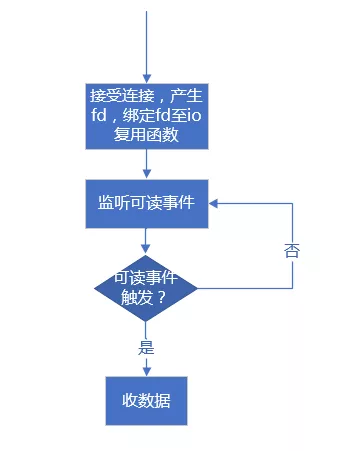
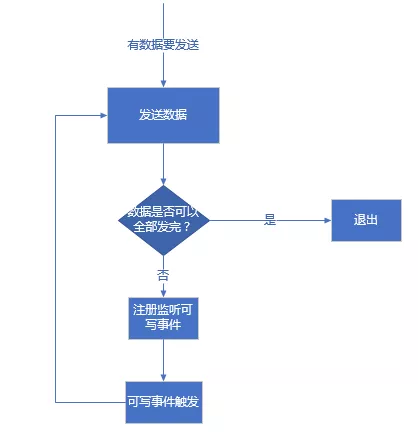

## 网络通信中收发数据的正确姿势

在网络通信中，我们可能既要通过 socket 去发送数据也要通过 socket 来收取数据。那么一般的网络通信框架是如何收发数据的呢？注意，这里讨论的范围是基于各种 IO 复用函数（select、poll、epoll 等）来判断 socket 读写来收发数据，其他情形比较简单，这里就不提了。

我们这里以服务器端为例。服务器端接受客户端连接后，产生一个与客户端连接对应的 socket（Linux 下也叫 fd，为了叙述方便，以后称之为 clientfd），我们可以通过这个 clientfd 收取从客户端发来的数据，也可以通过这个 clientfd 将数据发往客户端。但是收与发在操作流程上是有明显的区别的。

#### 收数据的正确姿势

对于收数据，当接受连接成功得到 clientfd 后，我们会将该 clientfd 绑定到相应的 IO 复用函数上并监听其可读事件。不同的 IO 复用函数可读事件标志不一样，例如对于 poll 模型，可读标志是 POLLIN，对于 epoll 模型，可读事件标志是 EPOLLIN。当可读事件触发后，我们调用 recv 函数从 clientfd 上收取数据（这里不考虑出错的情况），根据不同的网络模式我们可能会收取部分，或一次性收完。收取到的数据我们会放入接收缓冲区内，然后做解包操作。这就是收数据的全部“姿势”。对于使用 epoll 的 LT 模式（水平触发模式），我们每次可以只收取部分数据；但是对于 ET 模式（边缘触发模式），我们必须将本次收到的数据全部收完。

> ET 模式收完的标志是 recv 或者 read 函数的返回值是 -1，错误码是 EWOULDBLOCK，针对 Windows 和 Linux 下区别，前面章节已经详细地说过了。

这就是读数据的全部姿势。流程图如下：




#### 发数据的正确姿势

对于发数据，除了 epoll 模型的 ET 模式外，epoll 的 LT 模式或者其他 IO 复用函数，我们通常都不会去注册监听该 clientfd 的可写事件。这是因为，只要对端正常收数据，一般不会出现 TCP 窗口太小导致 send 或 write 函数无法写的问题。因此大多数情况下，clientfd 都是可写的，如果注册了可写事件，会导致一直触发可写事件，而此时不一定有数据需要发送。故而，如果有数据要发送一般都是调用 send 或者 write 函数直接发送，如果发送过程中， send 函数返回 -1，并且错误码是 EWOULDBLOCK 表明由于 TCP 窗口太小数据已经无法写入时，而仍然还剩下部分数据未发送，此时我们才注册监听可写事件，并将剩余的服务存入自定义的发送缓冲区中，等可写事件触发后再接着将发送缓冲区中剩余的数据发送出去，如果仍然有部分数据不能发出去，继续注册可写事件，当已经无数据需要发送时应该立即移除对可写事件的监听。这是目前主流网络库的做法。

流程图如下：




上述逻辑示例如下：

**直接尝试发送消息处理逻辑：**

```
/**
 *@param data 待发送的数据
 *@param len  待发送数据长度
 */
void TcpConnection::sendMessage(const void* data, size_t len)
{    
    int32_t nwrote = 0;
    size_t remaining = len;
    bool faultError = false;
    if (state_ == kDisconnected)
    {
        LOGW("disconnected, give up writing");
        return;
    }

    // 当前未监听可写事件，且发送缓冲区中没有遗留数据
    if (!channel_->isWriting() && outputBuffer_.readableBytes() == 0)
    {
        //直接发送数据
        nwrote = sockets::write(channel_->fd(), data, len);      
        if (nwrote >= 0)
        {
            remaining = len - nwrote;           
        }
        else // nwrote < 0
        {
            nwrote = 0;
            //错误码不等于EWOULDBLOCK说明发送出错了
            if (errno != EWOULDBLOCK)
            {
                LOGSYSE("TcpConnection::sendInLoop");
                if (errno == EPIPE || errno == ECONNRESET)
                {
                    faultError = true;
                }
            }
        }
    }

    //发送未出错且还有剩余字节未发出去
    if (!faultError && remaining > 0)
    {
        //将剩余部分加入发送缓冲区
        outputBuffer_.append(static_cast<const char*>(data) + nwrote, remaining);
        if (!channel_->isWriting())
        {
            //注册可写事件
            channel_->enableWriting();
        }
    }
}
```

**不能全部发出去监听可写事件后，可写事件触发后处理逻辑：**

```
//可写事件触发后会调用handleWrite()函数
void TcpConnection::handleWrite()
{  
    //将发送缓冲区中的数据发送出去
    int32_t n = sockets::write(channel_->fd(), outputBuffer_.peek(), outputBuffer_.readableBytes());
    if (n > 0)
    {
        //发送多少从发送缓冲区移除多少
        outputBuffer_.retrieve(n);
        //如果发送缓冲区中已经没有剩余，则移除监听可写事件
        if (outputBuffer_.readableBytes() == 0)
        {
            //移除监听可写事件
            channel_->disableWriting();

            if (state_ == kDisconnecting)
            {
                shutdown();
            }
        }
    }
    else
    {
        //发数据出错处理
        LOGSYSE("TcpConnection::handleWrite");           
        handleClose();
    } 
}
```

对于 epoll LT 模式注册监听一次可写事件后，可写事件触发后，尝试发送数据，如果数据此时还不能全部发送完，不用再次注册可写事件；如果是 epoll 的 ET 模式，注册监听可写事件后，可写事件触发后，尝试发送数据，如果数据此时还不能全部发送完，需要再次注册可写事件以便让可写事件下次再次触发（给予再次发数据的机会）。当然，这只是理论上的情况，实际开发中，如果一段数据反复发送都不能完全发送完（例如对端先不收，后面每隔很长时间再收一个字节），我们可以设置一个最大发送次数或最大发送总时间，超过这些限定，我们可以认为对端出了问题，应该立即清空发送缓冲区并关闭连接。

本节的标题是“收发数据的正确姿势”，其实还可以换一种说法，即“检测网络事件的正确姿势”，这里意指检测一个 fd 的读写事件的区别（对于侦听 fd，只检测可读事件）：

- 在 select、poll 和 epoll 的 LT 模式下，可以直接设置检测 fd 的可读事件；
- 在 select、poll 和 epoll 的 LT 模式下不要直接设置检测 fd 的可写事件，应该先尝试发送数据，因为 TCP 窗口太小发不出去再设置检测 fd 的可写事件，一旦数据发出去应立即取消对可写事件的检测。
- 在 epoll 的 ET 模式下，需要发送数据时，每次都要设置检测可写事件。
