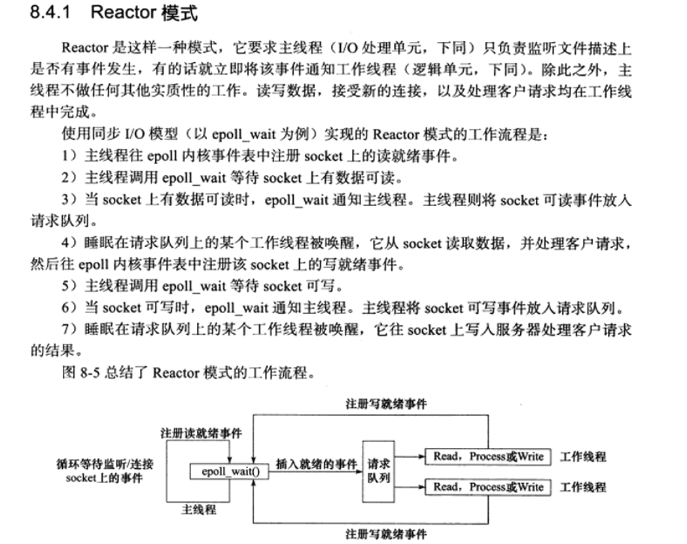
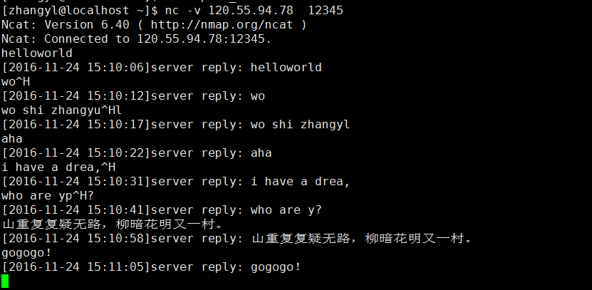

## Reactor模式

最近一直在看游双的《高性能Linux服务器编程》一书，下载链接： http://download.csdn.net/detail/analogous_love/9673008

书上是这么介绍Reactor模式的：



按照这个思路，我写个简单的练习：

```
/** 
 *@desc:   用reactor模式练习服务器程序，main.cpp
 *@author: zhangyl
 *@date:   2016.11.23
 */
 
#include <iostream>
#include <string.h>
#include <sys/types.h>
#include <sys/socket.h>
#include <netinet/in.h>
#include <arpa/inet.h>  //for htonl() and htons()
#include <unistd.h>
#include <fcntl.h>
#include <sys/epoll.h>
#include <signal.h>     //for signal()
#include <pthread.h>
#include <semaphore.h>
#include <list>
#include <errno.h>
#include <time.h>
#include <sstream>
#include <iomanip> //for std::setw()/setfill()
#include <stdlib.h>
 
 
#define WORKER_THREAD_NUM   5
 
#define min(a, b) ((a <= b) ? (a) : (b)) 
 
int g_epollfd = 0;
bool g_bStop = false;
int g_listenfd = 0;
pthread_t g_acceptthreadid = 0;
pthread_t g_threadid[WORKER_THREAD_NUM] = { 0 };
pthread_cond_t g_acceptcond;
pthread_mutex_t g_acceptmutex;
 
pthread_cond_t g_cond /*= PTHREAD_COND_INITIALIZER*/;
pthread_mutex_t g_mutex /*= PTHREAD_MUTEX_INITIALIZER*/;
 
pthread_mutex_t g_clientmutex;
 
std::list<int> g_listClients;
 
void prog_exit(int signo)
{
    ::signal(SIGINT, SIG_IGN);
    //::signal(SIGKILL, SIG_IGN);//该信号不能被阻塞、处理或者忽略
    ::signal(SIGTERM, SIG_IGN);
 
    std::cout << "program recv signal " << signo << " to exit." << std::endl;
 
    g_bStop = true;
 
    ::epoll_ctl(g_epollfd, EPOLL_CTL_DEL, g_listenfd, NULL);
 
    //TODO: 是否需要先调用shutdown()一下？
    ::shutdown(g_listenfd, SHUT_RDWR);
    ::close(g_listenfd);
    ::close(g_epollfd);
 
    ::pthread_cond_destroy(&g_acceptcond);
    ::pthread_mutex_destroy(&g_acceptmutex);
    
    ::pthread_cond_destroy(&g_cond);
    ::pthread_mutex_destroy(&g_mutex);
 
    ::pthread_mutex_destroy(&g_clientmutex);
}
 
bool create_server_listener(const char* ip, short port)
{
    g_listenfd = ::socket(AF_INET, SOCK_STREAM | SOCK_NONBLOCK, 0);
    if (g_listenfd == -1)
        return false;
 
    int on = 1;
    ::setsockopt(g_listenfd, SOL_SOCKET, SO_REUSEADDR, (char *)&on, sizeof(on));
    ::setsockopt(g_listenfd, SOL_SOCKET, SO_REUSEPORT, (char *)&on, sizeof(on));
 
    struct sockaddr_in servaddr;
    memset(&servaddr, 0, sizeof(servaddr)); 
    servaddr.sin_family = AF_INET;
    servaddr.sin_addr.s_addr = inet_addr(ip);
    servaddr.sin_port = htons(port);
    if (::bind(g_listenfd, (sockaddr *)&servaddr, sizeof(servaddr)) == -1)
        return false;
 
    if (::listen(g_listenfd, 50) == -1)
        return false;
 
    g_epollfd = ::epoll_create(1);
    if (g_epollfd == -1)
        return false;
 
    struct epoll_event e;
    memset(&e, 0, sizeof(e));
    e.events = EPOLLIN | EPOLLRDHUP;
    e.data.fd = g_listenfd;
    if (::epoll_ctl(g_epollfd, EPOLL_CTL_ADD, g_listenfd, &e) == -1)
        return false;
 
    return true;
}
 
void release_client(int clientfd)
{
    if (::epoll_ctl(g_epollfd, EPOLL_CTL_DEL, clientfd, NULL) == -1)
        std::cout << "release client socket failed as call epoll_ctl failed" << std::endl;
 
    ::close(clientfd);
}
 
void* accept_thread_func(void* arg)
{   
    while (!g_bStop)
    {
        ::pthread_mutex_lock(&g_acceptmutex);
        ::pthread_cond_wait(&g_acceptcond, &g_acceptmutex);
        //::pthread_mutex_lock(&g_acceptmutex);
 
        //std::cout << "run loop in accept_thread_func" << std::endl;
 
        struct sockaddr_in clientaddr;
        socklen_t addrlen;
        int newfd = ::accept(g_listenfd, (struct sockaddr *)&clientaddr, &addrlen);
        ::pthread_mutex_unlock(&g_acceptmutex);
        if (newfd == -1)
            continue;
 
        std::cout << "new client connected: " << ::inet_ntoa(clientaddr.sin_addr) << ":" << ::ntohs(clientaddr.sin_port) << std::endl;
 
        //将新socket设置为non-blocking
        int oldflag = ::fcntl(newfd, F_GETFL, 0);
        int newflag = oldflag | O_NONBLOCK;
        if (::fcntl(newfd, F_SETFL, newflag) == -1)
        {
            std::cout << "fcntl error, oldflag =" << oldflag << ", newflag = " << newflag << std::endl;
            continue;
        }
 
        struct epoll_event e;
        memset(&e, 0, sizeof(e));
        e.events = EPOLLIN | EPOLLRDHUP | EPOLLET;
        e.data.fd = newfd;
        if (::epoll_ctl(g_epollfd, EPOLL_CTL_ADD, newfd, &e) == -1)
        {
            std::cout << "epoll_ctl error, fd =" << newfd << std::endl;
        }
    }
 
    return NULL;
}
  
void* worker_thread_func(void* arg)
{   
    while (!g_bStop)
    {
        int clientfd;
        ::pthread_mutex_lock(&g_clientmutex);
        while (g_listClients.empty())
            ::pthread_cond_wait(&g_cond, &g_clientmutex);
        clientfd = g_listClients.front();
        g_listClients.pop_front();  
        pthread_mutex_unlock(&g_clientmutex);
 
        //gdb调试时不能实时刷新标准输出，用这个函数刷新标准输出，使信息在屏幕上实时显示出来
        std::cout << std::endl;
 
        std::string strclientmsg;
        char buff[256];
        bool bError = false;
        while (true)
        {
            memset(buff, 0, sizeof(buff));
            int nRecv = ::recv(clientfd, buff, 256, 0);
            if (nRecv == -1)
            {
                if (errno == EWOULDBLOCK)
                    break;
                else
                {
                    std::cout << "recv error, client disconnected, fd = " << clientfd << std::endl;
                    release_client(clientfd);
                    bError = true;
                    break;
                }
                    
            }
            //对端关闭了socket，这端也关闭。
            else if (nRecv == 0)
            {
                std::cout << "peer closed, client disconnected, fd = " << clientfd << std::endl;
                release_client(clientfd);
                bError = true;
                break;
            }
 
            strclientmsg += buff;
        }
 
        //出错了，就不要再继续往下执行了
        if (bError)
            continue;
        
        std::cout << "client msg: " << strclientmsg;
 
        //将消息加上时间标签后发回
        time_t now = time(NULL);
        struct tm* nowstr = localtime(&now);
        std::ostringstream ostimestr;
        ostimestr << "[" << nowstr->tm_year + 1900 << "-" 
                  << std::setw(2) << std::setfill('0') << nowstr->tm_mon + 1 << "-" 
                  << std::setw(2) << std::setfill('0') << nowstr->tm_mday << " "
                  << std::setw(2) << std::setfill('0') << nowstr->tm_hour << ":" 
                  << std::setw(2) << std::setfill('0') << nowstr->tm_min << ":" 
                  << std::setw(2) << std::setfill('0') << nowstr->tm_sec << "]server reply: ";
 
        strclientmsg.insert(0, ostimestr.str());
        
        while (true)
        {
            int nSent = ::send(clientfd, strclientmsg.c_str(), strclientmsg.length(), 0);
            if (nSent == -1)
            {
                if (errno == EWOULDBLOCK)
                {
                    ::sleep(10);
                    continue;
                }
                else
                {
                    std::cout << "send error, fd = " << clientfd << std::endl;
                    release_client(clientfd);
                    break;
                }
                   
            }          
 
            std::cout << "send: " << strclientmsg;
            strclientmsg.erase(0, nSent);
 
            if (strclientmsg.empty())
                break;
        }
    }
 
    return NULL;
}
 
void daemon_run()
{
    int pid;
    signal(SIGCHLD, SIG_IGN);
    //1）在父进程中，fork返回新创建子进程的进程ID；
    //2）在子进程中，fork返回0；
    //3）如果出现错误，fork返回一个负值；
    pid = fork();
    if (pid < 0)
    {
        std:: cout << "fork error" << std::endl;
        exit(-1);
    }
    //父进程退出，子进程独立运行
    else if (pid > 0) {
        exit(0);
    }
    //之前parent和child运行在同一个session里,parent是会话（session）的领头进程,
    //parent进程作为会话的领头进程，如果exit结束执行的话，那么子进程会成为孤儿进程，并被init收养。
    //执行setsid()之后,child将重新获得一个新的会话(session)id。
    //这时parent退出之后,将不会影响到child了。
    setsid();
    int fd;
    fd = open("/dev/null", O_RDWR, 0);
    if (fd != -1)
    {
        dup2(fd, STDIN_FILENO);
        dup2(fd, STDOUT_FILENO);
        dup2(fd, STDERR_FILENO);
    }
    if (fd > 2)
        close(fd);
 
}
 
 
int main(int argc, char* argv[])
{  
    short port = 0;
    int ch;
    bool bdaemon = false;
    while ((ch = getopt(argc, argv, "p:d")) != -1)
    {
        switch (ch)
        {
        case 'd':
            bdaemon = true;
            break;
        case 'p':
            port = atol(optarg);
            break;
        }
    }
 
    if (bdaemon)
        daemon_run();
 
 
    if (port == 0)
        port = 12345;
     
    if (!create_server_listener("0.0.0.0", port))
    {
        std::cout << "Unable to create listen server: ip=0.0.0.0, port=" << port << "." << std::endl;
        return -1;
    }
 
    
    //设置信号处理
    signal(SIGCHLD, SIG_DFL);
    signal(SIGPIPE, SIG_IGN);
    signal(SIGINT, prog_exit);
    //signal(SIGKILL, prog_exit);//该信号不能被阻塞、处理或者忽略
 
    signal(SIGTERM, prog_exit);
 
    ::pthread_cond_init(&g_acceptcond, NULL);
    ::pthread_mutex_init(&g_acceptmutex, NULL);
 
    ::pthread_cond_init(&g_cond, NULL);
    ::pthread_mutex_init(&g_mutex, NULL);
 
    ::pthread_mutex_init(&g_clientmutex, NULL);
     
    ::pthread_create(&g_acceptthreadid, NULL, accept_thread_func, NULL);
    //启动工作线程
    for (int i = 0; i < WORKER_THREAD_NUM; ++i)
    {
        ::pthread_create(&g_threadid[i], NULL, worker_thread_func, NULL);
    }
 
    while (!g_bStop)
    {       
        struct epoll_event ev[1024];
        int n = ::epoll_wait(g_epollfd, ev, 1024, 10);
        if (n == 0)
            continue;
        else if (n < 0)
        {
            std::cout << "epoll_wait error" << std::endl;
            continue;
        }
 
        int m = min(n, 1024);
        for (int i = 0; i < m; ++i)
        {
            //通知接收连接线程接收新连接
            if (ev[i].data.fd == g_listenfd)
                pthread_cond_signal(&g_acceptcond);
            //通知普通工作线程接收数据
            else
            {               
                pthread_mutex_lock(&g_clientmutex);              
                g_listClients.push_back(ev[i].data.fd);
                pthread_mutex_unlock(&g_clientmutex);
                pthread_cond_signal(&g_cond);
                //std::cout << "signal" << std::endl;
            }
                
        }
 
    }
    
    return 0;
}
```

程序的功能一个简单的echo服务：客户端连接上服务器之后，给服务器发送信息，服务器加上时间戳等信息后返回给客户端。

使用到的知识点有：

1. 条件变量

2. epoll的边缘触发模式

程序的大致框架是：

1. 主线程只负责监听侦听socket上是否有新连接，如果有新连接到来，交给一个叫accept的工作线程去接收新连接，并将新连接socket绑定到主线程使用epollfd上去。
2. 主线程如果侦听到客户端的socket上有可读事件，则通知另外五个工作线程去接收处理客户端发来的数据，并将数据加上时间戳后发回给客户端。
3. 可以通过传递-p port来设置程序的监听端口号；可以通过传递-d来使程序以daemon模式运行在后台。这也是标准linux daemon模式的书写方法。

程序难点和需要注意的地方是：

1. 条件变量为了防止虚假唤醒，一定要在一个循环里面调用pthread_cond_wait()函数，我在worker_thread_func()中使用了：

```
while (g_listClients.empty())  
	::pthread_cond_wait(&g_cond, &g_clientmutex); 
```

在accept_thread_func()函数里面我没有使用循环，这样会有问题吗？

1. 使用条件变量pthread_cond_wait()函数的时候一定要先获得与该条件变量相关的mutex，即像下面这样的结构：

```
mutex_lock(...);
 
while (condition is true)
    ::pthread_cond_wait(...);
 
//这里可以有其他代码...
mutex_unlock(...);
 
//这里可以有其他代码...
```

因为pthread_cond_wait()如果阻塞的话，它解锁相关mutex和阻塞当前线程这两个动作加在一起是原子的。

1. 作为服务器端程序最好对侦听socket调用setsocketopt()设置SO_REUSEADDR和SO_REUSEPORT两个标志，因为服务程序有时候会需要重启（比如调试的时候就会不断重启），如果不设置这两个标志的话，绑定端口时就会调用失败。因为一个端口使用后，即使不再使用，因为四次挥手该端口处于TIME_WAIT状态，有大约2min的MSL（Maximum Segment Lifetime，最大存活期）。这2min内，该端口是不能被重复使用的。你的服务器程序上次使用了这个端口号，接着重启，因为这个缘故，你再次绑定这个端口就会失败（bind函数调用失败）。要不你就每次重启时需要等待2min后再试（这在频繁重启程序调试是难以接收的），或者设置这种SO_REUSEADDR和SO_REUSEPORT立即回收端口使用。

其实，SO_REUSEADDR在Windows上和Unix平台上还有些细微的区别，我在libevent源码中看到这样的描述：

```
int evutil_make_listen_socket_reuseable(evutil_socket_t sock)
{
#ifndef WIN32
	int one = 1;
	/* REUSEADDR on Unix means, "don't hang on to this address after the
	 * listener is closed."  On Windows, though, it means "don't keep other
	 * processes from binding to this address while we're using it. */
	return setsockopt(sock, SOL_SOCKET, SO_REUSEADDR, (void*) &one,
	    (ev_socklen_t)sizeof(one));
#else
	return 0;
#endif
} 
```

注意注释部分，在Unix平台上设置这个选项意味着，任意进程可以复用该地址；而在windows，不要阻止其他进程复用该地址。也就是在在Unix平台上，如果不设置这个选项，任意进程在一定时间内，不能bind该地址；在windows平台上，在一定时间内，其他进程不能bind该地址，而本进程却可以再次bind该地址。

1. epoll_wait对新连接socket使用的是边缘触发模式EPOLLET（edge trigger），而不是默认的水平触发模式（level trigger)。因为如果采取水平触发模式的话，主线程检测到某个客户端socket数据可读时，通知工作线程去收取该socket上的数据，这个时候主线程继续循环，只要在工作线程没有将该socket上数据全部收完，或者在工作线程收取数据的过程中，客户端有新数据到来，主线程会继续发通知（通过pthread_cond_signal()）函数，再次通知工作线程收取数据。这样会可能导致多个工作线程同时调用recv函数收取该客户端socket上的数据，这样产生的结果将会导致数据错乱。

相反，采取边缘触发模式，只有等某个工作线程将那个客户端socket上数据全部收取完毕，主线程的epoll_wait才可能会再次触发来通知工作线程继续收取那个客户端socket新来的数据。

1. 代码中有这样一行：

    ```
    //gdb调试时不能实时刷新标准输出，用这个函数刷新标准输出，使信息在屏幕上实时显示出来 
    std::cout << std::endl;
    ```

如果不加上这一行，正常运行服务器程序，程序中要打印到控制台的信息都会打印出来，但是如果用gdb调试状态下，程序的所有输出就不显示了。我不知道这是不是gdb的一个bug，所以这里加上std::endl来输出一个换行符并flush标准输出，让输出显示出来。（std::endl不仅是输出一个换行符而且是同时刷新输出，相当于fflush()函数）。

程序我部署起来了，你可以使用linux的nc命令或自己写程序连接服务器来查看程序效果，当然也可以使用telnet命令，方法：

Linux:

```
nc 120.55.94.78 12345
```

或

```
telnet 120.55.94.78 12345
```

然后就可以给服务器自由发送数据了，服务器会给你发送的信息加上时间戳返回给你。效果如图：



另外我将这个代码改写了成纯C++11版本，使用CMake编译，为了支持编译必须加上这-std=c++11：

CMakeLists.txt代码如下：

```
cmake_minimum_required(VERSION 2.8)
 
PROJECT(myreactorserver)
 
AUX_SOURCE_DIRECTORY(./ SRC_LIST)
SET(EXECUTABLE_OUTPUT_PATH ./)
 
ADD_DEFINITIONS(-g -W -Wall -Wno-deprecated -DLINUX -D_REENTRANT -D_FILE_OFFSET_BITS=64 -DAC_HAS_INFO -DAC_HAS_WARNING -DAC_HAS_ERROR -DAC_HAS_CRITICAL -DTIXML_USE_STL -DHAVE_CXX_STDHEADERS ${CMAKE_CXX_FLAGS} -std=c++11)
 
INCLUDE_DIRECTORIES(
./
)
LINK_DIRECTORIES(
./
)
 
set(
main.cpp
myreator.cpp
)
 
ADD_EXECUTABLE(myreactorserver ${SRC_LIST})
 
TARGET_LINK_LIBRARIES(myreactorserver pthread)
```

myreactor.h文件内容：

```
/**
 *@desc: myreactor头文件, myreactor.h
 *@author: zhangyl
 *@date: 2016.12.03
 */
#ifndef __MYREACTOR_H__
#define __MYREACTOR_H__
 
#include <list>
#include <memory>
#include <thread>
#include <mutex>
#include <condition_variable>
 
#define WORKER_THREAD_NUM   5
 
class CMyReactor
{
public:
	CMyReactor();
	~CMyReactor();
 
	bool init(const char* ip, short nport);
	bool uninit();
 
	bool close_client(int clientfd);
 
	static void* main_loop(void* p);
 
private:
	//no copyable
	CMyReactor(const CMyReactor& rhs);
	CMyReactor& operator = (const CMyReactor& rhs);
 
	bool create_server_listener(const char* ip, short port);
	
	static void accept_thread_proc(CMyReactor* pReatcor);
	static void worker_thread_proc(CMyReactor* pReatcor);
 
private:
	//C11语法可以在这里初始化
	int							 m_listenfd = 0;
	int							 m_epollfd  = 0;
	bool						 m_bStop    = false;
	
	std::shared_ptr<std::thread> m_acceptthread;
	std::shared_ptr<std::thread> m_workerthreads[WORKER_THREAD_NUM];
	
	std::condition_variable		 m_acceptcond;
	std::mutex					 m_acceptmutex;
 
	std::condition_variable		 m_workercond ;
	std::mutex					 m_workermutex;
 
	std::list<int>				 m_listClients;
};
 
#endif //!__MYREACTOR_H__
```

myreactor.cpp文件内容：

```
/** 
 *@desc: myreactor实现文件, myreactor.cpp
 *@author: zhangyl
 *@date: 2016.12.03
 */
#include "myreactor.h"
#include <iostream>
#include <string.h>
#include <sys/types.h>
#include <sys/socket.h>
#include <netinet/in.h>
#include <arpa/inet.h>  //for htonl() and htons()
#include <fcntl.h>
#include <sys/epoll.h>
#include <list>
#include <errno.h>
#include <time.h>
#include <sstream>
#include <iomanip> //for std::setw()/setfill()
#include <unistd.h>
 
#define min(a, b) ((a <= b) ? (a) : (b))
 
CMyReactor::CMyReactor()
{
	//m_listenfd = 0;
	//m_epollfd = 0;
	//m_bStop = false;
}
 
CMyReactor::~CMyReactor()
{
 
}
 
bool CMyReactor::init(const char* ip, short nport)
{
	if (!create_server_listener(ip, nport))
	{
		std::cout << "Unable to bind: " << ip << ":" << nport << "." << std::endl;
		return false;
	}
 
 
	std::cout << "main thread id = " << std::this_thread::get_id() << std::endl;
 
	//启动接收新连接的线程
	m_acceptthread.reset(new std::thread(CMyReactor::accept_thread_proc, this));
	
	//启动工作线程
	for (auto& t : m_workerthreads)
	{
		t.reset(new std::thread(CMyReactor::worker_thread_proc, this));
	}
 
 
	return true;
}
 
bool CMyReactor::uninit()
{
	m_bStop = true;
	m_acceptcond.notify_one();
	m_workercond.notify_all();
 
	m_acceptthread->join();
	for (auto& t : m_workerthreads)
	{
		t->join();
	}
 
	::epoll_ctl(m_epollfd, EPOLL_CTL_DEL, m_listenfd, NULL);
 
	//TODO: 是否需要先调用shutdown()一下？
	::shutdown(m_listenfd, SHUT_RDWR);
	::close(m_listenfd);
	::close(m_epollfd);
 
	return true;
}
 
bool CMyReactor::close_client(int clientfd)
{
	if (::epoll_ctl(m_epollfd, EPOLL_CTL_DEL, clientfd, NULL) == -1)
	{
		std::cout << "close client socket failed as call epoll_ctl failed" << std::endl;
		//return false;
	}
		
 
	::close(clientfd);
 
	return true;
}
 
 
void* CMyReactor::main_loop(void* p)
{
	std::cout << "main thread id = " << std::this_thread::get_id() << std::endl;
	
	CMyReactor* pReatcor = static_cast<CMyReactor*>(p);
	
	while (!pReatcor->m_bStop)
	{
		struct epoll_event ev[1024];
		int n = ::epoll_wait(pReatcor->m_epollfd, ev, 1024, 10);
		if (n == 0)
			continue;
		else if (n < 0)
		{
			std::cout << "epoll_wait error" << std::endl;
			continue;
		}
 
		int m = min(n, 1024);
		for (int i = 0; i < m; ++i)
		{
			//通知接收连接线程接收新连接
			if (ev[i].data.fd == pReatcor->m_listenfd)
				pReatcor->m_acceptcond.notify_one();
			//通知普通工作线程接收数据
			else
			{
				{
					std::unique_lock<std::mutex> guard(pReatcor->m_workermutex);
					pReatcor->m_listClients.push_back(ev[i].data.fd);
				}
								
				pReatcor->m_workercond.notify_one();
				//std::cout << "signal" << std::endl;
			}// end if
 
		}// end for-loop
	}// end while
 
	std::cout << "main loop exit ..." << std::endl;
 
	return NULL;
}
 
void CMyReactor::accept_thread_proc(CMyReactor* pReatcor)
{
	std::cout << "accept thread, thread id = " << std::this_thread::get_id() << std::endl;
 
	while (true)
	{
		int newfd;
		struct sockaddr_in clientaddr;
		socklen_t addrlen;
		{
			std::unique_lock<std::mutex> guard(pReatcor->m_acceptmutex);
			pReatcor->m_acceptcond.wait(guard);
			if (pReatcor->m_bStop)
				break;
 
			//std::cout << "run loop in accept_thread_proc" << std::endl;
			
			newfd = ::accept(pReatcor->m_listenfd, (struct sockaddr *)&clientaddr, &addrlen);
		}
		if (newfd == -1)
			continue;
 
		std::cout << "new client connected: " << ::inet_ntoa(clientaddr.sin_addr) << ":" << ::ntohs(clientaddr.sin_port) << std::endl;
 
		//将新socket设置为non-blocking
		int oldflag = ::fcntl(newfd, F_GETFL, 0);
		int newflag = oldflag | O_NONBLOCK;
		if (::fcntl(newfd, F_SETFL, newflag) == -1)
		{
			std::cout << "fcntl error, oldflag =" << oldflag << ", newflag = " << newflag << std::endl;
			continue;
		}
 
		struct epoll_event e;
		memset(&e, 0, sizeof(e));
		e.events = EPOLLIN | EPOLLRDHUP | EPOLLET;
		e.data.fd = newfd;
		if (::epoll_ctl(pReatcor->m_epollfd, EPOLL_CTL_ADD, newfd, &e) == -1)
		{
			std::cout << "epoll_ctl error, fd =" << newfd << std::endl;
		}
	}
 
	std::cout << "accept thread exit ..." << std::endl;
}
 
void CMyReactor::worker_thread_proc(CMyReactor* pReatcor)
{
	std::cout << "new worker thread, thread id = " << std::this_thread::get_id() << std::endl;
 
	while (true)
	{
		int clientfd;
		{
			std::unique_lock<std::mutex> guard(pReatcor->m_workermutex);
			while (pReatcor->m_listClients.empty())
			{
				if (pReatcor->m_bStop)
				{
					std::cout << "worker thread exit ..." << std::endl;
					return;
				}
					
				pReatcor->m_workercond.wait(guard);
			}
				
			clientfd = pReatcor->m_listClients.front();
			pReatcor->m_listClients.pop_front();
		}
 
		//gdb调试时不能实时刷新标准输出，用这个函数刷新标准输出，使信息在屏幕上实时显示出来
		std::cout << std::endl;
 
		std::string strclientmsg;
		char buff[256];
		bool bError = false;
		while (true)
		{
			memset(buff, 0, sizeof(buff));
			int nRecv = ::recv(clientfd, buff, 256, 0);
			if (nRecv == -1)
			{
				if (errno == EWOULDBLOCK)
					break;
				else
				{
					std::cout << "recv error, client disconnected, fd = " << clientfd << std::endl;
					pReatcor->close_client(clientfd);
					bError = true;
					break;
				}
 
			}
			//对端关闭了socket，这端也关闭。
			else if (nRecv == 0)
			{
				std::cout << "peer closed, client disconnected, fd = " << clientfd << std::endl;
				pReatcor->close_client(clientfd);
				bError = true;
				break;
			}
 
			strclientmsg += buff;
		}
 
		//出错了，就不要再继续往下执行了
		if (bError)
			continue;
 
		std::cout << "client msg: " << strclientmsg;
 
		//将消息加上时间标签后发回
		time_t now = time(NULL);
		struct tm* nowstr = localtime(&now);
		std::ostringstream ostimestr;
		ostimestr << "[" << nowstr->tm_year + 1900 << "-"
			<< std::setw(2) << std::setfill('0') << nowstr->tm_mon + 1 << "-"
			<< std::setw(2) << std::setfill('0') << nowstr->tm_mday << " "
			<< std::setw(2) << std::setfill('0') << nowstr->tm_hour << ":"
			<< std::setw(2) << std::setfill('0') << nowstr->tm_min << ":"
			<< std::setw(2) << std::setfill('0') << nowstr->tm_sec << "]server reply: ";
 
		strclientmsg.insert(0, ostimestr.str());
 
		while (true)
		{
			int nSent = ::send(clientfd, strclientmsg.c_str(), strclientmsg.length(), 0);
			if (nSent == -1)
			{
				if (errno == EWOULDBLOCK)
				{
					std::this_thread::sleep_for(std::chrono::milliseconds(10));
					continue;
				}
				else
				{
					std::cout << "send error, fd = " << clientfd << std::endl;
					pReatcor->close_client(clientfd);
					break;
				}
 
			}
 
			std::cout << "send: " << strclientmsg;
			strclientmsg.erase(0, nSent);
 
			if (strclientmsg.empty())
				break;
		}
	}
}
 
bool CMyReactor::create_server_listener(const char* ip, short port)
{
	m_listenfd = ::socket(AF_INET, SOCK_STREAM | SOCK_NONBLOCK, 0);
	if (m_listenfd == -1)
		return false;
 
	int on = 1;
	::setsockopt(m_listenfd, SOL_SOCKET, SO_REUSEADDR, (char *)&on, sizeof(on));
	::setsockopt(m_listenfd, SOL_SOCKET, SO_REUSEPORT, (char *)&on, sizeof(on));
 
	struct sockaddr_in servaddr;
	memset(&servaddr, 0, sizeof(servaddr));
	servaddr.sin_family = AF_INET;
	servaddr.sin_addr.s_addr = inet_addr(ip);
	servaddr.sin_port = htons(port);
	if (::bind(m_listenfd, (sockaddr *)&servaddr, sizeof(servaddr)) == -1)
		return false;
 
	if (::listen(m_listenfd, 50) == -1)
		return false;
 
	m_epollfd = ::epoll_create(1);
	if (m_epollfd == -1)
		return false;
 
	struct epoll_event e;
	memset(&e, 0, sizeof(e));
	e.events = EPOLLIN | EPOLLRDHUP;
	e.data.fd = m_listenfd;
	if (::epoll_ctl(m_epollfd, EPOLL_CTL_ADD, m_listenfd, &e) == -1)
		return false;
 
	return true;
}
```

main.cpp文件内容：

```
/** 
 *@desc:   用reactor模式练习服务器程序
 *@author: zhangyl
 *@date:   2016.12.03
 */
 
#include <iostream>
#include <signal.h>     //for signal()
#include<unistd.h>
#include <stdlib.h>		//for exit()
#include <sys/types.h>
#include <sys/stat.h>
#include <fcntl.h>
#include "myreactor.h"
 
CMyReactor g_reator;
 
void prog_exit(int signo)
{
    std::cout << "program recv signal " << signo << " to exit." << std::endl; 
 
	g_reator.uninit();
}
 
void daemon_run()
{
    int pid;
    signal(SIGCHLD, SIG_IGN);
    //1）在父进程中，fork返回新创建子进程的进程ID；
    //2）在子进程中，fork返回0；
    //3）如果出现错误，fork返回一个负值；
    pid = fork();
    if (pid < 0)
    {
        std:: cout << "fork error" << std::endl;
        exit(-1);
    }
    //父进程退出，子进程独立运行
    else if (pid > 0) {
        exit(0);
    }
    //之前parent和child运行在同一个session里,parent是会话（session）的领头进程,
    //parent进程作为会话的领头进程，如果exit结束执行的话，那么子进程会成为孤儿进程，并被init收养。
    //执行setsid()之后,child将重新获得一个新的会话(session)id。
    //这时parent退出之后,将不会影响到child了。
    setsid();
    int fd;
    fd = open("/dev/null", O_RDWR, 0);
    if (fd != -1)
    {
        dup2(fd, STDIN_FILENO);
        dup2(fd, STDOUT_FILENO);
        dup2(fd, STDERR_FILENO);
    }
    if (fd > 2)
        close(fd);
}
 
 
int main(int argc, char* argv[])
{  
	//设置信号处理
	signal(SIGCHLD, SIG_DFL);
	signal(SIGPIPE, SIG_IGN);
	signal(SIGINT, prog_exit);
	signal(SIGKILL, prog_exit);
	signal(SIGTERM, prog_exit);
	
	short port = 0;
	int ch;
	bool bdaemon = false;
	while ((ch = getopt(argc, argv, "p:d")) != -1)
	{
		switch (ch)
		{
		case 'd':
			bdaemon = true;
			break;
		case 'p':
			port = atol(optarg);
			break;
		}
	}
 
	if (bdaemon)
		daemon_run();
 
 
	if (port == 0)
		port = 12345;
 
	
	if (!g_reator.init("0.0.0.0", 12345))
		return -1;
    
	g_reator.main_loop(&g_reator);
 
    return 0;
}
```

完整实例代码下载地址：

普通版本：https://pan.baidu.com/s/1o82Mkno

C++11版本：https://pan.baidu.com/s/1dEJdrih
