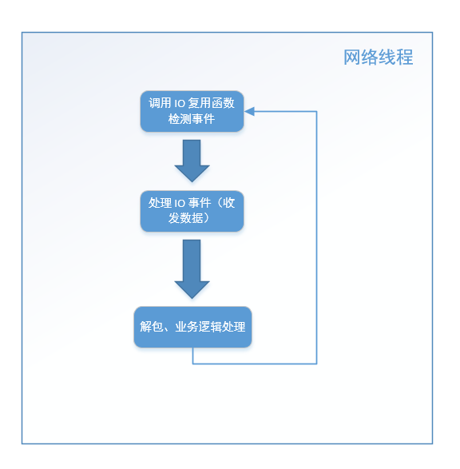
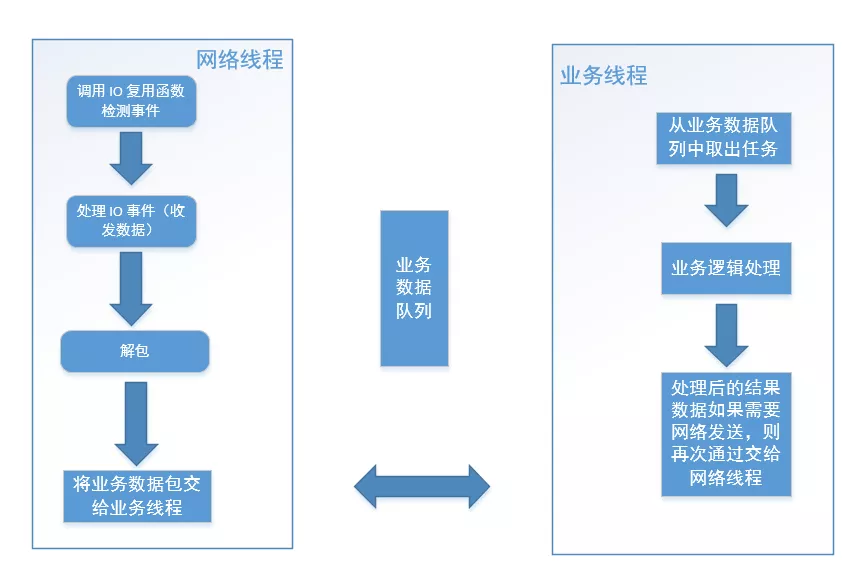

## 业务数据处理一定要单独开线程吗

在 《[one thread one loop 思想](http://mp.weixin.qq.com/s?__biz=MzU2MTkwMTE4Nw==&mid=2247487973&idx=2&sn=140004b0dfde45745091ab5c6522dcba&chksm=fc70ea09cb07631f2a06d5be464c3b3c88dc309a16f797f548ec49971ef60b946d2b6e46fcf1&scene=21#wechat_redirect)》一文我们介绍了一个 loop 的主要结构一般如下所示：

```
while (!m_bQuitFlag)
{
	epoll_or_select_func();

	handle_io_events();

	handle_other_things();
}
```

对于一些业务逻辑处理比较简单、不会太耗时的应用来说，**handle_io_events()** 方法除了收发数据也可以直接用来直接做业务的处理，即其结构如下：

```
void handle_io_events()
{
	//收发数据
	recv_or_send_data();
	
	//解包并处理数据
	decode_packages_and_process();
}
```

其中 **recv_or_send_data()** 方法中调用 send/recv API 进行实际的网络数据收发。以收数据为例，收完数据存入接收缓冲区后，接下来进行解包处理，然后进行业务处理，例如一个登陆数据包，其业务就是验证登陆的账户密码是否正确、记录其登陆行为等等。从程序函数调用堆栈来看，这些业务处理逻辑其实是直接在网络收发数据线程中处理的。我的意思是：网络线程调用 handle_io_events() 方法，handle_io_events() 方法调用 decode_packages_and_process() 方法，decode_packages_and_process() 方法做具体的业务逻辑处理。

需要注意的是，为了让网络层与业务层脱耦，网络层中通常会提供一些回调函数的接口，这些回调函数我们将其指向具体的业务处理函数。以 libevent 网络库的用法为例：

```
int main(int argc, char **argv)
{
	struct event_base *base;
	struct evconnlistener *listener;
	struct event *signal_event;

	struct sockaddr_in sin;

	base = event_base_new();

	memset(&sin, 0, sizeof(sin));
	sin.sin_family = AF_INET;
	sin.sin_port = htons(PORT);

	//listener_cb是我们自定义回调函数
	listener = evconnlistener_new_bind(base, listener_cb, (void *)base,
	    LEV_OPT_REUSEABLE|LEV_OPT_CLOSE_ON_FREE, -1,
	    (struct sockaddr*)&sin,
	    sizeof(sin));

	if (!listener) {
		fprintf(stderr, "Could not create a listener!\n");
		return 1;
	}

	//signal_cb是我们自定义回调函数
	signal_event = evsignal_new(base, SIGINT, signal_cb, (void *)base);

	if (!signal_event || event_add(signal_event, NULL)<0) {
		fprintf(stderr, "Could not create/add a signal event!\n");
		return 1;
	}

	//启动loop
	event_base_dispatch(base);

	evconnlistener_free(listener);
	event_free(signal_event);
	event_base_free(base);

	printf("done\n");
	return 0;
}
```

上述代码根据 libevent 自带的 helloworld 示例修改而来，其中 **listener_cb** 和 **signal_cb** 是自定义的回调函数，有相应的事件触发后，libevent 的事件循环会调用我们设置的回调，在这些回调函数中，我们可以编写自己的业务逻辑代码。

这种基本的服务器结构，我们可以绘制成如下流程图：




这是这个结构的最基本逻辑，在这基础上可以延伸出很多变体。不知道读者有没有发现，上述流程图中第三步解包和业务逻辑处理这一步中（位于 **handle_io_events()** 中的 **decode_packages_and_process()** 方法中），如果业务逻辑处理过程比较耗时（例如，从数据库取大量数据、写文件），那么会导致 网络线程在这个步骤停留时间很长，导致很久以后才能执行下一次循环，影响网络数据的检测和收发，最终导致整个程序的效率低下。

因此，对于这种情形，我们需要将业务处理逻辑单独拆出来交给另外的业务工作线程处理，业务工作线程可以是一个线程池，这个过程业务数据从网络线程组流向业务线程组。

这样的程序结构图如下图所示：




上图中，对于网络线程将业务数据包交给业务线程，可以使用一个共享的业务数据队列来实现，此时网络线程是生产者，业务线程从业务数据队列中取出任务去处理，业务线程是消费者。业务线程处理完成后如果需要将结果数据发出去，则再将数据交给网络线程。这里处理后的数据从业务线程再次流向网络线程，那么如何将数据从业务线程交给网络线程呢？这里以发数据为例，一般有三种方法：

**方法一**

直接调用相应的的发数据的方法，如果你的网络线程本身也会调用这些发数据的方法，那么此时就可能会出现网络线程和业务线程同时对发方法进行调用，相当于多个线程同时调用 socket send 函数，这样可能会导致同一个连接上的数据顺序有问题，此时的做法时，利用锁机制，同一时刻只有一个线程可以调用 socket send 方法。这里给出一段伪代码，假设 TcpConnection 对象表示某路连接，无论网络线程还是业务线程处理完数据后需要发送数据，则使用：

```
void TcpConnection::sendData(const std::string& data)
{
	//加上锁
	std::lock_guard<std::mutex> scoped_lock(m_mutexForConnection);
	//在这里调用 send
}
```

方法一的做法在设计上来说，存在让人不满意的地方，即数据发送应该属于网络层自己的事情，而不是其他模块（这里指的是业务线程）强行抢夺过来越俎代庖。

**方法二**

前面章节介绍了存在定时器结构的情况，网络线程结构变成如下流程：

```
while (!m_bQuitFlag)
{
	check_and_handle_timers();
	
	epoll_or_select_func();

	handle_io_events();
}
```

业务线程可以将需要发送的数据放入另外一个共享区域中（例如相应的 TcpConnection 对象的一个成员变量中），定时器定时从这个共享区域取出来，再发送出去，这种方案的优点是网络线程做了它该做的事情，缺点是需要添加定时器，让程序逻辑变得复杂，且定时器是每隔一段时间才会触发，发送的数据可能会有一定的延迟。

**方法三**

利用线程执行流中的 **handle_other_things()** 方法，再来看下前面章节中介绍的基本结构：

```
while (!m_bQuitFlag)
{
	epoll_or_select_func();

	handle_io_events();

	handle_other_things();
}
```

我们在《one thread one loop 思想》章节介绍了 **handle_other_things()** 函数可以做一些“其他事情”，这个函数可以在需要执行时通过前面章节介绍的唤醒机制立即被唤醒执行。业务线程将数据放入某个共享区域中（这一步和**方法二**介绍的一样），然后添加 "other_things" ，在 **handle_other_things()** 中执行数据的发送。

如果读者能清晰明白地看到这里，说明您大致明白了一个不错的服务器框架是怎么回事了。上面介绍的服务器结构是目前主流的基于 Reactor 模式的服务程序的通用结构，例如 libevent、libuv。

如果读者有兴趣，咱们可以再进一步深入讨论一下。

实际应用中，很多程序的业务逻辑处理其实是不耗时的，也就是说这些业务逻辑处理速度很快。由于 CPU 核数有限，当线程数量超过 CPU 数量时，各个线程（网络线程和业务线程）也不是真正地并行执行，那么即使开了一组业务线程也不一定能真正地并发执行，而业务逻辑处理并不耗时，不会影响网络线程的执行效率，那么我们不如就在网络线程里面直接处理。

上文介绍了在 handle_io_events() 方法中直接处理，如果处理的业务逻辑会产生新的其他任务，那么我们可以投递 "other_things"，最终交给 **handle_other_things()** 方法来处理。此时的服务器程序结构如下：


特别说明一下：这种方式仅限于 handle_io_events() 或 handle_other_things() 里面不会有耗时的逻辑，才可以替代专门开业务线程，如果有耗时操作还得老老实实单独开业务线程。虽然线程数量超过 CPU 数量时，各个线程不会得到真正的并行，但那是操作系统线程调度的事情了，应用层开发不必关心这点。
