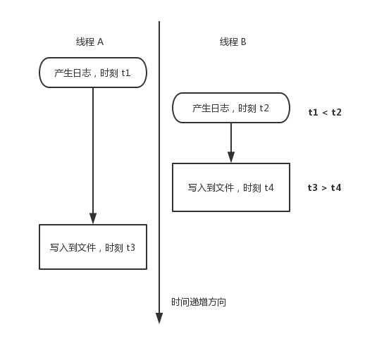

## 日志系统的设计


### 为什么需要日志

实际的软件项目产出都有一个流程，即先开发、测试，再发布生产，由于人的因素，既然是软件产品就不可能百分百没有 bug 或者逻辑错误，对于已经发布到生产的项目，一旦某个时刻产生非预期的结果，我们就需要去定位和排查问题。但是一般正式的生产环境的服务器或者产品是不允许开发人员通过附加调试器去排查问题的，主要有如下可能原因：

1. 在很多互联网企业，开发部门、测试部分和产品运维部门是分工明确的，软件产品一旦发布到生产环境以后，将全部交由运维部门人员去管理和维护，而原来开发此产品的开发人员不再拥有相关的操作程序的权限。
2. 对于已经上了生产环境的服务，其数据和程序稳定性是公司的核心产值所在，一般不敢或不允许被开发人员随意调试或者操作，以免造成损失。
3. 发布到生产环境的服务，一般为了让程序执行效率更高、文件体积更小，都是去掉调试符号后的版本，不方便也不利于调试。

既然我们无法通过调试器去调试，这个时候为了跟踪和回忆当时的程序行为进而定位问题，我们就需要日志系统。

退一步说，即使在开发或者测试环境，我们可以把程序附加到调试器上去调试，但是对于一些特定的程序行为，我们无法通过设置断点，让程序在某个时刻暂停下来进行调试。例如，对于某些网络通信功能，如果暂停时间过长（相对于某些程序逻辑来说），通信的对端可能由于彼端没有在规定时间内响应而断开连接，导致程序逻辑无法进入我们想要的执行流中去；再例如，对于一些高频操作（如心跳包、定时器、界面绘制下的某些高频重复行为），可能在少量次数下无法触发我们想要的行为，而通过断点的暂停方式，我们不得不重复操作几十次、上百次甚至更多，这样排查问题效率是非常低下的。对于这类操作，我们可以通过打印日志，将当时的程序行为上下文现场记录下来，然后从日志系统中找到某次不正常的行为的上下文信息。这也是日志的另外一个作用。

本文将从技术和业务上两个方面来介绍日志系统相关的设计与开发，所谓技术上，就是如何从程序开发的角度设计一款功能强大、性能优越、使用方便的日志系统；而业务上，是指我们在使用日志系统时，应该去记录哪些行为和数据，既简洁、不啰嗦，又方便需要时快速准确地定位到问题。

### 日志系统的技术上的实现

日志的最初的原型即将程序运行的状态打印出来，对于 C/C++ 这门语言来说，即可以利用 **printf**、**std::cout** 等控制台输出函数，将日志信息输出到控制台，这类简单的情形我们不在此过多赘述。

对于商业项目，为了方便排查问题，我们一般不将日志写到控制台，而是输出到文件或者数据库系统。不管哪一种，其思路基本上一致，我们这里以写文件为例来详细介绍。

#### 同步写日志

所谓同步写日志，指的是在输出日志的地方，将日志即时写入到文件中去。根据笔者的经验，这种设计广泛地用于相当多的的客户端软件。笔者曾从事过数年的客户端开发（包括 PC、安卓软件），设计过一些功能复杂的金融客户端产品，在这些系统中采用的就是这种同步写日志的方式。之所以使用这种方式其主要原因就是设计简单，而又不会影响用户使用体验。说到这里读者可能有这样一个疑问：一般的客户端软件，一般存在界面，而界面部分所属的逻辑就是程序的主线程，如果采取这种同步写日志的方式，当写日志时，写文件是磁盘 IO 操作，相比较程序其他部分是 CPU 操作，前者要慢很多，这样势必造成CPU等待，进而导致主线程“卡”在写文件处，进而造成界面卡顿，从而导致用户使用软件的体验不好。读者的这种顾虑确实是存在的。但是，很多时候我们不用担心这种问题，主要有两个原因：

1. 对于客户端程序，即使在主线程（UI 线程）中同步写文件，其单次或者几次磁盘操作累加时间，与人（用户）的可感知时间相比，也是非常小的，也就是说用户根本感觉不到这种同步写文件造成的延迟。当然，这里也给您一个提醒就是，如果在 UI 线程里面写日志，尤其是在一些高频操作中（如 Windows 的界面绘制消息 WM_PAINT 处理逻辑中），一定要控制写日志的长度和次数，否则就会因频繁写文件或一次写入数据过大而对界面造成卡顿。
2. 客户端程序除了 UI 线程，还有其他与界面无关的工作线程，在这些线程中直接写文件，一般不会对用户的体验产生什么影响。

说了这么多，我们给出一个具体的例子。

**日志类的 .h 文件**

```
/**
 *@desc:   IULog.h
 *@author: zhangyl
 *@date:   2014.12.25
 */
#ifndef __LOG_H__
#define __LOG_H__

enum LOG_LEVEL
{
    LOG_LEVEL_INFO,
    LOG_LEVEL_WARNING,
    LOG_LEVEL_ERROR
};

//注意：如果打印的日志信息中有中文，则格式化字符串要用_T()宏包裹起来，
#define LOG_INFO(...)     CIULog::Log(LOG_LEVEL_INFO, __FUNCSIG__,__LINE__, __VA_ARGS__)
#define LOG_WARNING(...)  CIULog::Log(LOG_LEVEL_WARNING, __FUNCSIG__, __LINE__,__VA_ARGS__)
#define LOG_ERROR(...)    CIULog::Log(LOG_LEVEL_ERROR, __FUNCSIG__,__LINE__, __VA_ARGS__)

class CIULog
{
public:
    static bool Init(bool bToFile, bool bTruncateLongLog, PCTSTR pszLogFileName);
    static void Uninit();

    static void SetLevel(LOG_LEVEL nLevel);

    //不输出线程ID号和所在函数签名、行号
    static bool Log(long nLevel, PCTSTR pszFmt, ...);
    //输出线程ID号和所在函数签名、行号
    static bool Log(long nLevel, PCSTR pszFunctionSig, int nLineNo, PCTSTR pszFmt, ...);        //注意:pszFunctionSig参数为Ansic版本
    static bool Log(long nLevel, PCSTR pszFunctionSig, int nLineNo, PCSTR pszFmt, ...);
private:
    CIULog() = delete;
    ~CIULog() = delete;

    CIULog(const CIULog& rhs) = delete;
    CIULog& operator=(const CIULog& rhs) = delete;

    static void GetTime(char* pszTime, int nTimeStrLength);

private:
    static bool             m_bToFile;              //日志写入文件还是写到控制台  
    static HANDLE           m_hLogFile;
    static bool             m_bTruncateLongLog;     //长日志是否截断
    static LOG_LEVEL        m_nLogLevel;            //日志级别
};

#endif // !__LOG_H__
```

**日志的 cpp 文件**

```
/**
 *@desc:   IULog.cpp
 *@author: zhangyl
 *@date:   2014.12.25
 */
#include "stdafx.h"
#include "IULog.h"
#include "EncodingUtil.h"
#include <tchar.h>

#ifndef LOG_OUTPUT
#define LOG_OUTPUT
#endif

#define MAX_LINE_LENGTH 256

bool CIULog::m_bToFile = false;
bool CIULog::m_bTruncateLongLog = false;
HANDLE CIULog::m_hLogFile = INVALID_HANDLE_VALUE;
LOG_LEVEL CIULog::m_nLogLevel = LOG_LEVEL_INFO;

bool CIULog::Init(bool bToFile, bool bTruncateLongLog, PCTSTR pszLogFileName)
{
#ifdef LOG_OUTPUT
    m_bToFile = bToFile;
    m_bTruncateLongLog = bTruncateLongLog;

    if (pszLogFileName == NULL || pszLogFileName[0] == NULL)
        return FALSE;

    TCHAR szHomePath[MAX_PATH] = {0};
    ::GetModuleFileName(NULL, szHomePath, MAX_PATH);
    for (int i = _tcslen(szHomePath); i >= 0; --i)
    {
        if (szHomePath[i] == _T('\\'))
        {
            szHomePath[i] = _T('\0');
            break;
        }
    }

    TCHAR szLogDirectory[MAX_PATH] = { 0 };
    _stprintf_s(szLogDirectory, _T("%s\\Logs\\"), szHomePath);

    DWORD dwAttr = ::GetFileAttributes(szLogDirectory);
    if (!((dwAttr != 0xFFFFFFFF) && (dwAttr & FILE_ATTRIBUTE_DIRECTORY)))
    {
        TCHAR cPath[MAX_PATH] = { 0 };
        TCHAR cTmpPath[MAX_PATH] = { 0 };
        TCHAR* lpPos = NULL;
        TCHAR cTmp = _T('\0');

        _tcsncpy_s(cPath, szLogDirectory, MAX_PATH);

        for (int i = 0; i < (int)_tcslen(cPath); i++)
        {
            if (_T('\\') == cPath[i])
                cPath[i] = _T('/');
        }

        lpPos = _tcschr(cPath, _T('/'));
        while (lpPos != NULL)
        {
            if (lpPos == cPath)
            {
                lpPos++;
            }
            else
            {
                cTmp = *lpPos;
                *lpPos = _T('\0');
                _tcsncpy_s(cTmpPath, cPath, MAX_PATH);
                ::CreateDirectory(cTmpPath, NULL);
                *lpPos = cTmp;
                lpPos++;
            }
            lpPos = _tcschr(lpPos, _T('/'));
        }
    }

    m_hLogFile = ::CreateFile(pszLogFileName, GENERIC_READ | GENERIC_WRITE, FILE_SHARE_READ, NULL, CREATE_NEW, FILE_ATTRIBUTE_NORMAL, NULL);
    if (m_hLogFile == INVALID_HANDLE_VALUE)
        return false;

#endif // end LOG_OUTPUT

    return true;
}

void CIULog::Uninit()
{
#ifdef LOG_OUTPUT
    if(m_hLogFile != INVALID_HANDLE_VALUE)
    {
        ::CloseHandle(m_hLogFile);
        m_hLogFile = INVALID_HANDLE_VALUE;
    }
#endif //end LOG_OUTPUT
}

void CIULog::SetLevel(LOG_LEVEL nLevel)
{
    m_nLogLevel = nLevel;
}

bool CIULog::Log(long nLevel, PCTSTR pszFmt, ...)
{
#ifdef LOG_OUTPUT
    if (nLevel < m_nLogLevel)
        return false;

    char szTime[64] = { 0 };
    GetTime(szTime,ARRAYSIZE(szTime));
    std::string strDebugInfo(szTime);

    std::string strLevel("[INFO]");
    if (nLevel == LOG_LEVEL_WARNING)
        strLevel = "[Warning]";
    else if (nLevel == LOG_LEVEL_ERROR)
        strLevel = "[Error]";

    strDebugInfo += strLevel;

    //当前线程信息
    char szThreadID[32] = { 0 };
    DWORD dwThreadID = ::GetCurrentThreadId();
    sprintf_s(szThreadID, ARRAYSIZE(szThreadID), "[ThreadID: %u]", dwThreadID);  
    strDebugInfo += szThreadID;

    //log正文
    std::wstring strLogMsg;
    va_list ap;
    va_start(ap, pszFmt);
    int nLogMsgLength = _vsctprintf(pszFmt, ap);
    //容量必须算上最后一个\0
    if ((int)strLogMsg.capacity() < nLogMsgLength + 1)
    {
        strLogMsg.resize(nLogMsgLength + 1);
    }
    _vstprintf_s((TCHAR*)strLogMsg.data(), strLogMsg.capacity(), pszFmt, ap);
    va_end(ap);

    //string内容正确但length不对，恢复一下其length
    std::wstring strMsgFormal;
    strMsgFormal.append(strLogMsg.c_str(), nLogMsgLength);

    //如果日志开启截断，长日志只取前MAX_LINE_LENGTH个字符
    if (m_bTruncateLongLog)
        strMsgFormal = strMsgFormal.substr(0, MAX_LINE_LENGTH);

    std::string strLogMsgAscii;
    strLogMsgAscii = EncodeUtil::UnicodeToAnsi(strMsgFormal);

    strDebugInfo += strLogMsgAscii;
    strDebugInfo += "\r\n";

    if(m_bToFile)
    {
        if(m_hLogFile == INVALID_HANDLE_VALUE)
            return false;

        ::SetFilePointer(m_hLogFile, 0, NULL, FILE_END);
        DWORD dwBytesWritten = 0;       
        ::WriteFile(m_hLogFile, strDebugInfo.c_str(), strDebugInfo.length(), &dwBytesWritten, NULL);
        ::FlushFileBuffers(m_hLogFile);
        return true;
    }

    ::OutputDebugStringA(strDebugInfo.c_str());

#endif // end LOG_OUTPUT

    return true;
}

bool CIULog::Log(long nLevel, PCSTR pszFunctionSig, int nLineNo, PCTSTR pszFmt, ...)
{
#ifdef LOG_OUTPUT
    if (nLevel < m_nLogLevel)
        return false;

    //时间
    char szTime[64] = { 0 };
    GetTime(szTime, ARRAYSIZE(szTime));
    std::string strDebugInfo(szTime);

    //错误级别
    std::string strLevel("[INFO]");
    if (nLevel == LOG_LEVEL_WARNING)
        strLevel = "[Warning]";
    else if (nLevel == LOG_LEVEL_ERROR)
        strLevel = "[Error]";

    strDebugInfo += strLevel;

    //当前线程信息
    char szThreadID[32] = {0};
    DWORD dwThreadID = ::GetCurrentThreadId();
    sprintf_s(szThreadID, ARRAYSIZE(szThreadID), "[ThreadID: %u]", dwThreadID);
    strDebugInfo += szThreadID;

    //函数签名
    char szFuncSig[512] = { 0 };
    sprintf_s(szFuncSig, "[%s:%d]", pszFunctionSig, nLineNo);
    strDebugInfo += szFuncSig;

    //log正文
    std::wstring strLogMsg;
    va_list ap;
    va_start(ap, pszFmt);
    int nLogMsgLength = _vsctprintf(pszFmt, ap);
    //容量必须算上最后一个\0 
    if ((int)strLogMsg.capacity() < nLogMsgLength + 1)
    {
        strLogMsg.resize(nLogMsgLength + 1);
    }
    _vstprintf_s((TCHAR*)strLogMsg.data(), strLogMsg.capacity(), pszFmt, ap);
    va_end(ap);

    //string内容正确但length不对，恢复一下其length
    std::wstring strMsgFormal;
    strMsgFormal.append(strLogMsg.c_str(), nLogMsgLength);

    //如果日志开启截断，长日志只取前MAX_LINE_LENGTH个字符
    if (m_bTruncateLongLog)
        strMsgFormal = strMsgFormal.substr(0, MAX_LINE_LENGTH);

    std::string strLogMsgAscii;
    strLogMsgAscii = EncodeUtil::UnicodeToAnsi(strMsgFormal);

    strDebugInfo += strLogMsgAscii;
    strDebugInfo += "\r\n";

    if(m_bToFile)
    {
        if(m_hLogFile == INVALID_HANDLE_VALUE)
            return false;

        ::SetFilePointer(m_hLogFile, 0, NULL, FILE_END);
        DWORD dwBytesWritten = 0;
        ::WriteFile(m_hLogFile, strDebugInfo.c_str(), strDebugInfo.length(), &dwBytesWritten, NULL);
        ::FlushFileBuffers(m_hLogFile);
        return true;
    }

    ::OutputDebugStringA(strDebugInfo.c_str());

#endif // end LOG_OUTPUT

    return true;
}

bool CIULog::Log(long nLevel, PCSTR pszFunctionSig, int nLineNo, PCSTR pszFmt, ...)
{
#ifdef LOG_OUTPUT
    if (nLevel < m_nLogLevel)
        return false;

    //时间
    char szTime[64] = { 0 };
    GetTime(szTime, ARRAYSIZE(szTime));
    std::string strDebugInfo(szTime);

    //错误级别
    std::string strLevel("[INFO]");
    if (nLevel == LOG_LEVEL_WARNING)
        strLevel = "[Warning]";
    else if (nLevel == LOG_LEVEL_ERROR)
        strLevel = "[Error]";

    strDebugInfo += strLevel;

    //当前线程信息
    char szThreadID[32] = {0};
    DWORD dwThreadID = ::GetCurrentThreadId();
    sprintf_s(szThreadID, ARRAYSIZE(szThreadID), "[ThreadID: %u]", dwThreadID);
    strDebugInfo += szThreadID;

    //函数签名
    char szFuncSig[512] = { 0 };
    sprintf_s(szFuncSig, "[%s:%d]", pszFunctionSig, nLineNo);
    strDebugInfo += szFuncSig;

    //日志正文
    std::string strLogMsg;
    va_list ap;
    va_start(ap, pszFmt);
    int nLogMsgLength = _vscprintf(pszFmt, ap);
    //容量必须算上最后一个\0
    if ((int)strLogMsg.capacity() < nLogMsgLength + 1)
    {
        strLogMsg.resize(nLogMsgLength + 1);
    }
    vsprintf_s((char*)strLogMsg.data(), strLogMsg.capacity(), pszFmt, ap);
    va_end(ap);

    //string内容正确但length不对，恢复一下其length
    std::string strMsgFormal;
    strMsgFormal.append(strLogMsg.c_str(), nLogMsgLength);

    //如果日志开启截断，长日志只取前MAX_LINE_LENGTH个字符
    if (m_bTruncateLongLog)
        strMsgFormal = strMsgFormal.substr(0, MAX_LINE_LENGTH);

    strDebugInfo += strMsgFormal;
    strDebugInfo += "\r\n";

    if(m_bToFile)
    {
        if(m_hLogFile == INVALID_HANDLE_VALUE)
            return false;

        ::SetFilePointer(m_hLogFile, 0, NULL, FILE_END);
        DWORD dwBytesWritten = 0;
        ::WriteFile(m_hLogFile, strDebugInfo.c_str(), strDebugInfo.length(), &dwBytesWritten, NULL);
        ::FlushFileBuffers(m_hLogFile);
        return true;
    }

    ::OutputDebugStringA(strDebugInfo.c_str());

#endif // end LOG_OUTPUT

    return true;
}

void CIULog::GetTime(char* pszTime, int nTimeStrLength)
{
    SYSTEMTIME st = {0};
    ::GetLocalTime(&st);
    sprintf_s(pszTime, nTimeStrLength, "[%04d-%02d-%02d %02d:%02d:%02d:%04d]", st.wYear, st.wMonth, st.wDay, st.wHour, st.wMinute, st.wSecond, st.wMilliseconds);
}
```

上述代码中根据日志级别定义了三个宏 **LOG_INFO**、**LOG_WARNING**、**LOG_ERROR**，如果要使用该日志模块，只需要在程序启动处的地方调用 **CIULog::Init** 函数初始化日志：

```
SYSTEMTIME st = {0};
::GetLocalTime(&st);
TCHAR szLogFileName[MAX_PATH] = {0};
_stprintf_s(szLogFileName, MAX_PATH, _T("%s\\Logs\\%04d%02d%02d%02d%02d%02d.log"), g_szHomePath, st.wYear, st.wMonth, st.wDay, st.wHour, st.wMinute, st.wSecond);
CIULog::Init(true, false, szLogFileName);
```

当然，最佳的做法，在程序退出的地方，调用 **CIULog::Uninit** 回收日志模块相关的资源：

```
CIULog::Uninit();
```

在做好这些准备工作以后，如果你想在程序的某个地方写一条日志，只需要这样写：

```
//打印一条 INFO 级别的日志
LOG_INFO("Request logon: Account=%s, Password=*****, Status=%d, LoginType=%d.", pLoginRequest->m_szAccountName, pLoginRequest->m_szPassword, pLoginRequest->m_nStatus, (long)pLoginRequest->m_nLoginType);
//打印一条 WARNING 级别的日志
LOG_WARN("Some warning...");
//打印一条 ERROR 级别的日志
LOG_ERROR("Recv data error, errorNO=%d.", ::WSAGetLastError());
```

关于 **CIULog** 这个日志模块类，如果读者要想实际运行查看效果，可以从链接（https://github.com/baloonwj/flamingo/tree/master/flamingoclient ）下载完整的项目代码来运行。该日志输出效果如下：

```
[2018-11-09 23:52:54:0826][INFO][ThreadID: 7252][bool __thiscall CIUSocket::Login(const char *,const char *,int,int,int,class std::basic_string<char,struct std::char_traits<char>,class std::allocator<char> > &):1107]Request logon: Account=zhangy, Password=*****, Status=76283204, LoginType=1.
[2018-11-09 23:52:56:0352][INFO][ThreadID: 5828][void __thiscall CIUSocket::SendThreadProc(void):794]Recv data thread start...
[2018-11-09 23:52:56:0385][INFO][ThreadID: 6032][void __thiscall CSendMsgThread::HandleUserBasicInfo(const class CUserBasicInfoRequest *):298]Request to get userinfo.
[2018-11-09 23:52:56:0355][INFO][ThreadID: 7140][void __thiscall CIUSocket::RecvThreadProc(void):842]Recv data thread start...
[2018-11-09 23:52:57:0254][INFO][ThreadID: 7220][int __thiscall CRecvMsgThread::HandleFriendListInfo(const class std::basic_string<char,struct std::char_traits<char>,class std::allocator<char> > &):593]Recv user basic info, info count=1.
```

##### 多线程同步写日志出现的问题一

从上面的日志输出来看，这种同步的日志输出方式，也存在时间顺序不正确的问题（时间戳大的日志比时间戳小的日志靠前）。这是由于多线程同时写日志到同一个文件时，产生日志的时间和实际写入磁盘的时间不是一个原子操作。下图解释了该现象出现的根源：



多线程写同一个日志文件出现先产生的日志后写入到文件中的现象

好在这种时间顺序不正确只会出现在不同线程之间，对于同一个线程的不同时间的日志记录顺序肯定是正确的。所以这种日期错乱现象，并不影响我们使用日志。

##### 多线程同步写日志出现的问题二

多线程同时写入同一个日志文件还有一个问题，就是假设线程 A 写某一个时刻追加日志内容为 “AAAAA” ，线程 B 在同一时刻追加日志内容为 “BBBBB” ，线程 C 在同一时刻追加日志内容为 “CCCCC” ，那么最终的日志文件中的内容会不会出现 “AABBCCABCAACCBB” 这种格式？

在类 Unix 系统上（包括 Linux），同一个进程内针对同一个 **FILE*** 的操作是线程安全的，也就是说，在这类操作系统上得到的日志结果 A、B、C 各个字母组一定是连续在一起，也就是说最终得到的日志内容可能是 “**AAAAACCCCCBBBBB**” 或 “**AAAAABBBBBCCCCC**” 等这种连续的格式，绝不会出现 A、B、C 字母交错相间的现象。

而在Windows系统上，对于 **FILE*** 的操作并不是线程安全的。但是笔者做了大量实验，在 Windows 系统上也没有出现这种 A、B、C 字母相间的现象。（关于这个问题的讨论，可以参考这里：https://www.zhihu.com/question/40472431 ）

这种同步日志的实现方式，一般用于低频写日志的软件系统中（如客户端软件），所以我可以认为这种多线程同时写日志到一个文件中是可行的。

#### 异步写日志

当然，对于性能要求不高的应用（如大多数客户端程序、某些并发数量不高的服务）来说，这种同步写日志的实现方式是可以满足要求的。但是对于 QPS 要求很高或者对性能有一定要求的服务器程序，同步写日志等待磁盘 IO 的完成对于服务的关键性逻辑的快速执行和及时响应性会造成一定的性能损失。为了减小这种损失，我们可以采用异步日志。

所谓异步写日志，与同步写日志相反，即产生日志的地方，不会将日志实时写入到文件中去，而是通过一些线程同步技术将日志先暂存下来，然后再通过一个或多个专门的日志写入线程去将这些缓存的日志写入到磁盘中去，这样的话，原来输出日志的线程就不存在等待写日志到磁盘这样的效率损耗了。这本质上，其实就是一个生产者和消费者，产生日志的线程是生产者，将日志写入文件的线程是消费者。当然，对于日志的消费者线程，我这里提到“**一个**”或“**多个**”日志线程，在实际开发中，如果多个日志消费线程，我们又要考虑多个线程可能会造成写日志的时间顺序错位（时间较晚的日志写在时间较早的日志前面），这在上文中已经讨论过，这里不再赘述。

总结起来，为了方便读者理解和编码，我们可以认为异步写日志的逻辑一般存在一组专门写日志的线程（一个或多个），程序的其他线程为这些日志线程生产日志。

至于其他线程如何将产生的日志交给日志线程，这就是多线程之间资源同步的问题了。我们可以使用一个队列来存储其他线程产生的日志，日志线程从该队列中取出日志，然后将日志内容写入文件。最简单的方式是日志生产线程将每次产生的日志信息放入一个队列时、日志写入线程从队列中取出日志时，都使用一个**互斥体( mutex )**保护起来。代码示例如下（C++11 代码）：

```
/**
 *@desc: AsyncLogger.cpp
 *@author: zhangyl
 *@date: 2018.11.10
 */
#include "stdafx.h"
#include <thread>
#include <mutex>
#include <list>
#include <string>
#include <sstream>
#include <iostream>

//保护队列的互斥体
std::mutex log_mutex;
std::list<std::string> cached_logs;
FILE* log_file = NULL;

bool init_log_file()
{
    //以追加内容的形式写入文件内容，如果文件不存在，则创建
    log_file = fopen("my.log", "a+");
    return log_file != NULL;
}

void uninit_log_file()
{
    if (log_file != NULL)
        fclose(log_file);
}

bool write_log_tofile(const std::string& line)
{
    if (log_file == NULL)
        return false;

    if (fwrite((void*)line.c_str(), 1, line.length(), log_file) != line.length())
        return false;

    //将日志立即冲刷到文件中去
    fflush(log_file);

    return true;
}

void log_producer()
{
    int index = 0;
    while (true)
    {
        ++ index;
        std::ostringstream os;
        os << "This is log, index: " << index << ", producer threadID: " << std::this_thread::get_id() << "\n";
        //使用花括号括起来为的是减小锁的粒度
        {
            std::lock_guard<std::mutex> lock(log_mutex);
            cached_logs.emplace_back(os.str());
        }

        std::chrono::milliseconds duration(100);
        std::this_thread::sleep_for(duration);
    }
}

void log_consumer()
{
    std::string line;
    while (true)
    {
        //使用花括号括起来为的是减小锁的粒度
        {
            std::lock_guard<std::mutex> lock(log_mutex);
            if (!cached_logs.empty())
            {
                line = cached_logs.front();
                cached_logs.pop_front();
            }
        }

        if (line.empty())
        {        
            std::chrono::milliseconds duration(1000);
            std::this_thread::sleep_for(duration);

            continue;
        }

        write_log_tofile(line);

        line.clear();
    }
}

int main(int argc, char* argv[])
{
    if (!init_log_file())
    {
        std::cout << "init log file error." << std::endl;
        return -1;
    }

    std::thread log_producer1(log_producer);
    std::thread log_producer2(log_producer);
    std::thread log_producer3(log_producer);

    std::thread log_consumer1(log_consumer);
    std::thread log_consumer2(log_consumer);
    std::thread log_consumer3(log_consumer);

    log_producer1.join();
    log_producer2.join();
    log_producer3.join();

    log_consumer1.join();
    log_consumer2.join();
    log_consumer3.join();

    uninit_log_file();

    return 0;
}
```

上述代码分别模拟了三个生产日志的线程（**log_producer1～3**）和三个消费日志线程（**log_consumer1～3**）。当然上述代码可以继续优化，如果当前缓存队列中没有日志记录，那么消费日志线程会做无用功。

##### 优化方法一

可以使用条件变量，如果当前队列中没有日志记录，则将日志消费线程挂起；当生产日志的线程产生了新的日志后，**置信（signal）**条件变量，这样日志消费线程会被唤醒，以将日志从队列中取出来并写入文件。我们来看下代码：

```
/**
 *@desc: AsyncLoggerLinux.cpp
 *@author: zhangyl
 *@date: 2018.11.10
 */
#include "stdafx.h"
#include <thread>
#include <mutex>
#include <condition_variable>
#include <list>
#include <string>
#include <sstream>
#include <iostream>

std::mutex log_mutex;
std::condition_variable log_cv;
std::list<std::string> cached_logs;
FILE* log_file = NULL;

bool init_log_file()
{
    //以追加内容的形式写入文件内容，如果文件不存在，则创建
    log_file = fopen("my.log", "a+");
    return log_file != NULL;
}

void uninit_log_file()
{
    if (log_file != NULL)
        fclose(log_file);
}

bool write_log_tofile(const std::string& line)
{
    if (log_file == NULL)
        return false;

    if (fwrite((void*)line.c_str(), 1, line.length(), log_file) != line.length())
        return false;

    //将日志立即冲刷到文件中去
    fflush(log_file);

    return true;
}

void log_producer()
{
    int index = 0;
    while (true)
    {
        ++ index;
        std::ostringstream os;
        os << "This is log, index: " << index << ", producer threadID: " << std::this_thread::get_id() << "\n";
        //使用花括号括起来为的是减小锁的粒度
        {
            std::lock_guard<std::mutex> lock(log_mutex);
            cached_logs.emplace_back(os.str());
            log_cv.notify_one();
        }

        std::chrono::milliseconds duration(100);
        std::this_thread::sleep_for(duration);
    }
}

void log_consumer()
{
    std::string line;
    while (true)
    {
        //使用花括号括起来为的是减小锁的粒度
        {
            std::unique_lock<std::mutex> lock(log_mutex);
            if (cached_logs.empty())
            {
                //无限等待
                log_cv.wait(lock);
            }

            line = cached_logs.front();
            cached_logs.pop_front();
        }

        if (line.empty())
        {        
            std::chrono::milliseconds duration(1000);
            std::this_thread::sleep_for(duration);

            continue;
        }

        write_log_tofile(line);

        line.clear();
    }
}

int main(int argc, char* argv[])
{
    if (!init_log_file())
    {
        std::cout << "init log file error." << std::endl;
        return -1;
    }

    std::thread log_producer1(log_producer);
    std::thread log_producer2(log_producer);
    std::thread log_producer3(log_producer);

    std::thread log_consumer1(log_consumer);
    std::thread log_consumer2(log_consumer);
    std::thread log_consumer3(log_consumer);

    log_producer1.join();
    log_producer2.join();
    log_producer3.join();

    log_consumer1.join();
    log_consumer2.join();
    log_consumer3.join();

    uninit_log_file();

    return 0;
}
```

##### 优化方法二

除了条件变量以外，我们还可以使用信号量来设计我们的异步日志系统，信号量是带有资源计数的线程同步对象，当每产生一条日志时，我们将信号量资源计数自增1，日志消费线程默认是等待这个信号量是否受信，如果受信，每唤醒一个日志消费线程，信号量字数计数将自动减1。通俗地说就是生成者每生产一个资源，就将资源计数加1，而消费者每消费一个资源数量，就将资源计数减一；如果当前资源计数已经为0，则消费者将自动挂起。

由于 C++ 11 没有提供对不同平台的信号量对象的封装，我们这里分别给出 Windows 和 Linux 两个平台的实现代码，读者可以根据需要来学习其中一个或两个同时学习。注意，为了保持代码风格一致，对于线程和读写文件相关函数，在不同的操作系统平台，我们使用该系统平台相关的 API 接口，而不再使用 C++ 11 的相关函数和类库。

**Windows 平台代码**

```
/**
 *@desc: AsyncLogger.cpp，Windows版本
 *@author: zhangyl
 *@date: 2018.11.10
 */
#include "stdafx.h"
#include <windows.h>
#include <list>
#include <string>
#include <iostream>
#include <sstream>

std::list<std::string> cached_logs;
CRITICAL_SECTION g_cs;
HANDLE g_hSemaphore = NULL;
HANDLE g_hLogFile = INVALID_HANDLE_VALUE;

bool Init()
{
    InitializeCriticalSection(&g_cs);

    //假设资源数量上限是0xFFFFFFFF
    g_hSemaphore = CreateSemaphore(NULL, 0, 0xFFFFFFFF, NULL);

    //如果文件不存在，则创建
    g_hLogFile = CreateFile(_T("my.log"), GENERIC_WRITE, FILE_SHARE_READ, NULL, CREATE_ALWAYS, FILE_ATTRIBUTE_NORMAL, NULL);
    if (g_hLogFile == INVALID_HANDLE_VALUE)
        return false;

    return true;
}

void Uninit()
{
    DeleteCriticalSection(&g_cs);

    if (g_hSemaphore != NULL)
        CloseHandle(g_hSemaphore);

    if (g_hLogFile != INVALID_HANDLE_VALUE)
        CloseHandle(g_hLogFile);
}

bool WriteLogToFile(const std::string& line)
{
    if (g_hLogFile == INVALID_HANDLE_VALUE)
        return false;

    DWORD dwBytesWritten;
    //如果对于比较长的日志，应该分段写入，因为单次写入可能只能写入部分，这里为了演示方便，逻辑从简
    if (!WriteFile(g_hLogFile, line.c_str(), line.length(), &dwBytesWritten, NULL) || dwBytesWritten != line.length())
        return false;

    //将日志立即冲刷到文件中去
    FlushFileBuffers(g_hLogFile);

    return true;
}

DWORD CALLBACK LogProduceThreadProc(LPVOID lpThreadParameter)
{
    int index = 0;
    while (true)
    {
        ++ index;
        std::ostringstream os;
        os << "This is log, index: " << index << ", producer threadID: " << GetCurrentThreadId() << "\n";

        EnterCriticalSection(&g_cs);       
        cached_logs.emplace_back(os.str());
        LeaveCriticalSection(&g_cs);

        ReleaseSemaphore(g_hSemaphore, 1, NULL);

        Sleep(100);
    }

    return 0;
}

DWORD CALLBACK LogConsumeThreadProc(LPVOID lpThreadParameter)
{
    std::string line;
    while (true)
    {     
        //无限等待
        WaitForSingleObject(g_hSemaphore, INFINITE);

        EnterCriticalSection(&g_cs);
        if (!cached_logs.empty())
        {
            line = cached_logs.front();
            cached_logs.pop_front();
        }     
        LeaveCriticalSection(&g_cs);          

        if (line.empty())
        {        
            Sleep(1000);

            continue;
        }

        WriteLogToFile(line);

        line.clear();
    }
}

int main(int argc, char* argv[])
{
    if (!Init())
    {
        std::cout << "init log file error." << std::endl;
        return -1;
    }

    HANDLE hProducers[3];
    for (int i = 0; i < sizeof(hProducers) / sizeof(hProducers[0]); ++i)
    {
        hProducers[i] = CreateThread(NULL, 0, LogProduceThreadProc, NULL, 0, NULL);
    }

    HANDLE hConsumers[3];
    for (int i = 0; i < sizeof(hConsumers) / sizeof(hConsumers[0]); ++i)
    {
        hConsumers[i] = CreateThread(NULL, 0, LogConsumeThreadProc, NULL, 0, NULL);
    }

    //等待消费者线程退出
    for (int i = 0; i < sizeof(hProducers) / sizeof(hProducers[0]); ++i)
    {
        WaitForSingleObject(hProducers[i], INFINITE);
    }

    //等待生产者线程退出
    for (int i = 0; i < sizeof(hConsumers) / sizeof(hConsumers[0]); ++i)
    {
        WaitForSingleObject(hConsumers[i], INFINITE);
    }

    Uninit();

    return 0;
}
```

上述代码，在多线程向队列中增加日志记录和从队列中取出日志记录使用了Windows的上的**临界区（CRITICAL_SECTION，有的书上译作“关键段”）**对象来对队列进行保护。

**Linux 平台代码**

```
/**
 *@desc: AsyncLogger.cpp，linux版本
 *@author: zhangyl
 *@date: 2018.11.10
 */
#include <unistd.h>
#include <list>
#include <stdio.h>
#include <pthread.h>
#include <semaphore.h>
#include <string>
#include <iostream>
#include <sstream>


std::list<std::string> cached_logs;
pthread_mutex_t log_mutex = PTHREAD_MUTEX_INITIALIZER;
sem_t           log_semphore;
FILE* plogfile = NULL;

bool init()
{
    pthread_mutex_init(&log_mutex, NULL);
    //初始信号量资源数目是0
    sem_init(&log_semphore, 0, 0);

    //如果文件不存在，则创建
    plogfile = fopen("my.log", "a++");

    return plogfile != NULL;
}

void uninit()
{
    pthread_mutex_destroy(&log_mutex);
    sem_destroy(&log_semphore);

    if (plogfile != NULL)
        fclose(plogfile);
}

bool write_log_to_file(const std::string& line)
{
    if (plogfile == NULL)
        return false;

    //如果对于比较长的日志，应该分段写入，因为单次写入可能只能写入部分，这里为了演示方便，逻辑从简
    if (fwrite((void*)line.c_str(), 1, line.length(), plogfile) != line.length())
        return false;

    //将日志立即冲刷到文件中去
    fflush(plogfile);

    return true;
}

void* producer_thread_proc(void* arg)
{
    int index = 0;
    while (true)
    {
        ++ index;
        std::ostringstream os;
        os << "This is log, index: " << index << ", producer threadID: " << pthread_self() << "\n";

        pthread_mutex_lock(&log_mutex);
        cached_logs.push_back(os.str());
        pthread_mutex_unlock(&log_mutex);

        sem_post(&log_semphore);

        usleep(100000);
    }
}

void* consumer_thread_proc(void* arg)
{
    std::string line;
    while (true)
    {     
        //无限等待
        sem_wait(&log_semphore);

        pthread_mutex_lock(&log_mutex);
        if (!cached_logs.empty())
        {
            line = cached_logs.front();
            cached_logs.pop_front();
        }     
        pthread_mutex_unlock(&log_mutex);

        if (line.empty())
        {        
            sleep(1);

            continue;
        }

        write_log_to_file(line);

        line.clear();
    }
}

int main(int argc, char* argv[])
{
    if (!init())
    {
        std::cout << "init log file error." << std::endl;
        return -1;
    }

    pthread_t producer_thread_id[3];
    for (int i = 0; i < sizeof(producer_thread_id) / sizeof(producer_thread_id[0]); ++i)
    {
        pthread_create(&producer_thread_id[i], NULL, producer_thread_proc, NULL);
    }

    pthread_t consumer_thread_id[3];
    for (int i = 0; i < sizeof(consumer_thread_id) / sizeof(consumer_thread_id[0]); ++i)
    {
        pthread_create(&consumer_thread_id[i], NULL, consumer_thread_proc, NULL);
    }

    //等待消费者线程退出
    for (int i = 0; i < sizeof(producer_thread_id) / sizeof(producer_thread_id[0]); ++i)
    {
        pthread_join(producer_thread_id[i], NULL);
    }

    //等待生产者线程退出
    for (int i = 0; i < sizeof(consumer_thread_id) / sizeof(consumer_thread_id[0]); ++i)
    {
        pthread_join(consumer_thread_id[i], NULL);
    }

    uninit();

    return 0;
}
```

我们使用 g++ 编译器编译上述代码，使用如下命令生成可移植性文件 **AsyncLoggerLinux**：

```
g++ -g -o AsyncLoggerLinux AsyncLoggerLinux.cpp -lpthread
```

接着执行生成的 **AsyncLoggerLinux** 文件，然后生成的日志效果如下：

```
This is log, index: 1, producer threadID: 140512358795008
This is log, index: 1, producer threadID: 140512367187712
This is log, index: 1, producer threadID: 140512375580416
This is log, index: 2, producer threadID: 140512358795008
This is log, index: 2, producer threadID: 140512367187712
This is log, index: 2, producer threadID: 140512375580416
This is log, index: 3, producer threadID: 140512358795008
This is log, index: 3, producer threadID: 140512367187712
This is log, index: 3, producer threadID: 140512375580416
This is log, index: 4, producer threadID: 140512358795008
This is log, index: 4, producer threadID: 140512367187712
This is log, index: 4, producer threadID: 140512375580416
This is log, index: 5, producer threadID: 140512358795008
This is log, index: 5, producer threadID: 140512367187712
This is log, index: 5, producer threadID: 140512375580416
//省略...
```

> 当然，您可能需要同时能在 Windows 和 Linux 同时运行的代码，我们自然而然想到用 C++11 语法的信号量，由于 C++ 11 本身没有提供现成的信号量库，我们可以自己利用**std::mutex**、**std::condition_variable**模拟一下信号量的功能，这里就不再详细介绍了，有兴趣的可以自行尝试一下。

以上就是异步日志的基本原理，在这个原理的基础上，我们可以增加很多的特性。
