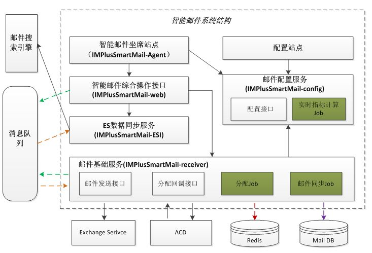

## 错误码系统的设计

> 本文介绍服务器开发中一组服务中错误码系统的设计理念与实践，如果读者从来没想过或者没接触过这种设计理念，建议认真体会一下这种设计思路的优点。

#### 错误码的作用

读者如果有使用过中国电信的宽带账号上网的经历，如果我们登陆不成功，一般服务器会返回一个错误码，如651、678。然后，我们打中国电信的客服电话，客服会询问我们错误码是多少，通过错误码他们的技术人员就大致知道了错误原因；并且通过错误码，他们就知道到底是电信的服务器问题还是宽带用户自己的设备或者操作问题，如果是用户自己的问题，他们一般会尝试教用户如何操作，而不是冒然就派遣维修人员上门，这样不仅能尽早解决问题同时也节约了人力成本。

再举另外一个例子，我们日常浏览网页，当Web服务器正常返回页面时，状态码一般是200(OK)，而当页面不存在时，错误码一般是404，另外像503等错误都是比较常见的。

通过以上两个例子，读者应该能明白，对于服务器系统来说，设计一套好的错误码是非常有必要的，可以在用户请求出问题时迅速定位并解决问题。具体包括两个方面：

1. 可以迅速定位是用户“输入”问题还是服务器自身的问题。

所谓的用户“输入”问题，是指用户的不当操作，这里的“用户的不当操作”可能是因为客户端软件本身的逻辑错误或漏洞，也可能是使用客户端的人的非法操作，而客户端软件在设计上因为考虑不周而缺乏有效性校验，这两类情形都可能会产生非法的数据，并且直接发给服务器。一个好的服务端系统不能假设客户端的请求数据一定是合法的，必须对传过来的数据做有效性校验。服务器没有义务一定给非法的请求做出应答，因此请求的最终结果是服务器不应答或给客户端不想要的应答。

以上面的例子为例，宽带用户输入了无效的用户名或者密码造成服务器拒绝访问；用户在浏览器中输入了一个无效的网址等。这类错误，都是需要用户自己解决或者用户可以自己解决的。如果错误码可以反映出这类错误，那么在实际服务器运维的过程中，当用户反馈这一类故障时，我们通过服务器内部产生的错误码或者应答给客户端的错误码，准确快速地确定问题原因。如果是用户非法请求造成的，可以让用户自行解决。注意，这里的“用户”，可以代指人，也可以代指使用某个服务器的所有下游服务和客户端。

1. 可以快速定位哪个步骤或哪个服务出了问题。

   对于单个服务，假设收到某个“客户端”请求时，需要经历多个步骤才能完成，而这中间任何一个步骤都可能出问题，在不同步骤出错时返回不同的错误码，那么就可以知道是哪个步骤出了问题。

   其次，一般稍微复杂一点的系统，都不是单个服务，往往是由一组服务构成。如果将错误码分段，每个服务的错误码都有各自的范围，那么通过错误码，我们也能准确地知道是哪个服务出了问题。

#### 错误码系统设计实践

前面介绍了太多的理论知识，我们来看一个具体的例子。假设如下一个“智能邮件系统”，其结构如下所示：

上图中的服务**“智能邮件坐席站点”**和**“配置站点”**是客户端，**”智能邮件操作综合接口“**和**”邮件配置服务“**是对客户端提供服务的前置服务，这两个前置服务后面还依赖后面的数个服务。由于这里我们要说明的是技术问题，而不是业务问题，所以具体每个服务作何用途这里就不一一介绍了。在这个系统中，当客户端得到前置服务某个不正确应答时，会得到一个错误码，我们按以下规则来设计错误码：

|       服务名称       | 正值错误码范围 | 负值错误码范围 |
| :------------------: | :------------: | :------------: |
| 智能邮件综合操作接口 |    100~199     |   -100~-199    |
|    ES数据同步服务    |    200~299     |   -200~-299    |
|     邮件配置服务     |    300~399     |   -300~-399    |
|     邮件基础服务     |    400~499     |   -400~-499    |

我们在设计这套系统时，做如下规定：

1. **所有的正值错误码表示所在服务的上游服务发来的请求不满足业务要求**。举个例子，假设某次**智能邮件坐席站点**客户端得到了一个错误码**101**，我们可以先确定错误产生的服务器是**智能邮件综合操作接口**服务；其次，产生该错误的原因是**智能邮件坐席站点**客户端发送给**智能邮件综合操作接口**服务的请求不满足要求，通过这个错误码我们甚至可以进一步确定发送的请求哪里不符合要求。如我们可以这样定义：

- 100 用户名不存在

- 101 密码无效

- 102 发送的邮件收件人非法

- 103 邮件正文含有非法字符

  其他从略，此处就不一一列举了。

1. **所有的负值错误码表示程序内部错误**。如：

- -100 数据库操作错误

- -101 网络错误

- -102 内存分配失败

- -103 **ES数据同步服务**连接不上

  其他从略，此处就不一一列举了。

  #### 对负值错误码的特殊处理

通过前面的介绍，读者应该能看出正值错误码与负值错误码的区别，即正值错误码一般是由请求服务的客户产生，如果出现这样的错误，应该由客户自己去解决问题；而负值错误码，则一般是服务内部产生的错误。因此，如果是正值错误码，**错误码**和**错误信息**一般可以直接返回给客户端；而对于负值错误，我们一般只将**错误码**返回给客户端，而**不带上具体的错误信息**，这也是读者在使用很多软件产品时，经常会得到“**网络错误**”这类万能错误提示。也就是说对于负值错误码的错误信息，我们可以统一显示成“**网络错误**”或者其他比较友好的错误提示。

这样做的原因有二：

1. 客户端即使拿到这样的错误信息，也不能对排查和解决问题提供任何帮助，因为这些错误是程序内部错误或者bug。
2. 这类错误有可能是企业内部的设计缺陷，直接暴露给客户，除了让客户对企业的技术实力产生质疑以外，没有任何其他正面效应。

而之所以带上错误码，是为了方便内部排查和定位问题。当然，现在的企业服务，内部也有大量监控系统，可能也不会再暴露这样的错误码了。

#### 扩展

上文介绍了利用错误码的分段来定位问题的技术思想，其实不仅仅是错误码可以分段，我们在开发一组服务时，业务类型也可以通过编号来分段，这样通过业务号就能知道归属哪个服务了。

如果读者以前没接触过这种设计思想，希望可以好好的思考和体会一下。
